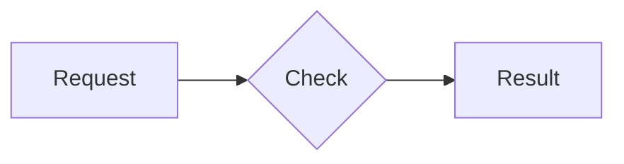
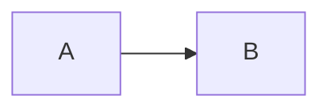

# Bifrost Documentation Writer

Write, update, and review Mintlify MDX documentation for Bifrost features. Performs thorough codebase research across both the Next.js UI and Go backend, validates config.json examples against the schema, and follows established documentation conventions.

## Usage

```
/docs-writer <feature-name>                # Write new docs for a feature
/docs-writer update <doc-path>             # Update an existing doc page
/docs-writer review <doc-path>             # Review a doc for accuracy and completeness
```

## Workflow Overview

1. **Understand the request** -- Determine which feature needs documentation
2. **Research the codebase** -- Explore UI pages, Go handlers, config schema, and existing docs
3. **Research external context** -- Use Context7 and WebSearch for additional information
4. **Ask clarifying questions** -- Confirm scope, audience, and edge cases with the user
5. **Present doc outline** -- Show a structured outline and wait for approval
6. **Write the documentation** -- Create the MDX file following Mintlify conventions
7. **Update navigation** -- Add the new page to docs.json
8. **Present for review** -- Show the complete doc and incorporate feedback

---

## Step 1: Understand the Request

### For new docs (`/docs-writer <feature-name>`)

Parse the feature name and map it to codebase areas. Common feature-to-directory mappings:

| Feature Name | UI Directory | Handler File | Config Schema Section | Existing Docs |
|---|---|---|---|---|
| virtual-keys | `ui/app/workspace/virtual-keys/` | `handlers/governance.go` | `governance.virtual_keys` | `docs/features/governance/virtual-keys.mdx` |
| routing | `ui/app/workspace/routing-rules/` | `handlers/governance.go` | `governance.routing_rules` | `docs/features/governance/routing.mdx` |
| providers | `ui/app/workspace/providers/` | `handlers/providers.go` | `providers` | `docs/providers/` |
| mcp | `ui/app/workspace/mcp-registry/` | `handlers/mcp.go` | `mcp` | `docs/mcp/` |
| plugins | `ui/app/workspace/plugins/` | `handlers/plugins.go` | `plugins` | `docs/features/plugins/` |
| logs / observability | `ui/app/workspace/logs/` | `handlers/logging.go` | `client.enable_logging` | `docs/features/observability/` |
| semantic-caching | `ui/app/workspace/config/caching/` | `handlers/cache.go` | `plugins.semantic_cache` + `vector_store` | `docs/features/semantic-caching.mdx` |
| guardrails | `ui/app/workspace/guardrails/` | Enterprise | `guardrails_config` | `docs/enterprise/guardrails.mdx` |
| clustering | `ui/app/workspace/cluster/` | Enterprise | `cluster_config` | `docs/enterprise/clustering.mdx` |
| load-balancing | `ui/app/workspace/adaptive-routing/` | Enterprise | `load_balancer_config` | `docs/enterprise/adaptive-load-balancing.mdx` |
| audit-logs | `ui/app/workspace/audit-logs/` | Enterprise | `audit_logs` | `docs/enterprise/audit-logs.mdx` |
| rbac | `ui/app/workspace/rbac/` | Enterprise | `auth_config` | `docs/enterprise/rbac.mdx` |
| config | `ui/app/workspace/config/` | `handlers/config.go` | `client` | `docs/quickstart/` |
| budget-and-limits | `ui/app/workspace/virtual-keys/` | `handlers/governance.go` | `governance.budgets`, `governance.rate_limits` | `docs/features/governance/budget-and-limits.mdx` |
| mcp-tools | `ui/app/workspace/mcp-tool-groups/` | `handlers/governance.go` | `governance.virtual_keys[].mcp_configs` | `docs/features/governance/mcp-tools.mdx` |
| fallbacks | N/A (request-level) | `handlers/inference.go` | N/A | `docs/features/fallbacks.mdx` |
| telemetry | `ui/app/workspace/observability/` | `handlers/plugins.go` | `plugins.prometheus`, `plugins.otel` | `docs/features/telemetry.mdx` |

If the feature name does not match any known mapping, search the codebase:
```bash
# Search UI for the feature
ls ui/app/workspace/ | grep -i "<feature>"

# Search handlers for related endpoints
grep -rn "<feature>" transports/bifrost-http/handlers/ --include='*.go' -l

# Search config schema
grep -i "<feature>" transports/config.schema.json | head -20

# Search existing docs
grep -rn "<feature>" docs/ --include='*.mdx' -l
```

### For updates (`/docs-writer update <doc-path>`)

Read the existing doc first:
```bash
cat docs/<doc-path>
```

Then identify what has changed by checking recent git history:
```bash
# Find recent code changes related to the feature
git log --oneline -20 -- 'ui/app/workspace/<feature>/' 'transports/bifrost-http/handlers/<handler>.go'

# See actual diffs
git diff HEAD~10 -- 'ui/app/workspace/<feature>/'
```

### For reviews (`/docs-writer review <doc-path>`)

Read the doc and cross-reference against the current codebase to identify:
- Outdated information (API endpoints changed, UI flow changed)
- Missing config.json fields (new schema properties not documented)
- Missing screenshots for new UI elements
- Broken internal links
- config.json examples that do not match the schema

---

## Step 2: Research the Codebase

**ALWAYS perform thorough research before writing.** This is the most critical step.

### 2a. Explore the UI Code

The UI is a Next.js application. Feature pages live under `ui/app/workspace/<feature>/`.

```bash
# List the feature directory structure
find ui/app/workspace/<feature>/ -type f -name '*.tsx' -o -name '*.ts' | sort

# Read the main page
cat ui/app/workspace/<feature>/page.tsx

# Find all views/components
ls ui/app/workspace/<feature>/views/ 2>/dev/null
ls ui/app/workspace/<feature>/dialogs/ 2>/dev/null
ls ui/app/workspace/<feature>/fragments/ 2>/dev/null

# Look for form fields, buttons, and interactive elements
grep -rn 'label\|placeholder\|data-testid\|FormField\|Input\|Select\|Button' ui/app/workspace/<feature>/ --include='*.tsx' | head -40

# Find API calls from the UI
grep -rn 'fetch\|api/\|useSWR\|mutate' ui/app/workspace/<feature>/ --include='*.tsx' --include='*.ts' | head -20

# Check shared components used
grep -rn 'import.*from.*components' ui/app/workspace/<feature>/ --include='*.tsx' | head -20
```

**What to extract from UI research:**
- Feature name as shown in the UI (page title, sidebar label)
- All form fields for create/edit operations (field names, types, validation)
- Table columns and displayed data
- Available actions (create, edit, delete, import, export)
- Navigation flow (how users reach this feature)
- Any special UI patterns (sheets, dialogs, tabs, accordions)

### 2b. Explore the Go Backend

API handlers live in `transports/bifrost-http/handlers/`.

```bash
# Find the relevant handler file
grep -rn '<feature>\|<Feature>' transports/bifrost-http/handlers/ --include='*.go' -l

# Read route registrations
grep -n '/api/' transports/bifrost-http/handlers/<handler>.go

# Read request/response types
grep -n 'type.*Request\|type.*Response' transports/bifrost-http/handlers/<handler>.go

# Read the handler functions for create/update operations
grep -n 'func.*create\|func.*update\|func.*delete\|func.*get' transports/bifrost-http/handlers/<handler>.go
```

**Complete API route reference by handler:**

| Handler File | Route Prefix | Operations |
|---|---|---|
| `governance.go` | `/api/governance/virtual-keys` | CRUD virtual keys |
| `governance.go` | `/api/governance/teams` | CRUD teams |
| `governance.go` | `/api/governance/customers` | CRUD customers |
| `governance.go` | `/api/governance/routing-rules` | CRUD routing rules |
| `governance.go` | `/api/governance/model-configs` | CRUD model configs |
| `governance.go` | `/api/governance/providers` | GET/PUT/DELETE provider governance |
| `governance.go` | `/api/governance/budgets` | GET budgets |
| `governance.go` | `/api/governance/rate-limits` | GET rate limits |
| `providers.go` | `/api/providers` | CRUD providers |
| `providers.go` | `/api/keys` | GET keys |
| `providers.go` | `/api/models` | GET models |
| `mcp.go` | `/api/mcp/clients` | GET MCP clients |
| `mcp.go` | `/api/mcp/client/{id}` | POST/PUT/DELETE MCP client |
| `logging.go` | `/api/logs` | GET/DELETE logs |
| `logging.go` | `/api/logs/stats` | GET log stats |
| `logging.go` | `/api/logs/histogram` | GET log histograms |
| `plugins.go` | `/api/plugins` | CRUD plugins |
| `config.go` | `/api/config` | GET/PUT config |
| `config.go` | `/api/proxy-config` | GET/PUT proxy config |
| `cache.go` | `/api/cache/clear/{requestId}` | DELETE cache |
| `session.go` | `/api/session/*` | Login/logout/auth check |
| `oauth2.go` | `/api/oauth/*` | OAuth callback/status |

**What to extract from backend research:**
- All API endpoints (method, path, description)
- Request body fields with types and validation rules
- Response body structure
- Error responses and status codes
- Business logic (what happens when an entity is created/updated)

### 2c. Read the Config Schema

The config schema at `transports/config.schema.json` (~2709 lines) is the source of truth for all `config.json` examples.

```bash
# Extract a specific section from the schema
cat transports/config.schema.json | python3 -c "
import json, sys
schema = json.load(sys.stdin)
# For top-level properties:
section = schema['properties'].get('<section_name>', {})
print(json.dumps(section, indent=2))
"

# For $defs references:
cat transports/config.schema.json | python3 -c "
import json, sys
schema = json.load(sys.stdin)
defn = schema.get('\$defs', {}).get('<def_name>', {})
print(json.dumps(defn, indent=2))
"
```

**Top-level config schema properties:**
- `encryption_key` - Encryption key configuration
- `auth_config` - Authentication configuration
- `client` - Client settings (logging, governance, CORS, etc.)
- `framework` - Framework configuration (pricing)
- `providers` - Provider configurations (per-provider with keys)
- `governance` - Governance (budgets, rate_limits, customers, teams, virtual_keys, routing_rules)
- `mcp` - MCP client configs and tool manager
- `vector_store` - Vector store backends (weaviate, redis, qdrant, pinecone)
- `config_store` - Config store backend (file, postgres)
- `logs_store` - Log store backend (file, postgres)
- `cluster_config` - Cluster/multinode configuration
- `saml_config` - SAML/SSO configuration
- `load_balancer_config` - Adaptive load balancer
- `guardrails_config` - Guardrails configuration
- `plugins` - Plugin configurations
- `audit_logs` - Audit log configuration

**Key $defs (reusable types):**
- `routing_rule` - Routing rule definition
- `virtual_key_provider_config` - Provider config within a virtual key
- `virtual_key_mcp_config` - MCP config within a virtual key
- `provider` / `provider_with_bedrock_config` / `provider_with_azure_config` / `provider_with_vertex_config` - Provider definitions
- `base_key` / `bedrock_key` / `azure_key` / `vertex_key` - Key definitions
- `mcp_client_config` / `mcp_tool_manager_config` - MCP configs
- `weaviate_config` / `redis_config` / `qdrant_config` / `pinecone_config` - Vector store configs
- `proxy_config` - Proxy configuration
- `cluster_config` / `saml_config` / `load_balancer_config` / `guardrails_config` - Enterprise configs
- `pricing_config` / `network_config` / `concurrency_config` - Client sub-configs
- `audit_logs_config` - Audit logs config

**CRITICAL RULE:** Every `config.json` example in documentation MUST be validated against this schema. Extract the relevant section, verify field names, types, required fields, and allowed values before including in the doc.

### 2d. Check Existing Related Docs

```bash
# Find all docs that mention this feature
grep -rn '<feature>' docs/ --include='*.mdx' -l

# Read the most relevant existing doc
cat docs/features/<category>/<feature>.mdx

# Check cross-references
grep -rn '<feature>' docs/ --include='*.mdx' | grep -i 'link\|href\|](/\|see\|read more'
```

### 2e. Check OpenAPI Spec

If the feature has management API endpoints, check if they are in the OpenAPI spec:
```bash
ls docs/openapi/paths/management/
cat docs/openapi/paths/management/<relevant>.yaml 2>/dev/null
```

---

## Step 3: Research External Context

### 3a. Use Context7 for Library Documentation

If the feature involves external libraries or protocols:

1. Resolve the library ID:
   ```
   mcp__context7__resolve-library-id with the library name
   ```

2. Query relevant documentation:
   ```
   mcp__context7__query-docs with the resolved library ID
   ```

**Common libraries to research:**
- `mintlify` -- For MDX component syntax (Tabs, Info, Note, etc.)
- `mark3labs/mcp-go` -- For MCP-related features
- `next.js` -- For UI architecture context
- Provider SDKs -- For provider-specific features

### 3b. Use WebSearch for Additional Context

Search for:
- Official documentation of providers or protocols being documented
- Best practices for the feature pattern (e.g., "API gateway rate limiting best practices")
- Related open-source project documentation for comparison

---

## Step 4: Ask Clarifying Questions

**ALWAYS ask clarifying questions before writing.** Present what you have learned and ask:

```
## Documentation Plan for: <Feature Name>

### What I Found
- **UI pages:** <list of discovered UI pages and their purpose>
- **API endpoints:** <list of relevant endpoints>
- **Config schema fields:** <list of relevant config fields>
- **Existing docs:** <list of related docs that already exist>

### Questions
1. **Audience:** Is this doc for self-hosted OSS users, enterprise users, or both?
2. **Scope:** Should I cover <list specific sub-features>? Anything to exclude?
3. **Placement:** I plan to place this at `docs/<path>`. Does that look right?
4. **Tab coverage:** Should I include all three config methods (Web UI / API / config.json)?
5. **Related features:** Should I cross-reference <related features>?
6. <Any feature-specific questions based on ambiguities found during research>
```

Wait for user responses before proceeding.

---

## Step 5: Present Doc Outline

After clarifying questions are answered, present a structured outline:

```
## Proposed Outline: <Doc Title>

**File:** `docs/<path>/<filename>.mdx`
**Navigation:** Will be added to `docs.json` under <group> > <subgroup>

### Frontmatter
- title: "<Title>"
- description: "<Description>"
- icon: "<icon-name>"

### Sections
1. **Overview** - What the feature does, key benefits, core concepts
2. **How It Works** - Technical explanation with flow diagram
3. **Configuration** (Tabs: Web UI / API / config.json)
   - Web UI steps with screenshot placeholders
   - API examples with curl commands
   - config.json examples (validated against schema)
4. **<Feature-specific sections>** - E.g., "Budget Hierarchy", "Rate Limiting", etc.
5. **Examples** - Real-world use cases with complete configs
6. **Troubleshooting** - Common issues and solutions
7. **Next Steps** - Links to related docs

### Screenshots Needed
- `` -- <what to capture>
- ...

### Cross-References
- [<Related Doc 1>](<path>)
- [<Related Doc 2>](<path>)

**Proceed with writing?** (yes / no / modify outline)
```

Wait for approval before writing.

---

## Step 6: Write the Documentation

### 6a. MDX File Structure

Every doc file follows this structure:

```mdx
---
title: "<Page Title>"
description: "<Short description for SEO and navigation>"
icon: "<fontawesome-icon-name>"
---

## Overview

<1-3 paragraphs explaining what the feature does and why it matters>

**Key Benefits/Features:**
- **Benefit 1** - Description
- **Benefit 2** - Description

---

## <Core Concept Section>

<Explain the core concepts, architecture, or flow>



---

## Configuration

<Tabs group="config-method">
<Tab title="Web UI">

1. Step-by-step instructions
2. With numbered steps


3. Continue steps after screenshot

</Tab>
<Tab title="API">

```bash
curl -X POST http://localhost:8080/api/<endpoint> \
  -H "Content-Type: application/json" \
  -d '{
    "field": "value"
  }'
```

**Response:**
```json
{
  "message": "Success",
  "data": {}
}
```

</Tab>
<Tab title="config.json">

```json
{
  "<section>": {
    "<field>": "<value>"
  }
}
```

| Field | Type | Required | Description |
|-------|------|----------|-------------|
| `field` | string | Yes | Description |

</Tab>
</Tabs>

---

## <Additional Sections>

<Info>
Important information the user should know.
</Info>

<Note>
Caveats or edge cases to be aware of.
</Note>

<Warning>
Dangerous or irreversible operations.
</Warning>

---

## Troubleshooting

### Common Issue 1
**Symptom:** ...
**Cause:** ...
**Fix:** ...

---

## Next Steps

- **[Related Feature 1](../path)** - Brief description
- **[Related Feature 2](../path)** - Brief description
```

### 6b. Screenshot Placeholder Rules

**Naming convention:** `ui-<feature>-<element>.png`

Examples from existing docs:
- `ui-virtual-key.png` - Virtual key creation form
- `ui-virtual-key-routing.png` - Virtual key routing configuration
- `ui-virtual-key-provider-config.png` - Provider config within VK
- `ui-create-teams.png` - Team creation form
- `ui-create-customer.png` - Customer creation form
- `ui-config.png` - General config page
- `ui-mcp-servers-table.png` - MCP servers listing
- `ui-mcp-new-server.png` - New MCP server form
- `ui-routing-rules-dashboard.png` - Routing rules overview
- `ui-semantic-cache-config.png` - Semantic cache settings
- `ui-tracing-config.png` - Tracing configuration

**Path in docs:** Always use relative path from the doc file location:
- From `docs/features/governance/*.mdx`: `../../media/ui-<name>.png`
- From `docs/features/*.mdx`: `../media/ui-<name>.png`
- From `docs/enterprise/*.mdx`: `../media/ui-<name>.png`
- From `docs/mcp/*.mdx`: `../media/ui-<name>.png`
- From `docs/providers/*.mdx`: `../media/ui-<name>.png`
- From `docs/quickstart/gateway/*.mdx`: `../../media/ui-<name>.png`

**Format:**
```markdown

```

**Rules:**
- Alt text should describe what the screenshot shows (e.g., "Virtual Key Provider Configuration Interface")
- File name should be lowercase, hyphen-separated
- One screenshot per major UI interaction (creation form, table view, config panel, etc.)
- Place screenshot AFTER the step that leads to that UI state, not before
- Check if the screenshot already exists in `docs/media/` before creating a new placeholder

### 6c. Config.json Example Validation

**MANDATORY:** Before writing any config.json example:

1. Read the relevant schema section:
```bash
cat transports/config.schema.json | python3 -c "
import json, sys
schema = json.load(sys.stdin)
section = schema['properties']['<top_level_key>']
print(json.dumps(section, indent=2))
"
```

2. For $ref references, resolve them:
```bash
cat transports/config.schema.json | python3 -c "
import json, sys
schema = json.load(sys.stdin)
ref = schema['\$defs']['<def_name>']
print(json.dumps(ref, indent=2))
"
```

3. Verify your example includes:
   - All `required` fields
   - Correct field types (string, integer, number, boolean, array, object)
   - Valid enum values where applicable
   - Proper nesting structure
   - Realistic example values (not just "string" or 0)

4. Cross-check field names against the Go handler request types:
```bash
grep -A 30 'type Create.*Request\|type Update.*Request' transports/bifrost-http/handlers/<handler>.go
```

### 6d. Mintlify Component Reference

**Callout boxes:**
```mdx
<Info>Informational content - tips, best practices, important context</Info>
<Note>Caveats, edge cases, things to be aware of</Note>
<Warning>Dangerous operations, irreversible actions, breaking changes</Warning>
<Tip>Helpful shortcuts or pro tips</Tip>
```

**Tabs (for multi-method configuration):**
```mdx
<Tabs group="config-method">
<Tab title="Web UI">
Content for Web UI method
</Tab>
<Tab title="API">
Content for API method
</Tab>
<Tab title="config.json">
Content for config.json method
</Tab>
</Tabs>
```

The `group` attribute ensures tab selection persists across the page. Use consistent group names:
- `config-method` - For Web UI / API / config.json tabs
- `sdk` or `gateway` - For Gateway / Go SDK tabs
- Feature-specific group names for feature-specific tabs

**Code blocks:**
````mdx
```bash
# Shell commands
```

```json
{
  "config": "example"
}
```

```go
// Go code
```

```python
# Python code
```

```typescript
// TypeScript code
```


````

**Tables:**
```mdx
| Column 1 | Column 2 | Column 3 |
|----------|----------|----------|
| Value 1  | Value 2  | Value 3  |
```

### 6e. Cross-Reference Conventions

Use relative links for internal cross-references:
```mdx
[Link Text](./sibling-page)
[Link Text](../parent-dir/page)
[Link Text](/absolute/from/docs/root)
[Link Text](./page#section-anchor)
```

Common cross-reference patterns in Bifrost docs:
- Governance docs link to each other (virtual-keys, routing, budget-and-limits, mcp-tools)
- Feature docs link to the quickstart guides
- Enterprise docs link to the OSS equivalents
- All config docs link to the architecture pages
- Provider docs link to the supported providers overview

---

## Step 7: Update Navigation

After writing the doc, add it to `docs/docs.json` in the appropriate location.

### Determining Placement

The navigation structure in `docs.json` follows this hierarchy:

```
tabs (Documentation, Developer Guides, Deployment Guides, API Reference, Architecture, Benchmarks, Changelogs)
  └── groups
      └── pages (strings or nested groups)
```

**Placement rules:**
- OSS features go under: `Documentation > Open Source Features`
- Enterprise features go under: `Documentation > Enterprise Features`
- Provider-specific guides go under: `Documentation > Providers & Guides`
- MCP features go under: `Documentation > MCP Gateway`
- Architecture docs go under: `Architecture` tab
- Deployment guides go under: `Deployment Guides` tab

**Example: Adding a new governance feature doc:**
Find the governance group in docs.json:
```json
{
  "group": "Governance",
  "icon": "user-lock",
  "pages": [
    "features/governance/virtual-keys",
    "features/governance/routing",
    "features/governance/budget-and-limits",
    "features/governance/mcp-tools",
    "features/governance/NEW-PAGE-HERE"
  ]
}
```

**Page path format:** The path in docs.json is relative to `docs/` and omits the `.mdx` extension.

---

## Step 8: Present for Review

After writing the doc and updating navigation, present a summary:

```
## Documentation Complete: <Feature Name>

### Files Created/Modified
- **Created:** `docs/<path>/<filename>.mdx` (<line count> lines)
- **Modified:** `docs/docs.json` (added to <group> navigation)

### Screenshots Needed
The following screenshot placeholders were added. You will need to capture these:
1. `docs/media/ui-<feature>-<element>.png` -- <description of what to capture>
2. ...

### Config.json Validation
- All config.json examples validated against `transports/config.schema.json`
- Fields verified: <list of key fields>
- Schema sections referenced: <list>

### Cross-References Added
- Links TO this doc from: <none yet / list>
- Links FROM this doc to: <list of referenced pages>

### Review Checklist
- [ ] Frontmatter title and description are accurate
- [ ] All three config methods covered (Web UI / API / config.json)
- [ ] config.json examples match schema
- [ ] Screenshot placeholders have correct paths and descriptive alt text
- [ ] Internal links are valid
- [ ] Navigation placement in docs.json is correct
- [ ] No duplicate content with existing docs

**Would you like any changes?**
```

---

## Mandatory Rules

### Content Rules
- **ALWAYS** research the codebase before writing -- never write from assumptions
- **ALWAYS** validate config.json examples against `transports/config.schema.json`
- **ALWAYS** include all three config methods (Web UI, API, config.json) for configurable features
- **ALWAYS** use the established screenshot naming convention (`ui-<feature>-<element>.png`)
- **ALWAYS** present an outline and wait for approval before writing
- **NEVER** invent API endpoints -- verify them in the handler files
- **NEVER** guess config field names -- verify them in the schema
- **NEVER** write documentation for features that do not exist in the codebase
- **NEVER** copy content from existing docs without adapting it to the specific feature

### Style Rules
- Use sentence case for headings (e.g., "Budget management" not "Budget Management") -- but follow existing doc convention if different
- Use `**bold**` for UI element names (e.g., **Virtual Keys**, **Save** button)
- Use backticks for code references (field names, values, commands)
- Use numbered steps for sequential instructions (1, 2, 3...)
- Use bullet points for non-sequential lists
- Keep paragraphs short (2-4 sentences max)
- Use horizontal rules (`---`) to separate major sections
- Use Info/Note/Warning boxes sparingly -- only when the information is genuinely important

### Technical Rules
- API examples should use `http://localhost:8080` as the base URL
- API examples should use `curl` with proper flags (`-X`, `-H`, `-d`)
- config.json examples should be minimal but complete (include all required fields)
- Field description tables should include: Field, Type, Required, Description
- Error responses should include the HTTP status code and error body
- Reset duration format: `1m`, `5m`, `1h`, `1d`, `1w`, `1M`, `1Y`

### Navigation Rules
- Page paths in docs.json omit the `.mdx` extension
- Page paths are relative to the `docs/` directory
- New pages should be added at the end of their group unless order matters logically
- Group icons use FontAwesome icon names

---

## Project Directory Reference

```
bifrost/
├── docs/                              # Mintlify documentation
│   ├── docs.json                      # Navigation configuration
│   ├── openapi/                       # OpenAPI spec (auto-generated API reference)
│   ├── media/                         # Screenshots and images
│   │   └── ui-*.png                   # UI screenshots (naming convention)
│   ├── features/                      # Feature documentation
│   │   ├── governance/                # Virtual keys, routing, budgets, MCP tools
│   │   ├── observability/             # Logging, tracing, Prometheus, OTel
│   │   └── plugins/                   # Mocker, JSON parser
│   ├── enterprise/                    # Enterprise feature docs
│   ├── mcp/                           # MCP Gateway documentation
│   ├── providers/                     # Provider guides and supported providers
│   ├── quickstart/                    # Getting started guides
│   ├── integrations/                  # SDK integration guides
│   ├── plugins/                       # Custom plugin development
│   ├── architecture/                  # Architecture documentation
│   ├── deployment-guides/             # Deployment guides
│   ├── contributing/                  # Developer contribution guides
│   ├── benchmarking/                  # Performance benchmarks
│   └── changelogs/                    # Version changelogs
├── ui/                                # Next.js UI application
│   └── app/workspace/                 # Feature pages
│       ├── providers/                 # Provider management
│       ├── virtual-keys/              # Virtual key management
│       ├── routing-rules/             # Routing rules
│       ├── logs/                      # LLM request logs
│       ├── mcp-registry/              # MCP server registry
│       ├── mcp-logs/                  # MCP tool execution logs
│       ├── mcp-tool-groups/           # MCP tool groups
│       ├── mcp-auth-config/           # MCP OAuth configuration
│       ├── plugins/                   # Plugin configuration
│       ├── observability/             # Observability settings
│       ├── dashboard/                 # Analytics dashboard
│       ├── config/                    # System configuration
│       ├── guardrails/                # Guardrails (enterprise)
│       ├── adaptive-routing/          # Adaptive load balancing (enterprise)
│       ├── cluster/                   # Clustering (enterprise)
│       ├── rbac/                      # RBAC (enterprise)
│       ├── scim/                      # SCIM provisioning (enterprise)
│       ├── user-groups/               # User groups (enterprise)
│       ├── audit-logs/                # Audit logs (enterprise)
│       ├── model-limits/              # Model limits
│       ├── alert-channels/            # Alert channels
│       └── prompt-repo/               # Prompt repository
├── transports/
│   ├── config.schema.json             # Configuration schema (source of truth)
│   └── bifrost-http/
│       └── handlers/                  # HTTP handlers
│           ├── governance.go          # Governance CRUD
│           ├── providers.go           # Provider CRUD + keys + models
│           ├── mcp.go                 # MCP client management
│           ├── logging.go             # Log queries
│           ├── plugins.go             # Plugin CRUD
│           ├── config.go              # Config get/update
│           ├── cache.go               # Cache management
│           ├── session.go             # Session/auth management
│           ├── oauth2.go              # OAuth callback handling
│           ├── inference.go           # LLM inference routing
│           ├── mcpinference.go        # MCP inference
│           ├── mcpserver.go           # MCP server (SSE/streamable)
│           ├── integrations.go        # SDK integrations
│           ├── health.go              # Health check
│           └── websocket.go           # WebSocket handler
├── core/                              # Go core library
│   ├── schemas/                       # All Go types/schemas
│   ├── providers/                     # Provider implementations
│   └── mcp/                           # MCP protocol implementation
├── framework/                         # Framework layer
│   ├── configstore/                   # Config storage backends
│   └── logstore/                      # Log storage backends
└── plugins/                           # Go plugins
```

## Error Handling

### Feature Not Found in Codebase
If the feature name does not map to any UI page or handler:
1. Search more broadly: `grep -ri "<feature>" ui/ transports/ core/ --include='*.go' --include='*.tsx' -l`
2. Ask the user: "I could not find a UI page or API handler for '<feature>'. Can you point me to the relevant code?"
3. The feature might be code-only (Go SDK) with no UI -- adjust the doc accordingly (no Web UI tab)

### Config Schema Section Not Found
If the feature does not have a config.json section:
1. Some features are API/UI-only (no file-based config)
2. Skip the config.json tab in that case
3. Note in the doc: "This feature is configured via the Web UI or API only."

### Existing Doc Conflicts
If a doc already exists for the feature:
1. Read the existing doc thoroughly
2. Ask the user: "A doc already exists at `<path>`. Should I update it or create a new companion page?"
3. If updating, make targeted edits rather than rewriting the entire doc
