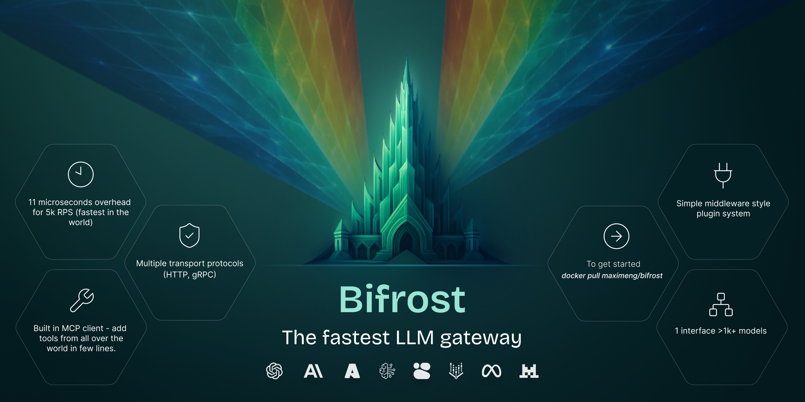

# Bifrost

[](https://goreportcard.com/report/github.com/maximhq/bifrost/core)

**The fastest way to build AI applications that never go down.**

Bifrost is a high-performance AI gateway that connects you to 10+ providers (OpenAI, Anthropic, Bedrock, and more) through a single API. Get automatic failover, load balancing, and zero-downtime deployments in under 30 seconds.



🚀 **Just launched:** Native MCP (Model Context Protocol) support for seamless tool integration  
⚡ **Performance:** Adds only 11µs latency while handling 5,000+ RPS  
🛡️ **Reliability:** 100% uptime with automatic provider failover

## ⚡ Quickstart (30 seconds)

**Go from zero to production-ready AI gateway in under a minute.** Here's how:

**What You Need**

- Any AI provider API key (OpenAI, Anthropic, Bedrock, etc.)
- Node.js 18+ installed (or use Docker instead via [Docker installation](./docs/quickstart/http-transport.md))
- 20 seconds of your time ⏰

### Using Bifrost HTTP Transport

📖 For detailed setup guides with multiple providers, advanced configuration, and language examples, see [Quick Start Documentation](./docs/quickstart/http-transport.md)

**Step 1:** Start Bifrost

```bash
# 🔧 Run Bifrost binary
npx @maximhq/bifrost
```

**Step 2:** Open the built-in web interface and configure bifrost

```bash
# 🖥️ Open the web interface in your browser
open http://localhost:8080

# Or simply open http://localhost:8080 manually in your browser
```

**Step 3:** Test it works

```bash
curl -X POST http://localhost:8080/v1/chat/completions \
  -H "Content-Type: application/json" \
  -d '{
    "model": "openai/gpt-4o-mini",
    "messages": [
      {"role": "user", "content": "Hello from Bifrost! 🌈"}
    ]
  }'
```

**🎉 Boom! You're done!**

Your AI gateway is now running with a beautiful web interface. You can:

- **🖥️ Configure everything visually** - No more JSON files!
- **📊 Monitor requests in real-time** - See logs, analytics, and metrics
- **🔄 Add providers and MCP clients on-the-fly** - Scale and failover without restarts
- **🚀 Drop into existing code** - Zero changes to your OpenAI/Anthropic apps

> **Want more?** See our [Complete Setup Guide](./docs/quickstart/http-transport.md) for multi-provider configuration, failover strategies, and production deployment.

## 📑 Table of Contents

- [Bifrost](#bifrost)
  - [⚡ Quickstart (30 seconds)](#-quickstart-30-seconds)
    - [Using Bifrost HTTP Transport](#using-bifrost-http-transport)
  - [📑 Table of Contents](#-table-of-contents)
  - [✨ Features](#-features)
  - [🏗️ Repository Structure](#️-repository-structure)
  - [🚀 Getting Started](#-getting-started)
    - [1. As a Go Package (Core Integration)](#1-as-a-go-package-core-integration)
    - [2. As an HTTP API (Transport Layer)](#2-as-an-http-api-transport-layer)
    - [3. As a Drop-in Replacement (Zero Code Changes)](#3-as-a-drop-in-replacement-zero-code-changes)
  - [📊 Performance](#-performance)
    - [🔑 Key Performance Highlights](#-key-performance-highlights)
  - [📚 Documentation](#-documentation)
  - [💬 Need Help?](#-need-help)
  - [🤝 Contributing](#-contributing)
  - [📄 License](#-license)

---

## ✨ Features

- **🖥️ Built-in Web UI**: Visual configuration, real-time monitoring, and analytics dashboard - no config files needed
- **🚀 Zero-Config Startup & Easy Integration**: Start immediately with dynamic provider configuration, or integrate existing SDKs by simply updating the `base_url` - one line of code to get running
- **🔄 Multi-Provider Support**: Integrate with OpenAI, Anthropic, Amazon Bedrock, Mistral, Ollama, and more through a single API
- **🛡️ Fallback Mechanisms**: Automatically retry failed requests with alternative models or providers
- **🔑 Dynamic Key Management**: Rotate and manage API keys efficiently with weighted distribution
- **⚡ Connection Pooling**: Optimize network resources for better performance
- **🎯 Concurrency Control**: Manage rate limits and parallel requests effectively
- **🔌 Flexible Transports**: Multiple transports for easy integration into your infra
- **🏗️ Plugin First Architecture**: No callback hell, simple addition/creation of custom plugins
- **🛠️ MCP Integration**: Built-in Model Context Protocol (MCP) support for external tool integration and execution
- **⚙️ Custom Configuration**: Offers granular control over pool sizes, network retry settings, fallback providers, and network proxy configurations
- **📊 Built-in Observability**: Native Prometheus metrics out of the box, no wrappers, no sidecars, just drop it in and scrape
- **🔧 SDK Support**: Bifrost is available as a Go package, so you can use it directly in your own applications

---

## 🏗️ Repository Structure

Bifrost is built with a modular architecture:

```text
bifrost/
├── ci/                   # CI/CD pipeline scripts and npx configuration
│
├── core/                 # Core functionality and shared components
│   ├── providers/        # Provider-specific implementations
│   ├── schemas/          # Interfaces and structs used in bifrost
│   ├── bifrost.go        # Main Bifrost implementation
│
├── docs/                 # Documentations for Bifrost's configurations and contribution guides
│   └── ...
│
├── tests/                # All test setups related to /core and /transports
│   └── ...
│
├── transports/           # Interface layers (HTTP, gRPC, etc.)
│   ├── bifrost-http/     # HTTP transport implementation
│   └── ...
│
├── ui/                  # UI files for the web interface of the HTTP transport
│   └── ...
│
└── plugins/              # Plugin Implementations
    ├── maxim/
    └── ...
```

The system uses a provider-agnostic approach with well-defined interfaces to easily extend to new AI providers. All interfaces are defined in `core/schemas/` and can be used as a reference for contributions.

---

## 🚀 Getting Started

There are three ways to use Bifrost - choose the one that fits your needs:

### 1. As a Go Package (Core Integration)

For direct integration into your Go applications. Provides maximum performance and control.

> **📖 [2-Minute Go Package Setup](./docs/quickstart/go-package.md)**

Quick example:

```bash
go get github.com/maximhq/bifrost/core
```

### 2. As an HTTP API (Transport Layer)

For language-agnostic integration and microservices architecture.

> **📖 [30-Second HTTP Transport Setup](./docs/quickstart/http-transport.md)**

Quick example:

```bash
npx @maximhq/bifrost
```

### 3. As a Drop-in Replacement (Zero Code Changes)

Replace existing OpenAI/Anthropic APIs without changing your application code.

> **📖 [1-Minute Drop-in Integration](./docs/usage/http-transport/integrations/README.md)**

Quick example:

```diff
- base_url = "https://api.openai.com"
+ base_url = "http://localhost:8080/openai"
```

---

## 📊 Performance

**Bifrost adds virtually zero overhead to your AI requests.** In our sustained 5,000 RPS benchmark (see full methodology in [docs/benchmarks.md](./docs/benchmarks.md)), the gateway added only **11 µs** of overhead per request – that's **less than 0.001%** of a typical GPT-4o response time.

**Translation:** Your users won't notice Bifrost is there, but you'll sleep better knowing your AI never goes down.

| Metric                                | t3.medium | t3.xlarge   | Δ                  |
| ------------------------------------- | --------- | ----------- | ------------------ |
| Added latency (Bifrost overhead)      | 59 µs     | **11 µs**   | **-81 %**          |
| Success rate @ 5 k RPS                | 100 %     | 100 %       | No failed requests |
| Avg. queue wait time                  | 47 µs     | **1.67 µs** | **-96 %**          |
| Avg. request latency (incl. provider) | 2.12 s    | **1.61 s**  | **-24 %**          |

### 🔑 Key Performance Highlights

- **Perfect Success Rate** – 100 % request success rate on both instance types even at 5 k RPS.
- **Tiny Total Overhead** – < 15 µs additional latency per request on average.
- **Efficient Queue Management** – just **1.67 µs** average wait time on the t3.xlarge test.
- **Fast Key Selection** – ~**10 ns** to pick the right weighted API key.

Bifrost is deliberately configurable so you can dial the **speed ↔ memory** trade-off:

| Config Knob                   | Effect                                                           |
| ----------------------------- | ---------------------------------------------------------------- |
| `initial_pool_size`           | How many objects are pre-allocated. Higher = faster, more memory |
| `buffer_size` & `concurrency` | Queue depth and max parallel workers (can be set per provider)   |
| Retry / Timeout               | Tune aggressiveness for each provider to meet your SLOs          |

Choose higher settings (like the t3.xlarge profile above) for raw speed, or lower ones (t3.medium) for reduced memory footprint – or find the sweet spot for your workload.

> **Need more numbers?** Dive into the [full benchmark report](./docs/benchmarks.md) for breakdowns of every internal stage (JSON marshalling, HTTP call, parsing, etc.), hardware sizing guides and tuning tips.

---

## 📚 Documentation

**Everything you need to master Bifrost, from 30-second setup to production-scale deployments.**

<details>
<summary><strong>🚀 I want to get started (2 minutes)</strong></summary>

- **[📖 Documentation Hub](./docs/README.md)** - Your complete roadmap to Bifrost
- **[🔧 Go Package Setup](./docs/quickstart/go-package.md)** - Direct integration into your Go app
- **[🌐 HTTP API Setup](./docs/quickstart/http-transport.md)** - Language-agnostic service deployment
- **[🔄 Drop-in Replacement](./docs/usage/http-transport/integrations/README.md)** - Replace OpenAI/Anthropic with zero code changes

</details>

<details>
<summary><strong>🎯 I want to understand what Bifrost can do</strong></summary>

- **[🔗 Multi-Provider Support](./docs/usage/providers.md)** - Connect to 10+ AI providers with one API
- **[🛡️ Fallback & Reliability](./docs/usage/providers.md#fallback-mechanisms)** - Never lose a request with automatic failover
- **[🛠️ MCP Tool Integration](./docs/usage/http-transport/configuration/mcp.md)** - Give your AI external capabilities
- **[🔌 Plugin Ecosystem](./docs/usage/http-transport/configuration/plugins.md)** - Extend Bifrost with custom middleware
- **[🔑 Key Management](./docs/usage/key-management.md)** - Rotate API keys without downtime
- **[📡 Networking](./docs/usage/networking.md)** - Proxies, timeouts, and connection tuning

</details>

<details>
<summary><strong>⚙️ I want to deploy this to production</strong></summary>

- **[🏗️ System Architecture](./docs/architecture/README.md)** - Understand how Bifrost works internally
- **[📊 Performance Tuning](./docs/benchmarks.md)** - Squeeze out every microsecond
- **[🚀 Production Deployment](./docs/usage/http-transport/README.md)** - Scale to millions of requests
- **[🔧 Complete API Reference](./docs/usage/README.md)** - Every endpoint, parameter, and response
- **[🐛 Error Handling](./docs/usage/errors.md)** - Troubleshoot like a pro

</details>

<details>
<summary><strong>📱 I'm migrating from another tool</strong></summary>

- **[🔄 Migration Guides](./docs/usage/http-transport/integrations/migration-guide.md)** - Step-by-step migration from OpenAI, Anthropic, LiteLLM
- **[🎓 Real-World Examples](./docs/examples/)** - Production-ready code samples
- **[❓ Common Questions](./docs/usage/errors.md)** - Solutions to frequent issues

</details>

---

## 💬 Need Help?

**🔗 [Join our Discord](https://getmax.im/bifrost-discord)** for:

- ❓ Quick setup assistance and troubleshooting
- 💡 Best practices and configuration tips
- 🤝 Community discussions and support
- 🚀 Real-time help with integrations

---

## 🤝 Contributing

See our **[Contributing Guide](./docs/contributing/README.md)** for detailed information on how to contribute to Bifrost. We welcome contributions of all kinds—whether it's bug fixes, features, documentation improvements, or new ideas. Feel free to open an issue, and once it's assigned, submit a Pull Request.

---

## 📄 License

This project is licensed under the Apache 2.0 License - see the [LICENSE](LICENSE) file for details.

Built with ❤️ by [Maxim](https://github.com/maximhq)
