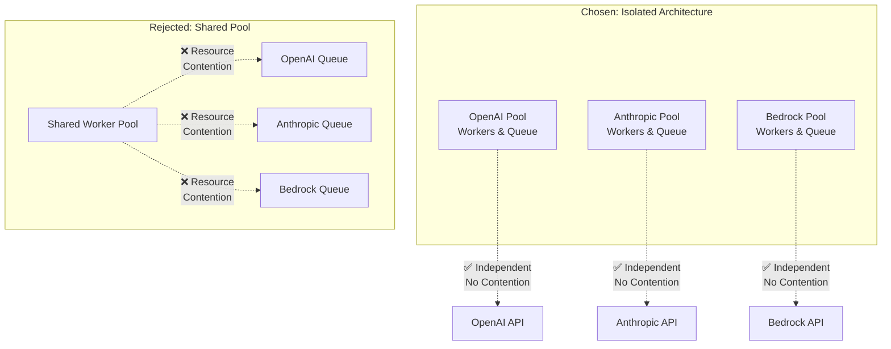
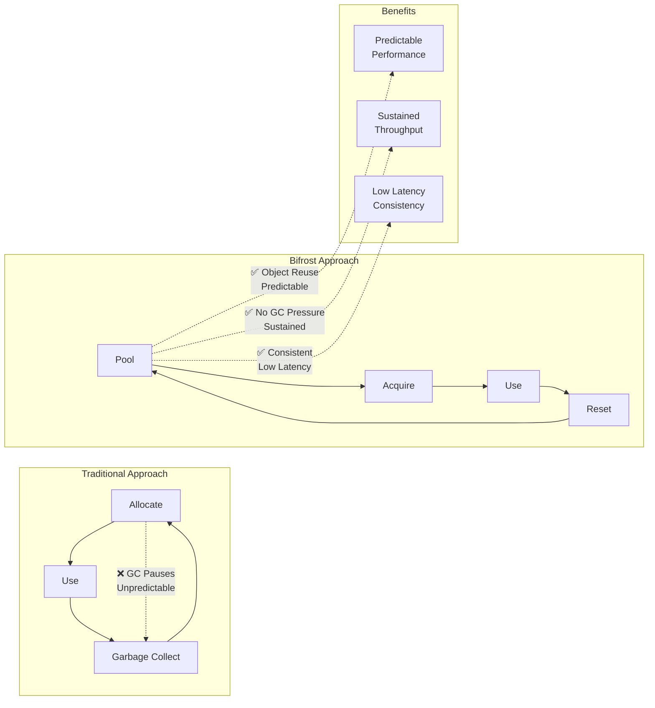
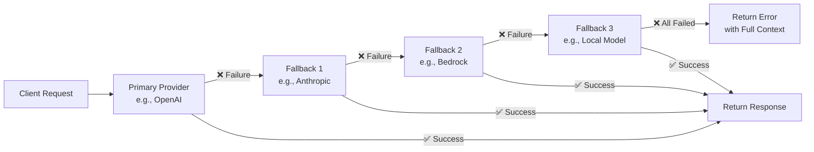
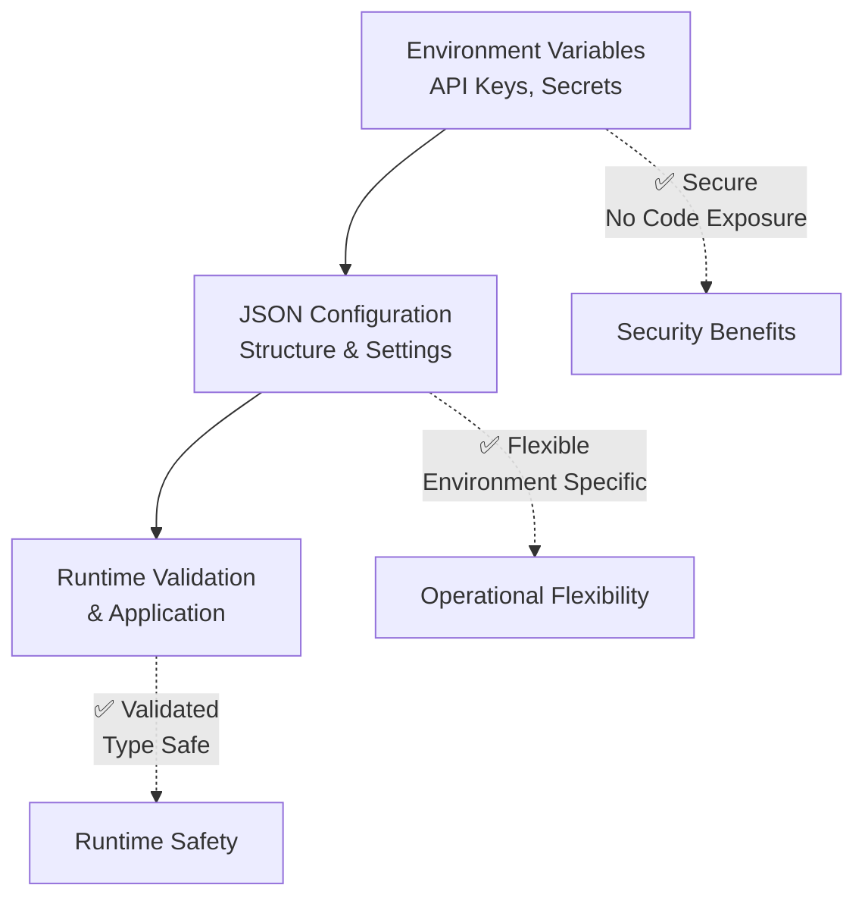

# 💡 Design Decisions & Architecture Rationale

This document explains the key architectural decisions behind Bifrost's design, the rationale for these choices, and the trade-offs considered during development.

---

## 🎯 Core Design Principles

Bifrost's architecture is built on six fundamental principles that guide every design decision:

- **🔄 Provider Agnostic** - Uniform interface across all AI providers for seamless switching
- **⚡ Performance First** - Minimal overhead with maximum throughput (11-59μs added latency)
- **🛡️ Reliability** - Built-in fallbacks and error recovery for production resilience
- **🔧 Simplicity** - Easy integration with existing applications without complex setup
- **📊 Observability** - Comprehensive monitoring and metrics out of the box
- **🚀 Scalability** - Linear scaling with hardware resources up to 10,000+ RPS

---

## 🏗️ Fundamental Architectural Decisions

### **1. Provider Isolation Architecture**

**Decision:** Each AI provider operates with completely isolated worker pools and queues.

**Why This Matters:**

- **Performance Isolation** - OpenAI slowdowns don't affect Anthropic requests
- **Resource Control** - Independent rate limiting prevents one provider from starving others
- **Failure Isolation** - Provider outages remain contained
- **Configuration Flexibility** - Each provider can be optimized independently

**Alternative Considered:** Shared worker pool across all providers  
**Why Rejected:** Would create resource contention and cascade failures when one provider experiences issues.

> **📖 Configuration Guide:** [Provider Setup →](../usage/http-transport/configuration/providers)

### **2. Aggressive Object Pooling Strategy**

**Decision:** Implement comprehensive object pooling for channels, messages, and responses.

**The Performance Impact:**

- **81% reduction** in processing overhead (from 59μs to 11μs)
- **96% faster** queue wait times
- **Predictable latency** through object reuse patterns
- **Minimal GC pressure** for sustained high throughput

**Trade-offs Made:**

- ✅ **Pro:** Dramatic performance improvement under load
- ⚠️ **Con:** Higher baseline memory usage (configurable)
- ⚠️ **Con:** More complex memory management (handled internally)

> **📖 Performance Tuning:** [Memory Management →](../usage/memory-management)

### **3. Sequential Fallback Chain Design**

**Decision:** Execute fallback providers sequentially with independent configuration.

**Why Sequential Over Parallel:**

- **Cost Efficiency** - Don't waste API calls on multiple providers simultaneously
- **Predictable Behavior** - Clear fallback order and deterministic logic
- **Error Transparency** - Detailed error reporting from each attempt
- **Configuration Simplicity** - Each fallback step has independent settings

**Alternative Considered:** Parallel fallback execution  
**Why Rejected:** Would increase costs and complexity without providing significant reliability benefits.

> **📖 Fallback Configuration:** [Provider Fallbacks →](../usage/providers#fallback-configuration)

### **4. Unified Request/Response Schema**

**Decision:** Single schema supporting all provider features with optional fields for extensibility.

**Developer Experience Benefits:**

- **Consistent Interface** - Same code works across OpenAI, Anthropic, Bedrock, etc.
- **Feature Parity** - Access to all provider capabilities through unified API
- **Migration Ease** - Switch providers without changing application code
- **Type Safety** - Strong typing catches errors at compile time (Go SDK)

**Schema Design Philosophy:**

- **Core Fields** - Common across all providers (messages, model, temperature)
- **Optional Extensions** - Provider-specific features via optional fields
- **Future-Proof** - Extensible for new provider capabilities

> **📖 Schema Reference:** [Go Package Schemas →](../usage/go-package/schemas) | [HTTP API Reference →](../usage/http-transport/endpoints)

### **5. Configuration-First Security**

**Decision:** JSON configuration files with environment variable support for all sensitive data.

**Security Principles:**

- **Secrets Out of Code** - API keys never in source code
- **Environment Flexibility** - Different configs per deployment environment
- **Operational Control** - Non-developers can manage keys and settings
- **Version Control Safety** - Exclude sensitive data from repositories

**Configuration Hierarchy:**

> **📖 Configuration Guide:** [Provider Configuration →](../usage/http-transport/configuration/providers) | [Key Management →](../usage/key-management)

### **6. Dual Interface Architecture**

**Decision:** Maintain both HTTP transport and Go package interfaces with shared core logic.

**Interface Comparison:**

| Aspect          | HTTP Transport              | Go Package             | Why Both?               |
| --------------- | --------------------------- | ---------------------- | ----------------------- |
| **Use Case**    | Microservices, any language | Go applications        | Maximum flexibility     |
| **Performance** | High (sub-100μs overhead)   | Maximum (direct calls) | Performance options     |
| **Integration** | REST API calls              | Go imports             | Integration preferences |
| **Features**    | All features via HTTP       | All features direct    | Feature parity          |

**Shared Core Strategy:**

- **Single Implementation** - Core logic shared between interfaces
- **Consistent Behavior** - Same configuration and functionality
- **Synchronized Updates** - Features available in both interfaces simultaneously

> **📖 Interface Guides:** [Go Package →](../usage/go-package/README) | [HTTP Transport →](../usage/http-transport/README)

---

## ⚖️ Critical Trade-off Analysis

### **Performance vs. Memory Usage**

Our configurable approach allows optimization for different deployment scenarios:

| Configuration        | Memory Usage            | Performance        | Best For                 |
| -------------------- | ----------------------- | ------------------ | ------------------------ |
| **High Performance** | High baseline (1.5GB+)  | Maximum throughput | Production, high-load    |
| **Memory Efficient** | Low baseline (100MB)    | Good throughput    | Development, constrained |
| **Balanced**         | Medium baseline (500MB) | High throughput    | Most deployments         |

**Decision:** Configurable with intelligent defaults, allowing teams to optimize for their specific constraints.

### **Reliability vs. Complexity**

We carefully chose which reliability features to include based on value vs. complexity:

| Feature               | Reliability Gain | Complexity Cost | Decision          |
| --------------------- | ---------------- | --------------- | ----------------- |
| **Fallback Chains**   | High             | Medium          | ✅ Include        |
| **Automatic Retries** | Medium           | Low             | ✅ Include        |
| **Circuit Breakers**  | High             | High            | ❌ Future Release |
| **Health Monitoring** | Medium           | Medium          | ✅ Include        |

### **Feature Completeness vs. Simplicity**

**Chosen Approach:** Comprehensive feature set with progressive disclosure:

- ✅ **Simple Defaults** - Work out-of-the-box with minimal configuration
- ✅ **All Provider Features** - Support full capabilities of each provider
- ✅ **Advanced Tuning** - Power users can optimize extensively
- ✅ **Progressive Complexity** - Basic → Intermediate → Advanced configuration layers

---

## 🔧 Implementation Philosophy

### **Error Handling Strategy**

**Decision:** Structured error types with rich context for debugging and monitoring.

**Error Design Principles:**

- **Actionable Information** - Errors include enough context for resolution
- **Monitoring Integration** - Structured errors enable alerting and analytics
- **Recovery Support** - Error details enable intelligent retry logic
- **Debug Friendliness** - Rich error context for troubleshooting

> **📖 Error Handling:** [Error Reference →](../usage/errors)

### **Plugin Architecture Philosophy**

**Decision:** Pre/Post hook system with symmetric execution and failure isolation.

**Plugin Design Goals:**

- **Extensibility** - Custom logic injection without core changes
- **Safety** - Plugin failures don't crash the system
- **Performance** - Minimal overhead for plugin execution
- **Simplicity** - Easy to write and deploy plugins

**Symmetric Execution:** PostHooks run in reverse order of PreHooks to ensure proper cleanup and state management.

> **📖 Plugin Development:** [Plugin Guide →](../usage/http-transport/configuration/plugins)

### **MCP Integration Strategy**

**Decision:** Client-side tool execution with server-side tool discovery for maximum security and flexibility.

**MCP Architecture Benefits:**

- **Security** - Client controls all tool execution
- **Flexibility** - Client can validate and modify tool calls
- **Performance** - Avoid server-side execution overhead
- **Compliance** - Client can implement authorization policies

> **📖 MCP Setup:** [MCP Configuration →](../usage/http-transport/configuration/mcp)

---

## 🚀 Future-Proofing Decisions

### **Schema Extensibility**

**Decision:** Use flexible interfaces for provider-specific parameters while maintaining type safety for core functionality.

**Benefits:**

- **New Features** - Support future provider capabilities without breaking changes
- **Backward Compatibility** - Existing applications continue working
- **Provider Innovation** - Don't limit provider evolution

### **Transport Agnostic Core**

**Decision:** Separate core logic from transport mechanisms to enable multiple interface types.

**Current & Future Transports:**

- ✅ **HTTP REST API** - Current, production-ready
- ✅ **Go Package** - Current, maximum performance
- 🔄 **gRPC Transport** - Planned for service mesh environments
- 🔄 **Message Queue** - Planned for async processing

### **Observability First**

**Decision:** Built-in Prometheus metrics without external dependencies or wrappers.

**Observability Strategy:**

- **Zero Dependencies** - No sidecars or external metric collectors required
- **Rich Metrics** - Comprehensive performance and business metrics
- **Industry Standard** - Prometheus format for wide ecosystem compatibility
- **Custom Labels** - Application-specific metric dimensions

> **📖 Monitoring Setup:** [Observability →](../usage/monitoring)

---

## 📊 Alternative Architectures Considered

### **Event-Driven Architecture**

**Considered:** Message queue-based request processing

**Analysis:**

- ✅ **Pros:** Horizontal scaling, durability, service decoupling
- ❌ **Cons:** Added latency, infrastructure complexity, operational overhead
- **Decision:** **Rejected** - Synchronous model better suits real-time AI applications

### **Microservices Architecture**

**Considered:** Separate service per provider

**Analysis:**

- ✅ **Pros:** Provider isolation, independent scaling, technology diversity
- ❌ **Cons:** Network overhead, configuration complexity, operational burden
- **Decision:** **Rejected** - Single binary simplifies deployment and reduces latency

### **Plugin-Only Architecture**

**Considered:** Everything as plugins with minimal core

**Analysis:**

- ✅ **Pros:** Maximum flexibility, community contributions, small core
- ❌ **Cons:** Configuration complexity, performance overhead, reliability concerns
- **Decision:** **Rejected** - Core features should be built-in for reliability

---

## 🎯 Success Metrics & Validation

### **Performance Targets (Achieved)**

- ✅ **Sub-100μs Overhead** - Achieved 11-59μs processing overhead
- ✅ **5000+ RPS Sustained** - Demonstrated without failures
- ✅ **100% Success Rate** - Maintained under high load conditions
- ✅ **Linear Scaling** - Performance scales with hardware resources

### **Developer Experience Goals (Achieved)**

- ✅ **5-Minute Setup** - From zero to working integration
- ✅ **Drop-in Replacement** - Compatible with existing provider SDKs
- ✅ **Rich Documentation** - Comprehensive guides and examples
- ✅ **Clear Error Messages** - Actionable error information and debugging

### **Operational Excellence (Achieved)**

- ✅ **Zero-Downtime Deployments** - Configuration hot-reload capabilities
- ✅ **Comprehensive Monitoring** - Built-in Prometheus metrics
- ✅ **Failure Recovery** - Automatic fallbacks and retry mechanisms
- ✅ **Security First** - Secure API key management and rotation

---

## 🔗 Related Architecture Documentation

- **[🌐 System Overview](./system-overview)** - High-level architecture and component interaction
- **[🔄 Request Flow](./request-flow)** - How these decisions affect request processing
- **[⚙️ Concurrency Model](./concurrency)** - Concurrency-related design decisions
- **[📊 Benchmarks](../benchmarks)** - Performance implications of design choices
- **[🔌 Plugin System](./plugins)** - Plugin architecture design decisions
- **[🛠️ MCP System](./mcp)** - MCP integration design decisions

---

**💭 These design decisions reflect careful consideration of real-world usage patterns, performance requirements, and operational needs. Each decision balances multiple factors to create a robust, performant, and developer-friendly AI gateway.**
