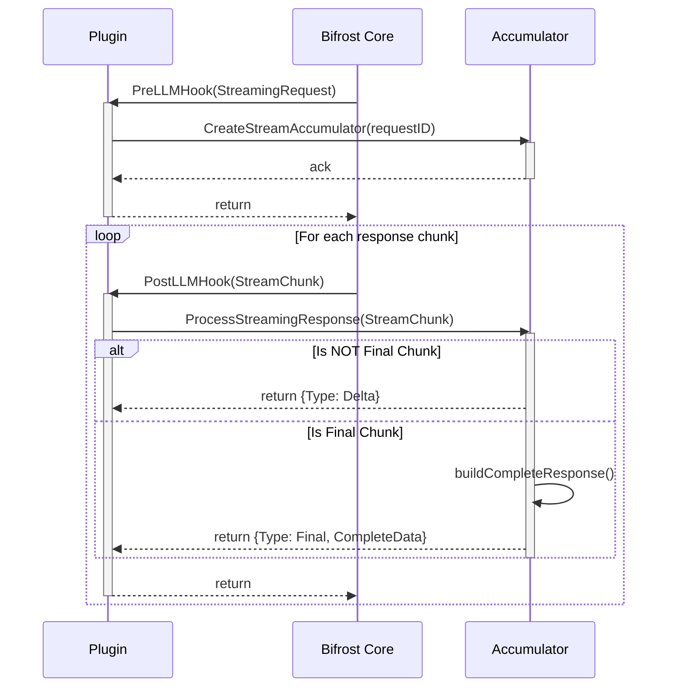

## Overview

The **Streaming** package (`framework/streaming`) is a core utility within Bifrost designed to handle real-time data streams from AI providers. It provides a robust and efficient mechanism for plugins like [Logging](/features/observability/default), [OTel](/features/observability/otel), and [Maxim](/features/observability/maxim) to process, aggregate, and format streaming responses for chat completions, transcriptions, and other real-time AI interactions.



Its primary purpose is to simplify the complexity of handling chunked data, ensuring that plugins can work with complete, well-structured responses without needing to implement their own aggregation logic.


## How It Works

The streaming package uses an `Accumulator` to manage the lifecycle of a streaming operation. This process is designed to be highly efficient, using `sync.Pool` to reuse objects and minimize memory allocations.

1.  **Initialization**: When a plugin that needs to process streams (like `logging` or `otel`) is initialized, it creates a new `streaming.Accumulator`.

2.  **Stream Start**: In the `PreLLMHook` phase of a request, if the request is identified as a streaming type, the plugin calls `accumulator.CreateStreamAccumulator(requestID, timestamp)` to prepare a dedicated buffer for the incoming chunks of that request.

3.  **Chunk Processing**: In the `PostLLMHook` phase, as each chunk of the streaming response arrives, the plugin passes it to `accumulator.ProcessStreamingResponse()`.
    *   For each `delta` chunk, the accumulator appends it to the buffer associated with the request ID.
    *   The accumulator handles different types of streams, including chat, audio, and transcriptions, using specialized logic to correctly piece together the data. For example, it accumulates text deltas, tool call argument deltas, and other parts of the message.

4.  **Finalization**: When the final chunk of the stream is received (indicated by a `finish_reason` or other provider-specific signal), `ProcessStreamingResponse` performs the final assembly.
    *   It reconstructs the complete `ChatMessage` or other response object from all the stored chunks.
    *   It calculates total token usage, cost, and latency.
    *   It returns a `ProcessedStreamResponse` object with `StreamResponseTypeFinal` and the complete, structured `AccumulatedData`.

5.  **Cleanup**: Once the final response is processed, the accumulator cleans up all buffered chunks for that request ID, returning them to the `sync.Pool` for reuse.

## Key Components

### `Accumulator`

The central component of the package. It is a thread-safe manager that:
-   Tracks stream chunks for multiple concurrent requests using a `sync.Map`.
-   Uses `sync.Pool` to recycle `*StreamChunk` objects, reducing garbage collection overhead.
-   Provides methods to add chunks (`addChatStreamChunk`, `addAudioStreamChunk`, etc.).
-   Includes a periodic cleanup worker to remove stale accumulators for incomplete or orphaned requests.

### `ProcessStreamingResponse`

This is the main entry point for plugins to process stream data. It inspects the response type and delegates to the appropriate handler:
-   `processChatStreamingResponse`
-   `processAudioStreamingResponse`
-   `processTranscriptionStreamingResponse`
-   `processResponsesStreamingResponse`

It returns a `ProcessedStreamResponse`, which indicates whether the chunk is a `delta` or the `final` aggregated response.

### Stream-Specific Builders

The package includes internal logic to correctly build complete messages from chunks. For example, `buildCompleteMessageFromChatStreamChunks` iterates through the collected `ChatStreamChunk` objects, appending content deltas and assembling tool calls into a final, coherent `schemas.ChatMessage`.

## Usage Example

The following snippet from the `logging` plugin shows how the `streaming` package is used in practice within a plugin's `PostLLMHook`.

```go
// In plugins/logging/main.go

func (p *LoggerPlugin) PostLLMHook(ctx *schemas.BifrostContext, result *schemas.BifrostResponse, bifrostErr *schemas.BifrostError) (*schemas.BifrostResponse, *schemas.BifrostError, error) {
    // ... setup, get requestID ...

    go func() {
        // ...
        if bifrost.IsStreamRequestType(requestType) {
            p.logger.Debug("[logging] processing streaming response")

            // 1. Pass the response chunk to the accumulator
            streamResponse, err := p.accumulator.ProcessStreamingResponse(ctx, result, bifrostErr)
            if err != nil {
                p.logger.Error("failed to process streaming response: %v", err)
            // 2. Check if this is the final, aggregated response
            } else if streamResponse != nil && streamResponse.Type == streaming.StreamResponseTypeFinal {
                // Prepare final log data
                logMsg.Operation = LogOperationStreamUpdate
                logMsg.StreamResponse = streamResponse
                
                // 3. Update the log entry with the complete data
                processingErr := retryOnNotFound(p.ctx, func() error {
                    return p.updateStreamingLogEntry(p.ctx, logMsg.RequestID, logMsg.SemanticCacheDebug, logMsg.StreamResponse, true)
                })
                
                // ... handle errors and callbacks ...
            }
        }
        // ... handle non-streaming responses ...
    }()

    return result, bifrostErr, nil
}
```

This demonstrates how a plugin can remain agnostic to the details of stream aggregation and simply react to the final, complete data returned by the `streaming` package. This greatly simplifies plugin development and ensures consistent data handling across the framework.
