# 🛠️ MCP System Architecture

Deep dive into Bifrost's Model Context Protocol (MCP) integration - how external tool discovery, execution, and integration work internally.

---

## 🎯 MCP Architecture Overview

### **What is MCP in Bifrost?**

The Model Context Protocol (MCP) system in Bifrost enables AI models to seamlessly discover and execute external tools, transforming static chat models into dynamic, action-capable agents. This architecture bridges the gap between AI reasoning and real-world tool execution.

**Core MCP Principles:**

- **🔍 Dynamic Discovery** - Tools are discovered at runtime, not hardcoded
- **🛡️ Client-Side Execution** - Bifrost controls all tool execution for security
- **🌐 Multi-Protocol Support** - STDIO, HTTP, and SSE connection types
- **🎯 Request-Level Filtering** - Granular control over tool availability
- **⚡ Async Execution** - Non-blocking tool invocation and response handling

### **MCP System Components**


---

## 🔗 MCP Connection Architecture

### **Multi-Protocol Connection System**

Bifrost supports three MCP connection types, each optimized for different tool deployment patterns:

```mermaid
graph TB
    subgraph "STDIO Connections"
        STDIO[Command Line Tools<br/>Local Execution]
        STDIOEx[Examples:<br/>• Filesystem tools<br/>• Local scripts<br/>• CLI utilities]
    end

    subgraph "HTTP Connections"
        HTTP[Web Service Tools<br/>Remote APIs]
        HTTPEx[Examples:<br/>• Web search APIs<br/>• Database services<br/>• External integrations]
    end

    subgraph "SSE Connections"
        SSE[Real-time Tools<br/>Streaming Data]
        SSEEx[Examples:<br/>• Live data feeds<br/>• Real-time monitoring<br/>• Event streams]
    end

    subgraph "Connection Characteristics"
        Latency[Latency:<br/>STDIO < HTTP < SSE]
        Security[Security:<br/>Local > HTTP > SSE]
        Scalability[Scalability:<br/>HTTP > SSE > STDIO]
        Complexity[Complexity:<br/>STDIO < HTTP < SSE]
    end

    STDIO --> Latency
    HTTP --> Security
    SSE --> Scalability
    HTTP --> Complexity
```



### **Connection Type Details**

**STDIO Connections (Local Tools):**

- **Use Case:** Command-line tools, local scripts, filesystem operations
- **Performance:** Lowest latency (~1-10ms) due to local execution
- **Security:** Highest security with full local control
- **Limitations:** Single-server deployment, resource sharing

**HTTP Connections (Remote Services):**

- **Use Case:** Web APIs, microservices, cloud functions
- **Performance:** Network-dependent latency (~10-500ms)
- **Security:** Configurable with authentication and encryption
- **Advantages:** Scalable, multi-server deployment, service isolation

**SSE Connections (Streaming Tools):**

- **Use Case:** Real-time data feeds, live monitoring, event streams
- **Performance:** Variable latency depending on stream frequency
- **Security:** Similar to HTTP with streaming capabilities
- **Benefits:** Real-time updates, persistent connections, event-driven

> **📖 MCP Configuration:** [MCP Setup Guide →](../usage/http-transport/configuration/mcp.md)

---

## 🔍 Tool Discovery & Registration

### **Dynamic Tool Discovery Process**

The MCP system discovers tools at runtime rather than requiring static configuration, enabling flexible and adaptive tool availability:


### **Tool Registry Management**

**Registration Process:**

1. **Connection Establishment** - MCP client connects to configured servers
2. **Capability Exchange** - Server announces available tools and schemas
3. **Tool Validation** - Bifrost validates tool definitions and security
4. **Registry Update** - Tools are registered in the internal tool registry
5. **Availability Notification** - Tools become available for AI model use

**Registry Features:**

- **Dynamic Updates** - Tools can be added/removed during runtime
- **Version Management** - Support for tool versioning and compatibility
- **Access Control** - Request-level tool filtering and permissions
- **Health Monitoring** - Continuous tool availability checking

**Tool Metadata Structure:**

- **Name & Description** - Human-readable tool identification
- **Parameters Schema** - JSON schema for tool input validation
- **Return Schema** - Expected response format definition
- **Capabilities** - Tool feature flags and limitations
- **Authentication** - Required credentials and permissions

---

## 🎛️ Tool Filtering & Access Control

### **Multi-Level Filtering System**

Bifrost provides granular control over tool availability through a sophisticated filtering system:


### **Filtering Configuration Levels**

**Request-Level Filtering:**

```bash
# Include only specific MCP clients
curl -X POST http://localhost:8080/v1/chat/completions \
  -H "mcp-include-clients: filesystem,websearch" \
  -d '{"model": "gpt-4o-mini", "messages": [...]}'

# Exclude dangerous tools
curl -X POST http://localhost:8080/v1/chat/completions \
  -H "mcp-exclude-tools: delete_file,format_disk" \
  -d '{"model": "gpt-4o-mini", "messages": [...]}'
```

**Configuration-Level Filtering:**

- **Client Selection** - Choose which MCP servers to connect to
- **Tool Blacklisting** - Permanently disable dangerous or unwanted tools
- **Permission Mapping** - Map user roles to available tool sets
- **Environment-Based** - Different tool sets for development vs production

**Security Benefits:**

- **Principle of Least Privilege** - Only necessary tools are exposed
- **Dynamic Access Control** - Per-request tool availability
- **Audit Trail** - Track which tools are used by which requests
- **Risk Mitigation** - Prevent access to dangerous operations

> **📖 Tool Filtering:** [MCP Tool Control →](../usage/http-transport/configuration/mcp.md#tool-filtering)

---

## ⚙️ Tool Execution Engine

### **Async Tool Execution Architecture**

The MCP execution engine handles tool invocation asynchronously to maintain system responsiveness and enable complex multi-tool workflows:


### **Execution Flow Characteristics**

**Validation Phase:**

- **Parameter Validation** - Ensure tool arguments match expected schema
- **Permission Checking** - Verify tool access permissions for the request
- **Rate Limiting** - Apply per-tool and per-user rate limits
- **Security Scanning** - Check for potentially dangerous operations

**Execution Phase:**

- **Timeout Management** - Bounded execution time to prevent hanging
- **Error Handling** - Graceful handling of tool failures and timeouts
- **Result Streaming** - Support for tools that return streaming responses
- **Resource Monitoring** - Track tool resource usage and performance

**Response Phase:**

- **Result Formatting** - Convert tool outputs to consistent format
- **Error Enrichment** - Add context and suggestions for tool failures
- **Multi-Result Aggregation** - Combine multiple tool outputs coherently
- **Context Integration** - Merge tool results into conversation context

### **Multi-Turn Conversation Support**

The MCP system enables sophisticated multi-turn conversations where AI models can:

1. **Initial Tool Discovery** - Request available tools for a given context
2. **Tool Execution** - Execute one or more tools based on user request
3. **Result Analysis** - Analyze tool outputs and determine next steps
4. **Follow-up Actions** - Execute additional tools based on previous results
5. **Response Synthesis** - Combine tool results into coherent user response

**Example Multi-Turn Flow:**

```
User: "Find recent news about AI and save interesting articles"
AI: → Execute web_search("AI news recent")
AI: → Analyze search results
AI: → Execute save_article() for each interesting result
AI: → Respond with summary of saved articles
```

### **Complete User-Controlled Tool Execution Flow**

The following diagram shows the end-to-end user experience with MCP tool execution, highlighting the critical user control points and decision-making process:

```mermaid
flowchart TD
    A["👤 User Message<br/>\"List files in current directory\""] --> B["🤖 Bifrost Core"]

    B --> C["🔧 MCP Manager<br/>Auto-discovers and adds<br/>available tools to request"]

    C --> D["🌐 LLM Provider<br/>(OpenAI, Anthropic, etc.)"]

    D --> E{"🔍 Response contains<br/>tool_calls?"}

    E -->|No| F["✅ Final Response<br/>Display to user"]

    E -->|Yes| G["📝 Add assistant message<br/>with tool_calls to history"]

    G --> H["🛡️ YOUR EXECUTION LOGIC<br/>(Security, Approval, Logging)"]

    H --> I{"🤔 User Decision Point<br/>Execute this tool?"}

    I -->|Deny| J["❌ Create denial result<br/>Add to conversation history"]

    I -->|Approve| K["⚙️ client.ExecuteMCPTool()<br/>Bifrost executes via MCP"]

    K --> L["📊 Tool Result<br/>Add to conversation history"]

    J --> M["🔄 Continue conversation loop<br/>Send updated history back to LLM"]
    L --> M

    M --> D

    style A fill:#e1f5fe
    style F fill:#e8f5e8
    style H fill:#fff3e0
    style I fill:#fce4ec
    style K fill:#f3e5f5
```



**Key Flow Characteristics:**

**User Control Points:**

- **🛡️ Security Layer** - Your application controls all tool execution decisions
- **🤔 Approval Gate** - Users can approve or deny each tool execution
- **📊 Transparency** - Full visibility into what tools will be executed and why
- **🔄 Conversation Continuity** - Tool results seamlessly integrate into conversation flow

**Security Benefits:**

- **No Automatic Execution** - Tools never execute without explicit approval
- **Audit Trail** - Complete logging of all tool execution decisions
- **Contextual Security** - Approval decisions can consider full conversation context
- **Graceful Denials** - Denied tools result in informative responses, not errors

**Implementation Patterns:**

```go
// Example tool execution control in your application
func handleToolExecution(toolCall schemas.ToolCall, userContext UserContext) error {
    // YOUR SECURITY AND APPROVAL LOGIC HERE
    if !userContext.HasPermission(toolCall.Function.Name) {
        return createDenialResponse("Tool not permitted for user role")
    }

    if requiresApproval(toolCall) {
        approved := promptUserForApproval(toolCall)
        if !approved {
            return createDenialResponse("User denied tool execution")
        }
    }

    // Execute the tool via Bifrost
    result, err := client.ExecuteMCPTool(ctx, toolCall)
    if err != nil {
        return handleToolError(err)
    }

    return addToolResultToHistory(result)
}
```

This flow ensures that while AI models can discover and request tool usage, all actual execution remains under user control, providing the perfect balance of AI capability and human oversight.

---

## 🔧 MCP Integration Patterns

### **Common Integration Scenarios**

**1. Filesystem Operations**

- **Tools:** `list_files`, `read_file`, `write_file`, `create_directory`
- **Use Cases:** Code analysis, document processing, file management
- **Security:** Sandboxed file access, path validation, permission checks
- **Performance:** Local execution for fast file operations

**2. Web Search & Information Retrieval**

- **Tools:** `web_search`, `fetch_url`, `extract_content`, `summarize`
- **Use Cases:** Research assistance, fact-checking, content gathering
- **Integration:** External search APIs, content parsing services
- **Caching:** Response caching for repeated queries

**3. Database Operations**

- **Tools:** `query_database`, `insert_record`, `update_record`, `schema_info`
- **Use Cases:** Data analysis, report generation, database administration
- **Security:** Read-only access by default, query validation, injection prevention
- **Performance:** Connection pooling, query optimization

**4. API Integrations**

- **Tools:** Custom business logic tools, third-party service integration
- **Use Cases:** CRM operations, payment processing, notification sending
- **Authentication:** API key management, OAuth token handling
- **Error Handling:** Retry logic, fallback mechanisms

### **MCP Server Development Patterns**

**Simple STDIO Server:**

- **Language:** Any language that can read/write JSON to stdin/stdout
- **Deployment:** Single executable, minimal dependencies
- **Use Case:** Local tools, development utilities, simple scripts

**HTTP Service Server:**

- **Architecture:** RESTful API with MCP protocol endpoints
- **Scalability:** Horizontal scaling, load balancing
- **Use Case:** Shared tools, enterprise integrations, cloud services

**Hybrid Approach:**

- **Local + Remote:** Combine STDIO tools for local operations with HTTP for remote services
- **Failover:** Use local fallbacks when remote services are unavailable
- **Optimization:** Route tool calls to most appropriate execution environment

> **📖 MCP Development:** [Tool Development Guide →](../usage/mcp.md#developing-mcp-tools)

---

## 🛡️ Security & Safety Considerations

### **MCP Security Architecture**


**Security Measures:**

**Connection Security:**

- **Authentication** - API keys, certificates, or token-based auth for HTTP/SSE
- **Encryption** - TLS for HTTP connections, secure pipes for STDIO
- **Network Isolation** - Firewall rules and network segmentation

**Execution Security:**

- **Sandboxing** - Isolated execution environments for tools
- **Resource Limits** - CPU, memory, and time constraints
- **Permission Model** - Principle of least privilege for tool access

**Data Security:**

- **Input Validation** - Strict parameter validation before tool execution
- **Output Sanitization** - Remove sensitive data from tool responses
- **Audit Logging** - Complete audit trail of tool usage

**Operational Security:**

- **Regular Updates** - Keep MCP servers and tools updated
- **Monitoring** - Continuous security monitoring and alerting
- **Incident Response** - Procedures for security incidents involving tools

> **📖 MCP Security:** [Security Best Practices →](../usage/key-management.md#mcp-security)

---

## 🔗 Related Architecture Documentation

- **[🌐 System Overview](./system-overview.md)** - How MCP fits in the overall architecture
- **[🔄 Request Flow](./request-flow.md)** - MCP integration in request processing
- **[⚙️ Concurrency Model](./concurrency.md)** - MCP concurrency and worker integration
- **[🔌 Plugin System](./plugins.md)** - Integration between MCP and plugin systems
- **[📊 Benchmarks](../benchmarks.md)** - MCP performance impact and optimization
- **[💡 Design Decisions](./design-decisions.md)** - MCP architecture design rationale

---

**🎯 Next Step:** Understand the complete design rationale in **[Design Decisions](./design-decisions.md)**.
