# 🌐 System Overview

Bifrost's high-level architecture designed for **enterprise-grade performance** with **10,000+ RPS throughput**, advanced concurrency management, and extensible plugin system.

---

## 🎯 Architecture Principles

| Principle                      | Implementation                                   | Benefit                                       |
| ------------------------------ | ------------------------------------------------ | --------------------------------------------- |
| **🔄 Asynchronous Processing** | Channel-based worker pools per provider          | High concurrency, no blocking operations      |
| **💾 Memory Pool Management**  | Object pooling for channels, messages, responses | Minimal GC pressure, sustained throughput     |
| **🏗️ Provider Isolation**      | Independent resources and workers per provider   | Fault tolerance, no cascade failures          |
| **🔌 Plugin-First Design**     | Middleware pipeline without core modifications   | Extensible business logic injection           |
| **⚡ Connection Optimization** | HTTP/2, keep-alive, intelligent pooling          | Reduced latency, optimal resource utilization |
| **📊 Built-in Observability**  | Native Prometheus metrics                        | Zero-dependency monitoring                    |

---

## 🏗️ High-Level Architecture

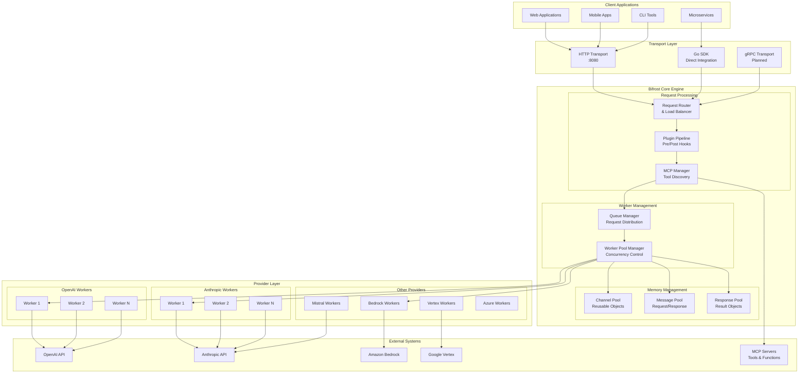

---

## ⚙️ Core Components

### **1. Transport Layer**

**Purpose:** Multiple interface options for different integration patterns

| Transport          | Use Case                                   | Performance | Integration Effort |
| ------------------ | ------------------------------------------ | ----------- | ------------------ |
| **HTTP Transport** | Microservices, web apps, language-agnostic | High        | Minimal (REST API) |
| **Go SDK**         | Go applications, maximum performance       | Maximum     | Low (Go package)   |
| **gRPC Transport** | Service mesh, type-safe APIs               | High        | Medium (protobuf)  |

**Key Features:**

- **OpenAPI Compatible** - Drop-in replacement for OpenAI/Anthropic APIs
- **Unified Interface** - Consistent API across all providers
- **Content Negotiation** - JSON, protobuf (planned)

### **2. Request Router & Load Balancer**

**Purpose:** Intelligent request distribution and provider selection

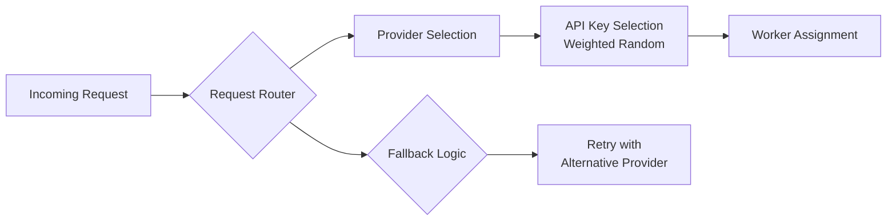

**Capabilities:**

- **Provider Selection** - Based on model availability and configuration
- **Load Balancing** - Weighted API key distribution
- **Fallback Chains** - Automatic provider switching on failures
- **Circuit Breaker** - Provider health monitoring and isolation

### **3. Plugin Pipeline**

**Purpose:** Extensible middleware for custom business logic

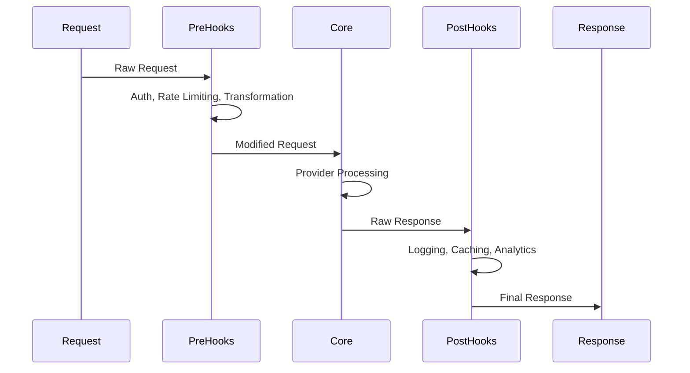

**Plugin Types:**

- **Authentication** - API key validation, JWT verification
- **Rate Limiting** - Per-user, per-provider limits
- **Monitoring** - Request/response logging, metrics collection
- **Transformation** - Request/response modification
- **Caching** - Response caching strategies

### **4. MCP Manager**

**Purpose:** Model Context Protocol integration for external tools

**Architecture:**

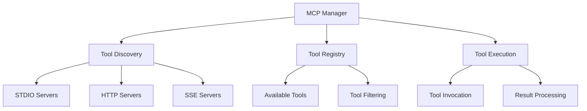

**Key Features:**

- **Dynamic Discovery** - Runtime tool discovery and registration
- **Multiple Protocols** - STDIO, HTTP, SSE support
- **Tool Filtering** - Request-level tool inclusion/exclusion
- **Async Execution** - Non-blocking tool invocation

### **5. Memory Management System**

**Purpose:** High-performance object pooling to minimize garbage collection

```go
// Simplified memory pool architecture
type MemoryManager struct {
    channelPool  sync.Pool  // Reusable communication channels
    messagePool  sync.Pool  // Request/response message objects
    responsePool sync.Pool  // Final response objects
    bufferPool   sync.Pool  // Byte buffers for network I/O
}
```

**Performance Impact:**

- **81% reduction** in processing overhead (11μs vs 59μs)
- **96% faster** queue wait times
- **Predictable latency** through object reuse

### **6. Worker Pool Manager**

**Purpose:** Provider-isolated concurrency with configurable resource limits

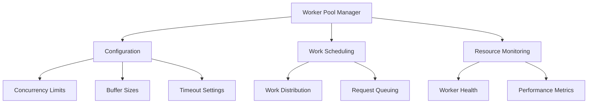

**Isolation Benefits:**

- **Fault Tolerance** - Provider failures don't affect others
- **Resource Control** - Independent rate limiting per provider
- **Performance Tuning** - Provider-specific optimization
- **Scaling** - Independent scaling per provider load

---

## 🔄 Data Flow Architecture

### **Request Processing Pipeline**

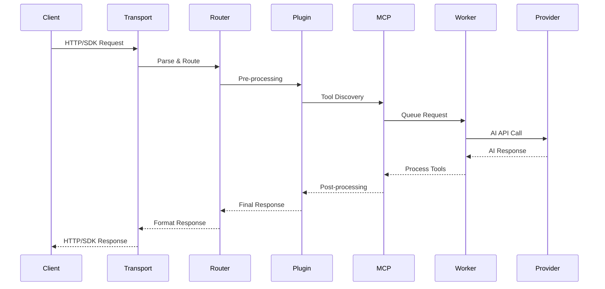

### **Memory Object Lifecycle**

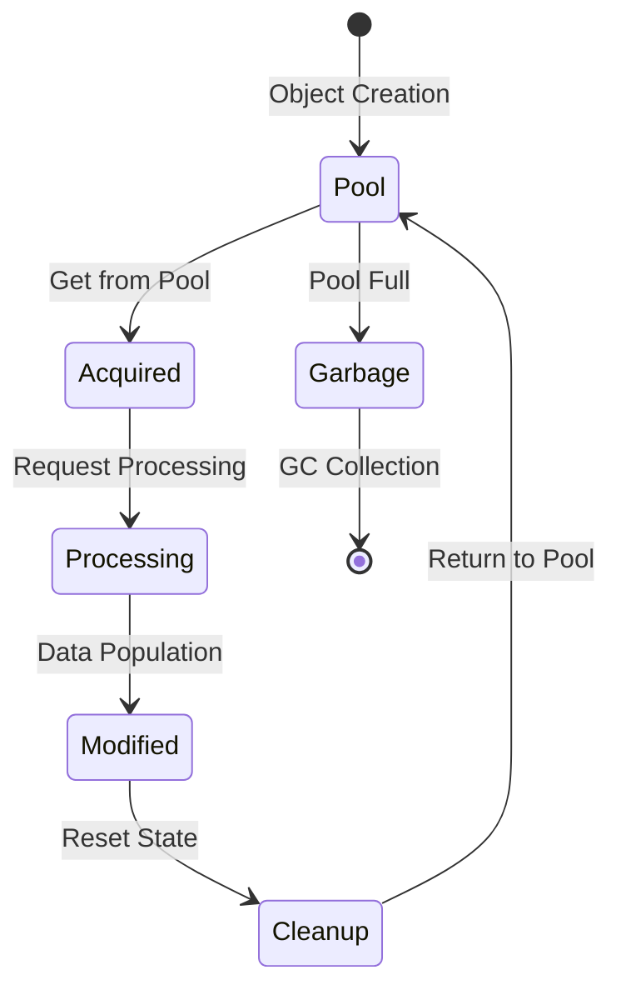

### **Concurrency Model**

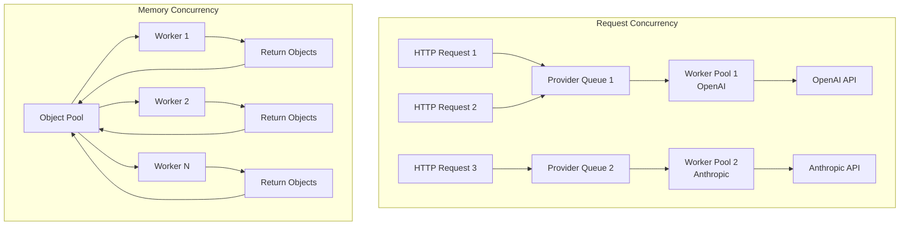

---

## 📊 Component Interactions

### **Configuration Hierarchy**

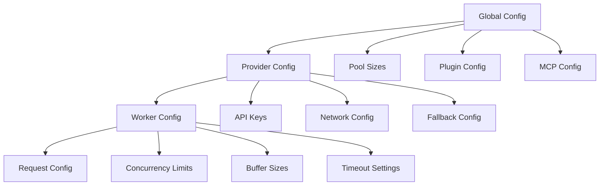

### **Error Propagation**

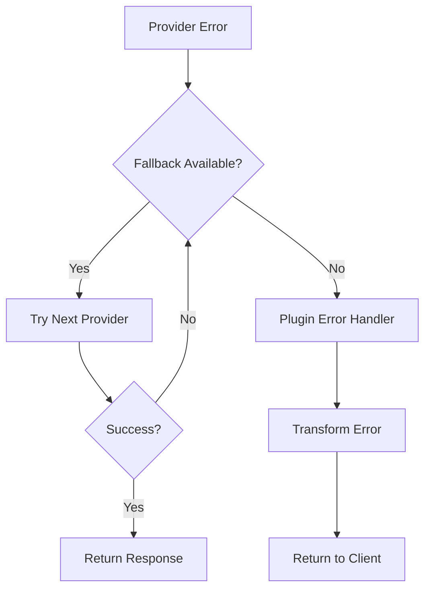

---

## 🚀 Scalability Architecture

### **Horizontal Scaling**

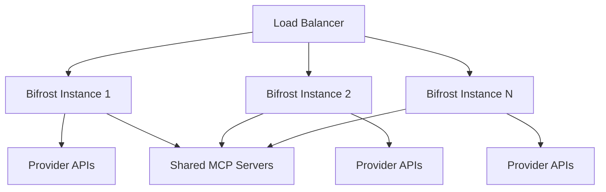

### **Vertical Scaling**

| Component            | Scaling Strategy        | Configuration              |
| -------------------- | ----------------------- | -------------------------- |
| **Memory Pools**     | Increase pool sizes     | `initial_pool_size: 25000` |
| **Worker Pools**     | More concurrent workers | `concurrency: 50`          |
| **Buffer Sizes**     | Larger request queues   | `buffer_size: 500`         |
| **Connection Pools** | More HTTP connections   | Provider-specific settings |

---

## 🔗 Related Architecture Documentation

- **[🔄 Request Flow](./request-flow.md)** - Detailed request processing pipeline
- **[⚙️ Concurrency Model](./concurrency.md)** - Worker pools and threading details
- **[🔌 Plugin System](./plugins.md)** - Plugin architecture and execution
- **[🛠️ MCP System](./mcp.md)** - Model Context Protocol implementation
- **[📊 Benchmarks](../benchmarks.md)** - Performance benchmarks and optimization strategies
- **[💡 Design Decisions](./design-decisions.md)** - Architecture rationale and trade-offs

---

**🎯 Next Step:** Understand how requests flow through the system in **[Request Flow](./request-flow.md)**.
