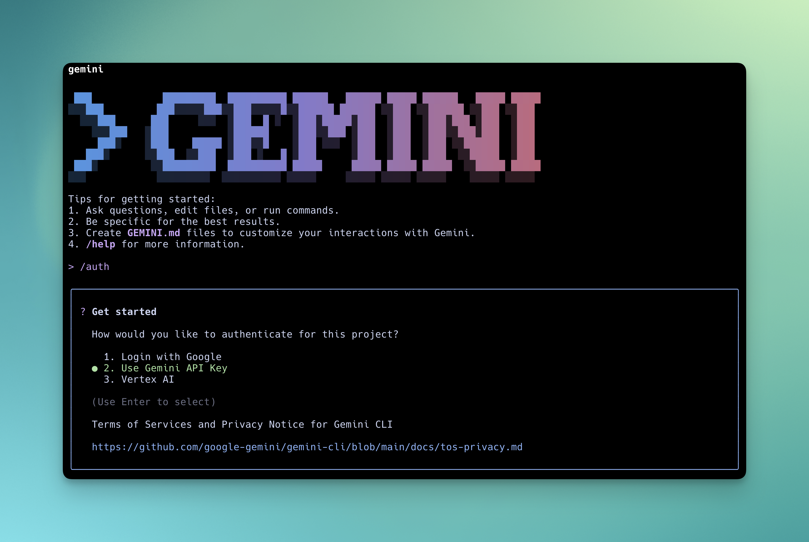

[Gemini CLI](https://github.com/google-gemini/gemini-cli) is Google's powerful coding assistant with advanced reasoning capabilities.

## To install Gemini CLI

```bash
npm install -g @google/gemini-cli
```

## Configuring Gemini CLI to work with Bifrost

Gemini CLI supports multiple authentication methods. Choose the one that matches your account type.

### Google account (OAuth)

Log in with your Google account for free-tier access (60 requests/min, 1,000 requests/day).

1. **Set the Bifrost base URL**
   ```bash
   export GOOGLE_GEMINI_BASE_URL=http://localhost:8080/genai
   ```

2. **Run Gemini CLI and sign in**
   ```bash
   gemini
   ```
   Select **Login with Google** and authenticate via your browser. All traffic automatically routes through Bifrost.

### API key based usage

For users with a Gemini API key (obtain one from [Google AI Studio](https://aistudio.google.com/apikey)):

1. **Configure environment variables**
   ```bash
   export GEMINI_API_KEY=your-api-key  # Gemini API key or Bifrost virtual key
   export GOOGLE_GEMINI_BASE_URL=http://localhost:8080/genai
   ```

2. **Run Gemini CLI**
   ```bash
   gemini
   ```
   Select **Use Gemini API Key** in the CLI prompt for authentication.



### Google Cloud / Vertex AI

For enterprise users with Vertex AI access:

```bash
export GOOGLE_API_KEY=your-api-key  # Google API key or Bifrost virtual key
export GOOGLE_GENAI_USE_VERTEXAI=true
export GOOGLE_GEMINI_BASE_URL=http://localhost:8080/genai
gemini
```

<Tip>
For paid Code Assist License users, set your Google Cloud project: `export GOOGLE_CLOUD_PROJECT="your-project-id"`
</Tip>

Now all Gemini CLI traffic flows through Bifrost, giving you access to any provider/model configured in your Bifrost setup, plus observability and governance.

## Model Configuration

Use the `-m` flag to start Gemini CLI with a specific model:

```bash
gemini -m gemini-2.5-flash
gemini -m gemini-2.5-pro
```

## Using Non-Google Models with Gemini CLI

Bifrost automatically translates GenAI API requests to other providers, so you can use Gemini CLI with models from OpenAI, Anthropic, Mistral, and more. Use the `provider/model-name` format to specify any Bifrost-configured model.

```bash
# Start with an OpenAI model
gemini -m openai/gpt-5

# Start with an Anthropic model
gemini -m anthropic/claude-sonnet-4-5-20250929

# Start with a Groq model
gemini -m groq/llama-3.3-70b-versatile
```

### Supported Providers

Bifrost supports the following providers with the `provider/model-name` format:

`openai`, `azure`, `gemini`, `vertex`, `bedrock`, `mistral`, `groq`, `cerebras`, `cohere`, `perplexity`, `xai`, `ollama`, `openrouter`, `huggingface`, `nebius`, `parasail`, `replicate`, `vllm`, `sgl`

<Warning>
Non-Google models **must support tool use** for Gemini CLI to work properly. Gemini CLI relies on tool calling for file operations, terminal commands, and code editing. Models without tool use support will fail on most operations.
</Warning>
