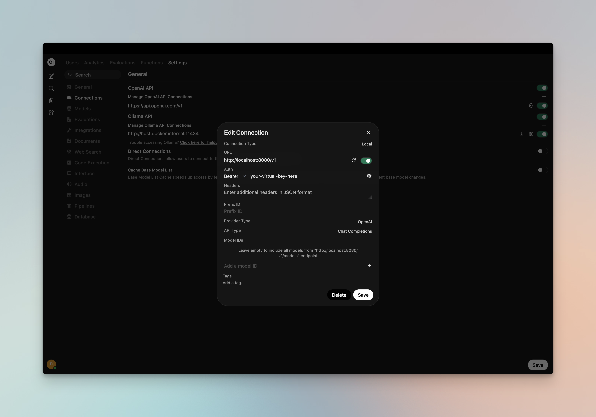
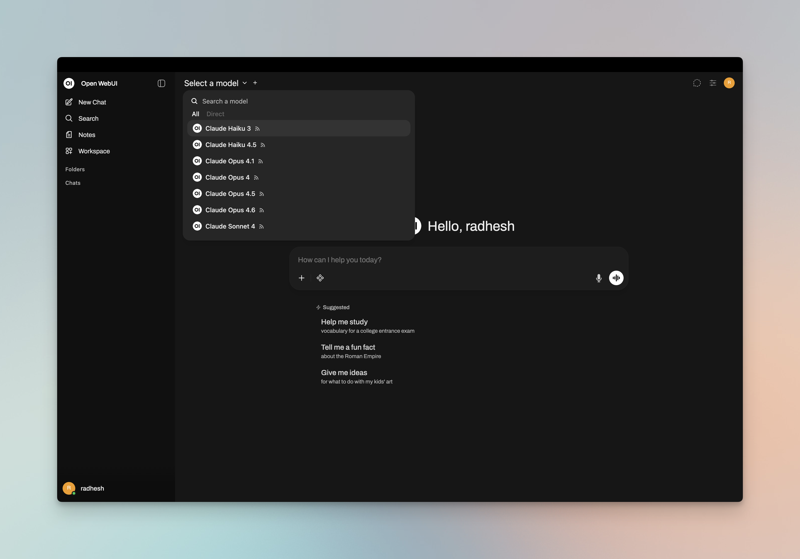
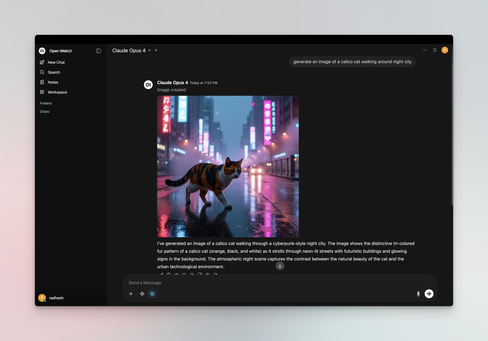
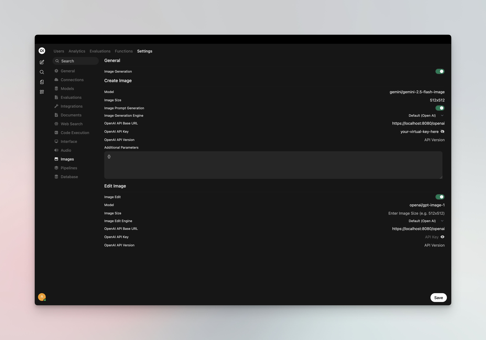

[Open WebUI](https://github.com/open-webui/open-webui) is a modern, open-source chat interface that supports OpenAI-compatible APIs. By adding Bifrost as a connection, you get access to any model configured in Bifrost through a familiar ChatGPT-like interface, plus governance features like virtual keys and built-in observability.

<Note>
If your Allowed Headers are already set to `*`, you can skip this note. If not and you face issues integrating Bifrost with Open WebUI, try switching to `*` or adding the specific headers required by your client. By default, Bifrost whitelists: `Content-Type`, `Authorization`, `X-Requested-With`, `X-Stainless-Timeout`, and `X-Api-Key`.
</Note>

## Setup

### 1. Install Open WebUI

Follow the [Open WebUI documentation](https://docs.openwebui.com/getting-started/installation/) for installation. Open WebUI can run via Docker, Docker Compose, or Kubernetes.

### 2. Add Bifrost as a Connection

<Tip>
If running Open WebUI in Docker and Bifrost is on the host machine, use `http://host.docker.internal:8080/v1` instead of `localhost`.
</Tip>

1. Open Open WebUI in your browser
2. Go to **⚙️ Admin Settings** → **Connections** → **OpenAI**
3. Click **➕ Add Connection**
4. Configure the following:

| Field | Value |
|-------|-------|
| **URL** | `http://localhost:8080/v1` (or your Bifrost host, e.g. `https://bifrost.yourcompany.com/v1`) |
| **API Key** | Your Bifrost virtual key if authentication is enabled; otherwise leave empty or use `dummy` |

5. Click **Save**



### 3. Model Discovery

Open WebUI fetches available models from Bifrost's `/v1/models` endpoint. If auto-detection fails or you want to filter which models appear, add model IDs to the **Model IDs (Filter)** allowlist in the connection settings. Use Bifrost model IDs in `provider/model` format (e.g. `openai/gpt-5`, `anthropic/claude-sonnet-4-5-20250929`).



### 4. Start Chatting

Select your Bifrost connection's model from the chat model selector and start chatting.



## Virtual Keys

When Bifrost has [virtual key authentication](/features/governance/virtual-keys) enabled, set **API Key** in the connection to your virtual key. This lets you enforce usage limits, budgets, and access control per user or team.

For team deployments, create separate Open WebUI connections (or use different API keys per connection) — each virtual key can have its own rate limits, budgets, and provider access rules configured in the Bifrost dashboard.

## Model Selection

Open WebUI displays models fetched from Bifrost or those you add to the Model IDs allowlist. Use Bifrost model IDs in `provider/model` format to access any configured provider:

- Use powerful models like `openai/gpt-5` or `anthropic/claude-sonnet-4-5-20250929` for complex conversations
- Use fast models like `groq/llama-3.3-70b-versatile` for quick responses

## Using Multiple Providers

Bifrost routes requests to the correct provider based on the model name. Use the `provider/model-name` format to access any configured provider through the single `/v1` endpoint:

```
anthropic/claude-sonnet-4-5-20250929
openai/gpt-5
gemini/gemini-2.5-pro
mistral/mistral-large-latest
```

### Supported Providers

Bifrost supports the following providers with the `provider/model-name` format:

`openai`, `azure`, `gemini`, `vertex`, `bedrock`, `mistral`, `groq`, `cerebras`, `cohere`, `perplexity`, `xai`, `ollama`, `openrouter`, `huggingface`, `nebius`, `parasail`, `replicate`, `vllm`, `sgl`

<Note>
Open WebUI connects to Bifrost via a single OpenAI-compatible endpoint. Bifrost handles routing to the correct provider based on the model name — no per-provider configuration needed in Open WebUI.
</Note>

## Multimodality

Open WebUI supports image generation and vision (image understanding). You can use Bifrost for both.

### Image Generation

Set a Bifrost provider/model as your **image inference engine** for DALL·E-style image generation:

1. Go to **⚙️ Admin Settings** → **Settings** → **Images**
2. Set **Image Generation Engine** to **Open AI**
3. Configure:
   - **API Endpoint URL**: `http://localhost:8080/v1` (or your Bifrost host + `/v1`)
   - **API Key**: Your Bifrost virtual key if authentication is enabled
   - **Model**: Bifrost model ID in `provider/model` format (e.g. `openai/dall-e-3`, `openai/gpt-image-1`)

Bifrost routes image generation requests to the configured provider. Use any image-capable model in your Bifrost configuration (OpenAI DALL·E, GPT-Image, or other providers that support `/v1/images/generations`).



### Vision (Image Understanding)

Chat models that support vision (e.g. `openai/gpt-4o`, `anthropic/claude-sonnet-4-5`) work through your main Bifrost connection. When you select a vision-capable model in the chat selector, you can attach images to your messages — Open WebUI sends them to Bifrost, which routes to the correct provider.

## Docker Networking

Choose the correct URL for your setup:

| Setup | URL |
|-------|-----|
| Open WebUI and Bifrost on same host | `http://localhost:8080/v1` |
| Open WebUI in Docker, Bifrost on host | `http://host.docker.internal:8080/v1` |
| Both in same Docker network | `http://bifrost-container-name:8080/v1` |

## Environment Variables (Alternative)

You can also configure Bifrost via environment variables when running Open WebUI:

```bash
# Single connection
OPENAI_API_BASE_URLS="http://localhost:8080/v1"
OPENAI_API_KEYS="your-bifrost-virtual-key"

# Multiple connections (semicolon-separated)
OPENAI_API_BASE_URLS="http://localhost:8080/v1;https://other-gateway.com/v1"
OPENAI_API_KEYS="key1;key2"
```

## Observability

All Open WebUI traffic through Bifrost is logged. Monitor it at `http://localhost:8080/logs` — filter by provider, model, or search through conversation content to track usage across your team.

## Next Steps

- [Provider Configuration](/quickstart/gateway/provider-configuration) — Configure AI providers in Bifrost
- [Virtual Keys](/features/governance/virtual-keys) — Set up usage limits and access control
