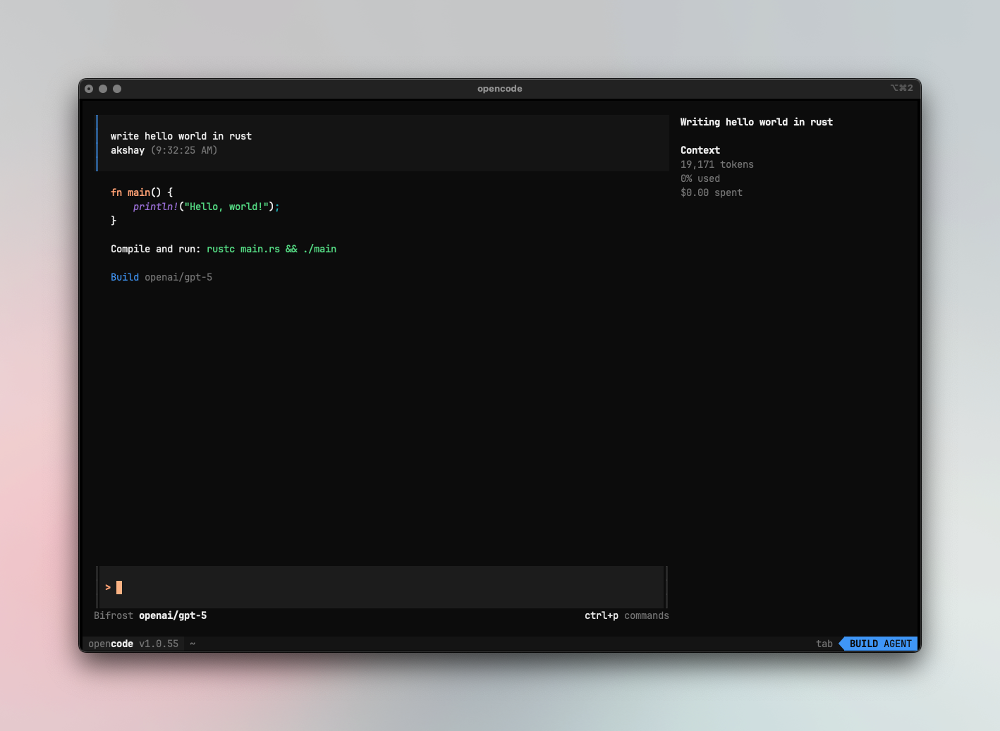
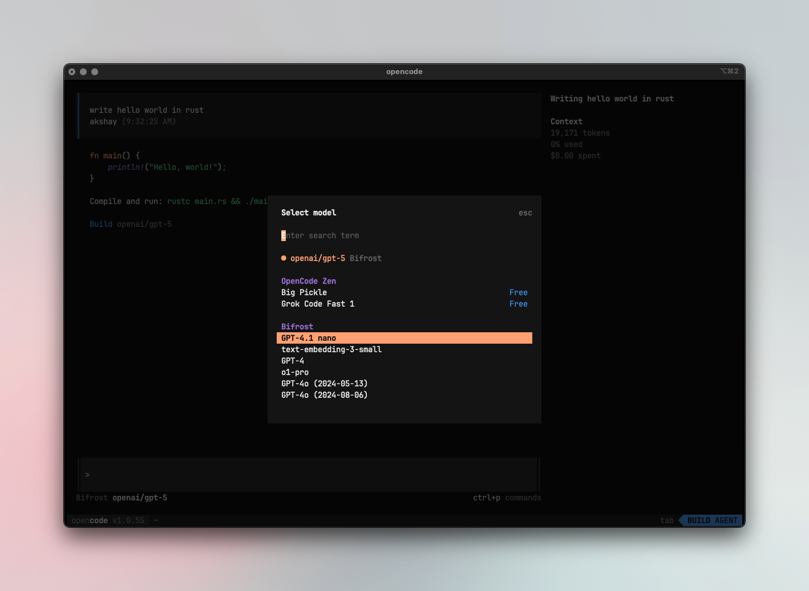

[Opencode](https://github.com/sst/opencode) is a terminal-based coding assistant by SST.



## Configuring OpenCode to work with Bifrost

OpenCode uses a JSON config file (`opencode.json`) to configure providers. Point your provider's `baseURL` to Bifrost.

### Using OpenAI-compatible endpoint

Route OpenAI and other providers through Bifrost's OpenAI endpoint:

```jsonc
{
  "$schema": "https://opencode.ai/config.json",
  "provider": {
    "openai": {
      "name": "Bifrost",
      "options": {
        "baseURL": "http://localhost:8080/openai",
        "apiKey": "your-bifrost-key"
      },
      "models": {
        "openai/gpt-5": {},
        "anthropic/claude-sonnet-4-5-20250929": {},
        "gemini/gemini-2.5-pro": {}
      }
    }
  },
  "model": "openai/gpt-5"
}
```

### Using Anthropic endpoint

Route Anthropic models through Bifrost's Anthropic endpoint:

```jsonc
{
  "$schema": "https://opencode.ai/config.json",
  "provider": {
    "anthropic": {
      "name": "Bifrost",
      "options": {
        "baseURL": "http://localhost:8080/anthropic",
        "apiKey": "your-bifrost-key"
      },
      "models": {
        "anthropic/claude-sonnet-4-5-20250929": {}
      }
    }
  },
  "model": "anthropic/claude-sonnet-4-5-20250929"
}
```

<Tip>
You can also use the `/connect` command in the OpenCode TUI to configure credentials interactively, then update the `baseURL` in your config file.
</Tip>

## Model Selection

Set your default models in `opencode.json`:

```jsonc
{
  "model": "openai/gpt-5",
  "small_model": "anthropic/claude-haiku-4-5"
}
```

Switch models in the TUI with <key>ctrl</key>+<key>p</key>



## Using Multiple Providers

Bifrost lets you configure models from different providers in a single endpoint. Use the `provider/model-name` format:

```jsonc
{
  "$schema": "https://opencode.ai/config.json",
  "theme": "opencode",
  "autoupdate": true,
  "provider": {
    "openai": {
      "name": "Bifrost",
      "options": {
        "baseURL": "http://localhost:8080/openai",
        "apiKey": "your-bifrost-key"
      },
      "models": {
        "openai/gpt-5": {
          "options": {
            "reasoningEffort": "high",
            "textVerbosity": "low",
            "reasoningSummary": "auto",
            "include": [
              "reasoning.encrypted_content"
            ]
          }
        },
        "anthropic/claude-sonnet-4-5-20250929": {
          "options": {
            "thinking": {
              "type": "enabled",
              "budgetTokens": 16000
            }
          }
        }
      }
    }
  }
}
```

### Supported Providers

Bifrost supports the following providers with the `provider/model-name` format:

`openai`, `azure`, `gemini`, `vertex`, `bedrock`, `mistral`, `groq`, `cerebras`, `cohere`, `perplexity`, `xai`, `ollama`, `openrouter`, `huggingface`, `nebius`, `parasail`, `replicate`, `vllm`, `sgl`

<Warning>
Non-native models **must support tool use** for OpenCode to work properly. OpenCode relies on tool calling for file operations, terminal commands, and code editing. Models without tool use support will fail on most operations.
</Warning>
