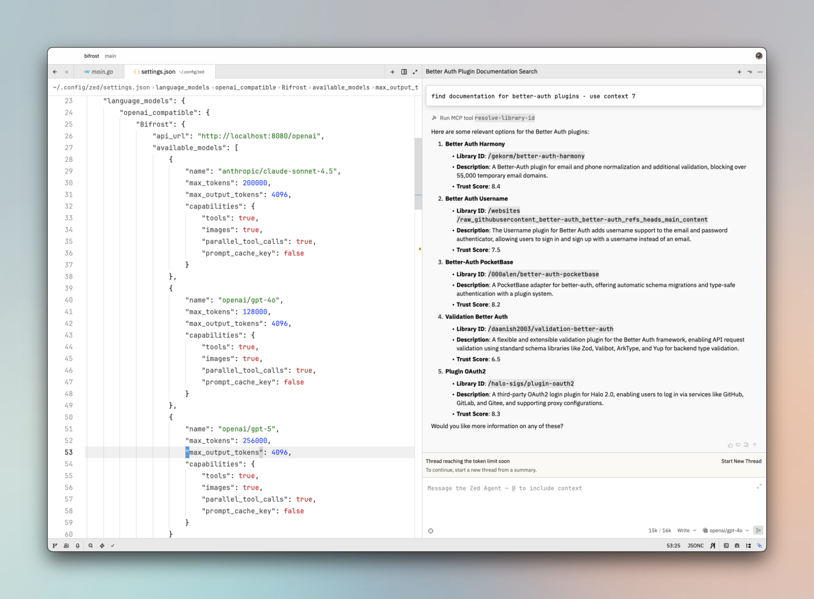

[Zed](https://zed.dev/) is a high-performance, multiplayer code editor with built-in AI integration.



## Setup

1. **Configure Bifrost provider.**

```json {4}
   "language_models": {
        "openai_compatible": {
            "Bifrost": {
                "api_url": "{{bifrost-base-url}}/openai",
                "available_models": [
                    {
                        "name": "anthropic/claude-sonnet-4.5",
                        "max_tokens": 200000,
                        "max_output_tokens": 4096,
                        "capabilities": {
                            "tools": true,
                            "images": true,
                            "parallel_tool_calls": true,
                            "prompt_cache_key": false
                        }
                    },
                    {
                        "name": "openai/gpt-4o",
                        "max_tokens": 128000,
                        "max_output_tokens": 4096,
                        "capabilities": {
                            "tools": true,
                            "images": true,
                            "parallel_tool_calls": true,
                            "prompt_cache_key": false
                        }
                    },
                    {
                        "name": "openai/gpt-5",
                        "max_tokens": 256000,
                        "max_output_tokens": 4096,
                        "capabilities": {
                            "tools": true,
                            "images": true,
                            "parallel_tool_calls": true,
                            "prompt_cache_key": false
                        }
                    }
                ]
            }
        }
    }
```

2. **Reload workspace** to make sure Zed editor recognizes and reloads the provider list.
