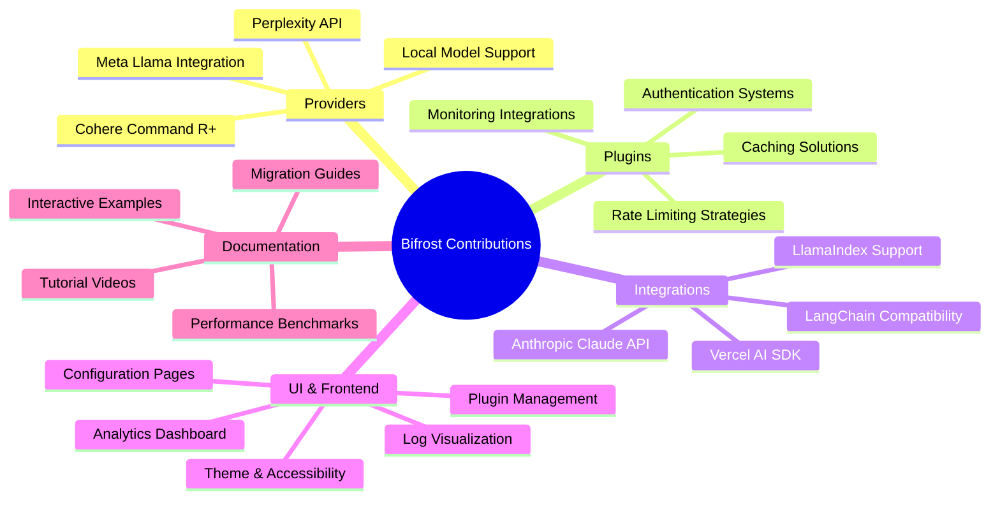

# 🤝 Contributing to Bifrost

Welcome to the Bifrost community! We're building the next generation of AI model integration infrastructure, and we'd love your help making it even better.

---

## 🎯 **Quick Start**

Ready to contribute? Here's your fastest path to making an impact:

### **🚀 5-Minute Setup**

```bash
# 1. Fork and clone
git clone https://github.com/YOUR_USERNAME/bifrost.git
cd bifrost/core  # or bifrost/transports

# 2. Install dependencies
go mod download

# 3. Verify setup
cd ../tests/core-providers/
go test -run TestOpenAI # or any provider you want to test

cd ../transports-integrations/
# read the README.md file in the transports-integrations directory for testing instructions

# 4. You're ready! 🎉
```

### **📋 Contribution Checklist**

- [ ] Read the [Code Conventions](./code-conventions)
- [ ] Check existing issues and discussions
- [ ] Write tests for your changes
- [ ] Update documentation if needed
- [ ] Submit PR with clear description

### **💬 Need Help Contributing?**

**🔗 [Join our Discord](https://getmax.im/bifrost-discord)** for:

- ❓ Quick questions about contributing
- 💡 Discuss your contribution ideas
- 🤝 Get help from maintainers and other contributors
- 🚀 Real-time support for development setup

---

## 🎨 **Contribution Types**

Choose your adventure based on what you'd like to work on:

### **🔧 Core Development**

| **Contribution Area**     | **Difficulty** | **Time Estimate** | **Getting Started**                          |
| ------------------------- | -------------- | ----------------- | -------------------------------------------- |
| **🌐 New Providers**      | Advanced       | 4-8 hours         | [Provider Guide →](./provider)            |
| **🔌 Plugin Development** | Intermediate   | 2-6 hours         | [Plugin Guide →](./plugin)                |
| **🌍 HTTP Integrations**  | Advanced       | 6-12 hours        | [Integration Guide →](./http-integration) |
| **🎨 UI Development**     | Variable       | 1-2 hours         | [UI Guide →](#-ui-development)               |
| **🐛 Bug Fixes**          | Variable       | 1-4 hours         | [Bug Reports →](#-bug-reports)               |
| **📝 Documentation**      | Beginner       | 30-120 min        | [Documentation →](#-documentation)           |

### **🚀 High-Impact Areas**

We're actively looking for contributions in these areas:



---

## 📚 **Specialized Contributing Guides**

### **🌐 [Provider Development →](./provider)**

**Add support for new AI model providers**

- **What:** Implement OpenAI-compatible provider interfaces
- **Skills:** Go programming, API integration, HTTP protocols
- **Examples:** Anthropic, Bedrock, Vertex AI implementations
- **Impact:** Enable Bifrost users to access new AI models

### **🔌 [Plugin Development →](./plugin)**

**Create extensible middleware for request/response processing**

- **What:** Build PreHook/PostHook plugins for custom logic
- **Skills:** Go interfaces, middleware patterns, testing
- **Examples:** Rate limiting, authentication, caching, monitoring
- **Impact:** Add powerful extensibility to Bifrost deployments

### **🌍 [HTTP Integration →](./http-integration)**

**Build compatibility with existing AI frameworks**

- **What:** Create OpenAI-compatible HTTP endpoints and adapters
- **Skills:** HTTP server development, API design, protocol translation
- **Examples:** OpenAI API compatibility, Anthropic integration, custom adapters
- **Impact:** Enable seamless migration from existing solutions

### **🎨 UI Development**

**Build and enhance the Bifrost web interface**

- **What:** Develop React components, pages, and user interfaces for Bifrost management
- **Skills:** React/Next.js, TypeScript, Tailwind CSS, UI/UX design
- **Examples:** Configuration panels, analytics dashboards, log viewers, plugin management
- **Impact:** Provide intuitive visual tools for Bifrost administration and monitoring

#### **🚀 UI Quick Start**

```bash
# Navigate to UI directory
cd ui

# Install dependencies
npm install

# Start development server
npm run dev

# Open http://localhost:3000 in your browser
```

#### **🛠️ Tech Stack**

- **Framework:** Next.js 15 with React 19
- **Language:** TypeScript for type safety
- **Styling:** Tailwind CSS with custom design system
- **Components:** Radix UI primitives for accessibility
- **Icons:** Lucide React icon library
- **Charts:** Recharts for data visualization
- **Code Editor:** Monaco Editor for configuration editing

#### **📁 UI Structure**

```
ui/
├── app/                    # Next.js app router pages
│   ├── config/            # Provider & plugin configuration
│   ├── docs/              # Documentation viewer
│   ├── plugins/           # Plugin management
│   └── page.tsx           # Dashboard homepage
├── components/            # React components
│   ├── config/            # Configuration UI components
│   ├── logs/              # Log viewing & analytics
│   ├── ui/                # Design system components
│   └── [shared components]
├── lib/                   # Utilities and API clients
├── hooks/                 # Custom React hooks
└── types/                 # TypeScript type definitions
```

#### **🎯 UI Contribution Areas**

| **Area**                  | **Difficulty** | **Description**                           | **Skills Needed**             |
| ------------------------- | -------------- | ----------------------------------------- | ----------------------------- |
| **🎨 Design System**      | Beginner       | Improve components, themes, accessibility | CSS, Design, Accessibility    |
| **📊 Analytics & Charts** | Intermediate   | Enhance data visualization and metrics    | React, Data Viz, Statistics   |
| **⚙️ Configuration UI**   | Intermediate   | Build provider/plugin setup interfaces    | React, Forms, Validation      |
| **📝 Log Management**     | Advanced       | Real-time log viewing and analysis        | WebSockets, Performance, UX   |
| **🔌 Plugin Interface**   | Advanced       | Dynamic plugin configuration and status   | React, State Management, APIs |
| **🌙 Theming & UX**       | Beginner       | Dark/light themes, responsive design      | CSS, Design, UX Principles    |

#### **🧪 UI Testing Guidelines**

```bash
# Run linting
npm run lint

# Run type checking
npx tsc --noEmit

# Run component tests (when available)
npm test

# Build for production
npm run build
```

#### **🎨 UI Design Principles**

- **Accessibility First:** WCAG 2.1 AA compliance, keyboard navigation, screen reader support
- **Responsive Design:** Mobile-first approach with breakpoint considerations
- **Performance:** Optimized bundle size, lazy loading, efficient re-renders
- **Consistency:** Unified design system using Radix UI and Tailwind
- **User Experience:** Intuitive navigation, clear feedback, minimal cognitive load

#### **🔧 Common UI Tasks**

**Adding a New Page:**

```typescript
// app/new-feature/page.tsx
import { Metadata } from "next";

export const metadata: Metadata = {
  title: "New Feature - Bifrost",
  description: "Description of the new feature",
};

export default function NewFeaturePage() {
  return (
    <div className="container mx-auto p-6">
      <h1 className="text-2xl font-bold">New Feature</h1>
      {/* Your component JSX */}
    </div>
  );
}
```

**Creating a Component:**

```typescript
// components/ui/custom-component.tsx
import { cn } from "@/lib/utils";

interface CustomComponentProps {
  className?: string;
  children: React.ReactNode;
}

export function CustomComponent({ className, children }: CustomComponentProps) {
  return <div className={cn("base-styles", className)}>{children}</div>;
}
```

**Adding API Integration:**

```typescript
// lib/api.ts
export async function fetchBifrostData(endpoint: string) {
  const response = await fetch(`/api/bifrost/${endpoint}`);
  if (!response.ok) throw new Error("Failed to fetch");
  return response.json();
}
```

#### **📋 UI Contribution Checklist**

- [ ] **Code Quality**

  - [ ] TypeScript types defined for all props and state
  - [ ] ESLint and Prettier formatting passes
  - [ ] No console.log statements in production code
  - [ ] Error boundaries implemented for fault tolerance

- [ ] **Accessibility**

  - [ ] Semantic HTML elements used appropriately
  - [ ] ARIA labels and roles where needed
  - [ ] Keyboard navigation functional
  - [ ] Color contrast meets WCAG standards

- [ ] **Performance**

  - [ ] Components use React.memo where appropriate
  - [ ] Images optimized with Next.js Image component
  - [ ] Bundle impact assessed (avoid heavy dependencies)
  - [ ] Loading states implemented for async operations

- [ ] **Design Consistency**
  - [ ] Tailwind CSS classes used consistently
  - [ ] Radix UI components leveraged where possible
  - [ ] Design system patterns followed
  - [ ] Responsive design implemented

### **📋 [Code Conventions →](./code-conventions)**

**Follow Bifrost's development standards**

- **What:** Code style, testing patterns, documentation standards
- **Skills:** Go best practices, testing methodologies, documentation
- **Examples:** Function naming, error handling, test structure
- **Impact:** Maintain code quality and consistency across the project

---

## 🐛 **Bug Reports**

Found a bug? Help us fix it quickly with a detailed report.

### **🔍 Before Reporting**

1. **Search existing issues** - Someone might have already reported it
2. **Try the latest version** - Bug might already be fixed
3. **Minimal reproduction** - Create the smallest possible test case
4. **Gather information** - Logs, version, environment details

### **📝 Bug Report Template**

```markdown
## Bug Description

Brief, clear description of the issue.

## Reproduction Steps

1. Set up Bifrost with [configuration]
2. Make request with [parameters]
3. Observe [unexpected behavior]

## Expected vs Actual

**Expected:** What should happen
**Actual:** What actually happens

## Environment

- Bifrost version:
- Go version:
- OS/Platform:
- Provider:

## Logs

[Include relevant logs with sensitive data removed]
```

[**🔗 Submit Bug Report →**](https://github.com/maximhq/bifrost/issues/new?template=bug_report)

---

## 💡 **Feature Requests**

Have an idea for improving Bifrost? We'd love to hear it!

### **💭 Feature Request Process**

1. **Check existing requests** - Look through GitHub issues and discussions
2. **Start a discussion** - Share your idea in GitHub Discussions
3. **Design collaboration** - Work with maintainers on implementation approach
4. **Implementation** - Code it up following our guidelines
5. **Review & merge** - Get feedback and merge your contribution

### **🎯 Feature Request Template**

```markdown
## Feature Description

What would you like to see added to Bifrost?

## Problem/Use Case

What problem does this solve? Why is it needed?

## Proposed Solution

How do you envision this working?

## Alternatives Considered

What other approaches could solve this?

## Implementation Ideas

Any thoughts on how this could be built?
```

[**🔗 Submit Feature Request →**](https://github.com/maximhq/bifrost/discussions/new?category=ideas)

---

## 📝 **Documentation**

Great documentation makes Bifrost accessible to everyone.

### **📖 Documentation Types**

**User Documentation:**

- **Getting Started** - First-time user experience
- **Configuration** - Setup and deployment guides
- **API Reference** - Complete function and endpoint documentation
- **Examples** - Real-world usage patterns
- **Troubleshooting** - Common issues and solutions

**Developer Documentation:**

- **Architecture** - System design and internal workings
- **Contributing** - How to contribute effectively
- **Testing** - Testing strategies and guidelines
- **Deployment** - Production deployment patterns

### **✍️ Documentation Standards**

- **Clear and concise** - Easy to understand for target audience
- **Comprehensive examples** - Show real working code
- **Up-to-date** - Reflect current functionality
- **Well-formatted** - Consistent markdown styling with diagrams
- **Searchable** - Include relevant keywords and cross-references

---

## 🧪 **Testing Guidelines**

Quality is our top priority. Every contribution should include appropriate tests.

### **🔬 Test Types**

| **Test Category**     | **Location**                     | **Purpose**                | **Run Command**                      |
| --------------------- | -------------------------------- | -------------------------- | ------------------------------------ |
| **Unit Tests**        | `core/`                          | Test individual functions  | `go test ./core/...`                 |
| **Integration Tests** | `tests/core-providers/`          | Test provider integrations | `go test ./tests/core-providers/...` |
| **HTTP API Tests**    | `tests/transports-integrations/` | Test HTTP endpoints        | `python -m pytest tests/`            |
| **Plugin Tests**      | `plugins/*/`                     | Test plugin functionality  | `go test ./plugins/...`              |
| **End-to-End Tests**  | `tests/`                         | Test complete workflows    | `go run tests/e2e.go`                |

### **✅ Testing Checklist**

- [ ] **Unit tests** for new functions
- [ ] **Integration tests** for provider/plugin changes
- [ ] **Error case testing** for failure scenarios
- [ ] **Performance tests** for critical paths
- [ ] **Documentation examples** actually work

---

## 🔄 **Pull Request Process**

### **📋 PR Checklist**

Before submitting your pull request:

- [ ] **Tests pass locally** - `go test ./...`
- [ ] **Code formatted** - `gofmt -w .` and `goimports -w .`
- [ ] **Linting clean** - `golangci-lint run`
- [ ] **Documentation updated** - If adding features or changing APIs
- [ ] **Changelog entry** - Add to CHANGELOG.md if user-facing change
- [ ] **Issue referenced** - Link to related GitHub issue

### **🎯 PR Template**

```markdown
## Description

Brief description of what this PR accomplishes.

## Type of Change

- [ ] Bug fix (non-breaking change)
- [ ] New feature (non-breaking change)
- [ ] Breaking change (fix or feature that changes existing functionality)
- [ ] Documentation update
- [ ] Refactoring (no functional changes)

## Testing

- [ ] Unit tests added/updated
- [ ] Integration tests pass
- [ ] Manual testing completed
- [ ] Performance impact assessed

## Related Issues

Fixes #(issue_number)
Related to #(issue_number)

## Breaking Changes

[If applicable, describe any breaking changes]

## Additional Notes

[Any additional context for reviewers]
```

### **👥 Review Process**

1. **Automated Checks** - CI/CD runs tests, linting, and security scans
2. **Code Review** - Maintainers review code quality, design, and documentation
3. **Testing** - Additional testing in staging environment if needed
4. **Approval** - Two maintainer approvals required for merge
5. **Merge** - Squash and merge to main branch with clean commit message

---

## 🌟 **Recognition & Community**

### **🏆 Contributor Recognition**

We value every contribution and recognize contributors:

- **📋 CONTRIBUTORS.md** - All contributors listed
- **📰 Release Notes** - Major contributors highlighted
- **📊 GitHub** - Contributor graphs and statistics
- **🎖️ Special Recognition** - Outstanding contributions featured

### **💬 Community & Support**

- **💬 [GitHub Discussions](https://github.com/maximhq/bifrost/discussions)** - Questions, ideas, and general discussion
- **🐛 [GitHub Issues](https://github.com/maximhq/bifrost/issues)** - Bug reports and feature requests
- **🔗 [Discord Community](https://getmax.im/bifrost-discord)** - Real-time chat and collaboration

---

## 🎉 **Getting Started Today**

Ready to make your first contribution? Here are some great starter issues:

- **🏷️ [`good first issue`](https://github.com/maximhq/bifrost/labels/good%20first%20issue)** - Perfect for newcomers
- **🏷️ [`help wanted`](https://github.com/maximhq/bifrost/labels/help%20wanted)** - Areas where we need help
- **🏷️ [`documentation`](https://github.com/maximhq/bifrost/labels/documentation)** - Documentation improvements

### **🚀 Next Steps**

1. **⭐ Star the repository** - Show your support
2. **👁️ Watch for updates** - Get notified of new releases
3. **🔀 Fork and clone** - Set up your development environment
4. **📖 Read the guides** - Choose your contribution area
5. **💻 Start coding** - Make your first contribution!

---

**Thank you for contributing to Bifrost!** 🎉

Every contribution, no matter how small, helps make AI integration easier and more accessible for developers worldwide. Together, we're building the future of AI infrastructure.

**Happy coding!** 🚀
