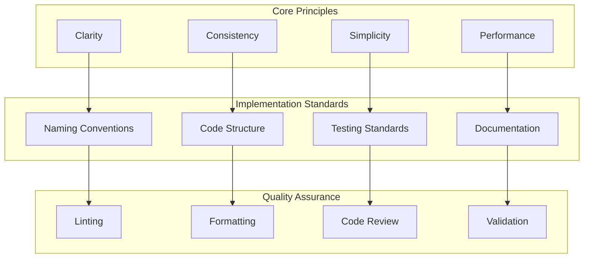

# 📋 Code Conventions Guide

Comprehensive coding standards and best practices for Bifrost development. Follow these conventions to maintain code quality, consistency, and readability across the project.

---

## 🎯 **Overview**

Consistent code conventions ensure that Bifrost remains maintainable, readable, and scalable as the project grows. These standards cover Go programming practices, testing patterns, documentation requirements, and project-specific conventions.

### **Code Quality Principles**



---

## 📋 **Go Language Standards**

### **General Guidelines**

Follow the official Go conventions with Bifrost-specific enhancements:

- **[Effective Go](https://golang.org/doc/effective_go.html)** - Core Go principles
- **[Go Code Review Comments](https://github.com/golang/go/wiki/CodeReviewComments)** - Best practices
- **[Uber Go Style Guide](https://github.com/uber-go/guide/blob/master/style)** - Advanced patterns
- **Bifrost-specific patterns** - Project conventions

### **Formatting and Tools**

#### **Required Tools**

```bash
# Install required tools
go install golang.org/x/tools/cmd/goimports@latest
go install github.com/golangci/golangci-lint/cmd/golangci-lint@latest
go install honnef.co/go/tools/cmd/staticcheck@latest

# Format code before committing
gofmt -w .
goimports -w .
golangci-lint run
```

#### **IDE Configuration**

**VS Code settings.json:**

```json
{
  "go.formatTool": "goimports",
  "go.lintTool": "golangci-lint",
  "go.lintOnSave": "package",
  "editor.formatOnSave": true,
  "editor.codeActionsOnSave": {
    "source.organizeImports": true
  }
}
```

---

## 🏗️ **Naming Conventions**

### **Package Names**

```go
// ✅ Good: Short, descriptive, lowercase
package providers
package schemas
package utils

// ❌ Bad: CamelCase, underscores, too long
package ProviderManagement
package provider_utils
package bifrost_core_internal_utilities
```

### **Function and Method Names**

```go
// ✅ Good: Clear, descriptive, CamelCase
func (p *OpenAIProvider) ChatCompletion(ctx context.Context, model string, messages []BifrostMessage) (*BifrostResponse, *BifrostError)

func validateAPIKey(key string) bool

func convertMessagesToOpenAIFormat(messages []schemas.BifrostMessage) []openai.ChatCompletionMessage

// ❌ Bad: Unclear abbreviations, too short, inconsistent
func (p *OAP) CC(c context.Context, m string, msgs []BMsg) (*BR, *BE)

func validate(k string) bool

func conv(msgs []schemas.BifrostMessage) []openai.ChatCompletionMessage
```

### **Variable Names**

```go
// ✅ Good: Descriptive, appropriate length for scope
func processRequest(ctx context.Context, req *BifrostRequest) (*BifrostResponse, error) {
    // Short names for short scopes
    for i, msg := range req.Messages {
        // Descriptive names for important variables
        convertedMessage := convertMessage(msg)
        processedMessages[i] = convertedMessage
    }

    // Clear names for important variables
    apiKey := extractAPIKeyFromContext(ctx)
    providerClient := p.createClient(apiKey)
    return nil, nil
}

// ❌ Bad: Generic names, unclear abbreviations
func processRequest(ctx context.Context, req *BifrostRequest) (*BifrostResponse, error) {
    for x, y := range req.Messages {
        z := convertMessage(y)
        data[x] = z
    }

    k := extractAPIKeyFromContext(ctx)
    c := p.createClient(k)
    return nil, nil
}
```

### **Type Names**

```go
// ✅ Good: Clear, descriptive, follows Go conventions
type BifrostRequest struct {
    Provider        ModelProvider     `json:"provider"`
    Model          string            `json:"model"`
    Input          RequestInput      `json:"input"`
    ModelParameters *ModelParameters  `json:"model_parameters,omitempty"`
}

type OpenAIProvider struct {
    config    *ProviderConfig
    client    *http.Client
    logger    Logger
    rateLimiter *RateLimiter
}

// Interface names should describe what they do
type Provider interface {
    GetProviderKey() ModelProvider
    ChatCompletion(ctx context.Context, model, key string, messages []BifrostMessage, params *ModelParameters) (*BifrostResponse, *BifrostError)
}

// ❌ Bad: Generic names, unclear purpose
type Data struct {
    P  string      `json:"p"`
    M  string      `json:"m"`
    I  interface{} `json:"i"`
}

type Thing struct {
    stuff map[string]interface{}
}
```

### **Constants**

```go
// ✅ Good: Descriptive, grouped logically
const (
    // HTTP timeout constants
    DefaultTimeoutSeconds    = 30
    MaxTimeoutSeconds       = 300
    MinTimeoutSeconds       = 1

    // Provider constants
    OpenAI    ModelProvider = "openai"
    Anthropic ModelProvider = "anthropic"
    Vertex    ModelProvider = "vertex"

    // Error types
    ErrorTypeAuthentication = "authentication_error"
    ErrorTypeRateLimit     = "rate_limit_error"
    ErrorTypeProviderError = "provider_error"
)

// ❌ Bad: Unclear names, no grouping
const (
    TIMEOUT = 30
    MAX_T   = 300
    ERR1    = "auth_err"
    ERR2    = "rate_err"
)
```

---

## 🏛️ **Code Structure**

### **File Organization**

```
core/
├── bifrost.go              # Main client interface
├── logger.go               # Logging utilities
├── mcp.go                  # MCP integration
├── utils.go                # Shared utilities
├── providers/              # Provider implementations
│   ├── openai.go
│   ├── anthropic.go
│   ├── vertex.go
│   └── utils.go           # Provider-shared utilities
└── schemas/               # Type definitions
    ├── bifrost.go         # Core types
    ├── provider.go        # Provider interfaces
    ├── plugin.go          # Plugin types
```

### **Import Organization**

```go
package providers

import (
    // Standard library imports first
    "context"
    "encoding/json"
    "fmt"
    "net/http"
    "time"

    // Third-party imports second
    "github.com/google/uuid"
    "github.com/stretchr/testify/assert"

    // Internal imports last
    "github.com/maximhq/bifrost/core/schemas"
    "github.com/maximhq/bifrost/core/utils"
)
```

### **Function Organization**

```go
type OpenAIProvider struct {
    config *schemas.ProviderConfig
    client *http.Client
    logger schemas.Logger
}

// Constructor first
func NewOpenAIProvider(config *schemas.ProviderConfig, logger schemas.Logger) *OpenAIProvider {
    return &OpenAIProvider{
        config: config,
        client: &http.Client{
            Timeout: time.Duration(config.NetworkConfig.TimeoutSeconds) * time.Second,
        },
        logger: logger,
    }
}

// Interface methods next (in interface order)
func (p *OpenAIProvider) GetProviderKey() schemas.ModelProvider {
    return schemas.OpenAI
}

func (p *OpenAIProvider) ChatCompletion(ctx context.Context, model, key string, messages []schemas.BifrostMessage, params *schemas.ModelParameters) (*schemas.BifrostResponse, *schemas.BifrostError) {
    // Implementation
}

// Private methods last (in logical order)
func (p *OpenAIProvider) buildRequest(model string, messages []schemas.BifrostMessage, params *schemas.ModelParameters) *openAIRequest {
    // Implementation
}

func (p *OpenAIProvider) executeRequest(ctx context.Context, key string, request *openAIRequest) (*openAIResponse, error) {
    // Implementation
}

func (p *OpenAIProvider) parseResponse(response *openAIResponse) (*schemas.BifrostResponse, error) {
    // Implementation
}
```

---

## 🛡️ **Error Handling**

### **Error Creation and Wrapping**

```go
// ✅ Good: Descriptive errors with context
func (p *OpenAIProvider) ChatCompletion(ctx context.Context, model, key string, messages []schemas.BifrostMessage, params *schemas.ModelParameters) (*schemas.BifrostResponse, *schemas.BifrostError) {

    request, err := p.buildRequest(model, messages, params)
    if err != nil {
        return nil, &schemas.BifrostError{
            IsBifrostError: true,
            Error: schemas.ErrorField{
                Message: fmt.Sprintf("failed to build request for model %s: %v", model, err),
                Error:   err,
            },
        }
    }

    response, err := p.executeRequest(ctx, key, request)
    if err != nil {
        // Check if it's an HTTP error
        if httpErr, ok := err.(*HTTPError); ok {
            return nil, &schemas.BifrostError{
                IsBifrostError: false,
                StatusCode:     &httpErr.StatusCode,
                Error: schemas.ErrorField{
                    Type:    &httpErr.Type,
                    Code:    &httpErr.Code,
                    Message: httpErr.Message,
                    Error:   err,
                },
            }
        }

        return nil, &schemas.BifrostError{
            IsBifrostError: true,
            Error: schemas.ErrorField{
                Message: fmt.Sprintf("request execution failed for provider %s: %v", p.GetProviderKey(), err),
                Error:   err,
            },
        }
    }

    bifrostResponse, err := p.parseResponse(response)
    if err != nil {
        return nil, &schemas.BifrostError{
            IsBifrostError: true,
            Error: schemas.ErrorField{
                Message: fmt.Sprintf("failed to parse response from %s: %v", p.GetProviderKey(), err),
                Error:   err,
            },
        }
    }

    return bifrostResponse, nil
}

// ❌ Bad: Generic errors without context
func (p *OpenAIProvider) ChatCompletion(ctx context.Context, model, key string, messages []schemas.BifrostMessage, params *schemas.ModelParameters) (*schemas.BifrostResponse, *schemas.BifrostError) {
    request, err := p.buildRequest(model, messages, params)
    if err != nil {
        return nil, &schemas.BifrostError{Error: schemas.ErrorField{Message: err.Error()}}
    }

    response, err := p.executeRequest(ctx, key, request)
    if err != nil {
        return nil, &schemas.BifrostError{Error: schemas.ErrorField{Message: "request failed"}}
    }

    return p.parseResponse(response)
}
```

### **Error Types and Consistency**

```go
// ✅ Good: Consistent error types with clear semantics
var (
    ErrInvalidAPIKey    = errors.New("invalid or missing API key")
    ErrProviderNotFound = errors.New("provider not found")
    ErrModelNotFound    = errors.New("model not supported by provider")
    ErrRateLimitExceeded = errors.New("rate limit exceeded")
    ErrContextCanceled  = errors.New("request context canceled")
)

// Create structured errors for different scenarios
func (p *OpenAIProvider) validateRequest(req *schemas.BifrostRequest) error {
    if req.Model == "" {
        return fmt.Errorf("model is required for provider %s", p.GetProviderKey())
    }

    if req.Input.ChatCompletionInput == nil {
        return fmt.Errorf("chat completion input is required for provider %s", p.GetProviderKey())
    }

    if len(*req.Input.ChatCompletionInput) == 0 {
        return fmt.Errorf("at least one message is required for provider %s", p.GetProviderKey())
    }

    return nil
}
```

---

## 🧪 **Testing Standards**

### **Test File Organization**

```go
// provider_test.go
package providers

import (
    "context"
    "testing"
    "time"

    "github.com/stretchr/testify/assert"
    "github.com/stretchr/testify/require"
    "github.com/stretchr/testify/mock"

    "github.com/maximhq/bifrost/core/schemas"
)

// Test naming: Test<FunctionName>_<Scenario>_<ExpectedResult>
func TestOpenAIProvider_ChatCompletion_ValidRequest_ReturnsResponse(t *testing.T) {
    // Arrange
    provider := NewOpenAIProvider(testConfig, testLogger)
    messages := []schemas.BifrostMessage{
        {
            Role: schemas.ModelChatMessageRoleUser,
            Content: schemas.MessageContent{
                ContentStr: stringPtr("Hello, world!"),
            },
        },
    }

    // Act
    result, err := provider.ChatCompletion(
        context.Background(),
        "gpt-4o-mini",
        "test-api-key",
        messages,
        nil,
    )

    // Assert
    assert.NoError(t, err)
    assert.NotNil(t, result)
    assert.Equal(t, "gpt-4o-mini", result.Model)
    assert.NotEmpty(t, result.Choices)
}

func TestOpenAIProvider_ChatCompletion_InvalidAPIKey_ReturnsError(t *testing.T) {
    provider := NewOpenAIProvider(testConfig, testLogger)
    messages := []schemas.BifrostMessage{
        {
            Role: schemas.ModelChatMessageRoleUser,
            Content: schemas.MessageContent{
                ContentStr: stringPtr("Hello"),
            },
        },
    }

    result, err := provider.ChatCompletion(
        context.Background(),
        "gpt-4o-mini",
        "invalid-key",
        messages,
        nil,
    )

    assert.Nil(t, result)
    assert.NotNil(t, err)
    assert.Contains(t, err.Error.Message, "authentication")
    assert.Equal(t, 401, *err.StatusCode)
}
```

### **Test Helpers and Utilities**

```go
// test_utils.go
package providers

import (
    "testing"
    "github.com/maximhq/bifrost/core/schemas"
)

// Test helper functions should be clear and reusable
func createTestBifrostMessage(role schemas.ModelChatMessageRole, content string) schemas.BifrostMessage {
    return schemas.BifrostMessage{
        Role: role,
        Content: schemas.MessageContent{
            ContentStr: &content,
        },
    }
}

func createTestProvider(t *testing.T) *OpenAIProvider {
    t.Helper() // Mark this as a test helper

    config := &schemas.ProviderConfig{
        NetworkConfig: schemas.NetworkConfig{
            TimeoutSeconds: 30,
            MaxRetries:     3,
        },
    }

    return NewOpenAIProvider(config, &testLogger{})
}

func assertValidBifrostResponse(t *testing.T, response *schemas.BifrostResponse) {
    t.Helper()

    assert.NotNil(t, response)
    assert.NotEmpty(t, response.ID)
    assert.NotEmpty(t, response.Model)
    assert.NotEmpty(t, response.Choices)
    assert.Greater(t, response.Created, 0)
}

// Use table-driven tests for multiple scenarios
func TestOpenAIProvider_ChatCompletion_MultipleScenarios(t *testing.T) {
    tests := []struct {
        name          string
        model         string
        messages      []schemas.BifrostMessage
        params        *schemas.ModelParameters
        expectedError bool
        errorContains string
    }{
        {
            name:  "valid_basic_request",
            model: "gpt-4o-mini",
            messages: []schemas.BifrostMessage{
                createTestBifrostMessage(schemas.ModelChatMessageRoleUser, "Hello"),
            },
            params:        nil,
            expectedError: false,
        },
        {
            name:  "empty_model",
            model: "",
            messages: []schemas.BifrostMessage{
                createTestBifrostMessage(schemas.ModelChatMessageRoleUser, "Hello"),
            },
            params:        nil,
            expectedError: true,
            errorContains: "model",
        },
        {
            name:          "empty_messages",
            model:         "gpt-4o-mini",
            messages:      []schemas.BifrostMessage{},
            params:        nil,
            expectedError: true,
            errorContains: "message",
        },
    }

    for _, tt := range tests {
        t.Run(tt.name, func(t *testing.T) {
            provider := createTestProvider(t)

            result, err := provider.ChatCompletion(
                context.Background(),
                tt.model,
                "test-key",
                tt.messages,
                tt.params,
            )

            if tt.expectedError {
                assert.NotNil(t, err)
                if tt.errorContains != "" {
                    assert.Contains(t, err.Error.Message, tt.errorContains)
                }
            } else {
                assert.NoError(t, err)
                assertValidBifrostResponse(t, result)
            }
        })
    }
}
```

### **Mock Usage**

```go
// Use interfaces for testability
type HTTPClient interface {
    Do(req *http.Request) (*http.Response, error)
}

type OpenAIProvider struct {
    config *schemas.ProviderConfig
    client HTTPClient // Use interface for mocking
    logger schemas.Logger
}

// Mock implementation for testing
type MockHTTPClient struct {
    mock.Mock
}

func (m *MockHTTPClient) Do(req *http.Request) (*http.Response, error) {
    args := m.Called(req)
    return args.Get(0).(*http.Response), args.Error(1)
}

func TestOpenAIProvider_WithMock(t *testing.T) {
    // Setup mock
    mockClient := new(MockHTTPClient)

    // Configure mock expectations
    mockResponse := &http.Response{
        StatusCode: 200,
        Body:       io.NopCloser(strings.NewReader(`{"choices":[{"message":{"content":"Hello!"}}]}`)),
    }
    mockClient.On("Do", mock.AnythingOfType("*http.Request")).Return(mockResponse, nil)

    // Create provider with mock
    provider := &OpenAIProvider{
        config: testConfig,
        client: mockClient,
        logger: testLogger,
    }

    // Test
    result, err := provider.ChatCompletion(context.Background(), "gpt-4o-mini", "key", testMessages, nil)

    // Assertions
    assert.NoError(t, err)
    assert.NotNil(t, result)

    // Verify mock was called as expected
    mockClient.AssertExpectations(t)
}
```

---

## 📝 **Documentation Standards**

### **Package Documentation**

```go
// Package providers implements AI model provider integrations for Bifrost.
//
// This package provides a unified interface for communicating with different
// AI providers such as OpenAI, Anthropic, Google Vertex AI, and others.
//
// Each provider implements the Provider interface, which defines standard
// methods for chat completion, text completion, and other AI operations.
// Providers handle the specifics of API communication, request/response
// transformation, and error handling for their respective services.
//
// Example usage:
//
//     provider := providers.NewOpenAIProvider(config, logger)
//     response, err := provider.ChatCompletion(ctx, model, apiKey, messages, params)
//     if err != nil {
//         // Handle error
//     }
//     // Use response
//
// Provider implementations are designed to be:
//   - Thread-safe for concurrent use
//   - Consistent in error handling and response formats
//   - Optimized for performance with connection pooling and retries
//   - Configurable through the ProviderConfig structure
package providers
```

### **Function Documentation**

```go
// ChatCompletion performs a chat completion request to the OpenAI API.
//
// This method converts Bifrost messages to OpenAI format, executes the API
// request with proper authentication and error handling, and converts the
// response back to Bifrost format.
//
// Parameters:
//   - ctx: Request context for cancellation and timeouts
//   - model: OpenAI model name (e.g., "gpt-4o-mini", "gpt-4")
//   - key: OpenAI API key for authentication
//   - messages: Conversation messages in Bifrost format
//   - params: Optional model parameters (temperature, max_tokens, etc.)
//
// Returns:
//   - *BifrostResponse: Formatted response containing choices, usage, and metadata
//   - *BifrostError: Structured error with status code and error details, or nil on success
//
// The method handles various error scenarios:
//   - Invalid API keys (401 Unauthorized)
//   - Rate limiting (429 Too Many Requests)
//   - Model not found (404 Not Found)
//   - Request validation errors (400 Bad Request)
//   - Network timeouts and connection errors
//
// Example:
//
//     messages := []schemas.BifrostMessage{
//         {Role: "user", Content: schemas.MessageContent{ContentStr: &prompt}},
//     }
//     params := &schemas.ModelParameters{Temperature: &temp, MaxTokens: &maxTokens}
//
//     response, err := provider.ChatCompletion(ctx, "gpt-4o-mini", apiKey, messages, params)
//     if err != nil {
//         if err.StatusCode != nil && *err.StatusCode == 401 {
//             // Handle authentication error
//         }
//         return err
//     }
//
//     content := response.Choices[0].Message.Content.ContentStr
//     fmt.Println(*content)
func (p *OpenAIProvider) ChatCompletion(ctx context.Context, model, key string, messages []schemas.BifrostMessage, params *schemas.ModelParameters) (*schemas.BifrostResponse, *schemas.BifrostError) {
    // Implementation
}

// buildRequest converts Bifrost messages and parameters to OpenAI API format.
//
// This internal method handles the translation between Bifrost's unified
// message format and OpenAI's specific API requirements. It preserves
// message roles, content types (text/image), tool calls, and model parameters.
//
// The conversion process:
//   1. Maps Bifrost message roles to OpenAI roles
//   2. Converts content blocks (text/image) to OpenAI format
//   3. Transforms tool calls and function definitions
//   4. Applies model parameters with proper validation
//
// Parameters:
//   - model: Target OpenAI model identifier
//   - messages: Bifrost messages to convert
//   - params: Model parameters to apply
//
// Returns:
//   - *openAIRequest: Request structure ready for OpenAI API
//   - error: Validation or conversion error, or nil on success
func (p *OpenAIProvider) buildRequest(model string, messages []schemas.BifrostMessage, params *schemas.ModelParameters) (*openAIRequest, error) {
    // Implementation
}
```

### **Type Documentation**

```go
// BifrostRequest represents a unified request structure for all AI providers.
//
// This structure abstracts provider-specific request formats into a common
// interface that can be used across different AI services. It supports
// various input types including chat completion, text completion, and
// future expansion for other AI operations.
//
// The request includes provider selection, model specification, input data,
// optional parameters, and tool definitions for function calling scenarios.
//
// Example usage:
//
//     request := &schemas.BifrostRequest{
//         Provider: schemas.OpenAI,
//         Model:    "gpt-4o-mini",
//         Input: schemas.RequestInput{
//             ChatCompletionInput: &[]schemas.BifrostMessage{
//                 {Role: "user", Content: schemas.MessageContent{ContentStr: &prompt}},
//             },
//         },
//         ModelParameters: &schemas.ModelParameters{
//             Temperature: &temperature,
//             MaxTokens:   &maxTokens,
//         },
//         Tools: &[]schemas.Tool{toolDefinition},
//     }
type BifrostRequest struct {
    // Provider specifies which AI service to use (e.g., "openai", "anthropic")
    Provider ModelProvider `json:"provider"`

    // Model identifies the specific model within the provider
    // Examples: "gpt-4o-mini", "claude-3-sonnet", "gemini-pro"
    Model string `json:"model"`

    // Input contains the request data in various formats
    // Currently supports chat completion and text completion inputs
    Input RequestInput `json:"input"`

    // ModelParameters configures model behavior (optional)
    // Includes temperature, max_tokens, top_p, frequency_penalty, etc.
    ModelParameters *ModelParameters `json:"model_parameters,omitempty"`

    // Tools defines available functions for function calling (optional)
    // Used with models that support tool/function calling capabilities
    Tools *[]Tool `json:"tools,omitempty"`

    // ExtraFields contains provider-specific additional data (optional)
    // Allows passing custom parameters not covered by standard fields
    ExtraFields map[string]interface{} `json:"extra_fields,omitempty"`
}
```

---

## ⚡ **Performance Best Practices**

### **Memory Management**

```go
// ✅ Good: Efficient memory usage
func (p *OpenAIProvider) ChatCompletion(ctx context.Context, model, key string, messages []schemas.BifrostMessage, params *schemas.ModelParameters) (*schemas.BifrostResponse, *schemas.BifrostError) {
    // Pre-allocate slices with known capacity
    openAIMessages := make([]openAIMessage, 0, len(messages))

    // Reuse buffers for JSON marshaling
    var buf bytes.Buffer
    encoder := json.NewEncoder(&buf)

    // Use string builder for string concatenation
    var sb strings.Builder
    sb.Grow(256) // Pre-allocate expected capacity

    // Process in chunks for large datasets
    const chunkSize = 100
    for i := 0; i < len(messages); i += chunkSize {
        end := i + chunkSize
        if end > len(messages) {
            end = len(messages)
        }

        chunk := messages[i:end]
        processMessageChunk(chunk)
    }

    return nil, nil
}

// ❌ Bad: Inefficient memory usage
func (p *OpenAIProvider) ChatCompletion(ctx context.Context, model, key string, messages []schemas.BifrostMessage, params *schemas.ModelParameters) (*schemas.BifrostResponse, *schemas.BifrostError) {
    // Inefficient: repeated string concatenation
    var result string
    for _, msg := range messages {
        result += msg.Content.String() + "\n" // Creates new string each iteration
    }

    // Inefficient: growing slice without capacity
    var openAIMessages []openAIMessage
    for _, msg := range messages {
        openAIMessages = append(openAIMessages, convertMessage(msg)) // Repeated allocations
    }

    return nil, nil
}
```

### **Concurrency Patterns**

```go
// ✅ Good: Proper goroutine management
type ProviderPool struct {
    providers map[schemas.ModelProvider]schemas.Provider
    mu        sync.RWMutex
    semaphore chan struct{} // Limit concurrent requests
}

func (pool *ProviderPool) ExecuteConcurrentRequests(ctx context.Context, requests []*schemas.BifrostRequest) ([]*schemas.BifrostResponse, error) {
    results := make([]*schemas.BifrostResponse, len(requests))
    errors := make([]error, len(requests))

    var wg sync.WaitGroup

    for i, req := range requests {
        wg.Add(1)

        go func(index int, request *schemas.BifrostRequest) {
            defer wg.Done()

            // Acquire semaphore to limit concurrency
            select {
            case pool.semaphore <- struct{}{}:
                defer func() { <-pool.semaphore }()
            case <-ctx.Done():
                errors[index] = ctx.Err()
                return
            }

            // Execute request
            provider := pool.getProvider(request.Provider)
            result, err := provider.ChatCompletion(ctx, request.Model, "", request.Input.ChatCompletionInput, request.ModelParameters)

            results[index] = result
            if err != nil {
                errors[index] = err
            }
        }(i, req)
    }

    wg.Wait()

    // Check for errors
    for _, err := range errors {
        if err != nil {
            return results, err
        }
    }

    return results, nil
}

// Use context for cancellation
func (p *OpenAIProvider) executeWithTimeout(ctx context.Context, req *http.Request) (*http.Response, error) {
    // Create context with timeout
    ctx, cancel := context.WithTimeout(ctx, 30*time.Second)
    defer cancel()

    // Add context to request
    req = req.WithContext(ctx)

    // Execute with context cancellation support
    return p.client.Do(req)
}
```

---

## 🔍 **Code Review Guidelines**

### **Review Checklist**

#### **Functionality**

- [ ] **Correctness** - Code works as intended
- [ ] **Edge Cases** - Handles boundary conditions
- [ ] **Error Handling** - Proper error propagation and logging
- [ ] **Resource Management** - No memory/connection leaks
- [ ] **Thread Safety** - Safe for concurrent use

#### **Code Quality**

- [ ] **Readability** - Clear, self-documenting code
- [ ] **Maintainability** - Easy to modify and extend
- [ ] **Performance** - Efficient algorithms and data structures
- [ ] **Security** - No security vulnerabilities
- [ ] **Testing** - Adequate test coverage

#### **Standards Compliance**

- [ ] **Naming** - Follows naming conventions
- [ ] **Formatting** - Properly formatted with tools
- [ ] **Documentation** - Adequate comments and docs
- [ ] **Architecture** - Follows project patterns
- [ ] **Dependencies** - Appropriate library usage

### **Common Issues to Watch For**

```go
// ❌ Issues to flag in review:

// 1. Missing error handling
result := provider.ChatCompletion(ctx, model, key, messages, params)
// Should check for error

// 2. Improper resource cleanup
resp, err := http.Get(url)
// Should defer resp.Body.Close()

// 3. Race conditions
func (p *Provider) UpdateConfig(config *Config) {
    p.config = config // Not thread-safe
}

// 4. Context not propagated
func processRequest(req *Request) {
    // Should accept and use context.Context
}

// 5. Inefficient string operations
var result string
for _, item := range items {
    result += item // Use strings.Builder instead
}

// 6. Missing validation
func setTemperature(temp float64) {
    // Should validate temp range
    p.temperature = temp
}

// 7. Hardcoded values
timeout := 30 * time.Second // Should be configurable

// 8. Generic error messages
return errors.New("error") // Should be descriptive
```

---

## ✅ **Pre-Commit Checklist**

### **Before Submitting Code**

```bash
# 1. Format and organize imports
gofmt -w .
goimports -w .

# 2. Run linting
golangci-lint run

# 3. Run static analysis
staticcheck ./...

# 4. Run all tests
go test ./... -v

# 5. Run race detector
go test ./... -race

# 6. Check test coverage
go test ./... -coverprofile=coverage.out
go tool cover -html=coverage.out

# 7. Build all binaries
go build ./...

# 8. Verify mod tidiness
go mod tidy
go mod verify
```

### **Automated Pre-Commit Hook**

```bash
#!/bin/sh
# .git/hooks/pre-commit

echo "Running pre-commit checks..."

# Format code
gofmt -w .
goimports -w .

# Check for linting issues
if ! golangci-lint run; then
    echo "❌ Linting failed. Please fix issues before committing."
    exit 1
fi

# Run tests
if ! go test ./... -short; then
    echo "❌ Tests failed. Please fix failing tests before committing."
    exit 1
fi

# Check for race conditions in critical packages
if ! go test ./core/... -race -short; then
    echo "❌ Race conditions detected. Please fix before committing."
    exit 1
fi

echo "✅ Pre-commit checks passed!"
```

---

## 🎯 **Next Steps**

1. **Setup Development Environment** - Install required tools and configure IDE
2. **Read Existing Code** - Study current codebase to understand patterns
3. **Start Small** - Begin with minor improvements following these conventions
4. **Get Feedback** - Submit small PRs to get familiar with review process
5. **Ask Questions** - Use [GitHub Discussions](https://github.com/maximhq/bifrost/discussions) for clarification

---

**Remember:** Consistent code is maintainable code! 🎉

These conventions ensure that Bifrost remains a high-quality, maintainable codebase that's easy for new contributors to understand and extend.
