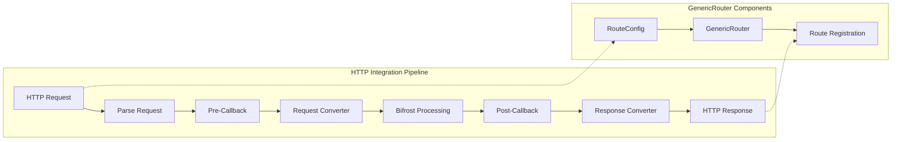

# 🌐 HTTP Integration Development Guide

Comprehensive guide for building HTTP integrations for Bifrost. Learn how to create new API-compatible endpoints that translate between external service formats and Bifrost's unified interface.

> **⚠️ IMPORTANT**: Before developing an integration, **thoroughly read** the [Request Flow Documentation](../architecture/request-flow.md) and [System Overview](../architecture/system-overview.md) to understand:
>
> - HTTP transport layer architecture and request processing pipeline
> - Integration patterns and GenericRouter design
> - Error handling and response formatting
> - Security considerations and validation requirements

---

## 🏗️ **Integration Structure Requirements**

Each HTTP integration should be organized as follows:

```
transports/bifrost-http/integrations/
└── your-integration/
    ├── router.go         # Route definitions and integration setup
    ├── types.go          # Request/response type definitions and converters
    └── (optional files)  # Additional integration-specific logic
```

### **Integration Testing Structure**

```
tests/transports-integrations/tests/integrations/
└── test_your_integration.py    # Comprehensive integration tests
```

---

## 🎯 **Overview**

HTTP integrations provide API-compatible endpoints that translate between external service formats (OpenAI, Anthropic, etc.) and Bifrost's unified request/response format. Each integration follows a standardized pattern using Bifrost's `GenericRouter` architecture.

**Key Feature**: All integrations should support **multi-provider model syntax** using `ParseModelString`, allowing users to access any provider through any SDK (e.g., `"anthropic/claude-3-sonnet"` via OpenAI SDK).

### **Integration Architecture Flow**



---

## 📋 **Prerequisites**

### **Required Skills**

- **Go Programming** - Proficient in Go interfaces and HTTP handling
- **API Design** - Understanding of REST API patterns and HTTP standards
- **JSON Processing** - Experience with JSON marshaling/unmarshaling
- **Testing** - Python pytest experience for integration testing

### **Development Environment**

- **Go 1.23+** - Latest Go version for integration development
- **Python 3.8+** - For integration testing with pytest
- **Bifrost Core** - Understanding of Bifrost request/response schemas
- **Target SDK** - SDK for the service you're integrating (OpenAI, Anthropic, etc.)

---

## 🏗️ **Integration Implementation**

### **1. Route Configuration (`router.go`)**

Define your integration routes using the `GenericRouter` pattern:

```go
package your_integration

import (
    "errors"
    "github.com/fasthttp/router"
    "github.com/valyala/fasthttp"

    bifrost "github.com/maximhq/bifrost/core"
    "github.com/maximhq/bifrost/core/schemas"
    "github.com/maximhq/bifrost/transports/bifrost-http/integrations"
)

// YourIntegrationRouter holds route registrations for your service endpoints
type YourIntegrationRouter struct {
    *integrations.GenericRouter
}

// NewYourIntegrationRouter creates a new router with configured routes
func NewYourIntegrationRouter(client *bifrost.Bifrost) *YourIntegrationRouter {
    routes := []integrations.RouteConfig{
        {
            Path:   "/your-service/v1/chat/completions",
            Method: "POST",
            GetRequestTypeInstance: func() interface{} {
                return &YourChatRequest{}
            },
            RequestConverter: func(req interface{}) (*schemas.BifrostRequest, error) {
                if yourReq, ok := req.(*YourChatRequest); ok {
                    return yourReq.ConvertToBifrostRequest(), nil
                }
                return nil, errors.New("invalid request type")
            },
            ResponseConverter: func(resp *schemas.BifrostResponse) (interface{}, error) {
                return ConvertBifrostToYourResponse(resp), nil
            },
            PreCallback: func(ctx *fasthttp.RequestCtx, req interface{}) error {
                // Optional: Extract model from URL parameters, validate headers, etc.
                return nil
            },
            PostCallback: func(ctx *fasthttp.RequestCtx, req interface{}, resp *schemas.BifrostResponse) error {
                // Optional: Add custom headers, modify response, etc.
                return nil
            },
        },
        // Add more routes for different endpoints
    }

    return &YourIntegrationRouter{
        GenericRouter: integrations.NewGenericRouter(client, routes),
    }
}
```

### **2. Type Definitions (`types.go`)**

Define request/response types and conversion functions:

```go
package your_integration

import (
    "github.com/maximhq/bifrost/core/schemas"
    "github.com/maximhq/bifrost/transports/bifrost-http/integrations"
)

// YourChatRequest represents the incoming request format
type YourChatRequest struct {
    Model       string                    `json:"model"`
    Messages    []YourMessage            `json:"messages"`
    MaxTokens   int                      `json:"max_tokens,omitempty"`
    Temperature *float64                 `json:"temperature,omitempty"`
    Tools       []YourTool               `json:"tools,omitempty"`
    // Add fields specific to your service
}

// YourMessage represents a chat message in your service format
type YourMessage struct {
    Role    string      `json:"role"`
    Content interface{} `json:"content"`
}

// YourChatResponse represents the response format
type YourChatResponse struct {
    ID      string       `json:"id"`
    Object  string       `json:"object"`
    Model   string       `json:"model"`
    Choices []YourChoice `json:"choices"`
    Usage   YourUsage    `json:"usage"`
}

// ConvertToBifrostRequest converts your service format to Bifrost format
func (r *YourChatRequest) ConvertToBifrostRequest() *schemas.BifrostRequest {
    // Enable multi-provider support with ParseModelString
    // This allows users to specify "provider/model" (e.g., "anthropic/claude-3-sonnet")
    // or just "model" (uses your integration's default provider)
    provider, modelName := integrations.ParseModelString(r.Model, schemas.YourDefaultProvider)

    // Convert messages
    bifrostMessages := make([]schemas.ModelChatMessage, len(r.Messages))
    for i, msg := range r.Messages {
        bifrostMessages[i] = schemas.ModelChatMessage{
            Role:    schemas.ModelChatMessageRole(msg.Role),
            Content: convertContentToBifrost(msg.Content),
        }
    }

    // Convert tools if present
    var bifrostTools []schemas.ChatCompletionTool
    if len(r.Tools) > 0 {
        bifrostTools = convertToolsToBifrost(r.Tools)
    }

    return &schemas.BifrostRequest{
        Model:       modelName,    // Clean model name without provider prefix
        Provider:    provider,     // Extracted or default provider
        MaxTokens:   &r.MaxTokens,
        Temperature: r.Temperature,
        Input: schemas.BifrostInput{
            ChatCompletionInput: &bifrostMessages,
        },
        Tools: bifrostTools,
    }
}

// ConvertBifrostToYourResponse converts Bifrost response to your service format
func ConvertBifrostToYourResponse(resp *schemas.BifrostResponse) *YourChatResponse {
    if resp.ChatCompletionOutput == nil {
        return &YourChatResponse{}
    }

    choices := make([]YourChoice, len(resp.ChatCompletionOutput.Choices))
    for i, choice := range resp.ChatCompletionOutput.Choices {
        choices[i] = YourChoice{
            Index: i,
            Message: YourMessage{
                Role:    string(choice.Message.Role),
                Content: convertContentFromBifrost(choice.Message.Content),
            },
            FinishReason: string(choice.FinishReason),
        }
    }

    return &YourChatResponse{
        ID:      resp.ID,
        Object:  "chat.completion",
        Model:   resp.Model,
        Choices: choices,
        Usage: YourUsage{
            PromptTokens:     resp.ChatCompletionOutput.Usage.PromptTokens,
            CompletionTokens: resp.ChatCompletionOutput.Usage.CompletionTokens,
            TotalTokens:      resp.ChatCompletionOutput.Usage.TotalTokens,
        },
    }
}

// Helper functions for content conversion
func convertContentToBifrost(content interface{}) schemas.ModelChatMessageContent {
    // Implementation depends on your service's content format
    // Handle text, images, tool calls, etc.
}

func convertContentFromBifrost(content schemas.ModelChatMessageContent) interface{} {
    // Convert Bifrost content back to your service format
}

func convertToolsToBifrost(tools []YourTool) []schemas.ChatCompletionTool {
    // Convert tools to Bifrost format
}
```

---

## 🧪 **Testing Framework**

### **Python Integration Tests**

Create comprehensive tests using pytest and the target service's SDK:

```python
"""
Your Service Integration Tests

🤖 MODELS USED:
- Chat: your-chat-model
- Vision: your-vision-model
- Tools: your-tools-model

Tests all 11 core scenarios using Your Service SDK directly:
1. Simple chat
2. Multi turn conversation
3. Tool calls
4. Multiple tool calls
5. End2End tool calling
6. Automatic function calling
7. Image (url)
8. Image (base64)
9. Multiple images
10. Complete end2end test
11. Integration specific tests
"""

import pytest
from your_service_sdk import YourServiceClient

from ..utils.common import (
    SIMPLE_CHAT_MESSAGES,
    MULTI_TURN_MESSAGES,
    SINGLE_TOOL_CALL_MESSAGES,
    assert_valid_chat_response,
    assert_has_tool_calls,
    get_api_key,
    skip_if_no_api_key,
)
from ..utils.config_loader import get_model, get_integration_url


@pytest.fixture
def client():
    """Create client for testing"""
    api_key = get_api_key("your_service")
    base_url = get_integration_url("your_service")

    return YourServiceClient(
        api_key=api_key,
        base_url=base_url,
        timeout=30,
    )


class TestYourServiceIntegration:
    """Test suite covering all 11 core scenarios"""

    @skip_if_no_api_key("your_service")
    def test_01_simple_chat(self, client):
        """Test Case 1: Simple chat interaction"""
        response = client.chat.completions.create(
            model=get_model("your_service", "chat"),
            messages=SIMPLE_CHAT_MESSAGES,
            max_tokens=100,
        )

        assert_valid_chat_response(response)
        assert response.choices[0].message.content is not None

    @skip_if_no_api_key("your_service")
    def test_02_multi_turn_conversation(self, client):
        """Test Case 2: Multi-turn conversation"""
        response = client.chat.completions.create(
            model=get_model("your_service", "chat"),
            messages=MULTI_TURN_MESSAGES,
            max_tokens=150,
        )

        assert_valid_chat_response(response)
        # Add service-specific assertions

    @skip_if_no_api_key("your_service")
    def test_03_single_tool_call(self, client):
        """Test Case 3: Single tool call"""
        response = client.chat.completions.create(
            model=get_model("your_service", "tools"),
            messages=SINGLE_TOOL_CALL_MESSAGES,
            tools=[{"type": "function", "function": WEATHER_TOOL}],
            max_tokens=100,
        )

        assert_has_tool_calls(response, expected_count=1)
        # Add service-specific tool call validation

    # Add remaining test cases following the same pattern
    # ... test_04_multiple_tool_calls
    # ... test_05_end2end_tool_calling
    # ... test_06_automatic_function_calling
    # ... test_07_image_url
    # ... test_08_image_base64
    # ... test_09_multiple_images
    # ... test_10_complex_end2end
    # ... test_11_integration_specific_features
```

### **Test Configuration**

Add your integration to the test configuration:

```yaml
# tests/transports-integrations/config.yml
integrations:
  your_service:
    base_url: "http://localhost:8080/your-service"
    enabled: true
    models:
      chat: "your-chat-model"
      vision: "your-vision-model"
      tools: "your-tools-model"
    settings:
      timeout: 30
      max_retries: 3
```

---

## 🚀 **Advanced Integration Patterns**

### **1. Multi-Endpoint Integration**

Support multiple endpoints with different request/response formats:

```go
routes := []integrations.RouteConfig{
    // Chat completions
    {
        Path:   "/your-service/v1/chat/completions",
        Method: "POST",
        GetRequestTypeInstance: func() interface{} { return &YourChatRequest{} },
        RequestConverter:       convertChatRequest,
        ResponseConverter:      convertChatResponse,
    },
    // Embeddings
    {
        Path:   "/your-service/v1/embeddings",
        Method: "POST",
        GetRequestTypeInstance: func() interface{} { return &YourEmbeddingRequest{} },
        RequestConverter:       convertEmbeddingRequest,
        ResponseConverter:      convertEmbeddingResponse,
    },
    // Completions (legacy)
    {
        Path:   "/your-service/v1/completions",
        Method: "POST",
        GetRequestTypeInstance: func() interface{} { return &YourCompletionRequest{} },
        RequestConverter:       convertCompletionRequest,
        ResponseConverter:      convertCompletionResponse,
    },
}
```

### **2. Model Parameter Extraction**

Extract model from URL parameters:

```go
PreCallback: func(ctx *fasthttp.RequestCtx, req interface{}) error {
    // Extract model from URL path
    if modelParam := ctx.UserValue("model"); modelParam != nil {
        if chatReq, ok := req.(*YourChatRequest); ok {
            chatReq.Model = modelParam.(string)
        }
    }
    return nil
},
```

### **3. Custom Header Handling**

Add service-specific headers and authentication:

```go
PostCallback: func(ctx *fasthttp.RequestCtx, req interface{}, resp *schemas.BifrostResponse) error {
    // Add service-specific headers
    ctx.Response.Header.Set("X-Your-Service-Version", "v1.0")
    ctx.Response.Header.Set("X-Request-ID", resp.ID)

    // Add timing information
    if resp.Usage != nil {
        ctx.Response.Header.Set("X-Processing-Time-Ms",
            fmt.Sprintf("%d", resp.Usage.ProcessingTimeMs))
    }

    return nil
},
```

### **4. Streaming Response Support**

Handle streaming responses (if your service supports them):

```go
// Add streaming route
{
    Path:   "/your-service/v1/chat/completions",
    Method: "POST",
    GetRequestTypeInstance: func() interface{} { return &YourChatRequest{} },
    RequestConverter: func(req interface{}) (*schemas.BifrostRequest, error) {
        // Check if streaming is requested
        if yourReq, ok := req.(*YourChatRequest); ok {
            bifrostReq := yourReq.ConvertToBifrostRequest()
            if yourReq.Stream {
                bifrostReq.Stream = &yourReq.Stream
            }
            return bifrostReq, nil
        }
        return nil, errors.New("invalid request type")
    },
    ResponseConverter: func(resp *schemas.BifrostResponse) (interface{}, error) {
        // Handle streaming vs non-streaming responses
        if resp.Stream != nil && *resp.Stream {
            return ConvertBifrostToYourStreamingResponse(resp), nil
        }
        return ConvertBifrostToYourResponse(resp), nil
    },
},
```

---

## 📚 **Integration Registration**

### **Main Router Registration**

Register your integration in the main HTTP transport by adding it to the extensions slice in `transports/bifrost-http/main.go`:

```go
// In transports/bifrost-http/main.go
func main() {
    // ... initialization code ...

    // Add your integration to the extensions slice
    extensions := []integrations.ExtensionRouter{
        genai.NewGenAIRouter(client),
        openai.NewOpenAIRouter(client),
        anthropic.NewAnthropicRouter(client),

        // Add your integration here:
        your_integration.NewYourIntegrationRouter(client),
    }

    // ... rest of server setup ...
}
```

### **Import Requirements**

Don't forget to add the import for your integration:

```go
import (
    // ... existing imports ...
    "github.com/maximhq/bifrost/transports/bifrost-http/integrations/your_integration"
)
```

---

## ✅ **Integration Checklist**

### **Development Checklist**

- [ ] **Router Implementation** - Created `router.go` with route configurations
- [ ] **Type Definitions** - Implemented `types.go` with request/response types
- [ ] **Request Conversion** - Properly converts service format to Bifrost format
- [ ] **Response Conversion** - Properly converts Bifrost format to service format
- [ ] **Multi-Provider Support** - Uses `ParseModelString` to enable "provider/model" syntax
- [ ] **Error Handling** - Handles all error cases gracefully
- [ ] **Tool Support** - Supports function/tool calling if applicable
- [ ] **Multi-Modal Support** - Supports images/vision if applicable
- [ ] **Streaming Support** - Supports streaming responses if applicable

### **Testing Checklist**

- [ ] **Python Test Suite** - Created comprehensive pytest integration tests
- [ ] **All 11 Core Scenarios** - Implemented all standard test cases
- [ ] **Service-Specific Tests** - Added integration-specific test cases
- [ ] **Error Testing** - Tests error handling and edge cases
- [ ] **Performance Testing** - Validated latency and throughput
- [ ] **Configuration** - Added to test configuration files

### **Documentation Checklist**

- [ ] **API Documentation** - Documented all supported endpoints
- [ ] **Usage Examples** - Provided clear usage examples
- [ ] **Migration Guide** - Created migration guide from direct service usage
- [ ] **Compatibility Notes** - Documented any limitations or differences
- [ ] **Performance Metrics** - Documented performance characteristics

### **Deployment Checklist**

- [ ] **Configuration** - Added to deployment configuration
- [ ] **Environment Variables** - Documented required environment variables
- [ ] **Dependencies** - Updated dependency management files
- [ ] **Health Checks** - Implemented health check endpoints
- [ ] **Monitoring** - Added metrics and logging

---

## 🔧 **Common Patterns**

### **Multi-Provider Model Support** (same as shown above in the types.go file example)

Enable users to access multiple providers through your integration using `ParseModelString`:

```go
import "github.com/maximhq/bifrost/transports/bifrost-http/integrations"

// In request converter - enables "provider/model" syntax
func (r *YourChatRequest) ConvertToBifrostRequest() *schemas.BifrostRequest {
    // ParseModelString handles both "provider/model" and "model" formats
    // - "anthropic/claude-3-sonnet" → (schemas.Anthropic, "claude-3-sonnet")
    // - "claude-3-sonnet" → (schemas.YourDefaultProvider, "claude-3-sonnet")
    provider, modelName := integrations.ParseModelString(r.Model, schemas.YourDefaultProvider)

    return &schemas.BifrostRequest{
        Model:    modelName,  // Clean model name without provider prefix
        Provider: provider,   // Extracted or default provider
        // ... rest of conversion
    }
}
```

**Benefits for Users:**

- **OpenAI SDK**: `model: "anthropic/claude-3-sonnet"` routes to Anthropic
- **Anthropic SDK**: `model: "openai/gpt-4o"` routes to OpenAI
- **Your SDK**: `model: "vertex/gemini-pro"` routes to Google Vertex
- **Backward Compatible**: `model: "claude-3-sonnet"` uses your default provider

### **Alternative: Pattern-Based Detection**

For automatic provider detection without prefixes:

```go
// Legacy approach - still supported but less flexible
func (r *YourChatRequest) ConvertToBifrostRequest() *schemas.BifrostRequest {
    provider := integrations.GetProviderFromModel(r.Model)

    return &schemas.BifrostRequest{
        Model:    r.Model,
        Provider: provider,
        // ... rest of conversion
    }
}
```

### **Content Type Handling**

Handle different content types (text, images, tool calls):

```go
func convertContentToBifrost(content interface{}) schemas.ModelChatMessageContent {
    switch v := content.(type) {
    case string:
        // Simple text content
        return schemas.ModelChatMessageContent{
            ContentStr: &v,
        }
    case []interface{}:
        // Array content (text + images)
        var contentParts []schemas.ModelChatMessageContentPart
        for _, part := range v {
            // Convert each part based on type
            contentParts = append(contentParts, convertContentPart(part))
        }
        return schemas.ModelChatMessageContent{
            ContentParts: contentParts,
        }
    default:
        // Fallback to string representation
        str := fmt.Sprintf("%v", v)
        return schemas.ModelChatMessageContent{
            ContentStr: &str,
        }
    }
}
```

---

## 📖 **Additional Resources**

- **[System Overview](../architecture/system-overview.md)** - Understanding Bifrost architecture
- **[Request Flow](../architecture/request-flow.md)** - Request processing pipeline details
- **[Benchmarks](../benchmarks.md)** - Performance characteristics and optimization
- **[Existing Integrations](../../transports/bifrost-http/integrations/)** - Reference implementations
- **[Integration Tests](../../tests/transports-integrations/)** - Test examples and utilities

---

**Need Help?** Check existing integrations in the codebase or ask for guidance in the development community!
