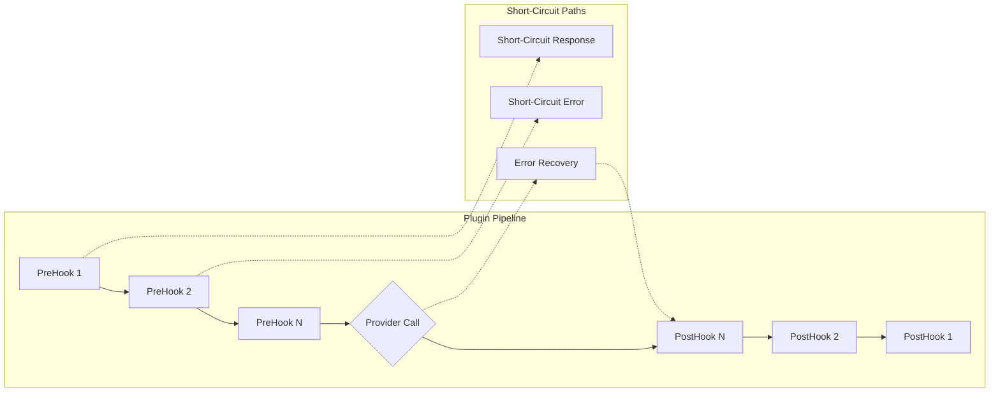

# 🔌 Plugin Development Guide

Comprehensive guide for building powerful Bifrost plugins. Learn how to create PreHook and PostHook plugins that extend Bifrost's request/response pipeline with custom logic.

> **⚠️ IMPORTANT**: Before developing a plugin, **thoroughly read** the [Plugin Architecture Documentation](../architecture/plugins.md) to understand:
>
> - Plugin system design principles and execution pipeline
> - Plugin lifecycle management and state transitions
> - Error handling patterns and recovery mechanisms
> - Security considerations and validation requirements
> - Performance implications and optimization strategies

> You are also encouraged to go through existing plugins [here](https://github.com/maximhq/bifrost/tree/main/plugins) to understand the plugin system and how to implement your own plugins.

---

## 🏗️ **Plugin Structure Requirements**

Each plugin should be organized as follows:

```
plugins/
└── your-plugin-name/
    ├── main.go           # Plugin implementation
    ├── plugin_test.go    # Comprehensive tests
    ├── README.md         # Documentation with examples
    └── go.mod            # Module definition
```

### **Using Plugins**

```go
import (
    "github.com/maximhq/bifrost/core"
    "github.com/your-org/your-plugin"
)

client, initErr := bifrost.Init(schemas.BifrostConfig{
    Account: &yourAccount,
    Plugins: []schemas.Plugin{
        your_plugin.NewYourPlugin(config),
        // Add more plugins as needed
    },
})
```

---

## 🎯 **Overview**

Bifrost plugins provide a powerful middleware system that allows you to inject custom logic at critical points in the request lifecycle. You can build plugins for authentication, rate limiting, caching, monitoring, content filtering, and much more.

### **Plugin Architecture Flow**



---

## 📋 **Prerequisites**

### **Required Skills**

- **Go Programming** - Intermediate proficiency required
- **Interface Design** - Understanding of Go interfaces
- **Middleware Patterns** - Request/response pipeline concepts
- **Testing** - Unit and integration testing skills

### **Development Environment**

- **Go 1.23+** - Latest Go version
- **Bifrost Core** - Understanding of Bifrost architecture
- **Git** - Version control proficiency
- **Testing Tools** - Go testing framework familiarity

---

## 🏗️ **Plugin Interface**

### **Core Plugin Interface**

Every plugin must implement the `Plugin` interface:

```go
type Plugin interface {
    // GetName returns the unique name of the plugin
    GetName() string

    // PreHook is called before a request is processed by a provider
    // Can modify request, short-circuit with response, or short-circuit with error
    PreHook(ctx *context.Context, req *BifrostRequest) (*BifrostRequest, *PluginShortCircuit, error)

    // PostHook is called after a response or after PreHook short-circuit
    // Can modify response/error or recover from errors
    PostHook(ctx *context.Context, result *BifrostResponse, err *BifrostError) (*BifrostResponse, *BifrostError, error)

    // Cleanup is called on bifrost shutdown
    Cleanup() error
}
```

### **Short-Circuit Control**

Plugins can short-circuit the request flow:

```go
// PluginShortCircuit represents a plugin's decision to short-circuit the normal flow.
// It can contain either a response (success short-circuit), a stream (streaming short-circuit), or an error (error short-circuit).
type PluginShortCircuit struct {
    Response *BifrostResponse    // If set, short-circuit with this response (skips provider call)
    Stream   chan *BifrostStream // If set, short-circuit with this stream (skips provider call)
    Error    *BifrostError       // If set, short-circuit with this error (can set AllowFallbacks field)
}
```

### **Context Utilities**

Plugin developers can access useful information from the context:

```go
// Get unique request ID for tracking and correlation
requestID := ctx.Value("request-id").(string)

// Use request ID in your plugin logic
fmt.Printf("Processing request: %s", requestID)
```

> **💡 Tip**: The `request-id` context key provides a unique identifier for each request that remains consistent across all plugin hooks and provider calls. This is essential for logging, tracing, and correlating plugin operations.

---

## 🔧 **Plugin Implementation Patterns**

### **1. Request Modification Plugin**

Modify requests before they reach the provider:

```go
package main

import (
    "context"
    "fmt"
    "strings"

    "github.com/maximhq/bifrost/core/schemas"
)

type RequestModifierPlugin struct {
    name   string
    config RequestModifierConfig
}

type RequestModifierConfig struct {
    PrefixPrompt string `json:"prefix_prompt"`
    SuffixPrompt string `json:"suffix_prompt"`
}

func NewRequestModifierPlugin(config RequestModifierConfig) *RequestModifierPlugin {
    return &RequestModifierPlugin{
        name:   "request-modifier",
        config: config,
    }
}

func (p *RequestModifierPlugin) GetName() string {
    return p.name
}

func (p *RequestModifierPlugin) PreHook(
    ctx *context.Context,
    req *schemas.BifrostRequest,
) (*schemas.BifrostRequest, *schemas.PluginShortCircuit, error) {

    // Only modify chat completion requests
    if req.Input.ChatCompletionInput == nil {
        return req, nil, nil
    }

    messages := *req.Input.ChatCompletionInput

    // Add prefix to first user message
    if len(messages) > 0 && p.config.PrefixPrompt != "" {
        for i, msg := range messages {
            if msg.Role == schemas.ModelChatMessageRoleUser && msg.Content.ContentStr != nil {
                originalContent := *msg.Content.ContentStr
                newContent := p.config.PrefixPrompt + "\n\n" + originalContent

                if p.config.SuffixPrompt != "" {
                    newContent += "\n\n" + p.config.SuffixPrompt
                }

                messages[i].Content.ContentStr = &newContent
                break
            }
        }
    }

    // Return modified request
    modifiedReq := *req
    modifiedReq.Input.ChatCompletionInput = &messages

    return &modifiedReq, nil, nil
}

func (p *RequestModifierPlugin) PostHook(
    ctx *context.Context,
    result *schemas.BifrostResponse,
    err *schemas.BifrostError,
) (*schemas.BifrostResponse, *schemas.BifrostError, error) {
    // No post-processing needed for this plugin
    return result, err, nil
}

func (p *RequestModifierPlugin) Cleanup() error {
    return nil
}
```

### **2. Authentication Plugin**

Validate and enrich requests with authentication:

```go
type AuthenticationPlugin struct {
    name        string
    apiKeys     map[string]string
    rateLimiter map[string]*time.Ticker
}

func NewAuthenticationPlugin(validKeys map[string]string) *AuthenticationPlugin {
    return &AuthenticationPlugin{
        name:        "authentication",
        apiKeys:     validKeys,
        rateLimiter: make(map[string]*time.Ticker),
    }
}

func (p *AuthenticationPlugin) PreHook(
    ctx *context.Context,
    req *schemas.BifrostRequest,
) (*schemas.BifrostRequest, *schemas.PluginShortCircuit, error) {

    // Extract API key from context
    apiKey := extractAPIKeyFromContext(ctx)
    if apiKey == "" {
        return nil, &schemas.PluginShortCircuit{
            Error: &schemas.BifrostError{
                IsBifrostError: true,
                StatusCode:     intPtr(401),
                Error: schemas.ErrorField{
                    Type:    stringPtr("authentication_error"),
                    Code:    stringPtr("missing_api_key"),
                    Message: "API key is required",
                },
            },
            AllowFallbacks: boolPtr(false), // Don't try fallbacks for auth errors
        }, nil
    }

    // Validate API key
    userID, exists := p.apiKeys[apiKey]
    if !exists {
        return nil, &schemas.PluginShortCircuit{
            Error: &schemas.BifrostError{
                IsBifrostError: true,
                StatusCode:     intPtr(401),
                Error: schemas.ErrorField{
                    Type:    stringPtr("authentication_error"),
                    Code:    stringPtr("invalid_api_key"),
                    Message: "Invalid API key",
                },
            },
            AllowFallbacks: boolPtr(false),
        }, nil
    }

    // Add user context to request
    enrichedCtx := context.WithValue(*ctx, "user_id", userID)
    enrichedCtx = context.WithValue(enrichedCtx, "authenticated", true)
    *ctx = enrichedCtx

    return req, nil, nil
}
```

### **3. Caching Plugin**

Cache responses for repeated requests:

```go
type CachingPlugin struct {
    name     string
    cache    map[string]*CacheEntry
    cacheMu  sync.RWMutex
    ttl      time.Duration
}

type CacheEntry struct {
    Response  *schemas.BifrostResponse
    Timestamp time.Time
}

func NewCachingPlugin(ttl time.Duration) *CachingPlugin {
    plugin := &CachingPlugin{
        name:  "caching",
        cache: make(map[string]*CacheEntry),
        ttl:   ttl,
    }

    // Start cleanup goroutine
    go plugin.cleanupExpiredEntries()

    return plugin
}

func (p *CachingPlugin) PreHook(
    ctx *context.Context,
    req *schemas.BifrostRequest,
) (*schemas.BifrostRequest, *schemas.PluginShortCircuit, error) {

    // Generate cache key from request
    cacheKey := p.generateCacheKey(req)

    p.cacheMu.RLock()
    entry, exists := p.cache[cacheKey]
    p.cacheMu.RUnlock()

    // Check if cached response is valid
    if exists && time.Since(entry.Timestamp) < p.ttl {
        // Cache hit - short-circuit with cached response
        return nil, &schemas.PluginShortCircuit{
            Response: entry.Response,
        }, nil
    }

    // Cache miss - let request continue
    return req, nil, nil
}

func (p *CachingPlugin) PostHook(
    ctx *context.Context,
    result *schemas.BifrostResponse,
    err *schemas.BifrostError,
) (*schemas.BifrostResponse, *schemas.BifrostError, error) {

    // Only cache successful responses
    if err == nil && result != nil {
        // Extract original request from context
        if originalReq := extractRequestFromContext(ctx); originalReq != nil {
            cacheKey := p.generateCacheKey(originalReq)

            p.cacheMu.Lock()
            p.cache[cacheKey] = &CacheEntry{
                Response:  result,
                Timestamp: time.Now(),
            }
            p.cacheMu.Unlock()
        }
    }

    return result, err, nil
}

func (p *CachingPlugin) generateCacheKey(req *schemas.BifrostRequest) string {
    // Create deterministic key based on request content
    h := sha256.New()

    // Include provider, model, and input
    h.Write([]byte(string(req.Provider)))
    h.Write([]byte(req.Model))

    if req.Input.ChatCompletionInput != nil {
        for _, msg := range *req.Input.ChatCompletionInput {
            h.Write([]byte(string(msg.Role)))
            if msg.Content.ContentStr != nil {
                h.Write([]byte(*msg.Content.ContentStr))
            }
        }
    }

    return fmt.Sprintf("%x", h.Sum(nil))
}

func (p *CachingPlugin) cleanupExpiredEntries() {
    ticker := time.NewTicker(time.Minute)
    defer ticker.Stop()

    for range ticker.C {
        p.cacheMu.Lock()
        for key, entry := range p.cache {
            if time.Since(entry.Timestamp) > p.ttl {
                delete(p.cache, key)
            }
        }
        p.cacheMu.Unlock()
    }
}
```

### **4. Error Recovery Plugin**

Recover from provider errors with fallback responses:

```go
type ErrorRecoveryPlugin struct {
    name           string
    fallbackModel  string
    maxRetries     int
    fallbackPrompt string
}

func NewErrorRecoveryPlugin(fallbackModel string, maxRetries int) *ErrorRecoveryPlugin {
    return &ErrorRecoveryPlugin{
        name:           "error-recovery",
        fallbackModel:  fallbackModel,
        maxRetries:     maxRetries,
        fallbackPrompt: "I apologize, but I'm experiencing technical difficulties. Please try again later.",
    }
}

func (p *ErrorRecoveryPlugin) PreHook(
    ctx *context.Context,
    req *schemas.BifrostRequest,
) (*schemas.BifrostRequest, *schemas.PluginShortCircuit, error) {
    // No pre-processing needed
    return req, nil, nil
}

func (p *ErrorRecoveryPlugin) PostHook(
    ctx *context.Context,
    result *schemas.BifrostResponse,
    err *schemas.BifrostError,
) (*schemas.BifrostResponse, *schemas.BifrostError, error) {

    // Only handle certain types of errors
    if err == nil || !p.shouldRecover(err) {
        return result, err, nil
    }

    // Check retry count
    retryCount := getRetryCountFromContext(ctx)
    if retryCount >= p.maxRetries {
        return result, err, nil
    }

    // Create fallback response
    fallbackResponse := &schemas.BifrostResponse{
        ID:      generateUUID(),
        Object:  "chat.completion",
        Model:   p.fallbackModel,
        Created: int(time.Now().Unix()),
        Choices: []schemas.BifrostResponseChoice{
            {
                Index:        0,
                FinishReason: "stop",
                Message: schemas.BifrostMessage{
                    Role: schemas.ModelChatMessageRoleAssistant,
                    Content: schemas.MessageContent{
                        ContentStr: &p.fallbackPrompt,
                    },
                },
            },
        },
        Usage: schemas.LLMUsage{
            PromptTokens:     0,
            CompletionTokens: len(strings.Split(p.fallbackPrompt, " ")),
            TotalTokens:      len(strings.Split(p.fallbackPrompt, " ")),
        },
        ExtraFields: schemas.BifrostResponseExtraFields{
            Provider: schemas.ModelProvider("fallback"),
        },
    }

    // Return recovered response (no error)
    return fallbackResponse, nil, nil
}

func (p *ErrorRecoveryPlugin) shouldRecover(err *schemas.BifrostError) bool {
    // Recover from rate limits and temporary failures
    if err.StatusCode != nil {
        code := *err.StatusCode
        return code == 429 || code == 502 || code == 503 || code == 504
    }
    return false
}
```

---

## 🧪 **Plugin Testing**

### **Unit Testing Framework**

```go
package main

import (
    "context"
    "testing"
    "github.com/stretchr/testify/assert"
    "github.com/stretchr/testify/require"
)

func TestRequestModifierPlugin(t *testing.T) {
    tests := []struct {
        name           string
        config         RequestModifierConfig
        inputRequest   *schemas.BifrostRequest
        expectedPrefix string
        expectedSuffix string
    }{
        {
            name: "adds prefix and suffix to user message",
            config: RequestModifierConfig{
                PrefixPrompt: "Please be concise:",
                SuffixPrompt: "Respond in one sentence.",
            },
            inputRequest: &schemas.BifrostRequest{
                Provider: schemas.OpenAI,
                Model:    "gpt-4o-mini",
                Input: schemas.RequestInput{
                    ChatCompletionInput: &[]schemas.BifrostMessage{
                        {
                            Role: schemas.ModelChatMessageRoleUser,
                            Content: schemas.MessageContent{
                                ContentStr: stringPtr("What is AI?"),
                            },
                        },
                    },
                },
            },
            expectedPrefix: "Please be concise:",
            expectedSuffix: "Respond in one sentence.",
        },
    }

    for _, tt := range tests {
        t.Run(tt.name, func(t *testing.T) {
            plugin := NewRequestModifierPlugin(tt.config)
            ctx := context.Background()

            result, shortCircuit, err := plugin.PreHook(&ctx, tt.inputRequest)

            assert.NoError(t, err)
            assert.Nil(t, shortCircuit)
            assert.NotNil(t, result)

            messages := *result.Input.ChatCompletionInput
            require.Len(t, messages, 1)

            content := *messages[0].Content.ContentStr
            assert.Contains(t, content, tt.expectedPrefix)
            assert.Contains(t, content, tt.expectedSuffix)
            assert.Contains(t, content, "What is AI?")
        })
    }
}

func TestAuthenticationPlugin(t *testing.T) {
    validKeys := map[string]string{
        "test-key-1": "user-1",
        "test-key-2": "user-2",
    }

    plugin := NewAuthenticationPlugin(validKeys)

    tests := []struct {
        name        string
        apiKey      string
        expectError bool
        errorCode   string
    }{
        {
            name:        "valid API key",
            apiKey:      "test-key-1",
            expectError: false,
        },
        {
            name:        "invalid API key",
            apiKey:      "invalid-key",
            expectError: true,
            errorCode:   "invalid_api_key",
        },
        {
            name:        "missing API key",
            apiKey:      "",
            expectError: true,
            errorCode:   "missing_api_key",
        },
    }

    for _, tt := range tests {
        t.Run(tt.name, func(t *testing.T) {
            ctx := context.WithValue(context.Background(), "api_key", tt.apiKey)
            req := &schemas.BifrostRequest{
                Provider: schemas.OpenAI,
                Model:    "gpt-4o-mini",
            }

            result, shortCircuit, err := plugin.PreHook(&ctx, req)

            assert.NoError(t, err) // Plugin errors are returned via shortCircuit

            if tt.expectError {
                assert.Nil(t, result)
                assert.NotNil(t, shortCircuit)
                assert.NotNil(t, shortCircuit.Error)

                if tt.errorCode != "" {
                    assert.Equal(t, tt.errorCode, *shortCircuit.Error.Error.Code)
                }

                assert.NotNil(t, shortCircuit.AllowFallbacks)
                assert.False(t, *shortCircuit.AllowFallbacks)
            } else {
                assert.NotNil(t, result)
                assert.Nil(t, shortCircuit)

                // Check that user context was added
                userID := ctx.Value("user_id")
                assert.Equal(t, "user-1", userID)
            }
        })
    }
}
```

### **Integration Testing**

```go
func TestPluginIntegration(t *testing.T) {
    // Create a test Bifrost instance with plugins
    config := schemas.BifrostConfig{
        Account: &testAccount,
        Plugins: []schemas.Plugin{
            NewAuthenticationPlugin(map[string]string{
                "test-key": "test-user",
            }),
            NewRequestModifierPlugin(RequestModifierConfig{
                PrefixPrompt: "Be helpful:",
            }),
            NewCachingPlugin(time.Minute),
        },
    }

    client, initErr := bifrost.Init(config)
    require.Nil(t, initErr)
    defer client.Cleanup()

    // Test authenticated request
    ctx := context.WithValue(context.Background(), "api_key", "test-key")

    request := &schemas.BifrostRequest{
        Provider: schemas.OpenAI,
        Model:    "gpt-4o-mini",
        Input: schemas.RequestInput{
            ChatCompletionInput: &[]schemas.BifrostMessage{
                {
                    Role: schemas.ModelChatMessageRoleUser,
                    Content: schemas.MessageContent{
                        ContentStr: stringPtr("Hello"),
                    },
                },
            },
        },
    }

    // First request - should hit provider
    result1, err := client.ChatCompletionRequest(ctx, request)
    assert.NoError(t, err)
    assert.NotNil(t, result1)

    // Second identical request - should hit cache
    result2, err := client.ChatCompletionRequest(ctx, request)
    assert.NoError(t, err)
    assert.NotNil(t, result2)

    // Results should be identical (from cache)
    assert.Equal(t, result1.ID, result2.ID)
}
```

---

## 📚 **Advanced Plugin Patterns**

### **Configuration-Driven Plugins**

```go
type ConfigurablePlugin struct {
    name   string
    config PluginConfig
}

type PluginConfig struct {
    Rules []Rule `json:"rules"`
}

type Rule struct {
    Condition string      `json:"condition"`
    Action    string      `json:"action"`
    Value     interface{} `json:"value"`
}

func (p *ConfigurablePlugin) PreHook(
    ctx *context.Context,
    req *schemas.BifrostRequest,
) (*schemas.BifrostRequest, *schemas.PluginShortCircuit, error) {

    for _, rule := range p.config.Rules {
        if p.evaluateCondition(rule.Condition, req) {
            return p.executeAction(rule.Action, rule.Value, req)
        }
    }

    return req, nil, nil
}
```

### **Plugin Chaining and Dependencies**

```go
type PluginManager struct {
    plugins    []schemas.Plugin
    pluginMeta map[string]PluginMetadata
}

type PluginMetadata struct {
    Dependencies []string
    Priority     int
    Enabled      bool
}

func (pm *PluginManager) SortPluginsByDependencies() error {
    // Topological sort based on dependencies
    sorted, err := pm.topologicalSort()
    if err != nil {
        return fmt.Errorf("plugin dependency cycle detected: %w", err)
    }

    pm.plugins = sorted
    return nil
}
```

### **Async Plugin Operations**

```go
type AsyncPlugin struct {
    name       string
    workQueue  chan PluginWork
    workers    int
    workerPool sync.WaitGroup
}

type PluginWork struct {
    Context  context.Context
    Request  *schemas.BifrostRequest
    Response *schemas.BifrostResponse
    Error    *schemas.BifrostError
    Done     chan struct{}
}

func (p *AsyncPlugin) PostHook(
    ctx *context.Context,
    result *schemas.BifrostResponse,
    err *schemas.BifrostError,
) (*schemas.BifrostResponse, *schemas.BifrostError, error) {

    work := PluginWork{
        Context:  *ctx,
        Request:  extractRequestFromContext(ctx),
        Response: result,
        Error:    err,
        Done:     make(chan struct{}),
    }

    // Queue work for async processing
    select {
    case p.workQueue <- work:
        // Don't wait for async work to complete
    default:
        // Queue full, skip async processing
    }

    return result, err, nil
}
```

### **Handling Streaming Responses**

When implementing plugins, it's crucial to handle both streaming and non-streaming responses correctly. The PostHook method will be called differently depending on the response type:

```go
func (p *YourPlugin) PostHook(
    ctx *context.Context,
    result *schemas.BifrostResponse,
    err *schemas.BifrostError,
) (*schemas.BifrostResponse, *schemas.BifrostError, error) {
    // First check if this is a streaming response
    isStreaming := false
    if result != nil && len(result.Choices) > 0 {
        // Check if any choice has BifrostStreamResponseChoice
        for _, choice := range result.Choices {
            if choice.BifrostStreamResponseChoice != nil {
                isStreaming = true
                break
            }
        }
    }

    if isStreaming {
        // Handle streaming response - this will be called for EACH delta
        // Each delta can contain:
        // 1. Role changes (initial delta)
        // 2. Content chunks
        // 3. Tool call chunks
        // 4. Usage information
        // 5. Finish reason (final delta)

        if result != nil && len(result.Choices) > 0 {
            choice := result.Choices[0]
            if choice.BifrostStreamResponseChoice != nil {
                delta := choice.BifrostStreamResponseChoice.Delta

                // Handle different delta types
                switch {
                case delta.Role != nil:
                    // Initial delta with role
                    p.handleRoleDelta(delta.Role)

                case delta.Content != nil:
                    // Content delta
                    p.handleContentDelta(delta.Content)

                case len(delta.ToolCalls) > 0:
                    // Tool call delta
                    p.handleToolCallDelta(delta.ToolCalls)

                case choice.FinishReason != nil:
                    // Final delta with finish reason
                    p.handleFinishDelta(choice.FinishReason)
                }
            }
        }
    } else {
        // Handle regular non-streaming response
        // This is called once with the complete response
        if result != nil {
            p.handleCompleteResponse(result)
        }
    }

    return result, err, nil
}

// Example delta handlers
func (p *YourPlugin) handleRoleDelta(role *string) {
    // Handle initial role delta
    // This is the first delta in a stream, indicating the start
    if role != nil {
        // Initialize any stream-specific state
        p.streamState = NewStreamState(*role)
    }
}

func (p *YourPlugin) handleContentDelta(content *string) {
    // Handle content delta
    // This contains the actual streamed text
    if content != nil {
        // Process the content chunk
        // Remember: each chunk is a small piece of the full response
        p.streamState.AppendContent(*content)
    }
}

func (p *YourPlugin) handleToolCallDelta(toolCalls []schemas.ToolCall) {
    // Handle tool call delta
    // This contains function call information
    for _, call := range toolCalls {
        if call.Function.Name != nil {
            // Process function name
            p.streamState.AddToolCall(*call.Function.Name)
        }
        if call.Function.Arguments != "" {
            // Process function arguments
            // Note: Arguments might come in multiple chunks
            p.streamState.AppendToolCallArgs(call.Function.Arguments)
        }
    }
}

func (p *YourPlugin) handleFinishDelta(reason *string) {
    // Handle finish reason delta
    // This is the last delta in a stream
    if reason != nil {
        // Finalize any stream processing
        p.streamState.Complete(*reason)
    }
}
```

**Key Considerations for Streaming Plugins:**

1. **Performance Critical:**
   - PostHook runs for EVERY delta in streaming responses
   - Keep processing lightweight and efficient
   - Use object pooling for frequently allocated structures
   - Avoid blocking operations

2. **State Management:**
   - Use context to maintain state across deltas
   - Consider using sync.Pool for stream state objects
   - Clean up state when finish reason is received
   - Handle unexpected stream termination

3. **Error Handling:**
   - Return errors only for critical failures
   - Consider recovering from non-critical errors
   - Maintain stream integrity during error recovery
   - Document error handling behavior

4. **Testing:**

   ```go
   func TestStreamingPlugin(t *testing.T) {
       plugin := NewYourPlugin()
       ctx := context.Background()

       // Test role delta
       roleDelta := createStreamResponse("assistant", nil, nil)
       result, err, _ := plugin.PostHook(&ctx, roleDelta, nil)
       assert.NotNil(t, result)
       assert.Nil(t, err)

       // Test content delta
       contentDelta := createStreamResponse("", stringPtr("Hello"), nil)
       result, err, _ = plugin.PostHook(&ctx, contentDelta, nil)
       assert.NotNil(t, result)
       assert.Nil(t, err)

       // Test finish delta
       finishDelta := createStreamResponse("", nil, stringPtr("stop"))
       result, err, _ = plugin.PostHook(&ctx, finishDelta, nil)
       assert.NotNil(t, result)
       assert.Nil(t, err)
   }

   func createStreamResponse(role string, content *string, finish *string) *schemas.BifrostResponse {
       resp := &schemas.BifrostResponse{
           Choices: []schemas.BifrostResponseChoice{
               {
                   BifrostStreamResponseChoice: &schemas.BifrostStreamResponseChoice{
                       Delta: schemas.BifrostStreamDelta{},
                   },
               },
           },
       }

       if role != "" {
           resp.Choices[0].BifrostStreamResponseChoice.Delta.Role = &role
       }
       if content != nil {
           resp.Choices[0].BifrostStreamResponseChoice.Delta.Content = content
       }
       if finish != nil {
           resp.Choices[0].FinishReason = finish
       }

       return resp
   }
   ```

5. **Documentation:**
   - Document streaming behavior in plugin README
   - Explain state management approach
   - List supported delta types
   - Provide streaming-specific examples

> **💡 Tip**: Use the `isStreamingResponse` helper to reliably detect streaming responses:

> ```go
> func isStreamingResponse(result *schemas.BifrostResponse) bool {
>     if result == nil || len(result.Choices) == 0 {
>         return false
>     }
>     for _, choice := range result.Choices {
>         if choice.BifrostStreamResponseChoice != nil {
>             return true
>         }
>     }
>     return false
> }
> ```

---

## 🔒 **Security Best Practices**

### **1. Input Validation**

- **Request Validation** - Ensure all incoming requests are valid and contain necessary fields.
- **API Key Management** - Securely manage and validate API keys.
- **Rate Limiting** - Implement robust rate limiting to prevent abuse.

### **2. Output Protection**

- **Sensitive Data** - Do not log or expose sensitive data in plugin logs.
- **Error Messages** - Return generic error messages to the user, not detailed technical errors.
- **Response Integrity** - Ensure responses are not tampered with and are in the expected format.

### **3. Resource Management**

- **Memory** - Be mindful of memory usage. Use object pooling for frequently allocated structures.
- **Connections** - Manage open connections to providers and external services.
- **Cleanup** - Properly clean up resources in the `Cleanup()` method.

### **4. Error Handling**

- **Graceful Degradation** - Implement graceful degradation for critical errors.
- **Recovery** - Use fallback mechanisms and retry strategies for transient failures.
- **Documentation** - Clearly document error handling patterns and recovery mechanisms.

### **5. Logging**

- **Contextual Information** - Log relevant information (request ID, user ID, etc.) for debugging.
- **Sensitive Data** - Do not log sensitive data (API keys, tokens, etc.).
- **Performance** - Log performance metrics and latency.

### **6. Testing**

- **Unit Tests** - Comprehensive test coverage for error scenarios.
- **Integration Tests** - Tests with real Bifrost instance to verify error handling.
- **Error Scenarios** - Tests for various error conditions and recovery paths.


---

## ✅ **Plugin Submission Checklist**

### **Code Quality**

- [ ] **Interface Implementation** - Correctly implements Plugin interface
- [ ] **Error Handling** - Proper error handling and short-circuit usage
- [ ] **Thread Safety** - Safe for concurrent use
- [ ] **Resource Management** - Proper cleanup in Cleanup() method
- [ ] **Code Documentation** - Clear comments and documentation

### **Testing**

- [ ] **Unit Tests** - Comprehensive test coverage (>90%)
- [ ] **Integration Tests** - Tests with real Bifrost instance
- [ ] **Concurrent Testing** - Tests under concurrent load
- [ ] **Error Scenarios** - Tests for various error conditions
- [ ] **Short-Circuit Testing** - Tests for short-circuit behavior

### **Documentation**

- [ ] **Plugin Documentation** - Clear setup and usage instructions
- [ ] **Configuration Schema** - Documented configuration options
- [ ] **Examples** - Working code examples and use cases
- [ ] **Performance Impact** - Performance characteristics documented
- [ ] **Compatibility** - Provider and feature compatibility matrix

### **Performance**

- [ ] **Benchmarks** - Performance benchmarks included
- [ ] **Memory Efficiency** - Minimal memory footprint
- [ ] **Latency Impact** - Low latency overhead (<10ms)
- [ ] **Resource Limits** - Configurable resource limits
- [ ] **Monitoring** - Built-in metrics and monitoring

---

## 🚀 **Plugin Distribution**

### **Plugin as Go Module**

```go
// go.mod
module github.com/yourorg/bifrost-plugin-awesome

go 1.23

require (
    github.com/maximhq/bifrost v1.0.0
)
```

### **Plugin Registration**

```go
package main

import (
    "github.com/maximhq/bifrost/core/schemas"
)

// PluginFactory creates and configures the plugin
func PluginFactory(config map[string]interface{}) (schemas.Plugin, error) {
    // Parse configuration
    pluginConfig, err := parseConfig(config)
    if err != nil {
        return nil, fmt.Errorf("invalid plugin configuration: %w", err)
    }

    // Create and return plugin instance
    return NewYourAwesomePlugin(pluginConfig), nil
}

// For binary plugins
func main() {
    // Plugin binary entry point
    plugin := NewYourAwesomePlugin(defaultConfig)

    // Register with plugin system
    schemas.RegisterPlugin("awesome-plugin", plugin)
}
```

---

## 🎯 **Next Steps**

1. **Study Examples** - Review existing plugins in `plugins/` directory
2. **Choose Use Case** - Identify the problem your plugin will solve
3. **Design Interface** - Plan your plugin's PreHook/PostHook behavior
4. **Implement Core Logic** - Build the main plugin functionality
5. **Add Configuration** - Make your plugin configurable
6. **Write Tests** - Create comprehensive test suite
7. **Document Usage** - Write clear documentation and examples
8. **Submit Plugin** - Follow the [contribution process](./README.md#-pull-request-process)

---

**Ready to build your plugin?** 🚀

Check out the existing plugin implementations in `plugins/` for inspiration, and join the discussion in [GitHub Discussions](https://github.com/maximhq/bifrost/discussions) to share your plugin ideas!
