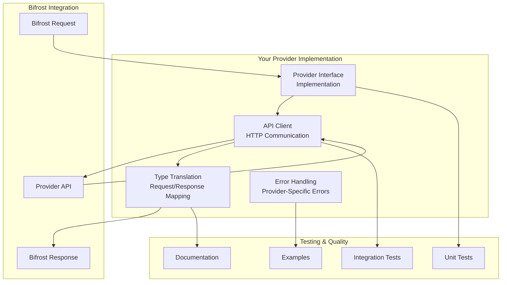

# 🌐 Provider Development Guide

Complete guide for adding new AI model providers to Bifrost. Learn how to implement the provider interface, handle API communication, and integrate seamlessly with the Bifrost ecosystem.

---

## 🎯 **Overview**

Adding a new provider to Bifrost enables users to access different AI models through a unified interface. This guide walks you through the entire process from design to deployment.

### **What You'll Build**



---

## 📋 **Prerequisites**

### **Required Skills**

- **Go Programming** - Intermediate level proficiency
- **HTTP/REST APIs** - Understanding of API communication
- **JSON Processing** - Request/response serialization
- **Testing** - Unit and integration test writing

### **Development Environment**

- **Go 1.23+** - Latest Go version
- **Provider API Access** - API keys for testing
- **Git** - Version control familiarity
- **Testing Tools** - Go test framework knowledge

---

## 🏗️ **Provider Interface**

### **Core Interface Definition**

Every provider must implement the `Provider` interface:

```go
type Provider interface {
    // GetProviderKey returns the unique provider identifier
    GetProviderKey() ModelProvider

    // ChatCompletion performs chat completion requests
    ChatCompletion(ctx context.Context, model, key string, messages []BifrostMessage, params *ModelParameters) (*BifrostResponse, *BifrostError)

    // TextCompletion performs text completion requests (optional)
    TextCompletion(ctx context.Context, model, key string, text string, params *ModelParameters) (*BifrostResponse, *BifrostError)
}
```

### **Provider Structure Template**

```go
package providers

import (
    "context"
    "fmt"
    "net/http"
    "time"

    "github.com/maximhq/bifrost/core/schemas"
)

// YourProviderProvider implements the Provider interface for YourProvider
type YourProviderProvider struct {
    config *schemas.ProviderConfig
    client *http.Client
    logger schemas.Logger
}

// NewYourProviderProvider creates a new YourProvider provider instance
func NewYourProviderProvider(config *schemas.ProviderConfig, logger schemas.Logger) *YourProviderProvider {
    return &YourProviderProvider{
        config: config,
        client: &http.Client{
            Timeout: time.Duration(config.NetworkConfig.TimeoutSeconds) * time.Second,
        },
        logger: logger,
    }
}

// GetProviderKey returns the provider identifier
func (p *YourProviderProvider) GetProviderKey() schemas.ModelProvider {
    return schemas.YourProvider // Add this to schemas/bifrost.go
}
```

---

## 🔌 **Step-by-Step Implementation**

### **Step 1: Add Provider Constant**

First, add your provider to the core schemas:

```go
// In core/schemas/bifrost.go
const (
    OpenAI    ModelProvider = "openai"
    Anthropic ModelProvider = "anthropic"
    // ... existing providers
    YourProvider ModelProvider = "yourprovider" // Add this line
)
```

### **Step 2: Implement Chat Completion**

```go
func (p *YourProviderProvider) ChatCompletion(
    ctx context.Context,
    model, key string,
    messages []schemas.BifrostMessage,
    params *schemas.ModelParameters,
) (*schemas.BifrostResponse, *schemas.BifrostError) {

    // 1. Build provider-specific request
    providerRequest := p.buildChatRequest(model, messages, params)

    // 2. Make HTTP request
    resp, err := p.makeRequest(ctx, key, providerRequest)
    if err != nil {
        return nil, p.handleError(err)
    }

    // 3. Parse and convert response
    bifrostResponse, err := p.parseChatResponse(resp)
    if err != nil {
        return nil, p.handleError(err)
    }

    return bifrostResponse, nil
}
```

### **Step 3: Request Translation**

Convert Bifrost requests to provider-specific format:

```go
type YourProviderChatRequest struct {
    Model       string                    `json:"model"`
    Messages    []YourProviderMessage     `json:"messages"`
    Temperature *float64                  `json:"temperature,omitempty"`
    MaxTokens   *int                      `json:"max_tokens,omitempty"`
    // Add provider-specific fields
}

func (p *YourProviderProvider) buildChatRequest(
    model string,
    messages []schemas.BifrostMessage,
    params *schemas.ModelParameters,
) *YourProviderChatRequest {

    req := &YourProviderChatRequest{
        Model:    model,
        Messages: p.convertMessages(messages),
    }

    // Apply parameters
    if params != nil {
        req.Temperature = params.Temperature
        req.MaxTokens = params.MaxTokens
        // Map other parameters
    }

    return req
}

func (p *YourProviderProvider) convertMessages(messages []schemas.BifrostMessage) []YourProviderMessage {
    var providerMessages []YourProviderMessage

    for _, msg := range messages {
        providerMsg := YourProviderMessage{
            Role: string(msg.Role),
        }

        // Handle different content types
        if msg.Content.ContentStr != nil {
            providerMsg.Content = *msg.Content.ContentStr
        } else if msg.Content.ContentBlocks != nil {
            // Handle multi-modal content
            providerMsg.Content = p.convertContentBlocks(*msg.Content.ContentBlocks)
        }

        providerMessages = append(providerMessages, providerMsg)
    }

    return providerMessages
}
```

### **Step 4: HTTP Communication**

```go
func (p *YourProviderProvider) makeRequest(
    ctx context.Context,
    apiKey string,
    request interface{},
) (*YourProviderResponse, error) {

    // Serialize request
    requestBody, err := json.Marshal(request)
    if err != nil {
        return nil, fmt.Errorf("failed to marshal request: %w", err)
    }

    // Create HTTP request
    httpReq, err := http.NewRequestWithContext(
        ctx,
        "POST",
        "https://api.yourprovider.com/v1/chat/completions",
        bytes.NewBuffer(requestBody),
    )
    if err != nil {
        return nil, fmt.Errorf("failed to create request: %w", err)
    }

    // Set headers
    httpReq.Header.Set("Content-Type", "application/json")
    httpReq.Header.Set("Authorization", "Bearer "+apiKey)
    httpReq.Header.Set("User-Agent", "Bifrost/1.0")

    // Execute request
    httpResp, err := p.client.Do(httpReq)
    if err != nil {
        return nil, fmt.Errorf("request failed: %w", err)
    }
    defer httpResp.Body.Close()

    // Handle HTTP errors
    if httpResp.StatusCode != http.StatusOK {
        return nil, p.handleHTTPError(httpResp)
    }

    // Parse response
    var response YourProviderResponse
    if err := json.NewDecoder(httpResp.Body).Decode(&response); err != nil {
        return nil, fmt.Errorf("failed to decode response: %w", err)
    }

    return &response, nil
}
```

### **Step 5: Response Translation**

Convert provider responses to Bifrost format:

```go
func (p *YourProviderProvider) parseChatResponse(resp *YourProviderResponse) (*schemas.BifrostResponse, error) {

    bifrostResp := &schemas.BifrostResponse{
        ID:     resp.ID,
        Object: "chat.completion",
        Model:  resp.Model,
        Created: int(time.Now().Unix()),
        Usage: schemas.LLMUsage{
            PromptTokens:     resp.Usage.PromptTokens,
            CompletionTokens: resp.Usage.CompletionTokens,
            TotalTokens:      resp.Usage.TotalTokens,
        },
        ExtraFields: schemas.BifrostResponseExtraFields{
            Provider:    p.GetProviderKey(),
            RawResponse: resp,
        },
    }

    // Convert choices
    for i, choice := range resp.Choices {
        bifrostChoice := schemas.BifrostResponseChoice{
            Index:        i,
            FinishReason: choice.FinishReason,
            Message: schemas.BifrostMessage{
                Role: schemas.ModelChatMessageRole(choice.Message.Role),
                Content: schemas.MessageContent{
                    ContentStr: &choice.Message.Content,
                },
            },
        }

        // Handle tool calls if supported
        if len(choice.Message.ToolCalls) > 0 {
            bifrostChoice.Message.AssistantMessage = &schemas.AssistantMessage{
                ToolCalls: &choice.Message.ToolCalls,
            }
        }

        bifrostResp.Choices = append(bifrostResp.Choices, bifrostChoice)
    }

    return bifrostResp, nil
}
```

### **Step 6: Error Handling**

```go
func (p *YourProviderProvider) handleError(err error) *schemas.BifrostError {
    return &schemas.BifrostError{
        IsBifrostError: false,
        Error: schemas.ErrorField{
            Message: err.Error(),
            Error:   err,
        },
    }
}

func (p *YourProviderProvider) handleHTTPError(resp *http.Response) error {
    var errorResp YourProviderErrorResponse
    if err := json.NewDecoder(resp.Body).Decode(&errorResp); err != nil {
        return fmt.Errorf("HTTP %d: %s", resp.StatusCode, resp.Status)
    }

    return &schemas.BifrostError{
        IsBifrostError: false,
        StatusCode:     &resp.StatusCode,
        Error: schemas.ErrorField{
            Type:    &errorResp.Error.Type,
            Code:    &errorResp.Error.Code,
            Message: errorResp.Error.Message,
        },
    }
}
```

---

## 🧪 **Testing Your Provider**

### **Unit Tests**

```go
package providers

import (
    "context"
    "testing"
    "github.com/stretchr/testify/assert"
    "github.com/stretchr/testify/require"
)

func TestYourProviderProvider_ChatCompletion(t *testing.T) {
    tests := []struct {
        name     string
        model    string
        messages []schemas.BifrostMessage
        params   *schemas.ModelParameters
        wantErr  bool
    }{
        {
            name:  "successful chat completion",
            model: "your-model-name",
            messages: []schemas.BifrostMessage{
                {
                    Role: schemas.ModelChatMessageRoleUser,
                    Content: schemas.MessageContent{
                        ContentStr: stringPtr("Hello, world!"),
                    },
                },
            },
            params:  nil,
            wantErr: false,
        },
        // Add more test cases
    }

    for _, tt := range tests {
        t.Run(tt.name, func(t *testing.T) {
            provider := NewYourProviderProvider(testConfig, testLogger)

            result, err := provider.ChatCompletion(
                context.Background(),
                tt.model,
                "test-api-key",
                tt.messages,
                tt.params,
            )

            if tt.wantErr {
                assert.Error(t, err)
                assert.Nil(t, result)
            } else {
                assert.NoError(t, err)
                assert.NotNil(t, result)
                assert.Equal(t, tt.model, result.Model)
                assert.NotEmpty(t, result.Choices)
            }
        })
    }
}
```

### **Integration Tests**

Create integration tests in `tests/core-providers/yourprovider_test.go`:

```go
func TestYourProviderIntegration(t *testing.T) {
    // Skip if no API key
    apiKey := os.Getenv("YOURPROVIDER_API_KEY")
    if apiKey == "" {
        t.Skip("YOURPROVIDER_API_KEY not set")
    }

    // Test with real API
    scenarios := []scenarios.TestScenario{
        scenarios.SimpleChatScenario(),
        scenarios.MultiTurnConversationScenario(),
        scenarios.ToolCallScenario(),
        // Add provider-specific scenarios
    }

    for _, scenario := range scenarios {
        t.Run(scenario.Name, func(t *testing.T) {
            err := scenario.Run(t, schemas.YourProvider, "your-model-name")
            assert.NoError(t, err)
        })
    }
}
```

---

## 🔗 **Integration with Bifrost Core**

### **Register Your Provider**

Add your provider to the core factory function in `core/bifrost.go`:

```go
func (bifrost *Bifrost) createProviderFromProviderKey(providerKey schemas.ModelProvider, config *schemas.ProviderConfig) (schemas.Provider, error) {
    switch providerKey {
    case schemas.OpenAI:
        return providers.NewOpenAIProvider(config, bifrost.logger), nil
    case schemas.Anthropic:
        return providers.NewAnthropicProvider(config, bifrost.logger), nil
    // ... existing providers
    case schemas.YourProvider:
        return providers.NewYourProviderProvider(config, bifrost.logger), nil
    default:
        return nil, fmt.Errorf("unsupported provider: %s", providerKey)
    }
}
```

### **Update Key Requirements**

If your provider requires API keys, update the key checking logic:

```go
func providerRequiresKey(providerKey schemas.ModelProvider) bool {
    return providerKey != schemas.Vertex &&
           providerKey != schemas.Ollama
    // YourProvider requires keys by default
}
```

## 🌐 **Integration with HTTP Transport**

The HTTP transport layer requires specific changes to handle provider configuration, and model patterns.

### **1. Provider Recognition**

Update `transports/bifrost-http/integrations/utils.go`:

```go
var validProviders = map[schemas.ModelProvider]bool{
    // ... existing providers
    schemas.YourProvider: true,  // Add this line
}

// Add model patterns
func isYourProviderModel(model string) bool {
    yourProviderPatterns := []string{
        "your-provider-pattern", "your-model-prefix", "yourprovider/",
    }
    return matchesAnyPattern(model, yourProviderPatterns)
}

// Add pattern check
func GetProviderFromModel(model string) schemas.ModelProvider {
    // ... existing checks
    if isYourProviderModel(modelLower) {
        return schemas.YourProvider
    }
}
```

### **2. Testing HTTP Transport Integration**

Add integration tests in `tests/transports-integrations/`:

```python
# tests/integrations/test_yourprovider.py

def test_yourprovider_config():
    config = {
        "provider": "yourprovider",
        "keys": [
            {
                "value": "env.YOURPROVIDER_API_KEY",
                "models": ["*"]
            }
        }
    }
    # Test config validation
    response = client.post("/v1/providers", json=config)
    assert response.status_code == 200

def test_yourprovider_models():
    # Test model pattern recognition
    response = client.post("/v1/chat/completions", json={
        "model": "yourprovider/model-name",
        "messages": [{"role": "user", "content": "Hello"}]
    })
    assert response.status_code == 200
```

Run the tests:

```bash
cd tests/transports-integrations
python -m pytest tests/integrations/ -v
```

### **4. Configuration Example**

Document the configuration format for users:

```json
{
  "providers": {
    "yourprovider": {
      "keys": [
        {
          "value": "env.YOURPROVIDER_API_KEY",
          "models": ["*"]
        }
      ],
    }
  }
}
```

Note: API key handling is automatic - you only need to implement the key config processing if your provider requires additional configuration beyond API keys.

---

## 📚 **Documentation Requirements**

### **Provider Documentation**

Create comprehensive documentation including:

1. **Setup Guide** - How to get API keys and configure
2. **Supported Features** - What capabilities are available
3. **Model List** - Supported models and their capabilities
4. **Examples** - Real usage examples
5. **Limitations** - Known limitations or differences

### **Example Documentation Template**

````markdown
# YourProvider Integration

## Configuration

### API Key Setup

1. Create account at YourProvider
2. Generate API key
3. Configure in Bifrost

### Supported Models

- `your-model-v1` - Fast, general purpose
- `your-model-v2` - Advanced reasoning
- `your-model-multimodal` - Vision and text

## Examples

### Basic Chat Completion

```go
client, initErr := bifrost.Init(schemas.BifrostConfig{
    Account: &account,
})

result, err := client.ChatCompletionRequest(ctx, &schemas.BifrostRequest{
    Provider: schemas.YourProvider,
    Model:    "your-model-v1",
    Input: schemas.RequestInput{
        ChatCompletionInput: &[]schemas.BifrostMessage{
            {Role: "user", Content: "Hello!"},
        },
    },
})

## Features

### Supported Features

- ✅ Chat completions
- ✅ Function calling
- ✅ Streaming responses
- ❌ Image generation

### Parameter Mapping

| Bifrost Parameter | YourProvider Parameter | Notes      |
| ----------------- | ---------------------- | ---------- |
| temperature       | temperature            | 0.0-2.0    |
| max_tokens        | max_tokens             | Up to 4096 |
```

---

## ✅ **Submission Checklist**

Before submitting your provider implementation:

### **Code Quality**

- [ ] **Interface Implementation** - Correctly implements Provider interface
- [ ] **Error Handling** - Proper error handling and BifrostError creation
- [ ] **Type Conversion** - Accurate Bifrost ↔ Provider type mapping
- [ ] **HTTP Communication** - Robust API communication with retries
- [ ] **Code Style** - Follows Go conventions and Bifrost patterns

### **Testing**

- [ ] **Unit Tests** - Comprehensive unit test coverage (>80%)
- [ ] **Integration Tests** - Real API integration tests
- [ ] **Error Scenarios** - Tests for various error conditions
- [ ] **Parameter Testing** - Tests for all supported parameters
- [ ] **Edge Cases** - Tests for edge cases and boundary conditions

### **Documentation**

- [ ] **Code Comments** - Clear function and complex logic documentation
- [ ] **User Documentation** - Setup and usage guides
- [ ] **Examples** - Working code examples
- [ ] **Feature Matrix** - Clear documentation of supported features
- [ ] **Migration Guide** - If replacing existing integrations

### **Integration**

- [ ] **Core Integration** - Properly integrated with bifrost.go factory
- [ ] **Schema Updates** - Provider constant added to schemas
- [ ] **Key Handling** - Proper API key requirement configuration
- [ ] **Configuration** - Standard provider configuration support

### **HTTP Transport Integration**

- [ ] **Provider Recognition** - Added to `validProviders` map in `transports/bifrost-http/integrations/utils.go`
- [ ] **Model Patterns** - Added patterns to appropriate `is*Model()` functions in utils.go
- [ ] **Transport Tests** - All tests pass in `tests/transports-integrations/` directory
- [ ] **Multi-Provider Support** - Verified `ParseModelString` correctly handles your provider prefix

**Required Updates in `utils.go`:**

```go
// 1. Add to validProviders map
var validProviders = map[schemas.ModelProvider]bool{
    // ... existing providers
    schemas.YourProvider: true,  // Add this line
}

// 2. Add model patterns to appropriate function
func isYourProviderModel(model string) bool {
    yourProviderPatterns := []string{
        "your-provider-pattern", "your-model-prefix", "yourprovider/",
    }
    return matchesAnyPattern(model, yourProviderPatterns)
}

// 3. Add pattern check to GetProviderFromModel
func GetProviderFromModel(model string) schemas.ModelProvider {
    // ... existing checks

    // Your Provider Models
    if isYourProviderModel(modelLower) {
        return schemas.YourProvider
    }

    // ... rest of function
}
```

**Test Your Integration:**

```bash
# Run HTTP transport integration tests
cd tests/transports-integrations
python -m pytest tests/integrations/ -v
```

---

## 🚀 **Advanced Features**

### **Streaming Support**

If your provider supports streaming responses:

```go
func (p *YourProviderProvider) ChatCompletionStream(
    ctx context.Context,
    model, key string,
    messages []schemas.BifrostMessage,
    params *schemas.ModelParameters,
) (<-chan *schemas.BifrostResponse, <-chan error) {

    responseChan := make(chan *schemas.BifrostResponse)
    errorChan := make(chan error, 1)

    go func() {
        defer close(responseChan)
        defer close(errorChan)

        // Implement streaming logic
        stream, err := p.createStream(ctx, key, request)
        if err != nil {
            errorChan <- err
            return
        }

        for event := range stream {
            if event.Error != nil {
                errorChan <- event.Error
                return
            }

            response := p.convertStreamEvent(event)
            responseChan <- response
        }
    }()

    return responseChan, errorChan
}
```

### **Multi-Modal Support**

For providers that support images or other media:

```go
func (p *YourProviderProvider) convertContentBlocks(blocks []schemas.ContentBlock) interface{} {
    var content []YourProviderContent

    for _, block := range blocks {
        switch block.Type {
        case schemas.ContentBlockTypeText:
            content = append(content, YourProviderContent{
                Type: "text",
                Text: *block.Text,
            })
        case schemas.ContentBlockTypeImage:
            content = append(content, YourProviderContent{
                Type: "image_url",
                ImageURL: YourProviderImageURL{
                    URL:    block.ImageURL.URL,
                    Detail: block.ImageURL.Detail,
                },
            })
        }
    }

    return content
}
```

### **Function Calling**

For providers with function calling capabilities:

```go
func (p *YourProviderProvider) convertTools(tools *[]schemas.Tool) []YourProviderTool {
    if tools == nil {
        return nil
    }

    var providerTools []YourProviderTool
    for _, tool := range *tools {
        providerTools = append(providerTools, YourProviderTool{
            Type: "function",
            Function: YourProviderFunction{
                Name:        tool.Function.Name,
                Description: tool.Function.Description,
                Parameters:  tool.Function.Parameters,
            },
        })
    }

    return providerTools
}
```
````

---

## 🎯 **Next Steps**

1. **Fork the Repository** - Create your development environment
2. **Choose a Provider** - Select a provider you want to integrate
3. **Study Existing Examples** - Look at OpenAI or Anthropic implementations
4. **Start with Basic Implementation** - Get chat completion working first
5. **Add Advanced Features** - Streaming, tools, multi-modal support
6. **Test Thoroughly** - Write comprehensive tests
7. **Document Everything** - Create clear documentation
8. **Submit Pull Request** - Follow the [contribution guidelines](./README#-pull-request-process)

---

**Ready to build your provider?** 🚀

Check out the existing provider implementations in `core/providers/` for reference, and don't hesitate to ask questions in [GitHub Discussions](https://github.com/maximhq/bifrost/discussions) if you need help!

```

```
