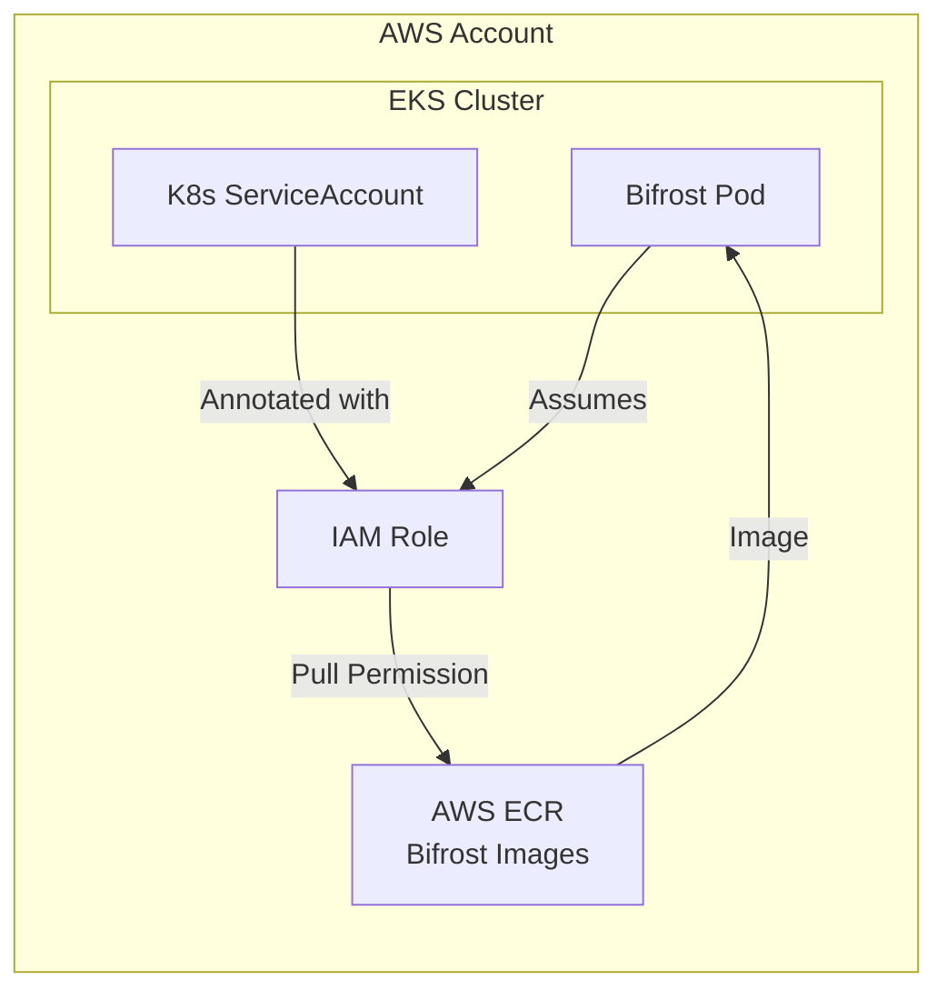

Bifrost Enterprise images for AWS customers are distributed through AWS ECR, enabling native IAM integration for secure, credential-less authentication.

## Architecture



## Prerequisites

- EKS cluster (v1.23+) or ECS cluster
- AWS CLI configured with appropriate permissions
- `kubectl` configured for your EKS cluster
- Your AWS Account ID allowlisted by Bifrost team

<Note>
Contact the Bifrost team to get your AWS account ID and IAM role ARN allowlisted for ECR access.
</Note>

## IRSA (Recommended)

IAM Roles for Service Accounts (IRSA) provides the most secure authentication method for EKS deployments.

### Step 1: Create IAM Policy

Create an IAM policy that grants ECR pull access to the Bifrost repository.

```json
{
  "Version": "2012-10-17",
  "Statement": [
    {
      "Sid": "ECRAuth",
      "Effect": "Allow",
      "Action": [
        "ecr:GetAuthorizationToken"
      ],
      "Resource": "*"
    },
    {
      "Sid": "ECRPullFromBifrost",
      "Effect": "Allow",
      "Action": [
        "ecr:BatchGetImage",
        "ecr:GetDownloadUrlForLayer",
        "ecr:BatchCheckLayerAvailability"
      ],
      "Resource": "arn:aws:ecr:us-east-1:BIFROST_ACCOUNT_ID:repository/YOUR_HUB_SLUG"
    }
  ]
}
```

<Warning>
Replace `BIFROST_ACCOUNT_ID` and `YOUR_HUB_SLUG` with the values provided by the Bifrost team.
</Warning>

Save this policy as `bifrost-ecr-pull-policy.json` and create it:

```bash
aws iam create-policy \
  --policy-name BifrostECRPullPolicy \
  --policy-document file://bifrost-ecr-pull-policy.json
```

### Step 2: Create IAM Role with OIDC Trust

Create an IAM role that can be assumed by your Kubernetes ServiceAccount.

First, get your OIDC provider URL:

```bash
aws eks describe-cluster \
  --name YOUR_CLUSTER_NAME \
  --query "cluster.identity.oidc.issuer" \
  --output text
```

Create the trust policy (`trust-policy.json`):

```json
{
  "Version": "2012-10-17",
  "Statement": [
    {
      "Effect": "Allow",
      "Principal": {
        "Federated": "arn:aws:iam::YOUR_ACCOUNT_ID:oidc-provider/oidc.eks.REGION.amazonaws.com/id/OIDC_ID"
      },
      "Action": "sts:AssumeRoleWithWebIdentity",
      "Condition": {
        "StringEquals": {
          "oidc.eks.REGION.amazonaws.com/id/OIDC_ID:aud": "sts.amazonaws.com",
          "oidc.eks.REGION.amazonaws.com/id/OIDC_ID:sub": "system:serviceaccount:NAMESPACE:bifrost-sa"
        }
      }
    }
  ]
}
```

Create the role and attach the policy:

```bash
# Create the role
aws iam create-role \
  --role-name BifrostECRPullRole \
  --assume-role-policy-document file://trust-policy.json

# Attach the policy
aws iam attach-role-policy \
  --role-name BifrostECRPullRole \
  --policy-arn arn:aws:iam::YOUR_ACCOUNT_ID:policy/BifrostECRPullPolicy
```

### Step 3: Provide Role ARN to Bifrost

Send your IAM role ARN to the Bifrost team for allowlisting:

```
arn:aws:iam::YOUR_ACCOUNT_ID:role/BifrostECRPullRole
```

### Step 4: Create Namespace and ServiceAccount

```bash
kubectl create namespace bifrost
```

```yaml
apiVersion: v1
kind: ServiceAccount
metadata:
  name: bifrost-sa
  namespace: bifrost
  annotations:
    eks.amazonaws.com/role-arn: arn:aws:iam::YOUR_ACCOUNT_ID:role/BifrostECRPullRole
```

### Step 5: Deploy Bifrost

```yaml
apiVersion: apps/v1
kind: Deployment
metadata:
  name: bifrost
  namespace: bifrost
spec:
  replicas: 2
  selector:
    matchLabels:
      app: bifrost
  template:
    metadata:
      labels:
        app: bifrost
    spec:
      serviceAccountName: bifrost-sa
      containers:
      - name: bifrost
        image: BIFROST_ACCOUNT_ID.dkr.ecr.us-east-1.amazonaws.com/YOUR_HUB_SLUG:latest
        ports:
        - containerPort: 8080
          name: http
        resources:
          requests:
            cpu: "250m"
            memory: "512Mi"
          limits:
            cpu: "1000m"
            memory: "2Gi"
        livenessProbe:
          httpGet:
            path: /health
            port: 8080
          initialDelaySeconds: 30
          periodSeconds: 10
        readinessProbe:
          httpGet:
            path: /health
            port: 8080
          initialDelaySeconds: 10
          periodSeconds: 5
        volumeMounts:
        - name: config
          mountPath: /app/data/config.json
          subPath: config.json
      volumes:
      - name: config
        secret:
          secretName: bifrost-config
---
apiVersion: v1
kind: Service
metadata:
  name: bifrost
  namespace: bifrost
spec:
  selector:
    app: bifrost
  ports:
  - port: 80
    targetPort: 8080
    protocol: TCP
  type: ClusterIP
```

## ECS Task Roles

For ECS deployments, use IAM Task Roles for authentication.

### Step 1: Create Task Execution Role

The task execution role allows ECS to pull images from ECR.

```json
{
  "Version": "2012-10-17",
  "Statement": [
    {
      "Effect": "Allow",
      "Action": [
        "ecr:GetAuthorizationToken"
      ],
      "Resource": "*"
    },
    {
      "Effect": "Allow",
      "Action": [
        "ecr:BatchCheckLayerAvailability",
        "ecr:GetDownloadUrlForLayer",
        "ecr:BatchGetImage"
      ],
      "Resource": "arn:aws:ecr:us-east-1:BIFROST_ACCOUNT_ID:repository/YOUR_HUB_SLUG"
    },
    {
      "Effect": "Allow",
      "Action": [
        "logs:CreateLogStream",
        "logs:PutLogEvents"
      ],
      "Resource": "*"
    }
  ]
}
```

### Step 2: Create ECS Task Definition

```json
{
  "family": "bifrost",
  "networkMode": "awsvpc",
  "requiresCompatibilities": ["FARGATE"],
  "cpu": "512",
  "memory": "1024",
  "executionRoleArn": "arn:aws:iam::YOUR_ACCOUNT_ID:role/BifrostECSExecutionRole",
  "containerDefinitions": [
    {
      "name": "bifrost",
      "image": "BIFROST_ACCOUNT_ID.dkr.ecr.us-east-1.amazonaws.com/YOUR_HUB_SLUG:latest",
      "portMappings": [
        {
          "containerPort": 8080,
          "protocol": "tcp"
        }
      ],
      "healthCheck": {
        "command": ["CMD-SHELL", "curl -f http://localhost:8080/health || exit 1"],
        "interval": 30,
        "timeout": 5,
        "retries": 3,
        "startPeriod": 60
      },
      "logConfiguration": {
        "logDriver": "awslogs",
        "options": {
          "awslogs-group": "/ecs/bifrost",
          "awslogs-region": "us-east-1",
          "awslogs-stream-prefix": "bifrost"
        }
      }
    }
  ]
}
```

### Step 3: Create ECS Service

```bash
aws ecs create-service \
  --cluster your-cluster \
  --service-name bifrost \
  --task-definition bifrost \
  --desired-count 2 \
  --launch-type FARGATE \
  --network-configuration "awsvpcConfiguration={subnets=[subnet-xxx],securityGroups=[sg-xxx],assignPublicIp=ENABLED}"
```

## Verifying Access

### Test ECR Authentication

```bash
# Get ECR login token
aws ecr get-login-password --region us-east-1 | \
  docker login --username AWS --password-stdin \
  BIFROST_ACCOUNT_ID.dkr.ecr.us-east-1.amazonaws.com

# Pull test
docker pull BIFROST_ACCOUNT_ID.dkr.ecr.us-east-1.amazonaws.com/YOUR_HUB_SLUG:latest
```

### Verify IRSA Configuration

```bash
# Check ServiceAccount annotation
kubectl get sa bifrost-sa -n bifrost -o yaml

# Verify pod can assume role
kubectl exec -it deployment/bifrost -n bifrost -- \
  aws sts get-caller-identity
```

## Troubleshooting

### ImagePullBackOff Errors

1. **Check IAM Role trust policy**: Ensure the OIDC provider and ServiceAccount match
2. **Verify ECR permissions**: Confirm the role has `ecr:BatchGetImage` permission
3. **Check allowlisting**: Ensure your role ARN is allowlisted by Bifrost team

```bash
# Check pod events
kubectl describe pod -l app=bifrost -n bifrost

# Check IRSA token
kubectl exec -it deployment/bifrost -n bifrost -- \
  cat /var/run/secrets/eks.amazonaws.com/serviceaccount/token
```

### Authentication Errors

```bash
# Verify OIDC provider is configured
aws iam list-open-id-connect-providers

# Check role assumption
aws sts assume-role-with-web-identity \
  --role-arn arn:aws:iam::YOUR_ACCOUNT_ID:role/BifrostECRPullRole \
  --role-session-name test \
  --web-identity-token file:///path/to/token
```

## Next Steps

- Configure [Bifrost settings](/quickstart/gateway/setting-up) for your use case
- Set up [observability](/features/observability/default) for monitoring
- Enable [clustering](/enterprise/clustering) for high availability
