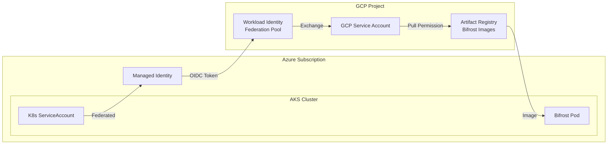

Bifrost Enterprise images for Azure customers are distributed through GCP Artifact Registry, using Azure Workload Identity Federation for secure, credential-less authentication.

## Architecture



## How It Works

Azure Workload Identity Federation allows Azure Managed Identities to authenticate to GCP without exchanging credentials:

1. **AKS Pod** requests a token using its Kubernetes ServiceAccount
2. **Azure AD** issues an OIDC token for the Managed Identity
3. **GCP Workload Identity Federation** validates the Azure token
4. **GCP STS** exchanges it for a GCP access token
5. **Pod** uses the GCP token to pull images from Artifact Registry

## Prerequisites

- AKS cluster (v1.24+) with Workload Identity enabled
- Azure CLI configured with appropriate permissions
- `kubectl` configured for your AKS cluster
- Your Azure Tenant ID and Managed Identity Client ID provided to Bifrost team

<Note>
Contact the Bifrost team with your Azure Tenant ID and Managed Identity Client IDs to get access configured.
</Note>

## Step 1: Enable Workload Identity on AKS

If not already enabled, enable Workload Identity on your AKS cluster:

```bash
# For existing cluster
az aks update \
  --resource-group YOUR_RESOURCE_GROUP \
  --name YOUR_CLUSTER_NAME \
  --enable-oidc-issuer \
  --enable-workload-identity

# Get the OIDC issuer URL
az aks show \
  --resource-group YOUR_RESOURCE_GROUP \
  --name YOUR_CLUSTER_NAME \
  --query "oidcIssuerProfile.issuerUrl" -o tsv
```

## Step 2: Create Azure Managed Identity

```bash
# Create Managed Identity
az identity create \
  --name bifrost-pull-identity \
  --resource-group YOUR_RESOURCE_GROUP \
  --location YOUR_LOCATION

# Get the Client ID
CLIENT_ID=$(az identity show \
  --name bifrost-pull-identity \
  --resource-group YOUR_RESOURCE_GROUP \
  --query clientId -o tsv)

echo "Client ID: $CLIENT_ID"
```

## Step 3: Create Federated Credential

Link the Kubernetes ServiceAccount to the Azure Managed Identity:

```bash
# Get AKS OIDC issuer
AKS_OIDC_ISSUER=$(az aks show \
  --resource-group YOUR_RESOURCE_GROUP \
  --name YOUR_CLUSTER_NAME \
  --query "oidcIssuerProfile.issuerUrl" -o tsv)

# Create federated credential
az identity federated-credential create \
  --name bifrost-federated-credential \
  --identity-name bifrost-pull-identity \
  --resource-group YOUR_RESOURCE_GROUP \
  --issuer "$AKS_OIDC_ISSUER" \
  --subject "system:serviceaccount:bifrost:bifrost-sa" \
  --audience "api://AzureADTokenExchange"
```

## Step 4: Provide Details to Bifrost Team

Send the following information to the Bifrost team:

```bash
# Get Tenant ID
az account show --query tenantId -o tsv

# Get Client ID
az identity show \
  --name bifrost-pull-identity \
  --resource-group YOUR_RESOURCE_GROUP \
  --query clientId -o tsv
```

The Bifrost team will configure GCP Workload Identity Federation to trust your Azure Managed Identity.

## Step 5: Store GCP Credential Configuration

After the Bifrost team configures access, they will provide a credential configuration. Store it as a ConfigMap:

```yaml
apiVersion: v1
kind: ConfigMap
metadata:
  name: gcp-credential-config
  namespace: bifrost
data:
  credential-config.json: |
    {
      "type": "external_account",
      "audience": "//iam.googleapis.com/projects/BIFROST_PROJECT_NUMBER/locations/global/workloadIdentityPools/YOUR_HUB_SLUG-azure-pool/providers/YOUR_HUB_SLUG-azure-provider",
      "subject_token_type": "urn:ietf:params:oauth:token-type:jwt",
      "service_account_impersonation_url": "https://iamcredentials.googleapis.com/v1/projects/-/serviceAccounts/BIFROST_SA@BIFROST_PROJECT.iam.gserviceaccount.com:generateAccessToken",
      "token_url": "https://sts.googleapis.com/v1/token",
      "credential_source": {
        "file": "/var/run/secrets/azure/tokens/azure-identity-token",
        "format": {
          "type": "text"
        }
      }
    }
```

<Warning>
The Bifrost team will provide the exact values for `BIFROST_PROJECT_NUMBER`, `YOUR_HUB_SLUG`, and `BIFROST_SA`.
</Warning>

## Step 6: Create Kubernetes ServiceAccount

```yaml
apiVersion: v1
kind: ServiceAccount
metadata:
  name: bifrost-sa
  namespace: bifrost
  annotations:
    azure.workload.identity/client-id: YOUR_MANAGED_IDENTITY_CLIENT_ID
  labels:
    azure.workload.identity/use: "true"
```

## Step 7: Create Image Pull Secret with Token Refresh

Create a CronJob to refresh the imagePullSecret using the federated identity:

```yaml
apiVersion: batch/v1
kind: CronJob
metadata:
  name: refresh-ar-secret
  namespace: bifrost
spec:
  schedule: "*/30 * * * *"  # Every 30 minutes
  successfulJobsHistoryLimit: 1
  failedJobsHistoryLimit: 3
  jobTemplate:
    spec:
      template:
        metadata:
          labels:
            azure.workload.identity/use: "true"
        spec:
          serviceAccountName: bifrost-sa
          containers:
          - name: token-refresh
            image: google/cloud-sdk:slim
            command: ["/bin/bash", "-c"]
            args:
            - |
              set -e
              
              # Set GCP credential config
              export GOOGLE_APPLICATION_CREDENTIALS=/etc/gcp/credential-config.json
              
              # Get GCP access token via federation
              TOKEN=$(gcloud auth print-access-token)
              
              # Delete existing secret if it exists
              kubectl delete secret ar-pull-secret --ignore-not-found -n bifrost
              
              # Create new imagePullSecret
              kubectl create secret docker-registry ar-pull-secret \
                --docker-server=REGION-docker.pkg.dev \
                --docker-username=oauth2accesstoken \
                --docker-password="$TOKEN" \
                -n bifrost
              
              echo "Secret refreshed at $(date)"
            volumeMounts:
            - name: gcp-credential-config
              mountPath: /etc/gcp
              readOnly: true
            - name: azure-identity-token
              mountPath: /var/run/secrets/azure/tokens
              readOnly: true
          volumes:
          - name: gcp-credential-config
            configMap:
              name: gcp-credential-config
          - name: azure-identity-token
            projected:
              sources:
              - serviceAccountToken:
                  path: azure-identity-token
                  expirationSeconds: 3600
                  audience: api://AzureADTokenExchange
          restartPolicy: OnFailure
---
apiVersion: rbac.authorization.k8s.io/v1
kind: Role
metadata:
  name: secret-manager
  namespace: bifrost
rules:
- apiGroups: [""]
  resources: ["secrets"]
  verbs: ["get", "create", "delete"]
---
apiVersion: rbac.authorization.k8s.io/v1
kind: RoleBinding
metadata:
  name: secret-manager-binding
  namespace: bifrost
subjects:
- kind: ServiceAccount
  name: bifrost-sa
  namespace: bifrost
roleRef:
  kind: Role
  name: secret-manager
  apiGroup: rbac.authorization.k8s.io
```

## Step 8: Deploy Bifrost

```yaml
apiVersion: apps/v1
kind: Deployment
metadata:
  name: bifrost
  namespace: bifrost
spec:
  replicas: 2
  selector:
    matchLabels:
      app: bifrost
  template:
    metadata:
      labels:
        app: bifrost
        azure.workload.identity/use: "true"
    spec:
      serviceAccountName: bifrost-sa
      imagePullSecrets:
      - name: ar-pull-secret
      containers:
      - name: bifrost
        image: REGION-docker.pkg.dev/BIFROST_PROJECT/YOUR_HUB_SLUG/bifrost:latest
        ports:
        - containerPort: 8080
          name: http
        resources:
          requests:
            cpu: "250m"
            memory: "512Mi"
          limits:
            cpu: "1000m"
            memory: "2Gi"
        livenessProbe:
          httpGet:
            path: /health
            port: 8080
          initialDelaySeconds: 30
          periodSeconds: 10
        readinessProbe:
          httpGet:
            path: /health
            port: 8080
          initialDelaySeconds: 10
          periodSeconds: 5
        volumeMounts:
        - name: config
          mountPath: /app/data/config.json
          subPath: config.json
      volumes:
      - name: config
        secret:
          secretName: bifrost-config
---
apiVersion: v1
kind: Service
metadata:
  name: bifrost
  namespace: bifrost
spec:
  selector:
    app: bifrost
  ports:
  - port: 80
    targetPort: 8080
    protocol: TCP
  type: ClusterIP
```

## Bootstrap: Initial Secret Creation

Before the first deployment, manually trigger the CronJob or create the secret:

```bash
# Create namespace
kubectl create namespace bifrost

# Apply all configurations
kubectl apply -f configmap.yaml
kubectl apply -f serviceaccount.yaml
kubectl apply -f cronjob.yaml

# Manually trigger the CronJob
kubectl create job --from=cronjob/refresh-ar-secret initial-refresh -n bifrost

# Wait for completion
kubectl wait --for=condition=complete job/initial-refresh -n bifrost --timeout=120s

# Verify secret was created
kubectl get secret ar-pull-secret -n bifrost
```

## Verifying Access

### Check Workload Identity Configuration

```bash
# Verify AKS has Workload Identity enabled
az aks show \
  --resource-group YOUR_RESOURCE_GROUP \
  --name YOUR_CLUSTER_NAME \
  --query "oidcIssuerProfile.enabled" -o tsv

# Check federated credential
az identity federated-credential show \
  --name bifrost-federated-credential \
  --identity-name bifrost-pull-identity \
  --resource-group YOUR_RESOURCE_GROUP
```

### Verify Token Exchange

```bash
# Check CronJob ran successfully
kubectl get jobs -n bifrost

# View CronJob logs
kubectl logs -l job-name=refresh-ar-secret -n bifrost

# Verify imagePullSecret exists
kubectl get secret ar-pull-secret -n bifrost -o yaml
```

## Troubleshooting

### ImagePullBackOff Errors

1. **Check imagePullSecret exists**: `kubectl get secret ar-pull-secret -n bifrost`
2. **Verify CronJob succeeded**: `kubectl get jobs -n bifrost`
3. **Check Azure Workload Identity**: Ensure labels are set correctly

```bash
# Check pod events
kubectl describe pod -l app=bifrost -n bifrost

# Check ServiceAccount has correct annotations
kubectl get sa bifrost-sa -n bifrost -o yaml
```

### Token Exchange Failures

```bash
# Check CronJob logs for errors
kubectl logs -l job-name=refresh-ar-secret -n bifrost

# Common issues:
# - "audience mismatch": Check credential-config.json audience field
# - "subject mismatch": Verify federated credential subject matches SA
# - "permission denied": Contact Bifrost team to verify WIF configuration
```

### Azure Workload Identity Issues

```bash
# Verify Managed Identity exists
az identity show \
  --name bifrost-pull-identity \
  --resource-group YOUR_RESOURCE_GROUP

# Check federated credentials
az identity federated-credential list \
  --identity-name bifrost-pull-identity \
  --resource-group YOUR_RESOURCE_GROUP

# Verify pod has identity token mounted
kubectl exec -it deployment/bifrost -n bifrost -- \
  ls -la /var/run/secrets/azure/tokens/
```

## Summary

| Component | Value |
|-----------|-------|
| Registry | GCP Artifact Registry |
| Authentication | Azure WIF -> GCP WIF -> GCP SA |
| Token Lifetime | 60 minutes (auto-refreshed every 30 min) |
| Secret Name | `ar-pull-secret` |

## Next Steps

- Configure [Bifrost settings](/quickstart/gateway/setting-up) for your use case
- Set up [observability](/features/observability/default) for monitoring
- Enable [clustering](/enterprise/clustering) for high availability
