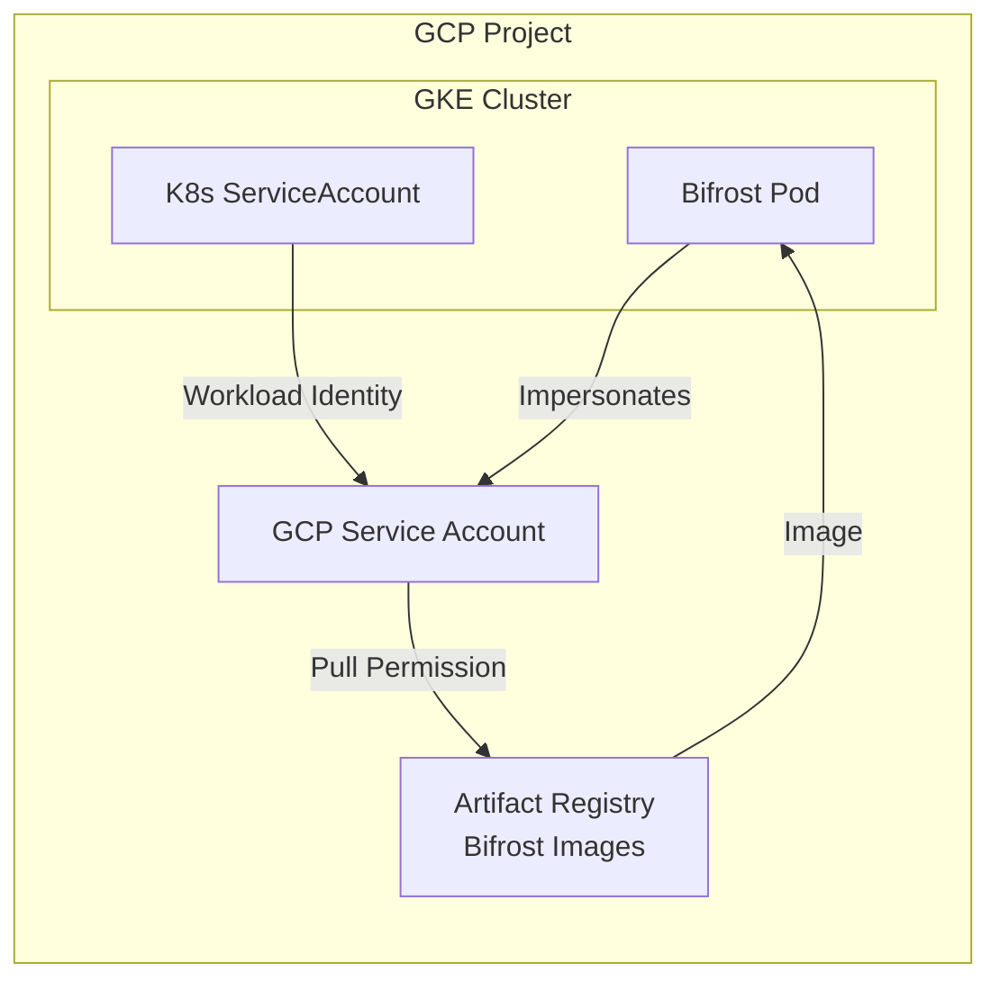

Bifrost Enterprise images for GCP customers are distributed through GCP Artifact Registry, enabling native Workload Identity for secure, keyless authentication.

## Architecture



## Prerequisites

- GKE cluster (v1.24+) with Workload Identity enabled
- `gcloud` CLI configured with appropriate permissions
- `kubectl` configured for your GKE cluster
- Your GCP project allowlisted by Bifrost team

<Note>
Contact the Bifrost team with your GCP project ID and service account email to get access configured.
</Note>

## Workload Identity (Recommended)

Workload Identity provides the most secure authentication method for GKE deployments by eliminating the need for service account keys.

### Step 1: Enable Workload Identity on GKE

If not already enabled, enable Workload Identity on your cluster:

```bash
# For existing cluster
gcloud container clusters update YOUR_CLUSTER_NAME \
  --region=YOUR_REGION \
  --workload-pool=YOUR_PROJECT_ID.svc.id.goog

# Verify Workload Identity is enabled
gcloud container clusters describe YOUR_CLUSTER_NAME \
  --region=YOUR_REGION \
  --format="value(workloadIdentityConfig.workloadPool)"
```

### Step 2: Create GCP Service Account

Create a service account that will be used to pull images:

```bash
# Create service account
gcloud iam service-accounts create bifrost-pull-sa \
  --display-name="Bifrost Image Pull SA" \
  --project=YOUR_PROJECT_ID
```

### Step 3: Request Access from Bifrost Team

Provide the following to the Bifrost team:
- Your GCP project ID
- Service account email: `bifrost-pull-sa@YOUR_PROJECT_ID.iam.gserviceaccount.com`

The Bifrost team will grant the necessary permissions to pull images from the registry.

### Step 4: Create Namespace and ServiceAccount

```bash
kubectl create namespace bifrost
```

```yaml
apiVersion: v1
kind: ServiceAccount
metadata:
  name: bifrost-sa
  namespace: bifrost
  annotations:
    iam.gke.io/gcp-service-account: bifrost-pull-sa@YOUR_PROJECT_ID.iam.gserviceaccount.com
```

### Step 5: Bind Kubernetes SA to GCP SA

Allow the Kubernetes ServiceAccount to impersonate the GCP Service Account:

```bash
gcloud iam service-accounts add-iam-policy-binding \
  bifrost-pull-sa@YOUR_PROJECT_ID.iam.gserviceaccount.com \
  --role=roles/iam.workloadIdentityUser \
  --member="serviceAccount:YOUR_PROJECT_ID.svc.id.goog[bifrost/bifrost-sa]"
```

### Step 6: Create Image Pull Secret with Token Refresh

Artifact Registry tokens expire after 60 minutes. Use a CronJob to refresh the imagePullSecret:

```yaml
apiVersion: batch/v1
kind: CronJob
metadata:
  name: refresh-ar-secret
  namespace: bifrost
spec:
  schedule: "*/30 * * * *"  # Every 30 minutes
  successfulJobsHistoryLimit: 1
  failedJobsHistoryLimit: 3
  jobTemplate:
    spec:
      template:
        spec:
          serviceAccountName: bifrost-sa
          containers:
          - name: token-refresh
            image: google/cloud-sdk:slim
            command: ["/bin/bash", "-c"]
            args:
            - |
              set -e
              
              # Get access token using Workload Identity
              TOKEN=$(gcloud auth print-access-token)
              
              # Delete existing secret if it exists
              kubectl delete secret ar-pull-secret --ignore-not-found -n bifrost
              
              # Create new imagePullSecret
              kubectl create secret docker-registry ar-pull-secret \
                --docker-server=REGION-docker.pkg.dev \
                --docker-username=oauth2accesstoken \
                --docker-password="$TOKEN" \
                -n bifrost
              
              echo "Secret refreshed at $(date)"
          restartPolicy: OnFailure
---
apiVersion: rbac.authorization.k8s.io/v1
kind: Role
metadata:
  name: secret-manager
  namespace: bifrost
rules:
- apiGroups: [""]
  resources: ["secrets"]
  verbs: ["get", "create", "delete"]
---
apiVersion: rbac.authorization.k8s.io/v1
kind: RoleBinding
metadata:
  name: secret-manager-binding
  namespace: bifrost
subjects:
- kind: ServiceAccount
  name: bifrost-sa
  namespace: bifrost
roleRef:
  kind: Role
  name: secret-manager
  apiGroup: rbac.authorization.k8s.io
```

<Warning>
Replace `REGION` with your Artifact Registry region (e.g., `us-central1`).
</Warning>

### Step 7: Deploy Bifrost

```yaml
apiVersion: apps/v1
kind: Deployment
metadata:
  name: bifrost
  namespace: bifrost
spec:
  replicas: 2
  selector:
    matchLabels:
      app: bifrost
  template:
    metadata:
      labels:
        app: bifrost
    spec:
      serviceAccountName: bifrost-sa
      imagePullSecrets:
      - name: ar-pull-secret
      containers:
      - name: bifrost
        image: REGION-docker.pkg.dev/BIFROST_PROJECT/YOUR_HUB_SLUG/bifrost:latest
        ports:
        - containerPort: 8080
          name: http
        resources:
          requests:
            cpu: "250m"
            memory: "512Mi"
          limits:
            cpu: "1000m"
            memory: "2Gi"
        livenessProbe:
          httpGet:
            path: /health
            port: 8080
          initialDelaySeconds: 30
          periodSeconds: 10
        readinessProbe:
          httpGet:
            path: /health
            port: 8080
          initialDelaySeconds: 10
          periodSeconds: 5
        volumeMounts:
        - name: config
          mountPath: /app/data/config.json
          subPath: config.json
      volumes:
      - name: config
        secret:
          secretName: bifrost-config
---
apiVersion: v1
kind: Service
metadata:
  name: bifrost
  namespace: bifrost
spec:
  selector:
    app: bifrost
  ports:
  - port: 80
    targetPort: 8080
    protocol: TCP
  type: ClusterIP
```

### Bootstrap: Initial Secret Creation

Before the first deployment, manually create the initial imagePullSecret:

```bash
# Authenticate gcloud
gcloud auth login

# Create initial secret
kubectl create secret docker-registry ar-pull-secret \
  --docker-server=REGION-docker.pkg.dev \
  --docker-username=oauth2accesstoken \
  --docker-password="$(gcloud auth print-access-token)" \
  -n bifrost
```

## Service Account Impersonation

For cross-project deployments or when you need to use an existing service account:

### Configure Impersonation

```bash
# Grant impersonation permission
gcloud iam service-accounts add-iam-policy-binding \
  BIFROST_PROVIDED_SA@BIFROST_PROJECT.iam.gserviceaccount.com \
  --role=roles/iam.serviceAccountTokenCreator \
  --member="serviceAccount:bifrost-pull-sa@YOUR_PROJECT_ID.iam.gserviceaccount.com"
```

### Token Refresh with Impersonation

Update the CronJob to use impersonation:

```yaml
args:
- |
  set -e
  
  # Get access token by impersonating the Bifrost SA
  TOKEN=$(gcloud auth print-access-token \
    --impersonate-service-account=BIFROST_PROVIDED_SA@BIFROST_PROJECT.iam.gserviceaccount.com)
  
  kubectl delete secret ar-pull-secret --ignore-not-found -n bifrost
  kubectl create secret docker-registry ar-pull-secret \
    --docker-server=REGION-docker.pkg.dev \
    --docker-username=oauth2accesstoken \
    --docker-password="$TOKEN" \
    -n bifrost
```

## Service Account Key (Legacy)

<Warning>
Service account keys are not recommended for production. Use Workload Identity instead.
</Warning>

For environments that cannot use Workload Identity:

```bash
# Create key (provided by Bifrost team)
# Store key securely

# Create imagePullSecret
kubectl create secret docker-registry ar-pull-secret \
  --docker-server=REGION-docker.pkg.dev \
  --docker-username=_json_key \
  --docker-password="$(cat sa-key.json)" \
  -n bifrost
```

## Verifying Access

### Test Artifact Registry Authentication

```bash
# Configure docker for Artifact Registry
gcloud auth configure-docker REGION-docker.pkg.dev

# Pull test (requires impersonation or direct access)
docker pull REGION-docker.pkg.dev/BIFROST_PROJECT/YOUR_HUB_SLUG/bifrost:latest
```

### Verify Workload Identity Configuration

```bash
# Check ServiceAccount annotation
kubectl get sa bifrost-sa -n bifrost -o yaml

# Verify pod can authenticate
kubectl exec -it deployment/bifrost -n bifrost -- \
  gcloud auth print-access-token

# Check token refresh CronJob
kubectl get cronjob refresh-ar-secret -n bifrost
kubectl get jobs -n bifrost
```

## Troubleshooting

### ImagePullBackOff Errors

1. **Check imagePullSecret exists**: `kubectl get secret ar-pull-secret -n bifrost`
2. **Verify token is valid**: Check if CronJob ran successfully
3. **Check Workload Identity binding**: Ensure GCP SA is bound to K8s SA

```bash
# Check pod events
kubectl describe pod -l app=bifrost -n bifrost

# Manually refresh token
kubectl create job --from=cronjob/refresh-ar-secret manual-refresh -n bifrost
```

### Workload Identity Issues

```bash
# Verify Workload Identity pool
gcloud container clusters describe YOUR_CLUSTER_NAME \
  --region=YOUR_REGION \
  --format="value(workloadIdentityConfig.workloadPool)"

# Check IAM binding
gcloud iam service-accounts get-iam-policy \
  bifrost-pull-sa@YOUR_PROJECT_ID.iam.gserviceaccount.com
```

### Token Expiration

If pods fail to pull images after 60 minutes:

1. Verify CronJob is running: `kubectl get cronjob -n bifrost`
2. Check CronJob logs: `kubectl logs -l job-name=refresh-ar-secret -n bifrost`
3. Manually trigger refresh: `kubectl create job --from=cronjob/refresh-ar-secret manual-refresh -n bifrost`

## Next Steps

- Configure [Bifrost settings](/quickstart/gateway/setting-up) for your use case
- Set up [observability](/features/observability/default) for monitoring
- Enable [clustering](/enterprise/clustering) for high availability
