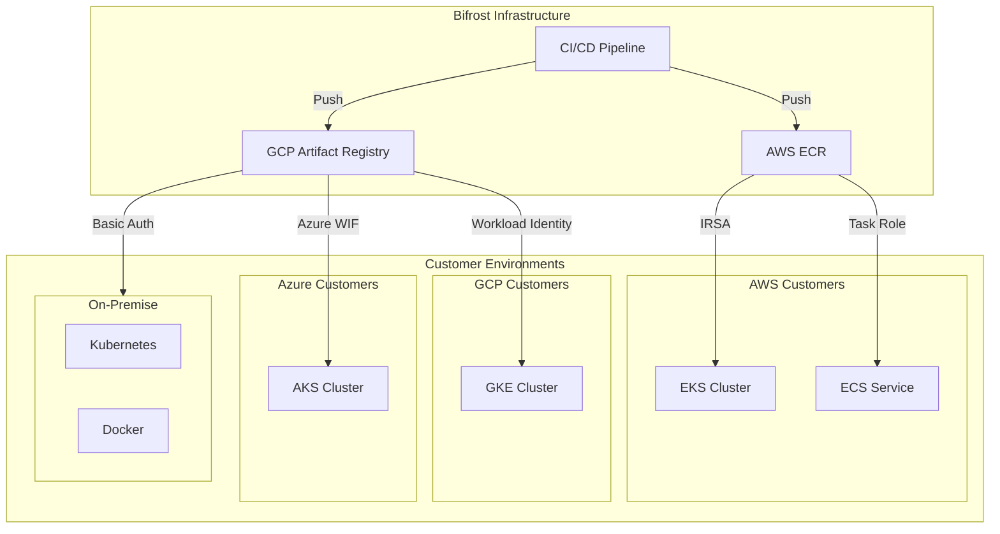

Bifrost Enterprise provides private container image distribution through dedicated registries, enabling secure deployments in AWS, GCP, Azure, and on-premise environments.

## Architecture

Bifrost uses a hub-and-spoke model with two container registries optimized for each cloud platform:

### Registry Distribution

| Customer Cloud | Registry Source | Why |
|----------------|-----------------|-----|
| AWS | AWS ECR | Native IAM integration, lowest latency within AWS |
| GCP | GCP Artifact Registry | Native Workload Identity, lowest latency within GCP |
| Azure | GCP Artifact Registry | Workload Identity Federation from Azure to GCP |
| On-Premise | GCP Artifact Registry | Basic auth with username/password credentials |

## Authentication Methods

Choose the authentication method based on your deployment environment:

| Environment | Method | Security Level | Setup Complexity |
|-------------|--------|----------------|------------------|
| AWS EKS | [IRSA](/deployment-guides/enterprise/aws#irsa-recommended) | High | Medium |
| AWS ECS | [IAM Task Roles](/deployment-guides/enterprise/aws#ecs-task-roles) | High | Low |
| GCP GKE | [Workload Identity](/deployment-guides/enterprise/gcp#workload-identity-recommended) | High | Low |
| Azure AKS | [Azure WIF](/deployment-guides/enterprise/azure) | High | Medium |
| On-Premise | [Basic Auth](/deployment-guides/enterprise/on-premise) | Medium | Low |

<Note>
Cloud-native identity federation (IRSA, Workload Identity, Azure WIF) is recommended over static credentials for production deployments.
</Note>

## Security Features

### Encryption
- **In-Transit**: All registry communication uses TLS 1.3
- **At-Rest**: Images encrypted using cloud-native encryption (AWS KMS, GCP CMEK)

### Access Control
- **IAM-based**: Fine-grained permissions using cloud IAM policies
- **Audit Logging**: All image pull operations are logged for compliance
- **IP Restrictions**: Optional VPC Service Controls (GCP) or VPC endpoints (AWS)

### Image Security
- **Vulnerability Scanning**: Automatic scanning on push
- **Immutable Tags**: Optional tag immutability to prevent overwrites
- **Signed Images**: Container image signatures for verification

## Prerequisites

Before deploying Bifrost Enterprise, ensure you have:

<Tabs>
<Tab title="AWS">
- AWS account with ECR access
- EKS cluster (v1.23+) or ECS cluster
- IAM permissions to create roles and policies
- `kubectl` and `aws` CLI configured
</Tab>
<Tab title="GCP">
- GCP project with Artifact Registry API enabled
- GKE cluster (v1.24+) with Workload Identity enabled
- IAM permissions for service account management
- `kubectl` and `gcloud` CLI configured
</Tab>
<Tab title="Azure">
- Azure subscription with AKS
- AKS cluster (v1.24+) with Workload Identity enabled
- Permissions to create Managed Identities
- `kubectl` and `az` CLI configured
</Tab>
<Tab title="On-Premise">
- Kubernetes cluster (v1.23+) or Docker runtime
- Network access to `us-central1-docker.pkg.dev`
- Docker credentials provided by Bifrost team
</Tab>
</Tabs>

## Getting Started

<CardGroup cols={2}>
  <Card title="AWS Deployment" icon="aws" href="/deployment-guides/enterprise/aws">
    Deploy on EKS or ECS with IRSA authentication
  </Card>
  <Card title="GCP Deployment" icon="google" href="/deployment-guides/enterprise/gcp">
    Deploy on GKE with Workload Identity
  </Card>
  <Card title="Azure Deployment" icon="microsoft" href="/deployment-guides/enterprise/azure">
    Deploy on AKS with Azure Workload Identity Federation
  </Card>
  <Card title="On-Premise" icon="server" href="/deployment-guides/enterprise/on-premise">
    Deploy anywhere with Docker credentials
  </Card>
</CardGroup>

## Support

For enterprise deployment assistance:
- **Email**: [contact@getmaxim.ai](mailto:contact@getmaxim.ai)
- **Slack**: Connect via Slack Connect for real-time support
- **Documentation**: Platform-specific guides linked above
