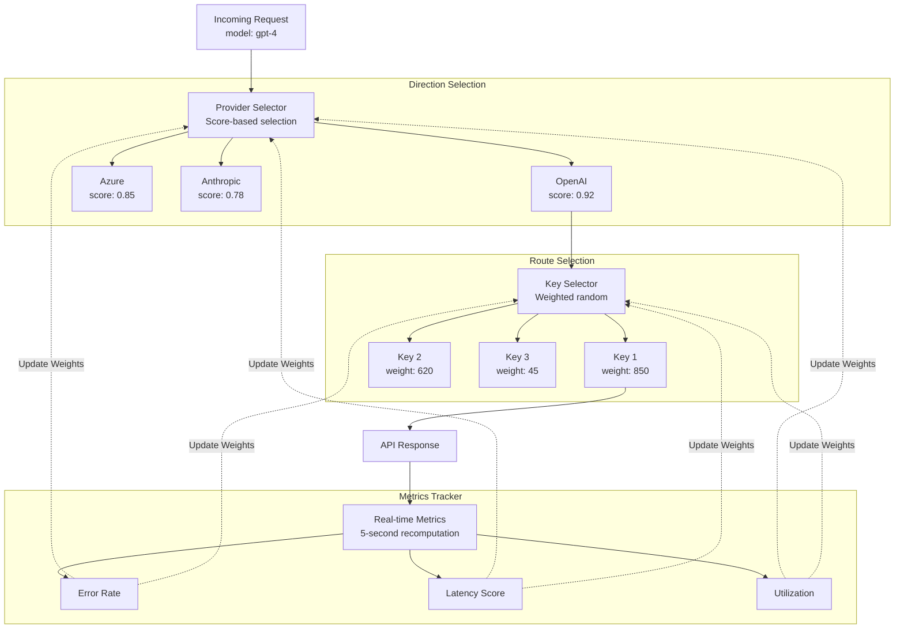
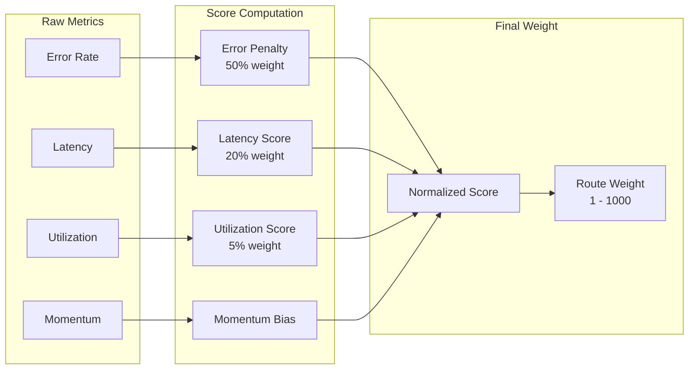
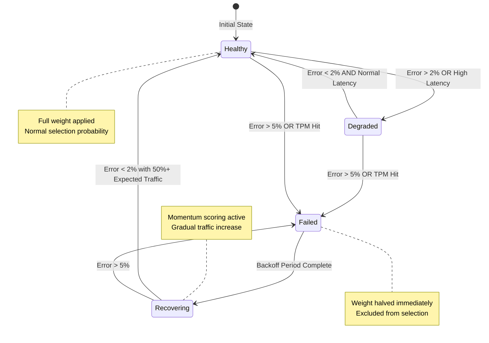

## Overview

**Adaptive Load Balancing** in Bifrost automatically optimizes traffic distribution across provider keys and models based on real-time performance metrics. The system continuously monitors error rates, latency, and throughput to dynamically adjust weights, ensuring optimal performance and reliability.

### Key Features

| Feature | Description |
|---------|-------------|
| **Dynamic Weight Adjustment** | Automatically adjusts key weights based on performance metrics |
| **Real-time Performance Monitoring** | Tracks error rates, latency, and success rates per model-key combination |
| **Cross-Node Synchronization** | Gossip protocol ensures consistent weight information across all cluster nodes |
| **Circuit Breaker Integration** | Temporarily removes poorly performing keys from rotation |
| **Fast Recovery** | Momentum-based scoring helps routes recover quickly after transient failures |

<Tip>
**Zero-overhead design**: All route selection logic adds less than **10 microseconds** to hot path latency. Weight calculations happen asynchronously every 5 seconds, so request routing uses pre-computed weights with minimal overhead.
</Tip>

---

## Architecture

The load balancing system operates at two levels:

- **Direction-level** (provider + model): Decides which provider to use for a given model
- **Route-level** (provider + model + key): Decides which API key to use within a provider

This two-tier approach enables both macro-level provider selection and micro-level key optimization.



---

## How Weight Calculation Works

Every 5 seconds, the system recalculates weights for all routes based on four factors:

| Factor | Weight | Purpose |
|--------|--------|---------|
| **Error Penalty** | 50% | Penalizes routes with high error rates |
| **Latency Score** | 20% | Penalizes routes with abnormally slow responses |
| **Utilization Score** | 5% | Prevents overloading high-performing routes |
| **Momentum Bias** | Additive | Rewards routes that are recovering well |

The system combines these into a single score, then converts it to a weight between 1 and 1000. Lower penalties mean higher weights, which means more traffic.

$$
Score = (P_{error} \times 0.5) + (P_{latency} \times 0.2) + (P_{util} \times 0.05) - M_{momentum}
$$

$$
Weight = W_{min} + (1 - Score) \times (W_{max} - W_{min})
$$



---

## Scoring Components Explained

### Error Penalty

The error penalty is the most important factor (50% of the total score). It measures how often a route fails and applies a penalty accordingly.

**How it works:**
- Recent errors matter more than old errors. The system uses a weighted average: 50% from the last minute, 30% from the last 5 minutes, and 20% from all-time history
- After a route stops failing, the penalty decays exponentially over time, allowing it to recover
- The first minute after recovery has aggressive decay (90% reduction in 30 seconds) to enable fast recovery

```math
R_{error} = 0.2 \times R_{alltime} + 0.3 \times R_{5min} + 0.5 \times R_{1min}
```

The penalty then decays over time after errors stop occurring:

```math
P_{error} = \min(P_{max}, R_{error}^{0.4} \times 2.5) \times e^{-t/\tau}
```

Where $t$ is time since last error and $\tau$ is the decay constant (faster in the first minute for quick recovery).

---

### Latency Score (MV-TACOS)

Not all slow responses are bad — a request with 10,000 output tokens *should* take longer than one with 100 tokens. The MV-TACOS algorithm (Multi-Variate Token-Aware COnformal Scoring) accounts for this by predicting expected latency based on token counts.

**How it works:**
1. The system learns a model that predicts latency based on input and output token counts
2. For each request, it compares actual latency to predicted latency
3. If actual latency significantly exceeds the prediction, a penalty is applied
4. The penalty uses the 80th percentile across recent requests (smoothed with EWMA) to avoid overreacting to individual slow requests

**Why this matters:** A route serving complex requests (high token counts) won't be unfairly penalized for being "slow" — only routes that are slower *than expected* get penalized.

```math
\log(latency) \approx \alpha + \beta \times \log(1 + a \times T_{in} + b \times T_{out})
```

If actual latency exceeds the prediction by more than a threshold $\Delta$, a penalty is applied:

```math
P_{latency} = 1 - e^{-k \times exceed / \Delta}
```

Where $exceed = \max(0, actual - predicted - \Delta)$ measures how much the latency exceeded expectations.

<Note>
MV-TACOS uses **Huber loss** for robust model updates, preventing outliers from destabilizing predictions. This means a few extremely slow requests won't break the model.
</Note>

---

### Utilization Score

This prevents the "winner takes all" problem where the best-performing route gets all the traffic and becomes overloaded.

**How it works:**
- The system calculates what each route's "fair share" of traffic should be (1/N where N is healthy routes)
- Routes handling more than their fair share get a small penalty
- This naturally spreads traffic across healthy routes while still favoring better performers

```math
P_{util} = \min(1.0, (Traffic_{actual} \times N_{healthy} - 1)^{1.5})
```

This only applies when a route is handling more than its fair share — underutilized routes get no penalty.

---

### Momentum (Fast Recovery)

When a route starts working again after failures, momentum scoring helps it recover traffic quickly.

**How it works:**
- The system tracks success rate over a short window (20 seconds by default)
- If success rate exceeds 97%, a sigmoid function converts this into a "momentum bonus"
- This bonus reduces the overall penalty score, giving the route more traffic
- The effect is capped to prevent recovered routes from immediately getting too much traffic

```math
M_{momentum} = \min(B_{max}, \lambda \times \frac{1}{1 + e^{-\gamma(SuccessRate - 0.97)}})
```

The sigmoid creates a sharp transition — routes below 97% success get almost no bonus, while routes above 97% get rapidly increasing momentum.

**Why this matters:** Without momentum, a route that had failures would take a long time to recover even after the underlying issue is fixed. Momentum accelerates this recovery.

---

## Route State Machine

Every route is in one of four states. The system automatically transitions routes between states based on their performance:



### State Descriptions

| State | What it means | What happens |
|-------|--------------|--------------|
| **Healthy** | Route is performing well | Full weight applied, normal traffic |
| **Degraded** | Route has minor issues | Still receives traffic but with reduced weight |
| **Failed** | Route is broken or rate-limited | Weight halved, excluded from selection until backoff completes |
| **Recovering** | Route is being tested after failure | Gradual traffic increase, momentum scoring active |

---

## Key Selection Algorithm

When selecting which API key to use, the system doesn't simply pick the highest-weight key every time. Instead, it uses **weighted random selection with jitter**.

**How it works:**
1. Find all keys within a "jitter band" of the top performer (default: within 5% of max weight)
2. From this candidate set, select randomly based on weights
3. With a small probability (25%), explore outside the candidate set to probe potentially recovered routes

**Why jitter matters:** Without jitter, the highest-weight key would get nearly all traffic. The jitter band ensures multiple good keys share the load, improving resilience.

**Why exploration matters:** Routes that recovered from failures need traffic to prove they're healthy again. Exploration gives them a chance.

The selection probability for each candidate key is proportional to its weight:

```math
P(key_i) = \frac{W_i}{\sum_{j \in candidates} W_j}
```

---

## Anti-Starvation

Even low-weight routes get some minimum traffic to prevent complete starvation. This is important because:

- Routes need traffic to prove they've recovered
- A route with zero traffic can't improve its metrics
- The system uses softmax normalization with a floor guarantee based on the exploration factor

```math
P_{floor} = \max(P_i, \frac{\eta}{K})
```

Where $\eta$ is the exploration factor (default 0.25) and $K$ is the number of healthy keys. This ensures every healthy route gets at least some minimum probability of selection.

---

## Performance Thresholds

| Metric | Threshold | Action |
|--------|-----------|--------|
| **Error Rate (10s)** | > 2% | Transition to Degraded state |
| **Error Rate (10s)** | > 5% | Transition to Failed state |
| **Latency Score** | > 25% | Transition to Degraded state |
| **TPM Hit** | Any | Immediate transition to Failed |
| **Recovery Traffic** | > 50% expected share | Transition to Healthy |

---

## Dashboard

<Frame>
  
</Frame>

The dashboard provides real-time visibility into:
- **Weight Distribution**: Current weights across all routes
- **Performance Metrics**: Error rates, latency percentiles, utilization
- **State Transitions**: Route health state changes over time
- **Traffic Distribution**: Actual vs expected traffic per route

---

## Next Steps

<Steps>
  <Step title="Enable Adaptive Load Balancing">
    Contact your Bifrost Enterprise representative to enable adaptive load balancing for your deployment
  </Step>
  <Step title="Monitor Weight Distribution">
    Use the dashboard to observe how weights adapt to real traffic patterns
  </Step>
  <Step title="Analyze Performance">
    Review route state transitions and weight adjustments to understand system behavior
  </Step>
</Steps>
