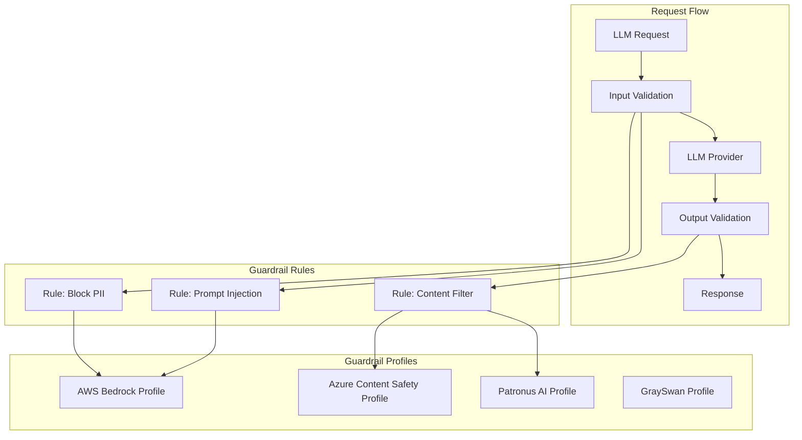
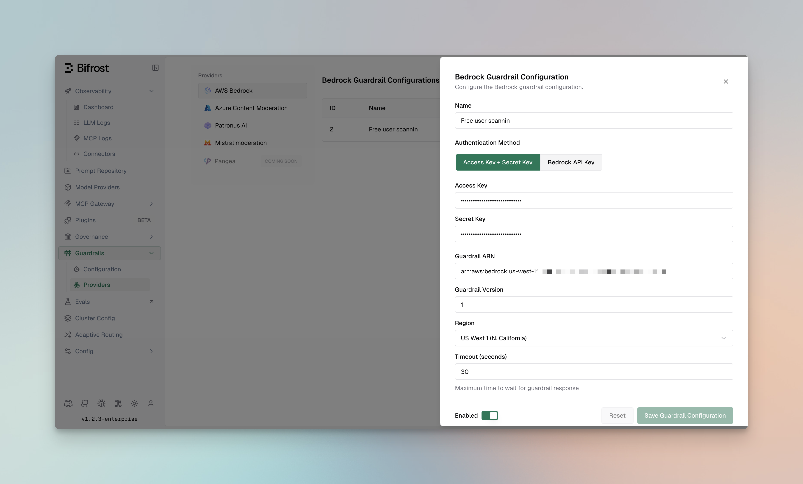
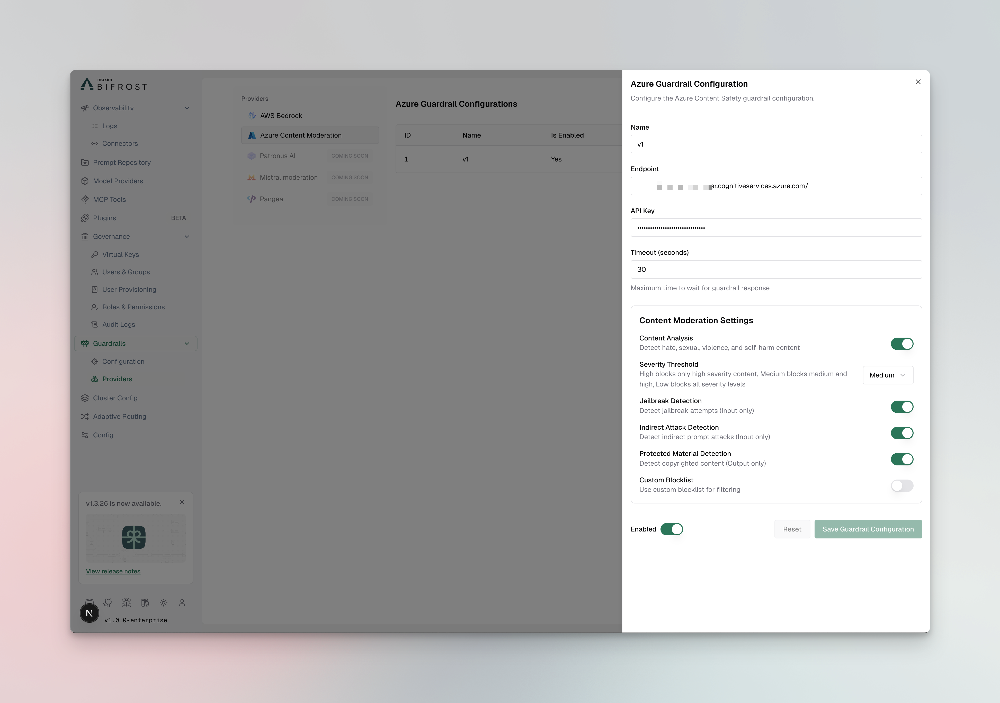
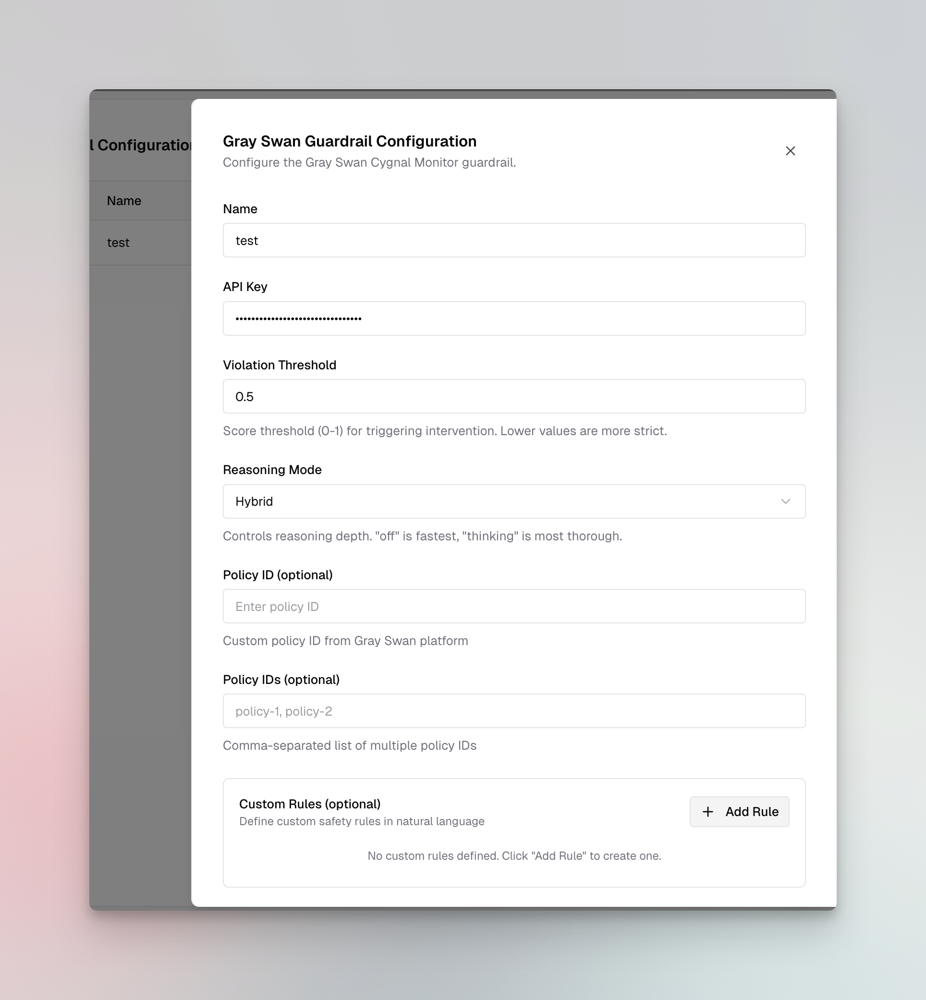
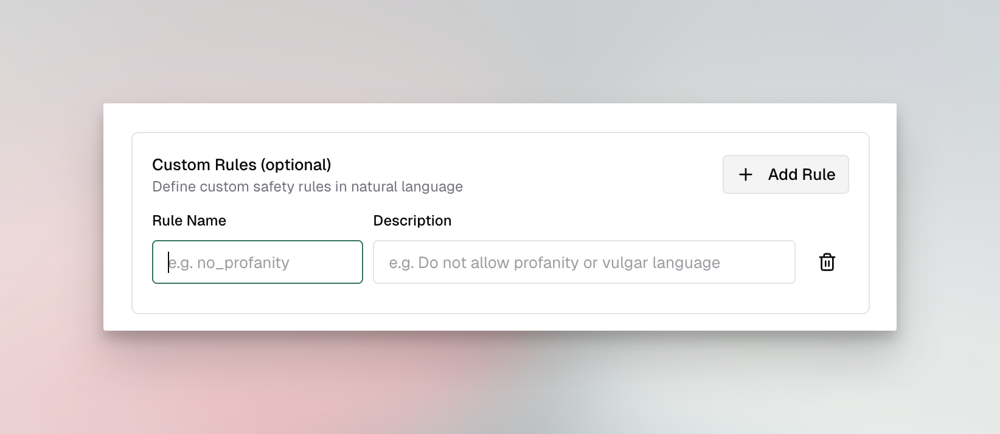

## Overview

**Guardrails** in Bifrost provide enterprise-grade content safety, security validation, and policy enforcement for LLM requests and responses. The system validates inputs and outputs in real-time against your specified policies, ensuring responsible AI deployment with comprehensive protection against harmful content, prompt injection, PII leakage, and policy violations.

<Frame>
  
</Frame>

### Core Concepts

Bifrost Guardrails are built around two core concepts that work together to provide flexible and powerful content protection:

| Concept | Description |
|---------|-------------|
| **Rules** | Custom policies defined using CEL (Common Expression Language) that determine what content to validate and when. Rules can apply to inputs, outputs, or both, and can be linked to one or more profiles for evaluation. |
| **Profiles** | Configurations for external guardrail providers (AWS Bedrock, Azure Content Safety, GraySwan, Patronus AI). Profiles are reusable and can be shared across multiple rules. |

**How They Work Together:**
- **Profiles** define *how* content is evaluated using external provider capabilities
- **Rules** define *when* and *what* content gets evaluated using CEL expressions
- A single rule can use multiple profiles for layered protection
- Profiles can be reused across different rules for consistency

### Key Features

| Feature | Description |
|---------|-------------|
| **Multi-Provider Support** | AWS Bedrock, Azure Content Safety, GraySwan, and Patronus AI integration |
| **Dual-Stage Validation** | Guard both inputs (prompts) and outputs (responses) |
| **Real-Time Processing** | Synchronous and asynchronous validation modes |
| **CEL-Based Rules** | Define custom policies using Common Expression Language |
| **Reusable Profiles** | Configure providers once, use across multiple rules |
| **Sampling Control** | Apply rules to a percentage of requests for performance tuning |
| **Automatic Remediation** | Block, redact, or modify content based on policy |
| **Comprehensive Logging** | Detailed audit trails for compliance |

### Navigating Guardrails in the UI

Access Guardrails from the Bifrost dashboard:

| Page | Path | Description |
|------|------|-------------|
| **Configuration** | Guardrails > Configuration | Manage guardrail rules and their settings |
| **Providers** | Guardrails > Providers | Configure and manage guardrail profiles |

### Architecture

The following diagram illustrates how Rules and Profiles work together to validate LLM requests:



**Flow Description:**
1. **Incoming Request** - LLM request arrives at Bifrost
2. **Input Validation** - Applicable rules evaluate the input using linked profiles
3. **LLM Processing** - If input passes, request is forwarded to the LLM provider
4. **Output Validation** - Response is evaluated by output rules using linked profiles
5. **Response** - Validated response is returned (or blocked/modified based on violations)

---

## Supported Guardrail Providers

Bifrost integrates with leading guardrail providers to offer comprehensive protection:

### AWS Bedrock Guardrails

**Amazon Bedrock Guardrails** provides enterprise-grade content filtering and safety features with deep AWS integration.



**Capabilities:**
- **Content Filters**: Hate speech, insults, sexual content, violence, misconduct
- **Denied Topics**: Block specific topics or categories
- **Word Filters**: Custom profanity and sensitive word blocking
- **PII Protection**: Detect and redact 50+ PII entity types
- **Contextual Grounding**: Verify responses against source documents
- **Prompt Attack Detection**: Identify injection and jailbreak attempts
- **Image Content Support**: Analyze images in addition to text (PNG, JPEG)

**Configuration Fields:**

| Field | Type | Required | Default | Description |
|-------|------|----------|---------|-------------|
| `access_key` | string | No* | - | AWS Access Key ID |
| `secret_key` | string | No* | - | AWS Secret Access Key |
| `bedrock_api_key` | string | No* | - | Alternative Bedrock API key (Bearer token) |
| `guardrail_arn` | string | Yes | - | ARN of the Bedrock guardrail |
| `guardrail_version` | string | Yes | - | Version of the guardrail (e.g., "1", "DRAFT") |
| `region` | string | Yes | - | AWS region |

<Note>
*Either `access_key` + `secret_key` OR `bedrock_api_key` must be provided for authentication.
</Note>

**Authentication Methods:**

<Tabs group="bedrock-auth">
<Tab title="Access Key + Secret Key">
Uses AWS SDK with static credentials:
```json
{
  "access_key": "AKIAXXXXXXXXXXXXXXXXXX",
  "secret_key": "your-secret-access-key",
  "guardrail_arn": "arn:aws:bedrock:us-east-1:123456789:guardrail/abc123",
  "guardrail_version": "1",
  "region": "us-east-1"
}
```
</Tab>
<Tab title="Bedrock API Key">
Uses HTTP REST API with Bearer token:
```json
{
  "bedrock_api_key": "your-bedrock-api-key",
  "guardrail_arn": "arn:aws:bedrock:us-east-1:123456789:guardrail/abc123",
  "guardrail_version": "1",
  "region": "us-east-1"
}
```
</Tab>
</Tabs>

**Supported AWS Regions:**

| Region Code | Region Name |
|-------------|-------------|
| `us-east-1` | US East (N. Virginia) |
| `us-east-2` | US East (Ohio) |
| `us-west-1` | US West (N. California) |
| `us-west-2` | US West (Oregon) |
| `ap-south-1` | Asia Pacific (Mumbai) |
| `ap-northeast-1` | Asia Pacific (Tokyo) |
| `ap-northeast-2` | Asia Pacific (Seoul) |
| `ap-southeast-1` | Asia Pacific (Singapore) |
| `ap-southeast-2` | Asia Pacific (Sydney) |
| `eu-central-1` | Europe (Frankfurt) |
| `eu-west-1` | Europe (Ireland) |
| `eu-west-2` | Europe (London) |
| `eu-west-3` | Europe (Paris) |

**Supported Content Types:**
- Text content
- Images (PNG, JPEG formats)

**Usage Metrics Returned:**

Bedrock guardrails return detailed usage metrics for cost tracking and monitoring:

| Metric | Description |
|--------|-------------|
| `content_policy_units` | Units consumed by content policy evaluation |
| `contextual_grounding_policy_units` | Units for grounding checks |
| `sensitive_information_policy_units` | Units for PII detection |
| `topic_policy_units` | Units for topic filtering |
| `word_policy_units` | Units for word filtering |
| `automated_reasoning_policy_units` | Units for reasoning checks |
| `content_policy_image_units` | Units for image content analysis |

**Supported PII Types:**
- Personal identifiers (SSN, passport, driver's license)
- Financial information (credit cards, bank accounts)
- Contact information (email, phone, address)
- Medical information (health records, insurance)
- Device identifiers (IP addresses, MAC addresses)

### Azure Content Safety

**Azure AI Content Safety** provides multi-modal content moderation powered by Microsoft's advanced AI models.



**Capabilities:**
- **Severity-Based Filtering**: 4-level severity classification (Safe, Low, Medium, High)
- **Multi-Category Detection**: Hate, sexual, violence, self-harm content
- **Prompt Shield**: Advanced jailbreak and injection detection
- **Indirect Attack Detection**: Identify hidden malicious instructions
- **Protected Material**: Detect copyrighted content (output only)
- **Custom Blocklists**: Define organization-specific blocked terms

**Configuration Fields:**

| Field | Type | Required | Default | Description |
|-------|------|----------|---------|-------------|
| `endpoint` | string | Yes | - | Azure Content Safety endpoint URL |
| `api_key` | string | Yes | - | Azure subscription key |
| `analyze_enabled` | boolean | No | true | Enable content analysis for Hate, Sexual, Violence, SelfHarm |
| `analyze_severity_threshold` | enum | No | "medium" | Severity level to trigger: `low`, `medium`, or `high` |
| `jailbreak_shield_enabled` | boolean | No | false | Enable jailbreak detection (input only) |
| `indirect_attack_shield_enabled` | boolean | No | false | Enable indirect prompt attack detection (input only) |
| `copyright_enabled` | boolean | No | false | Enable copyrighted content detection (output only) |
| `text_blocklist_enabled` | boolean | No | false | Enable custom blocklist filtering |
| `blocklist_names` | array | No | - | List of Azure blocklist names to apply |

**Severity Threshold Levels:**

| Threshold | Numeric Value | Behavior |
|-----------|---------------|----------|
| `low` | 2 | Most strict - blocks severity 2 and above |
| `medium` | 4 | Balanced - blocks severity 4 and above |
| `high` | 6 | Least strict - blocks only severity 6 |

**Detection Categories:**
- Hate and fairness
- Sexual content
- Violence
- Self-harm

<Note>
**Input-only features:** Jailbreak Shield and Indirect Attack Shield only apply to input validation.
**Output-only features:** Copyright detection only applies to output validation.
</Note>

### Patronus AI

**Patronus AI** specializes in LLM security and safety with advanced evaluation capabilities.

**Capabilities:**
- **Hallucination Detection**: Identify factually incorrect responses
- **PII Detection**: Comprehensive personal data identification
- **Toxicity Screening**: Multi-language toxic content detection
- **Prompt Injection Defense**: Advanced attack pattern recognition
- **Custom Evaluators**: Build organization-specific safety checks
- **Real-Time Monitoring**: Continuous safety validation

**Advanced Features:**
- Context-aware evaluation
- Multi-turn conversation analysis
- Custom policy templates
- Integration with existing safety workflows

### GraySwan Cygnal

**GraySwan Cygnal Monitor** provides AI safety monitoring with natural language rule definitions and advanced threat detection capabilities.



**Capabilities:**
- **Violation Scoring**: Continuous 0-1 scale violation detection with configurable thresholds
- **Custom Natural Language Rules**: Define safety rules in plain English without code
- **Policy Management**: Use pre-built policies from GraySwan platform or create custom ones
- **Indirect Prompt Injection (IPI) Detection**: Identify hidden instructions in user inputs
- **Mutation Detection**: Detect attempts to manipulate or alter content
- **Reasoning Modes**: Choose from fast ("off"), balanced ("hybrid"), or thorough ("thinking") analysis

**Configuration Fields:**

| Field | Type | Required | Default | Description |
|-------|------|----------|---------|-------------|
| `api_key` | string | Yes | - | GraySwan API key |
| `violation_threshold` | number | No | 0.5 | Score threshold (0-1) for triggering intervention. Lower values are more strict. |
| `reasoning_mode` | enum | No | "off" | Analysis depth: `off` (fastest), `hybrid` (balanced), or `thinking` (most thorough) |
| `policy_id` | string | No | - | Single custom policy ID from GraySwan platform |
| `policy_ids` | array | No | - | Multiple policy IDs for aggregated rule evaluation |
| `rules` | object | No | - | Custom natural language rules as key-value pairs |

**Custom Rules Example:**



Rules are defined as key-value pairs where the key is the rule name and the value is a natural language description:

```json
{
  "rules": {
    "no_profanity": "Do not allow profanity or vulgar language",
    "no_pii": "Do not allow personally identifiable information",
    "professional_tone": "Ensure all responses maintain a professional tone"
  }
}
```

**Detection Features:**
- Real-time violation scoring
- Multi-rule evaluation
- IPI attack detection
- Content mutation monitoring
- Detailed violation descriptions with rule attribution


---

## Guardrail Rules

Guardrail Rules are custom policies that define when and how content validation occurs. Rules use CEL (Common Expression Language) expressions to evaluate requests and can be linked to one or more profiles for execution.

<Frame>
  
</Frame>

### Rule Properties

| Property | Type | Required | Description |
|----------|------|----------|-------------|
| `id` | integer | Yes | Unique identifier for the rule |
| `name` | string | Yes | Descriptive name for the rule |
| `description` | string | No | Explanation of what the rule does |
| `enabled` | boolean | Yes | Whether the rule is active |
| `cel_expression` | string | Yes | CEL expression for rule evaluation |
| `apply_to` | enum | Yes | When to apply: `input`, `output`, or `both` |
| `sampling_rate` | integer | No | Percentage of requests to evaluate (0-100) |
| `timeout` | integer | No | Execution timeout in milliseconds |
| `provider_config_ids` | array | No | IDs of profiles to use for evaluation |

### Creating Rules

<Tabs group="rules-config">
<Tab title="Web UI">
1. **Navigate to Rules**
   - Go to **Guardrails** > **Configuration**
   - Click **Add Rule**

<Frame>

</Frame>


2. **Configure Rule Settings**

**Basic Information:**
- **Name**: Enter a descriptive name (e.g., "Block PII in Prompts")
- **Description**: Explain the rule's purpose
- **Enabled**: Toggle to activate the rule

**Evaluation Settings:**
- **Apply To**: Select when to apply the rule
  - `input` - Validate incoming prompts only
  - `output` - Validate LLM responses only
  - `both` - Validate both inputs and outputs
- **CEL Expression**: Define the validation logic
- **Sampling Rate**: Set percentage of requests to evaluate (default: 100%)
- **Timeout**: Set maximum execution time in milliseconds

3. **Link Profiles**
   - Select one or more profiles to use for evaluation
   - Rules will execute all linked profiles in sequence

4. **Save and Test**
   - Click **Save Rule**
   - Use the **Test** button to validate with sample content

</Tab>
<Tab title="API">

**Create a Guardrail Rule:**
```bash
curl -X POST http://localhost:8080/api/enterprise/guardrails/rules \
  -H "Content-Type: application/json" \
  -d '{
    "id": 1,
    "name": "Block PII in Prompts",
    "description": "Prevent PII from being sent to LLM providers",
    "enabled": true,
    "cel_expression": "request.messages.exists(m, m.role == \"user\")",
    "apply_to": "input",
    "sampling_rate": 100,
    "timeout": 5000,
    "provider_config_ids": [1, 2]
  }'
```

**List All Rules:**
```bash
curl -X GET http://localhost:8080/api/enterprise/guardrails/rules \
  -H "Content-Type: application/json"

# Response
{
  "rules": [
    {
      "id": 1,
      "name": "Block PII in Prompts",
      "description": "Prevent PII from being sent to LLM providers",
      "enabled": true,
      "cel_expression": "request.messages.exists(m, m.role == \"user\")",
      "apply_to": "input",
      "sampling_rate": 100,
      "timeout": 5000,
      "provider_config_ids": [1, 2]
    }
  ]
}
```

**Update a Rule:**
```bash
curl -X PUT http://localhost:8080/api/enterprise/guardrails/rules/1 \
  -H "Content-Type: application/json" \
  -d '{
    "enabled": false,
    "sampling_rate": 50
  }'
```

**Delete a Rule:**
```bash
curl -X DELETE http://localhost:8080/api/enterprise/guardrails/rules/1
```

</Tab>
<Tab title="config.json">

```json
{
  "enterprise": {
    "guardrails": {
      "guardrail_rules": [
        {
          "id": 1,
          "name": "Block PII in Prompts",
          "description": "Prevent PII from being sent to LLM providers",
          "enabled": true,
          "cel_expression": "request.messages.exists(m, m.role == \"user\")",
          "apply_to": "input",
          "sampling_rate": 100,
          "timeout": 5000,
          "provider_config_ids": [1, 2]
        },
        {
          "id": 2,
          "name": "Content Filter for Responses",
          "description": "Filter harmful content from LLM responses",
          "enabled": true,
          "cel_expression": "true",
          "apply_to": "output",
          "sampling_rate": 100,
          "timeout": 3000,
          "provider_config_ids": [2]
        },
        {
          "id": 3,
          "name": "Prompt Injection Detection",
          "description": "Detect and block prompt injection attempts",
          "enabled": true,
          "cel_expression": "request.messages.size() > 0",
          "apply_to": "input",
          "sampling_rate": 100,
          "timeout": 2000,
          "provider_config_ids": [1]
        }
      ]
    }
  }
}
```

</Tab>
<Tab title="Helm">

```yaml
enterprise:
  guardrails:
    rules:
      - id: 1
        name: "Block PII in Prompts"
        description: "Prevent PII from being sent to LLM providers"
        enabled: true
        cel_expression: "request.messages.exists(m, m.role == 'user')"
        apply_to: "input"
        sampling_rate: 100
        timeout: 5000
        provider_config_ids: [1, 2]
      - id: 2
        name: "Content Filter for Responses"
        description: "Filter harmful content from LLM responses"
        enabled: true
        cel_expression: "true"
        apply_to: "output"
        sampling_rate: 100
        timeout: 3000
        provider_config_ids: [2]
```

</Tab>
</Tabs>

### CEL Expression Examples

CEL (Common Expression Language) provides a powerful way to define rule conditions. Here are common patterns:

**Always Apply Rule:**
```cel
true
```

**Apply to User Messages Only:**
```cel
request.messages.exists(m, m.role == "user")
```

**Apply to Messages Containing Keywords:**
```cel
request.messages.exists(m, m.content.contains("confidential"))
```

**Apply Based on Model:**
```cel
request.model.startsWith("gpt-4")
```

**Apply to Long Prompts:**
```cel
request.messages.filter(m, m.role == "user").map(m, m.content.size()).sum() > 1000
```

**Combine Multiple Conditions:**
```cel
request.model.startsWith("gpt-4") && request.messages.exists(m, m.role == "user" && m.content.size() > 500)
```

### Linking Rules to Profiles

Rules can be linked to multiple profiles for comprehensive validation:

<Frame>
  
</Frame>

**Best Practices:**
- Link PII detection rules to profiles with PII capabilities (Bedrock, Patronus)
- Link content filtering rules to profiles with content safety features (Azure, Bedrock, GraySwan)
- Use GraySwan for custom natural language rules when you need flexible, readable policies
- Use multiple profiles for defense-in-depth (e.g., Bedrock + Patronus for PII, Azure + GraySwan for content)
- Set appropriate timeouts when using multiple profiles

---

## Managing Profiles

Profiles are reusable configurations for external guardrail providers. Each profile contains provider-specific settings including credentials, endpoints, and detection thresholds.

<Frame>
  
</Frame>

### Profile Properties

| Property | Type | Required | Description |
|----------|------|----------|-------------|
| `id` | integer | Yes | Unique identifier for the profile |
| `provider_name` | string | Yes | Provider type: `bedrock`, `azure`, `grayswan`, `patronus_ai` |
| `policy_name` | string | Yes | Descriptive name for the policy |
| `enabled` | boolean | Yes | Whether the profile is active |
| `config` | object | No | Provider-specific configuration |

### Creating Profiles

<Tabs group="profiles-config">
<Tab title="Web UI">

1. **Navigate to Providers**
   - Go to **Guardrails** > **Providers**
   - Click **Add Profile**

<Frame>
  
</Frame>

2. **Select Provider Type**
   - Choose from: AWS Bedrock, Azure Content Safety, GraySwan, or Patronus AI

3. **Configure Provider Settings**
   - Enter credentials and endpoint information
   - Configure detection thresholds and actions
   - See provider-specific setup sections above for detailed configuration

4. **Save Profile**
   - Click **Save Profile**
   - The profile is now available for linking to rules

</Tab>
<Tab title="API">

**Create a Profile:**
```bash
curl -X POST http://localhost:8080/api/enterprise/guardrails/providers \
  -H "Content-Type: application/json" \
  -d '{
    "id": 1,
    "provider_name": "bedrock",
    "policy_name": "PII Detection Profile",
    "enabled": true,
    "config": {
      "access_key": "${AWS_ACCESS_KEY_ID}",
      "secret_key": "${AWS_SECRET_ACCESS_KEY}",
      "guardrail_arn": "arn:aws:bedrock:us-east-1:123456789:guardrail/abc123",
      "guardrail_version": "1",
      "region": "us-east-1"
    }
  }'
```

**List All Profiles:**
```bash
curl -X GET http://localhost:8080/api/enterprise/guardrails/providers \
  -H "Content-Type: application/json"

# Response
{
  "providers": [
    {
      "id": 1,
      "provider_name": "bedrock",
      "policy_name": "PII Detection Profile",
      "enabled": true
    },
    {
      "id": 2,
      "provider_name": "azure",
      "policy_name": "Content Safety Profile",
      "enabled": true
    }
  ]
}
```

**Update a Profile:**
```bash
curl -X PUT http://localhost:8080/api/enterprise/guardrails/providers/1 \
  -H "Content-Type: application/json" \
  -d '{
    "enabled": false
  }'
```

**Delete a Profile:**
```bash
curl -X DELETE http://localhost:8080/api/enterprise/guardrails/providers/1
```

</Tab>
<Tab title="config.json">

```json
{
  "enterprise": {
    "guardrails": {
      "guardrail_providers": [
        {
          "id": 1,
          "provider_name": "bedrock",
          "policy_name": "PII Detection Profile",
          "enabled": true,
          "config": {
            "access_key": "${AWS_ACCESS_KEY_ID}",
            "secret_key": "${AWS_SECRET_ACCESS_KEY}",
            "guardrail_arn": "arn:aws:bedrock:us-east-1:123456789:guardrail/abc123",
            "guardrail_version": "1",
            "region": "us-east-1"
          }
        },
        {
          "id": 2,
          "provider_name": "azure",
          "policy_name": "Content Safety Profile",
          "enabled": true,
          "config": {
            "endpoint": "https://your-resource.cognitiveservices.azure.com/",
            "api_key": "${AZURE_CONTENT_SAFETY_API_KEY}",
            "analyze_enabled": true,
            "analyze_severity_threshold": "medium",
            "jailbreak_shield_enabled": true,
            "indirect_attack_shield_enabled": true
          }
        },
        {
          "id": 3,
          "provider_name": "grayswan",
          "policy_name": "Custom Safety Rules",
          "enabled": true,
          "config": {
            "api_key": "${GRAYSWAN_API_KEY}",
            "violation_threshold": 0.5,
            "reasoning_mode": "hybrid",
            "rules": {
              "no_pii": "Do not allow personally identifiable information",
              "professional_tone": "Ensure responses maintain a professional tone"
            }
          }
        },
        {
          "id": 4,
          "provider_name": "patronus_ai",
          "policy_name": "Hallucination Detection",
          "enabled": true,
          "config": {
            "api_key": "${PATRONUS_API_KEY}",
            "api_endpoint": "https://api.patronus.ai/v1"
          }
        }
      ]
    }
  }
}
```

</Tab>
<Tab title="Helm">

```yaml
enterprise:
  guardrails:
    providers:
      - id: 1
        provider_name: "bedrock"
        policy_name: "PII Detection Profile"
        enabled: true
        config:
          guardrail_arn: "arn:aws:bedrock:us-east-1:123456789:guardrail/abc123"
          guardrail_version: "1"
          region: "us-east-1"
          # AWS Authentication (choose one method):
          # Option 1: Explicit credentials
          access_key: "${AWS_ACCESS_KEY_ID}"
          secret_key: "${AWS_SECRET_ACCESS_KEY}"
          # Option 2: IAM Role - omit access_key and secret_key
          # (Bifrost will use IAM credentials from the environment)
      - id: 2
        provider_name: "azure"
        policy_name: "Content Safety Profile"
        enabled: true
        config:
          endpoint: "https://your-resource.cognitiveservices.azure.com/"
          api_key: "${AZURE_CONTENT_SAFETY_API_KEY}"
          analyze_enabled: true
          analyze_severity_threshold: "medium"
          jailbreak_shield_enabled: true
      - id: 3
        provider_name: "grayswan"
        policy_name: "Custom Safety Rules"
        enabled: true
        config:
          api_key: "${GRAYSWAN_API_KEY}"
          violation_threshold: 0.5
          reasoning_mode: "hybrid"
          rules:
            no_pii: "Do not allow personally identifiable information"
            professional_tone: "Ensure responses maintain a professional tone"
      - id: 4
        provider_name: "patronus_ai"
        policy_name: "Hallucination Detection"
        enabled: true
        config:
          api_endpoint: "https://api.patronus.ai/v1"
```

</Tab>
</Tabs>

### Provider Capabilities

Each provider offers different capabilities. Choose profiles based on your validation needs:

| Capability | AWS Bedrock | Azure Content Safety | GraySwan | Patronus AI |
|------------|-------------|---------------------|----------|-------------|
| PII Detection | Yes | No | No | Yes |
| Content Filtering | Yes | Yes | Yes | Yes |
| Prompt Injection | Yes | Yes | Yes | Yes |
| Hallucination Detection | No | No | No | Yes |
| Toxicity Screening | Yes | Yes | Yes | Yes |
| Custom Policies | Yes | Yes | Yes | Yes |
| Custom Natural Language Rules | No | No | Yes | No |
| Image Support | Yes | No | No | No |
| IPI Detection | No | Yes | Yes | No |
| Mutation Detection | No | No | Yes | No |

### Best Practices

**Profile Organization:**
- Create separate profiles for different use cases (PII, content filtering, etc.)
- Use descriptive policy names that indicate the profile's purpose
- Keep credentials secure using environment variables

**Performance Considerations:**
- Enable only the profiles you need to minimize latency
- Use sampling rates on rules for high-traffic endpoints
- Set appropriate timeouts to prevent slow requests

**Security:**
- Store API keys and credentials in environment variables or secrets managers
- Regularly rotate credentials
- Use least-privilege IAM roles for AWS Bedrock

---

## Using Guardrails in Requests

### Attaching Guardrails to API Calls

Once configured, attach guardrails to your LLM requests using custom headers:

**Single Guardrail:**
```bash
curl -X POST http://localhost:8080/v1/chat/completions \
  -H "Content-Type: application/json" \
  -H "x-bf-guardrail-id: bedrock-prod-guardrail" \
  -d '{
    "model": "gpt-4o-mini",
    "messages": [
      {
        "role": "user",
        "content": "Help me with this task"
      }
    ]
  }'
```

**Multiple Guardrails (Sequential):**
```bash
curl -X POST http://localhost:8080/v1/chat/completions \
  -H "Content-Type: application/json" \
  -H "x-bf-guardrail-ids: bedrock-prod-guardrail,azure-content-safety-001" \
  -d '{
    "model": "gpt-4o-mini",
    "messages": [
      {
        "role": "user",
        "content": "Help me with this task"
      }
    ]
  }'
```

**Guardrail Configuration in Request:**
```bash
curl -X POST http://localhost:8080/v1/chat/completions \
  -H "Content-Type: application/json" \
  -d '{
    "model": "gpt-4o-mini",
    "messages": [
      {
        "role": "user",
        "content": "Help me with this task"
      }
    ],
    "bifrost_config": {
      "guardrails": {
        "input": ["bedrock-prod-guardrail"],
        "output": ["patronus-ai-001"],
        "async": false
      }
    }
  }'
```

### Guardrail Response Handling

**Successful Validation (200):**
```json
{
  "id": "chatcmpl-abc123",
  "object": "chat.completion",
  "created": 1699564800,
  "model": "gpt-4o-mini",
  "choices": [
    {
      "index": 0,
      "message": {
        "role": "assistant",
        "content": "I'd be happy to help you with your task..."
      },
      "finish_reason": "stop"
    }
  ],
  "extra_fields": {
    "guardrails": {
      "input_validation": {
        "guardrail_id": "bedrock-prod-guardrail",
        "status": "passed",
        "violations": [],
        "processing_time_ms": 245
      },
      "output_validation": {
        "guardrail_id": "patronus-ai-001",
        "status": "passed",
        "violations": [],
        "processing_time_ms": 312
      }
    }
  }
}
```

**Validation Failure - Blocked (446):**
```json
{
  "error": {
    "message": "Request blocked by guardrails",
    "type": "guardrail_violation",
    "code": 446,
    "details": {
      "guardrail_id": "bedrock-prod-guardrail",
      "validation_stage": "input",
      "violations": [
        {
          "type": "PII",
          "category": "SSN",
          "severity": "HIGH",
          "action": "block",
          "text_excerpt": "My SSN is ***-**-****"
        },
        {
          "type": "prompt_injection",
          "severity": "CRITICAL",
          "action": "block",
          "confidence": 0.95
        }
      ],
      "processing_time_ms": 198
    }
  }
}
```

**Validation Warning - Logged (246):**
```json
{
  "id": "chatcmpl-def456",
  "object": "chat.completion",
  "created": 1699564800,
  "model": "gpt-4o-mini",
  "choices": [
    {
      "index": 0,
      "message": {
        "role": "assistant",
        "content": "Response with redacted content..."
      },
      "finish_reason": "stop"
    }
  ],
  "bifrost_metadata": {
    "guardrails": {
      "output_validation": {
        "guardrail_id": "azure-content-safety-001",
        "status": "warning",
        "violations": [
          {
            "type": "profanity",
            "severity": "LOW",
            "action": "redact",
            "modifications": 2
          }
        ],
        "processing_time_ms": 187
      }
    }
  }
}
```
