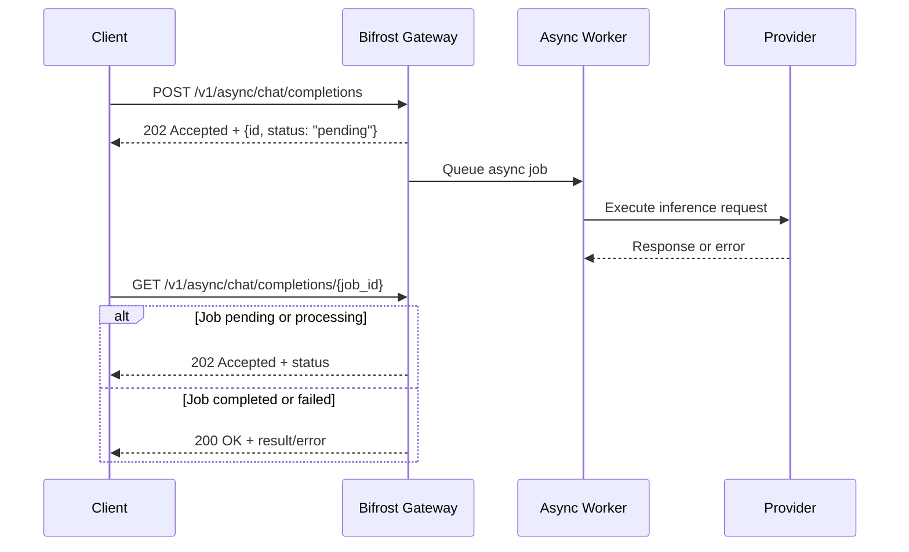

## Overview

Async inference uses a fire-and-forget pattern for gateway requests: submit a normal inference payload to an async endpoint, get a `job_id` immediately, and poll later for the final result.

<Note>
This is a gateway-only feature and is not available in the Go SDK and requires a Logs Store to be configured.
</Note>

## How It Works



## Supported Endpoints

Streaming is not supported on async endpoints.

| Request Type | Submit (POST) | Poll (GET) |
|---|---|---|
| Text completions | `/v1/async/completions` | `/v1/async/completions/{job_id}` |
| Chat completions | `/v1/async/chat/completions` | `/v1/async/chat/completions/{job_id}` |
| Responses API | `/v1/async/responses` | `/v1/async/responses/{job_id}` |
| Embeddings | `/v1/async/embeddings` | `/v1/async/embeddings/{job_id}` |
| Speech | `/v1/async/audio/speech` | `/v1/async/audio/speech/{job_id}` |
| Transcriptions | `/v1/async/audio/transcriptions` | `/v1/async/audio/transcriptions/{job_id}` |
| Image generations | `/v1/async/images/generations` | `/v1/async/images/generations/{job_id}` |
| Image edits | `/v1/async/images/edits` | `/v1/async/images/edits/{job_id}` |
| Image variations | `/v1/async/images/variations` | `/v1/async/images/variations/{job_id}` |
| Rerank | `/v1/async/rerank` | `/v1/async/rerank/{job_id}` |

## Submitting a Request

Use the same JSON body as the synchronous endpoint, but switch to the `/v1/async/` path.

```bash
curl -X POST http://localhost:8080/v1/async/chat/completions \
  -H "Content-Type: application/json" \
  -H "x-bf-vk: sk-bf-your-virtual-key" \
  -H "x-bf-async-job-result-ttl: 3600" \
  -d '{
    "model": "openai/gpt-4o-mini",
    "messages": [
      {
        "role": "user",
        "content": "Summarize the latest release notes in 3 bullets"
      }
    ]
  }'
```

**Response (`202 Accepted`)**

```json
{
  "id": "1e89b165-d4fe-49e8-beb2-3e157f2df02f",
  "status": "pending",
  "created_at": "2026-02-19T08:10:17.831Z"
}
```

## Polling for Results

Use `GET` on the matching endpoint with the returned `job_id`.

```bash
curl -X GET http://localhost:8080/v1/async/chat/completions/1e89b165-d4fe-49e8-beb2-3e157f2df02f \
  -H "x-bf-vk: sk-bf-your-virtual-key"
```

**Response codes:**
- `202 Accepted`: job is still `pending` or `processing`
- `200 OK`: job is `completed` or `failed`

**Pending example (`202`)**

```json
{
  "id": "1e89b165-d4fe-49e8-beb2-3e157f2df02f",
  "status": "pending",
  "created_at": "2026-02-19T08:10:17.831Z"
}
```

**Completed example (`200`)**

```json
{
  "id": "1e89b165-d4fe-49e8-beb2-3e157f2df02f",
  "status": "completed",
  "created_at": "2026-02-19T08:10:17.831Z",
  "completed_at": "2026-02-19T08:10:19.412Z",
  "expires_at": "2026-02-19T09:10:19.412Z",
  "status_code": 200,
  "result": {
    "id": "chatcmpl-123",
    "object": "chat.completion"
  }
}
```

**Failed example (`200`)**

```json
{
  "id": "1e89b165-d4fe-49e8-beb2-3e157f2df02f",
  "status": "failed",
  "created_at": "2026-02-19T08:10:17.831Z",
  "completed_at": "2026-02-19T08:10:19.412Z",
  "expires_at": "2026-02-19T09:10:19.412Z",
  "status_code": 429,
  "error": {
    "error": {
      "message": "rate limit exceeded",
      "type": "rate_limit_error"
    }
  }
}
```

## Job Lifecycle

| Status | Meaning | Transition Trigger |
|---|---|---|
| `pending` | Job record is created and queued | Immediate status on submit |
| `processing` | Background worker has picked up the job | Worker starts execution |
| `completed` | Operation succeeded and result is stored | Provider call completes successfully |
| `failed` | Operation failed and error is stored | Provider call returns a Bifrost error |

## Result TTL and Expiration

- Default TTL is **3600 seconds (1 hour)**.
- TTL starts from **completion time**, not submission time.
- Server default is configured in `client.async_job_result_ttl`.
- Per-request override uses `x-bf-async-job-result-ttl`.
- If the header is invalid or `<= 0`, Bifrost falls back to the default TTL.
- Expired jobs return `404 Job not found or expired`.
- Expired async jobs are cleaned up every minute.

## Virtual Key Authorization

- If a job is created with a virtual key, the job stores that virtual key identity.
- Polling must use the same virtual key value.
- Missing or mismatched virtual keys fail lookup and return `404 Job not found or expired`.
- Jobs created without a virtual key are not virtual-key scoped, so they can be polled by any caller that passes your gateway auth/middleware checks.

## Observability

- Async executions are logged like synchronous requests.
- The logging metadata includes `isAsyncRequest: true`, which appears as an **Async** badge in the Logs UI.
- Background execution still uses Bifrost request APIs, so LLM plugin hooks (governance, logging, cost tracking, etc.) are executed for the actual inference run.

## Limitations

- Gateway-only feature (not available in Go SDK).
- Streaming is not supported on async endpoints.
- Requires Logs Store to register async routes.
- Jobs stuck in `processing` are not auto-expired by TTL cleanup. Cleanup only deletes jobs with `expires_at` set (completed/failed).
