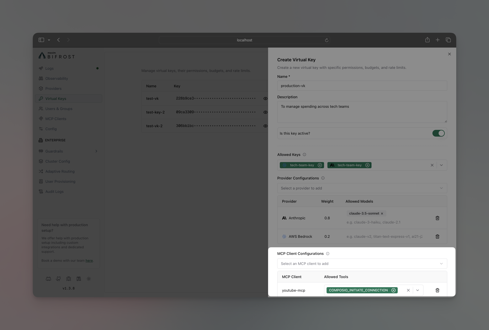

## Overview

MCP Tool Filtering allows you to control which tools are available to AI models on a per-request basis using Virtual Keys (VKs). By configuring a VirtualKey, you can create a strict allow-list of MCP clients and tools, ensuring that only approved tools can be executed.

Make sure you have at least one MCP client set up. Read more about it [here](../../mcp/overview).

## How It Works

The filtering logic is determined by the Virtual Key's configuration:

1.  **No MCP Configuration on Virtual Key (Default)**
    - If a Virtual Key has no specific MCP configurations, all tools from all enabled MCP clients are available by default.
    - In this state, a user can still manually filter tools for a single request by passing the `x-bf-mcp-include-tools` header.

2.  **With MCP Configuration on Virtual Key**
    - When you configure MCP clients on a Virtual Key, its settings take full precedence.
    - Bifrost automatically generates an `x-bf-mcp-include-tools` header based on your VK configuration. This acts as a strict allow-list for the request.
    - This generated header **overrides** any `x-bf-mcp-include-tools` header that might have been sent manually with the request.

For each MCP client associated with a Virtual Key, you can specify the allowed tools:
- **Select specific tools**: Only the chosen tools from that client will be available.
- **Use `*` wildcard**: All available tools from that client will be permitted.
- **Leave tool list empty**: All tools from that client will be **blocked**.
- **Do not configure a client**: All tools from that client will be **blocked** (if other clients are configured).

## Setting MCP Tool Restrictions

<Tabs group="mcp-tool-restrictions">
<Tab title="Web UI">

You can configure which tools a Virtual Key has access to via the UI.

1.  Go to **Virtual Keys** page.
2.  Create/Edit virtual key

3.  In **MCP Client Configurations** section, add the MCP client you want to restrict the VK to
4.  Add the tools you want to restrict the VK to, or leave it blank to allow all tools for this client
5.  Click on the **Save** button

</Tab>
<Tab title="API">

You can configure this via the REST API when creating (`POST`) or updating (`PUT`) a virtual key.

**Create Virtual Key:**
```bash
curl -X POST http://localhost:8080/api/governance/virtual-keys \
  -H "Content-Type: application/json" \
  -d '{
    "name": "vk-for-billing-support",
    "mcp_configs": [
      {
        "mcp_client_name": "billing-client",
        "tools_to_execute": ["check-status"]
      },
      {
        "mcp_client_name": "support-client",
        "tools_to_execute": ["*"]
      }
    ]
  }'
```

**Update Virtual Key:**
```bash
curl -X PUT http://localhost:8080/api/governance/virtual-keys/{vk_id} \
  -H "Content-Type: application/json" \
  -d '{
    "mcp_configs": [
      {
        "mcp_client_name": "billing-client",
        "tools_to_execute": ["check-status"]
      },
      {
        "mcp_client_name": "support-client",
        "tools_to_execute": ["*"]
      }
    ]
  }'
```

**Behavior:**
- The virtual key can only access the `check-status` tool from `billing-client`.
- It can access all tools from `support-client`.
- Any other MCP client is implicitly blocked for this key.

</Tab>

<Tab title="config.json">

You can also define MCP tool restrictions directly in your `config.json` file. The `mcp_configs` array under a virtual key should reference the MCP client by name.

```json
{
  "governance": {
    "virtual_keys": [
      {
        "id": "vk-billing-support-only",
        "name": "VK for Billing and Support",
        "mcp_configs": [
          {
            "mcp_client_name": "billing-client",
            "tools_to_execute": ["check-status"]
          },
          {
            "mcp_client_name": "support-client",
            "tools_to_execute": ["*"]
          }
        ]
      }
    ]
  }
}
```
</Tab>
</Tabs>

## Example Scenario

**Available MCP Clients & Tools:**
- **`billing-client`**: with tools `[create-invoice, check-status]`
- **`support-client`**: with tools `[create-ticket, get-faq]`

<Tabs>
<Tab title="VK with Full Access">
**Configuration:**
- `billing-client` -> Allowed Tools: `[*]` (wildcard)
- `support-client` -> Allowed Tools: `[*]` (wildcard)

**Result:**
A request with this Virtual Key can access all four tools: `create-invoice`, `check-status`, `create-ticket`, and `get-faq`.

</Tab>
<Tab title="VK with Partial Access">
**Configuration:**
- `billing-client` -> Allowed Tools: `[check-status]`
- `support-client` -> Not configured

**Result:**
A request with this Virtual Key can only access the `check-status` tool. All other tools are blocked.

</Tab>
<Tab title="VK with No Tools">
**Configuration:**
- `billing-client` -> Allowed Tools: `[]` (empty list)

**Result:**
A request with this Virtual Key cannot access any tools. All tools from all clients are blocked.
</Tab>
</Tabs>

<Note>
When a Virtual Key has MCP configurations, it dynamically generates the `x-bf-mcp-include-tools` header. This ensures that the VK's rules are always enforced and will override any manual header sent by the user. Though you can still use `x-bf-mcp-include-clients` header to filter the MCP clients per request.
</Note>