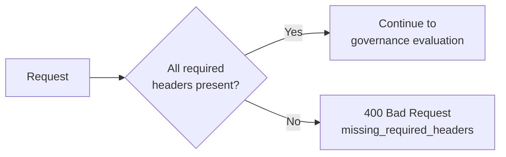
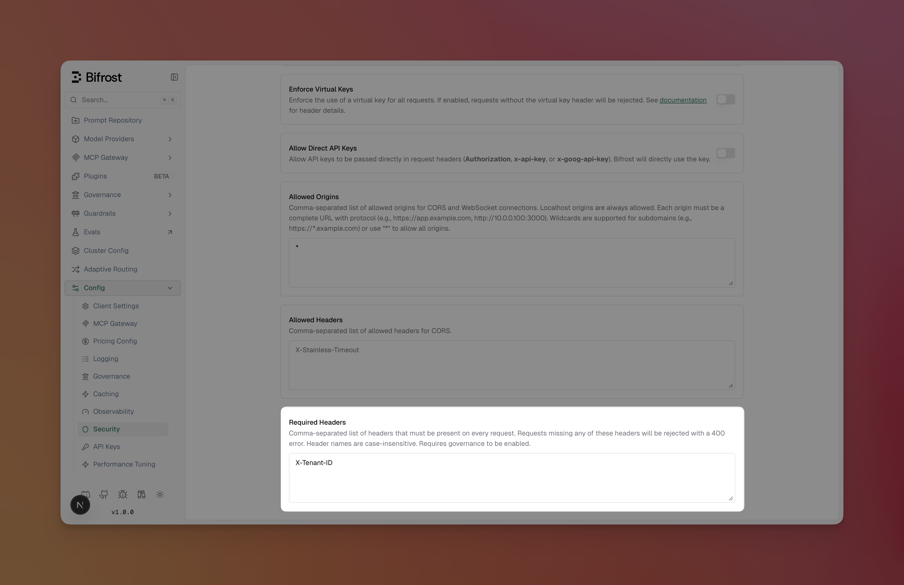

## Overview

Required headers let you enforce that specific HTTP headers are present on every LLM and MCP request passing through Bifrost. If a request is missing any required header, the governance plugin rejects it with a **400 Bad Request** error before it reaches the provider.

This is useful for:
- **Tenant isolation** - Require `X-Tenant-ID` to identify the calling tenant
- **Audit trails** - Require `X-Correlation-ID` for request tracing across services
- **Custom routing metadata** - Require headers your infrastructure depends on

<Note>
Required headers validation requires **governance to be enabled**. The check runs in both `PreLLMHook` and `PreMCPHook`, so it applies to all inference and MCP tool execution requests.
</Note>

Header matching is **case-insensitive** — configuring `X-Tenant-ID` will match `x-tenant-id`, `X-TENANT-ID`, or any other casing.

---

## How it works



When a request arrives:
1. The HTTP transport middleware stores all request headers in the Bifrost context (lowercased keys)
2. The governance plugin's `PreLLMHook` / `PreMCPHook` checks for each required header
3. If any are missing, the request is rejected immediately with a `400` status and a JSON error listing the missing headers

**Example error response:**
```json
{
  "error": {
    "message": "missing required headers: x-tenant-id, x-correlation-id",
    "type": "missing_required_headers"
  }
}
```

---

## Configuration

<Tabs group="config-method">
<Tab title="Web UI">

1. Navigate to **Config** > **Security Settings**
2. Ensure **Governance** is enabled (the required headers section only appears when governance is active)
3. Scroll to **Required Headers**



4. Enter a comma-separated list of header names (e.g., `X-Tenant-ID, X-Correlation-ID`)
5. Click **Save Changes**

Changes take effect immediately — no restart required.

</Tab>
<Tab title="API">

Include `required_headers` in the `client_config` when updating the configuration:

```bash
curl -X PUT http://localhost:8080/api/config \
  -H "Content-Type: application/json" \
  -d '{
    "client_config": {
      "required_headers": ["X-Tenant-ID", "X-Correlation-ID"]
    }
  }'
```

To clear required headers, pass an empty array:

```bash
curl -X PUT http://localhost:8080/api/config \
  -H "Content-Type: application/json" \
  -d '{
    "client_config": {
      "required_headers": []
    }
  }'
```

</Tab>
<Tab title="config.json">

Add `required_headers` to the `client` section:

```json
{
  "client": {    
    "required_headers": ["X-Tenant-ID", "X-Correlation-ID"]
  }
}
```

| Field | Type | Required | Description |
|-------|------|----------|-------------|
| `required_headers` | `string[]` | No | List of header names that must be present on every request. Case-insensitive. |

</Tab>
</Tabs>

---

## Examples

### Requiring a tenant header

Configure a single required header to enforce tenant identification:

```json
{
  "client": {
    "required_headers": ["X-Tenant-ID"]
  }
}
```

**Valid request:**
```bash
curl http://localhost:8080/v1/chat/completions \
  -H "Content-Type: application/json" \
  -H "X-Tenant-ID: tenant-123" \
  -d '{"model": "gpt-4o", "messages": [{"role": "user", "content": "Hello"}]}'
```

**Rejected request** (missing header):
```bash
curl http://localhost:8080/v1/chat/completions \
  -H "Content-Type: application/json" \
  -d '{"model": "gpt-4o", "messages": [{"role": "user", "content": "Hello"}]}'
# → 400: missing required headers: x-tenant-id
```

### Combining with virtual keys

Required headers work alongside virtual key enforcement. When both are configured, the governance plugin checks required headers first, then validates the virtual key:

```json
{
  "client": {
    "enforce_governance_header": true,
    "required_headers": ["X-Tenant-ID"]
  }
}
```

A request must include **both** the virtual key header and `X-Tenant-ID` to pass governance.

---

## Next steps

- **[Virtual Keys](./virtual-keys)** - Set up access control with virtual keys
- **[Budget and Limits](./budget-and-limits)** - Configure budgets and rate limits
- **[Routing](./routing)** - Route requests based on headers and other criteria
