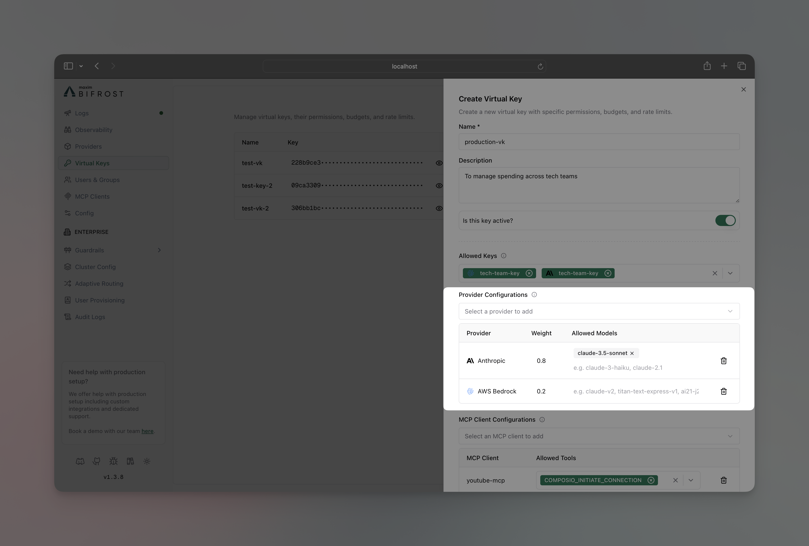
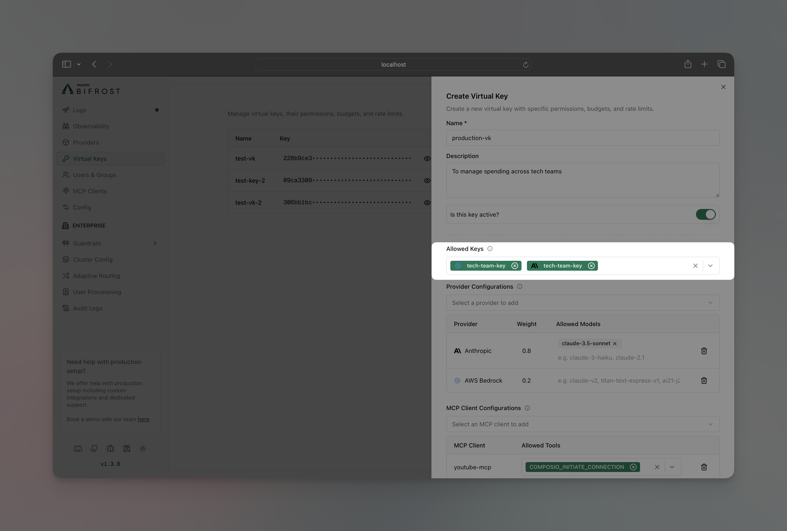

<Info>
**Looking for comprehensive provider routing documentation?**

For a detailed guide covering governance-based routing, adaptive load balancing, Model Catalog, and how they interact, see the [**Provider Routing Guide**](/providers/provider-routing).

This page focuses specifically on configuring governance routing via Virtual Keys.
</Info>

## Overview

Bifrost's governance-based routing capabilities offer granular control over how requests are directed to different AI models and providers through Virtual Key configuration. By configuring routing rules on a Virtual Key, you can enforce which providers and models are accessible, implement weighted load balancing strategies, create automatic fallbacks, and restrict access to specific provider API keys.

This powerful feature enables key use cases like:

- **Resilience & Failover**: Automatically fall back to a secondary provider if the primary one fails.
- **Environment Separation**: Dedicate specific virtual keys to development, testing, and production environments with different provider and key access.
- **Cost Management**: Route traffic to cheaper models or providers based on weights to optimize costs.
- **Fine-grained Access Control**: Ensure that different teams or applications only use the models and API keys they are explicitly permitted to.

## Provider/Model Restrictions

Virtual Keys can be restricted to use only specific provider/models. When provider/model restrictions are configured, the VK can only access those designated provider/models, providing fine-grained control over which provider/models different users or applications can utilize.

**How It Works:**
- **No Restrictions** (default): VK can use any available provider/models based on global configuration
- **With Restrictions**: VK limited to only the specified provider/models with weighted load balancing

**Model Validation:**
When you configure provider restrictions on a Virtual Key, Bifrost validates that the requested model is allowed for the selected provider:
- **Explicit `allowed_models`**: If you specify models in the provider config, only those models are permitted
- **Empty `allowed_models`**: Bifrost uses the **Model Catalog** (populated from pricing data + list models API) to determine which models the provider supports
- **Model Catalog Sync**: On startup and provider updates, Bifrost calls each provider's list models API. If this fails, you'll see a warning: `{"level":"warn","message":"failed to list models for provider <name>: failed to execute HTTP request to provider API"}`

<Note>
**Cross-provider routing does NOT happen automatically**. For example, requests for `gpt-4o` will NOT be routed to Anthropic unless you explicitly add `"gpt-4o"` to Anthropic's `allowed_models` in the Virtual Key configuration. Each provider only handles models it actually supports (determined by the Model Catalog).
</Note>

## Weighted Load Balancing

When you configure multiple providers on a Virtual Key, Bifrost automatically implements weighted load balancing. Each provider is assigned a weight, and requests are distributed proportionally.

**Example Configuration:**
```
Virtual Key: vk-prod-main
├── OpenAI
│   ├── Allowed Models: [gpt-4o, gpt-4o-mini]  ← Explicit whitelist
│   └── Weight: 0.2 (20% of traffic)
└── Azure
    ├── Allowed Models: [gpt-4o]  ← Explicit whitelist
    └── Weight: 0.8 (80% of traffic)
```

**Load Balancing Behavior:**
- For `gpt-4o`: 80% Azure, 20% OpenAI (both providers have it in allowed_models)
- For `gpt-4o-mini`: 100% OpenAI (only OpenAI has it in allowed_models)
- For `claude-3-sonnet`: ❌ Rejected (neither provider has it in allowed_models)

**Usage:**
To trigger weighted load balancing, send requests with just the model name:
```bash
curl -X POST http://localhost:8080/v1/chat/completions \
  -H "x-bf-vk: vk-prod-main" \
  -d '{"model": "gpt-4o", "messages": [{"role": "user", "content": "Hello!"}]}'
```

To bypass load balancing and target a specific provider:
```bash
curl -X POST http://localhost:8080/v1/chat/completions \
  -H "x-bf-vk: vk-prod-main" \
  -d '{"model": "openai/gpt-4o", "messages": [{"role": "user", "content": "Hello!"}]}'
```

<Info>
Weights are automatically normalized to a sum 1.0 based on the weights of all providers available on the VK for the given model.
</Info>

**Example with Empty `allowed_models` (using Model Catalog):**
```json
{
  "provider_configs": [
    {
      "provider": "openai",
      "allowed_models": [],  // Uses Model Catalog
      "weight": 0.5
    },
    {
      "provider": "anthropic",
      "allowed_models": [],  // Uses Model Catalog
      "weight": 0.5
    }
  ]
}
```
With this configuration:
- Request for `gpt-4o` → Routed to OpenAI (Model Catalog shows OpenAI supports this)
- Request for `claude-3-sonnet` → Routed to Anthropic (Model Catalog shows Anthropic supports this)
- Request for `gpt-4o` will NOT route to Anthropic (Model Catalog shows Anthropic doesn't support OpenAI models)

## Automatic Fallbacks

When multiple providers are configured on a Virtual Key, Bifrost automatically creates fallback chains for resilience. This feature provides automatic failover without manual intervention.

**How It Works:**
- **Only activated when**: Your request has no existing `fallbacks` array in the request body
- **Fallback creation**: Providers are sorted by weight (highest first) and added as fallbacks
- **Respects existing fallbacks**: If you manually specify fallbacks, they are preserved

**Example Request Flow:**
1. Primary request goes to weighted-selected provider (e.g., Azure with 80% weight)
2. If Azure fails, automatically retry with OpenAI
3. Continue until success or all providers exhausted

**Request with automatic fallbacks:**
```bash
# This request will get automatic fallbacks
curl -X POST http://localhost:8080/v1/chat/completions \
  -H "x-bf-vk: vk-prod-main" \
  -d '{"model": "gpt-4o", "messages": [{"role": "user", "content": "Hello!"}]}'
```

**Request with manual fallbacks (no automatic fallbacks added):**
```bash
# This request keeps your specified fallbacks
curl -X POST http://localhost:8080/v1/chat/completions \
  -H "x-bf-vk: vk-prod-main" \
  -d '{
    "model": "gpt-4o", 
    "messages": [{"role": "user", "content": "Hello!"}],
    "fallbacks": ["anthropic/claude-3-sonnet-20240229"]
  }'
```

## Setting Provider/Model Routing

<Tabs group="provider-model-restrictions">
<Tab title="Web UI">

1. Go to **Virtual Keys**
2. Create/Edit virtual key



3. In **Provider Configurations** section, add the provider you want to restrict the VK to
4. **Allowed Models**:
   - **Specify models**: Enter specific models (e.g., `["gpt-4o", "gpt-4o-mini"]`) to explicitly whitelist only those models
   - **Leave blank**: Uses the Model Catalog to determine which models this provider supports (populated from pricing data and the provider's list models API)
5. Add the weight you want to give to this provider
6. Click on the **Save** button
</Tab>

<Tab title="API">

```bash
curl -X PUT http://localhost:8080/api/governance/virtual-keys/{vk_id} \
  -H "Content-Type: application/json" \
  -d '{
    "provider_configs": [
      {
        "provider": "openai",
        "allowed_models": ["gpt-4o", "gpt-4o-mini"],
        "weight": 0.2
      },
      {
        "provider": "azure",
        "allowed_models": ["gpt-4o"],
        "weight": 0.8
      }
    ]
  }'
```

</Tab>

<Tab title="config.json">

```json
{
  "governance": {
    "virtual_keys": [
      {
        "id": "vk-prod-main",
        "provider_configs": [
          {
            "provider": "openai",
            "allowed_models": ["gpt-4o", "gpt-4o-mini"],
            "weight": 0.2
          },
          {
            "provider": "azure",
            "allowed_models": ["gpt-4o"],
            "weight": 0.8
          }
        ]
      }
    ]
  }
}
```

</Tab>

</Tabs>

## API Key Restrictions

Virtual Keys can be restricted to use only specific provider API keys. When key restrictions are configured, the VK can only access those designated keys, providing fine-grained control over which API keys different users or applications can utilize.

**How It Works:**
- **No Restrictions** (default): VK can use any available provider keys based on load balancing
- **With Restrictions**: VK limited to only the specified key IDs, regardless of other available keys

**Example Scenario:**
```
Available Provider Keys:
├── key-prod-001 → sk-prod-key... (Production OpenAI key)
├── key-dev-002  → sk-dev-key...  (Development OpenAI key)  
└── key-test-003 → sk-test-key... (Testing OpenAI key)

Virtual Key Restrictions:
├── vk-prod-main
│   ├── Allowed Models: [gpt-4o]
│   └── Restricted Keys: [key-prod-001] ← ONLY production key
├── vk-dev-main  
│   ├── Allowed Models: [gpt-4o-mini]
│   └── Restricted Keys: [key-dev-002, key-test-003] ← Dev + test keys
└── vk-unrestricted
    ├── Allowed Models: [all models]
    └── Restricted Keys: [] ← Can use ANY available key
```

**Request Behavior:**
```bash
# Production VK - will ONLY use key-prod-001
curl -X POST http://localhost:8080/v1/chat/completions \
  -H "x-bf-vk: vk-prod-main" \
  -d '{"model": "gpt-4o", "messages": [{"role": "user", "content": "Hello!"}]}'

# Development VK - will load balance between key-dev-002 and key-test-003
curl -X POST http://localhost:8080/v1/chat/completions \
  -H "x-bf-vk: vk-dev-main" \
  -d '{"model": "gpt-4o-mini", "messages": [{"role": "user", "content": "Hello!"}]}'

# VK with no key restrictions - can use any available OpenAI key
curl -X POST http://localhost:8080/v1/chat/completions \
  -H "x-bf-vk: vk-unrestricted" \
  -d '{"model": "gpt-4o-mini", "messages": [{"role": "user", "content": "Hello!"}]}'
```

**Setting API Key Restrictions:**

<Tabs group="api-key-restrictions">
<Tab title="Web UI">

1. Go to **Virtual Keys**
2. Create/Edit virtual key



3. In **Allowed Keys** section, select the API key you want to restrict the VK to
4. Click on the **Save** button

</Tab>

<Tab title="API">

```bash
curl -X PUT http://localhost:8080/api/governance/virtual-keys/{vk_id} \
  -H "Content-Type: application/json" \
  -d '{
    "key_ids": ["key-prod-001"]
  }'
```

</Tab>

<Tab title="config.json">

```json
{
  "governance": {
    "virtual_keys": [
      {
        "id": "vk-prod-main",
        "provider_configs": [
          {
            "provider": "openai",
            "allowed_keys": [
              "key-prod-001"
            ]
          }
        ]
      }
    ]
  }
}
```

</Tab>

</Tabs>

**Use Cases:**
- **Environment Separation** - Production VKs use production keys, dev VKs use dev keys
- **Cost Control** - Different teams use keys with different billing accounts
- **Access Control** - Restrict sensitive keys to specific VKs only
- **Compliance** - Ensure certain workloads only use compliant/audited keys

<Note>The models restrictions applied on the keys of individual providers will always be applied and will work together with the provider/model or api key restrictions set on the virtual key.</Note>

## Troubleshooting

### Model Catalog Sync Failures

If you see warnings like this in your Bifrost logs during startup or provider updates:
```json
{"level":"warn","time":"2026-01-13T14:18:53+05:30","message":"failed to list models for provider ollama: failed to execute HTTP request to provider API"}
```

**What this means:**
- Bifrost attempted to call the provider's list models API to populate the Model Catalog
- The request failed (network issue, provider unavailable, incorrect credentials, etc.)
- If your Virtual Key has `allowed_models: []` (empty) for this provider, model validation will fall back to the pricing data only

**How to fix:**
1. Check that the provider is correctly configured and accessible
2. Verify network connectivity to the provider's API
3. Ensure API credentials are valid
4. Consider using explicit `allowed_models` instead of relying on the Model Catalog for critical providers