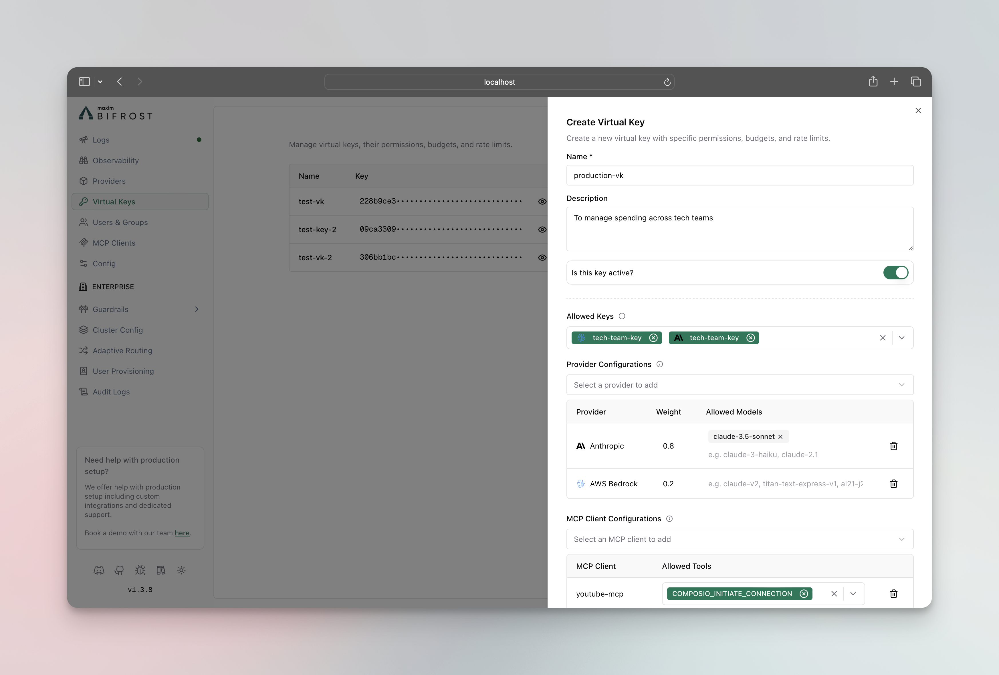
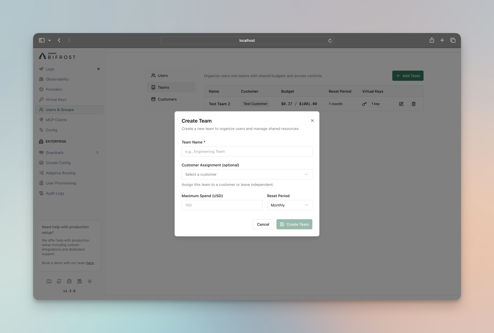
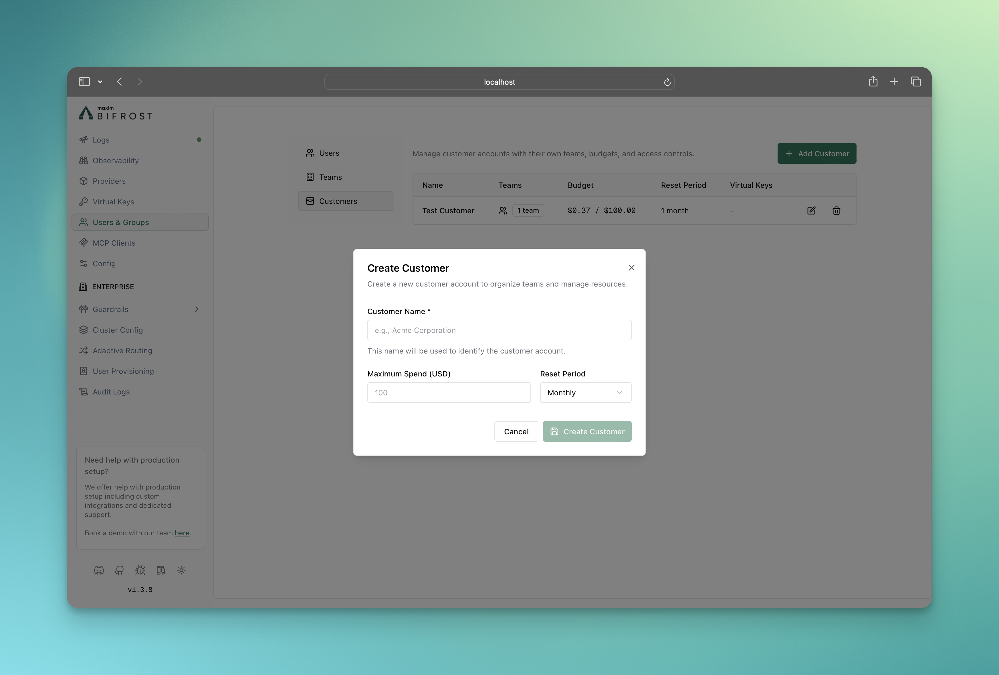
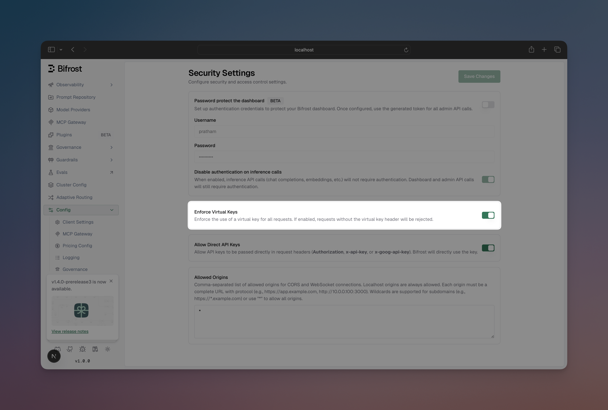
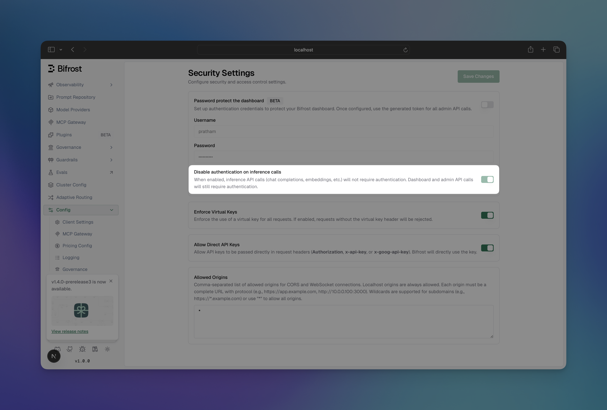

## Overview

Virtual Keys are the primary governance entity in Bifrost. Users and applications authenticate using the given headers to access virtual keys and get specific access permissions, budgets, and rate limits.

**Allowed Headers:**
- `x-bf-vk` - Virtual key header, eg. `sk-bf-*`
- `Authorization` - Authorization header, eg. `Bearer sk-bf-*` (OpenAI style)
- `x-api-key` - API key header, eg. `sk-bf-*` (Anthropic style)
- `x-goog-api-key` - API key header, eg. `sk-bf-*` (Google Gemini style)

<Note>Old virtual keys(without `sk-bf-*` prefix) are only supported by `x-bf-vk` header.</Note>

<Info>You can also use `Authorization`, `x-api-key` and `x-goog-api-key` headers to pass direct keys to the provider. Read more about it in [Direct Key Bypass](../keys-management#direct-key-bypass).</Info>

**Key Features:**
- **Access Control** - Model and provider filtering
- **Cost Management** - Independent budgets (checked along with team/customer budgets if attached)
- **Rate Limiting** - Token and request-based throttling (VK-level only)
- **Key Restrictions** - Limit VK to specific provider API keys (if configured, VK can only use those keys)
- **Exclusive Attachment** - Belongs to either one team OR one customer OR neither (mutually exclusive)
- **Active/Inactive Status** - Enable/disable access instantly

## Configuration

<Tabs group="config-method">
<Tab title="Web UI">

1. Go to **Virtual Keys**
2. Click on **Add Virtual Key** button



**Budget Settings:**
- **Max Limit**: Dollar amount (e.g., `10.50`)
- **Reset Duration**: `1m`, `1h`, `1d`, `1w`, `1M`

**Rate Limits:**
- **Token Limit**: Max tokens per period
- **Request Limit**: Max requests per period
- **Reset Duration**: Reset frequency for each limit

**Associations:**
- **Team**: Assign to existing team (mutually exclusive with customer)
- **Customer**: Assign to existing customer (mutually exclusive with team)

3. Click **Create Virtual Key**

</Tab>
<Tab title="API">

**Create Virtual Key (attached to team):**
```bash
curl -X POST http://localhost:8080/api/governance/virtual-keys \
  -H "Content-Type: application/json" \
  -d '{
    "name": "Engineering Team API",
    "description": "Main API key for engineering team",
    "provider_configs": [
      {
        "provider": "openai",
        "weight": 0.5,
        "allowed_models": ["gpt-4o-mini"]
      },
      {
        "provider": "anthropic",
        "weight": 0.5,
        "allowed_models": ["claude-3-sonnet-20240229"]
      }
    ],
    "team_id": "team-eng-001",
    "budget": {
      "max_limit": 100.00,
      "reset_duration": "1M"
    },
    "rate_limit": {
      "token_max_limit": 10000,
      "token_reset_duration": "1h",
      "request_max_limit": 100,
      "request_reset_duration": "1m"
    },
    "key_ids": ["8c52039e-38c6-48b2-8016-0bd884b7befb"],
    "is_active": true
  }'
```

**Create Virtual Key (directly attached to customer):**
```bash
curl -X POST http://localhost:8080/api/governance/virtual-keys \
  -H "Content-Type: application/json" \
  -d '{
    "name": "Executive API Key",
    "description": "Direct customer-level API access",
    "provider_configs": [
      {
        "provider": "openai",
        "weight": 0.5,
        "allowed_models": ["gpt-4o"]
      },
      {
        "provider": "anthropic",
        "weight": 0.5,
        "allowed_models": ["claude-3-opus-20240229"]
      }
    ],
    "customer_id": "customer-acme-corp",
    "budget": {
      "max_limit": 500.00,
      "reset_duration": "1M"
    },
    "is_active": true
  }'
```

> **Note**: 
> - `team_id` and `customer_id` are mutually exclusive - a VK can only belong to one team OR one customer, not both.
> - `key_ids` restricts the VK to only use those specific provider API keys. Omit this field to allow access to all available keys.

**Update Virtual Key:**
```bash
curl -X PUT http://localhost:8080/api/governance/virtual-keys/{vk_id} \
  -H "Content-Type: application/json" \
  -d '{
    "description": "Updated description",
    "budget": {
      "max_limit": 150.00,
      "reset_duration": "1M"
    }
  }'
```

**Get Virtual Keys:**
```bash
# List all virtual keys
curl http://localhost:8080/api/governance/virtual-keys

# Get specific virtual key
curl http://localhost:8080/api/governance/virtual-keys/{vk_id}
```

**Delete Virtual Key:**
```bash
curl -X DELETE http://localhost:8080/api/governance/virtual-keys/{vk_id}
```

</Tab>
<Tab title="config.json">

```json
{
  "client": {
    "enforce_governance_header": true
  },
  "governance": {
    "virtual_keys": [
      {
        "id": "vk-001",
        "name": "Engineering Team API",
        "value": "vk-engineering-main",
        "description": "Main API key for engineering team",
        "is_active": true,
        "provider_configs": [
          {
            "provider": "openai",
            "weight": 0.5,
            "allowed_models": ["gpt-4o-mini"]
          },
          {
            "provider": "anthropic",
            "weight": 0.5,
            "allowed_models": ["claude-3-sonnet-20240229"]
          }
        ],
        "team_id": "team-eng-001",
        "budget_id": "budget-eng-vk",
        "rate_limit_id": "rate-limit-eng-vk",
        "keys": [
          {"key_id": "8c52039e-38c6-48b2-8016-0bd884b7befb"}
        ]
      },
      {
        "id": "vk-002",
        "name": "Executive API Key", 
        "value": "vk-executive-direct",
        "description": "Direct customer-level API access",
        "is_active": true,
        "provider_configs": [
          {
            "provider": "openai",
            "weight": 0.5,
            "allowed_models": ["gpt-4o"]
          },
          {
            "provider": "anthropic",
            "weight": 0.5,
            "allowed_models": ["claude-3-opus-20240229"]
          }
        ],
        "customer_id": "customer-acme-corp",
        "budget_id": "budget-exec-vk",
        "keys": [
          {"key_id": "8c52039e-38c6-48b2-8016-0bd884b7befb"}
        ]
      }
    ],
    "budgets": [
      {
        "id": "budget-eng-vk",
        "max_limit": 100.00,
        "reset_duration": "1M",
        "current_usage": 0.0,
        "last_reset": "2025-01-01T00:00:00Z"
      },
      {
        "id": "budget-exec-vk",
        "max_limit": 500.00,
        "reset_duration": "1M",
        "current_usage": 0.0,
        "last_reset": "2025-01-01T00:00:00Z"
      }
    ],
    "rate_limits": [
      {
        "id": "rate-limit-eng-vk", 
        "token_max_limit": 10000,
        "token_reset_duration": "1h",
        "token_current_usage": 0,
        "token_last_reset": "2025-01-01T00:00:00Z",
        "request_max_limit": 100,
        "request_reset_duration": "1m",
        "request_current_usage": 0,
        "request_last_reset": "2025-01-01T00:00:00Z"
      }
    ]
  }
}
```

</Tab>
</Tabs>

## User Groups

### Teams

Teams provide organizational grouping for virtual keys with department-level budget management. Teams can belong to one customer and have their own independent budget allocation.

**Key Features:**
- **Organizational Structure** - Group multiple virtual keys
- **Independent Budgets** - Department-level cost control (separate from customer budgets)
- **Customer Association** - Can belong to one customer (optional)
- **No Rate Limits** - Teams cannot have rate limits (VK-level only)

**Configuration**

<Tabs group="config-method">
<Tab title="Web UI">

1. Go to **Users & Groups** → **Teams**

2. Click on **Add Team** button



Fill the form and click on **Create Team** button

3. **Assign Virtual Keys to Team**
   - Go to **Virtual Keys** page
   - Edit the virtual key and assign it to the team
   - Click on **Save** button

</Tab>
<Tab title="API">

**Create Team:**
```bash
curl -X POST http://localhost:8080/api/governance/teams \
  -H "Content-Type: application/json" \
  -d '{
    "name": "Engineering Team",
    "customer_id": "customer-acme-corp",
    "budget": {
      "max_limit": 500.00,
      "reset_duration": "1M"
    }
  }'
```

**Update Team:**
```bash
curl -X PUT http://localhost:8080/api/governance/teams/{team_id} \
  -H "Content-Type: application/json" \
  -d '{
    "name": "Updated Engineering Team",
    "budget": {
      "max_limit": 750.00,
      "reset_duration": "1M"
    }
  }'
```

**Get Teams:**
```bash
# List all teams
curl http://localhost:8080/api/governance/teams

# Get specific team
curl http://localhost:8080/api/governance/teams/{team_id}
```

**Delete Team:**
```bash
curl -X DELETE http://localhost:8080/api/governance/teams/{team_id}
```

</Tab>
<Tab title="config.json">

```json
{
  "governance": {
    "teams": [
      {
        "id": "team-eng-001",
        "name": "Engineering Team",
        "customer_id": "customer-acme-corp",
        "budget_id": "budget-team-eng"
      },
      {
        "id": "team-sales-001", 
        "name": "Sales Team",
        "customer_id": "customer-acme-corp",
        "budget_id": "budget-team-sales"
      }
    ],
    "budgets": [
      {
        "id": "budget-team-eng",
        "max_limit": 500.00,
        "reset_duration": "1M",
        "current_usage": 0.0,
        "last_reset": "2025-01-01T00:00:00Z"
      },
      {
        "id": "budget-team-sales",
        "max_limit": 250.00,
        "reset_duration": "1M", 
        "current_usage": 0.0,
        "last_reset": "2025-01-01T00:00:00Z"
      }
    ]
  }
}
```

</Tab>
</Tabs>

### Customers

Customers represent the highest level in the governance hierarchy, typically corresponding to organizations or major business units. They provide top-level budget control and organizational structure.

**Key Features:**
- **Top-Level Organization** - Highest hierarchy level
- **Independent Budgets** - Organization-wide cost control (separate from team/VK budgets)
- **Team Management** - Contains multiple teams and direct VKs
- **No Rate Limits** - Customers cannot have rate limits (VK-level only)

**Configuration**

<Tabs group="config-method">
<Tab title="Web UI">

1. Go to **Users & Groups** → **Customers**

2. Click on **Add Customer** button



Fill the form and click on **Create Customer** button

3. **Assign Teams to Customer**
   - Go to **Teams** page
   - Edit the team and assign it to the customer
   - Click on **Save** button

4. **Assign Virtual Keys to Customer**
   - Go to **Virtual Keys** page
   - Edit the virtual key and assign it to the customer
   - Click on **Save** button

</Tab>
<Tab title="API">

**Create Customer:**
```bash
curl -X POST http://localhost:8080/api/governance/customers \
  -H "Content-Type: application/json" \
  -d '{
    "name": "Acme Corporation",
    "budget": {
      "max_limit": 2000.00,
      "reset_duration": "1M"
    }
  }'
```

**Update Customer:**
```bash
curl -X PUT http://localhost:8080/api/governance/customers/{customer_id} \
  -H "Content-Type: application/json" \
  -d '{
    "name": "Acme Corp (Updated)",
    "budget": {
      "max_limit": 2500.00,
      "reset_duration": "1M"
    }
  }'
```

**Get Customers:**
```bash
# List all customers
curl http://localhost:8080/api/governance/customers

# Get specific customer
curl http://localhost:8080/api/governance/customers/{customer_id}
```

**Delete Customer:**
```bash
curl -X DELETE http://localhost:8080/api/governance/customers/{customer_id}
```

</Tab>
<Tab title="config.json">

```json
{
  "governance": {
    "customers": [
      {
        "id": "customer-acme-corp",
        "name": "Acme Corporation",
        "budget_id": "budget-customer-acme"
      },
      {
        "id": "customer-beta-inc",
        "name": "Beta Inc",
        "budget_id": "budget-customer-beta"
      }
    ],
    "budgets": [
      {
        "id": "budget-customer-acme",
        "max_limit": 2000.00,
        "reset_duration": "1M",
        "current_usage": 0.0,
        "last_reset": "2025-01-01T00:00:00Z"
      },
      {
        "id": "budget-customer-beta",
        "max_limit": 1500.00,
        "reset_duration": "1M",
        "current_usage": 0.0,
        "last_reset": "2025-01-01T00:00:00Z"
      }
    ]
  }
}
```

</Tab>
</Tabs>

## Features

- **[Budget and Limits](./budget-and-limits)** - Enterprise-grade budget management and cost control and rate limiting using virtual keys
- **[Routing](./routing)** - Route requests to the appropriate providers/models and restrict api keys using virtual keys
- **[MCP Tool Filtering](./mcp-tools)** - Manage MCP clients/tools for virtual keys


## Usage

### Making Virtual Keys Mandatory

All governance-enabled requests must include the virtual key header:

```bash
curl -X POST http://localhost:8080/v1/chat/completions \
  -H "Content-Type: application/json" \
  -H "x-bf-vk: vk-engineering-main" \
  -d '{
    "model": "gpt-4o-mini",
    "messages": [{"role": "user", "content": "Hello!"}]
  }'
```

By default governance is optional, meaning that if the virtual key header is not present, the request will be allowed but without any governance checks/routing. But you can make it mandatory by enforcing the virtual key header.

<Tabs group="enforce-governance-header">
<Tab title="Web UI">

1. Go to **Config** → **Security**

2. Check the **Enforce Virtual Keys** checkbox



</Tab>
<Tab title="API">
```bash
curl -X PUT http://localhost:8080/api/config \
  -H "Content-Type: application/json" \
  -d '{
    "client_config": {
      "enforce_governance_header": true
    }
  }'
```

</Tab>
<Tab title="config.json">

```json
{
  "client": {
    "enforce_governance_header": true
  }
}
```

</Tab>
</Tabs>

When the governance header is enforced, the request will be rejected if the `x-bf-vk` header is not present.

### Authentication and Virtual Keys

Virtual keys and HTTP authentication are **independent layers** that can work together:

| Layer | Purpose | Headers |
|-------|---------|---------|
| **Authentication** | Validates user identity | `Authorization: Basic/Bearer <credentials>` |
| **Virtual Keys** | Request routing and governance | `x-bf-vk`, `Authorization`[^1], `x-api-key`, `x-goog-api-key` |

[^1]: Authorization can carry virtual keys only when auth is disabled (`disable_auth_on_inference: true`). When auth is enabled, Authorization is consumed by authentication and cannot be used for virtual keys.

**When `disable_auth_on_inference: true` (auth disabled):**

Virtual keys can be passed via any supported header without additional authentication:

```bash
# Using x-bf-vk header
curl -X POST http://localhost:8080/v1/chat/completions \
  -H "x-bf-vk: <VIRTUAL_KEY>" \
  -H "Content-Type: application/json" \
  -d '{"model": "gpt-4o-mini", "messages": [...]}'

# Using Authorization header (OpenAI style)
curl -X POST http://localhost:8080/v1/chat/completions \
  -H "Authorization: Bearer <VIRTUAL_KEY>" \
  -H "Content-Type: application/json" \
  -d '{"model": "gpt-4o-mini", "messages": [...]}'
```

**When `disable_auth_on_inference: false` (auth enabled):**

You must provide both authentication credentials AND the virtual key. Use `x-bf-vk` for the virtual key since the `Authorization` header is used for authentication:

```bash
curl -X POST http://localhost:8080/v1/chat/completions \
  -H "Authorization: Basic <base64-credentials>" \
  -H "x-bf-vk: <VIRTUAL_KEY>" \
  -H "Content-Type: application/json" \
  -d '{"model": "gpt-4o-mini", "messages": [...]}'
```

**Configuring `disable_auth_on_inference`:**

<Tabs group="config-method">
<Tab title="Web UI">

1. Go to **Config** → **Security**
2. Toggle **Disable Auth on Inference** to enable/disable



</Tab>
<Tab title="API">

```bash
curl -X PUT http://localhost:8080/api/config \
  -H "Content-Type: application/json" \
  -d '{
    "auth_config": {
      "disable_auth_on_inference": true
    }
  }'
```

</Tab>
<Tab title="config.json">

```json
{
  "auth_config": {
    "is_enabled": true,
    "disable_auth_on_inference": true
  }
}
```

</Tab>
</Tabs>

### Error Responses

- Virtual Key Not Found (400)
```json
{
  "error": {
    "type": "virtual_key_required",
    "message": "virtual key is missing in headers"
  }
}
```

- Virtual Key Blocked (403)
```json
{
  "error": {
    "type": "virtual_key_blocked", 
    "message": "Virtual key is inactive"
  }
}
```

- Rate Limit Exceeded (429)
```json
{
  "error": {
    "type": "rate_limited",
    "message": "Rate limits exceeded: [token limit exceeded (1500/1000, resets every 1h)]"
  }
}
```

- Token Limit Exceeded (429)
```json
{
  "error": {
    "type": "token_limited",
    "message": "Rate limits exceeded: [token limit exceeded (1500/1000, resets every 1h)]"
  }
}
```

- Request Limit Exceeded (429)
```json
{
  "error": {
    "type": "request_limited", 
    "message": "Rate limits exceeded: [request limit exceeded (101/100, resets every 1m)]"
  }
}
```

- Budget Exceeded (402)
```json
{
  "error": {
    "type": "budget_exceeded",
    "message": "Budget exceeded: VK budget exceeded: 105.50 > 100.00 dollars"
  }
}
```

- Model Not Allowed (403)
```json
{
  "error": {
    "type": "model_blocked",
    "message": "Model 'gpt-4o' is not allowed for this virtual key"
  }
}
```

- Provider Not Allowed (403)
```json
{
  "error": {
    "type": "provider_blocked",
    "message": "Provider 'anthropic' is not allowed for this virtual key"
  }
}
```