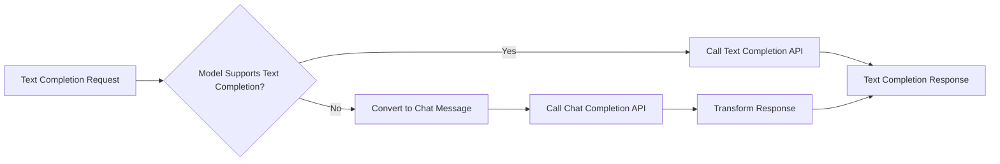

## Compatibility Transformations

The LiteLLM compatibility plugin provides two transformations:

1. **Text-to-Chat Conversion** - Automatically converts text completion requests to chat completion format for models that only support chat APIs
2. **Tool Call Content Fallback** - Populates empty message content from tool call arguments when providers return tool calls without content (e.g., Bedrock)

When either transformation is applied, responses include `extra_fields.litellm_compat: true`.

---

## 1. Text-to-Chat Conversion

Many modern AI models (like GPT-3.5-turbo, GPT-4, Claude, etc.) only support the chat completion API and don't have native text completion endpoints. LiteLLM compatibility mode automatically handles this by:

1. Checking if the model supports text completion natively (using the model catalog)
2. If not supported, converting your text prompt to chat message format
3. Calling the chat completion endpoint internally
4. Transforming the response back to text completion format
5. Returning content in `choices[0].text` instead of `choices[0].message.content`

<Note>
**Smart Conversion**: The conversion only happens when the model doesn't support text completions natively. If a model has native text completion support (like OpenAI's davinci models), Bifrost uses the text completion endpoint directly without any conversion.
</Note>

This allows you to use a unified text completion interface across all providers, even those that only support chat completions.

## How It Works

When LiteLLM compatibility is enabled and you make a text completion request, Bifrost first checks if the model supports text completion:



**Request Transformation:**
- Your text prompt becomes a user message: `{"role": "user", "content": "your prompt"}`
- Parameters like `max_tokens`, `temperature`, `top_p` are mapped to chat equivalents
- Fallbacks are preserved

**Response Transformation:**
- `choices[0].message.content` → `choices[0].text`
- `object: "chat.completion"` → `object: "text_completion"`
- Usage statistics and metadata are preserved

## Enabling LiteLLM Compatibility

<Tabs group="litellm-compat">

<Tab title="Gateway UI">

1. Open the Bifrost dashboard
2. Navigate to **Settings** → **Client Configuration**
3. Enable **LiteLLM Fallbacks**
4. Save your configuration

</Tab>

<Tab title="Configuration File">

```json
{
  "client_config": {
    "enable_litellm_fallbacks": true
  }
}
```

</Tab>

</Tabs>

---

## 2. Tool Call Content Fallback

Some providers (notably Bedrock) return chat responses with `tool_calls` but empty `content`. This can break clients that expect content to always be present.

**When it triggers:**
- Chat response has `tool_calls` in the message
- Message `content` is empty or null

**What it does:**
- Populates `content` with the tool call arguments
- Single tool call: `content` = `function.arguments`
- Multiple tool calls: `content` = arguments joined with newlines
- Original `tool_calls` array is preserved unchanged

**Example transformation:**

Before (from Bedrock):
```json
{
  "choices": [{
    "message": {
      "role": "assistant",
      "content": null,
      "tool_calls": [{
        "id": "call_123",
        "function": {
          "name": "get_weather",
          "arguments": "{\"location\": \"NYC\"}"
        }
      }]
    }
  }]
}
```

After (with LiteLLM compat):
```json
{
  "choices": [{
    "message": {
      "role": "assistant",
      "content": "{\"location\": \"NYC\"}",
      "tool_calls": [{
        "id": "call_123",
        "function": {
          "name": "get_weather",
          "arguments": "{\"location\": \"NYC\"}"
        }
      }]
    }
  }],
  "extra_fields": {
    "litellm_compat": true
  }
}
```

<Note>
This transformation applies to both streaming and non-streaming chat responses. The `tool_calls` array remains unchanged - only the empty `content` field is populated.
</Note>

---

## Supported Providers

LiteLLM compatibility mode works with any provider that supports chat completions but lacks native text completion support:

| Provider | Native Text Completion | LiteLLM Fallback |
|----------|----------------------|------------------|
| OpenAI (GPT-4, GPT-3.5-turbo) | No | Yes |
| Anthropic (Claude) | No | Yes |
| Groq | No | Yes |
| Gemini | No | Yes |
| Mistral | No | Yes |
| Bedrock | Varies by model | Yes |

## Behavior Details

**Model Capability Detection:**
- Bifrost uses the model catalog to check if a model supports text completion
- If the model has a "completion" mode in its pricing data, it supports text completion
- Conversion only happens when the model lacks native text completion support

## Transformations Reference

### Transformation 1: Text-to-Chat Conversion

**Applies to:** Text completion requests on chat-only models

| Phase | Original | Transformed |
|-------|----------|-------------|
| Request | Text prompt (string) | Chat message with `role: "user"` |
| Request | Array prompts | Concatenated into text content blocks |
| Request | `text_completion` request type | `chat_completion` request type |
| Request | `max_tokens`, `temperature`, `top_p` | Mapped to chat equivalents |
| Response | `choices[0].message.content` | `choices[0].text` |
| Response | `object: "chat.completion"` | `object: "text_completion"` |

### Transformation 2: Tool Call Content Fallback

**Applies to:** Chat responses with `tool_calls` but empty content

| Condition | Action |
|-----------|--------|
| Single tool call, empty content | `content` = `function.arguments` |
| Multiple tool calls, empty content | `content` = arguments joined by newlines |
| Content already present | No change |

### Metadata Set on Transformed Responses

When either transformation is applied:

- `extra_fields.litellm_compat`: Set to `true`
- `extra_fields.provider`: The provider that handled the request
- `extra_fields.request_type`: Reflects the original request type
- `extra_fields.model_requested`: The originally requested model

### Error Handling

When errors occur on transformed requests:
- `extra_fields.litellm_compat` is set to `true`
- Original request type and model are preserved in error metadata

## What's Preserved

- Model selection and fallback chain
- Temperature, top_p, max_tokens, and other generation parameters
- Stop sequences and frequency/presence penalties
- Usage statistics and token counts

## When to Use This

**Good Use Cases:**
- Migrating from LiteLLM to Bifrost without code changes
- Maintaining backward compatibility with text completion interfaces
- Using a unified API across providers with different capabilities

**Consider Alternatives When:**
- You need chat-specific features (system messages, conversation history)
- You want explicit control over message formatting
- Performance is critical (direct chat requests avoid conversion overhead)

## Related Features

- [Fallbacks](/features/fallbacks) - Automatic provider failover
- [Drop-in Replacement](/features/drop-in-replacement) - Use existing SDKs with Bifrost
- [LiteLLM Integration](/integrations/litellm-sdk) - Using LiteLLM SDK with Bifrost
