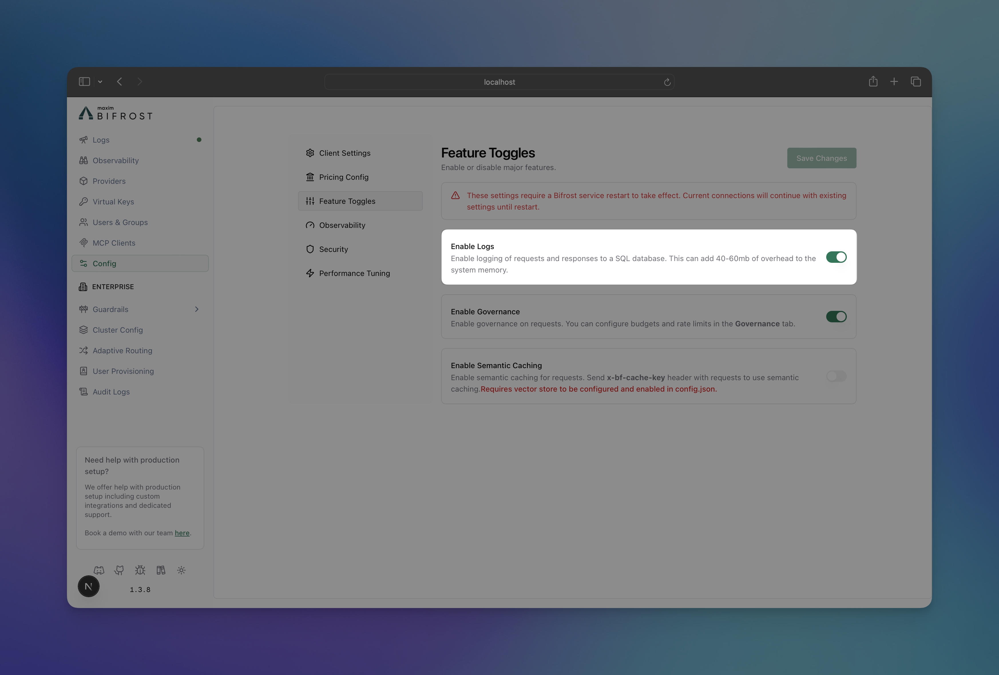
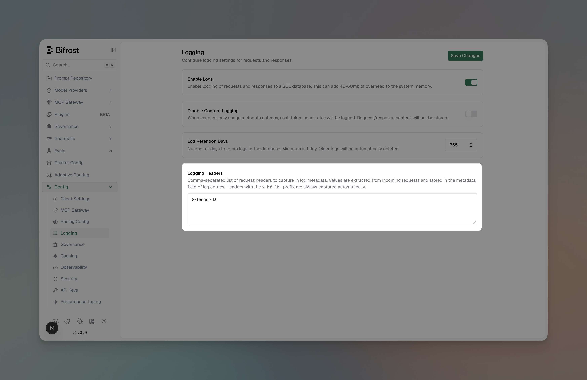

## Overview

Bifrost includes **built-in observability**, a powerful feature that automatically captures and stores detailed information about every AI request and response that flows through your system. This provides structured, searchable data with real-time monitoring capabilities, making it easy to debug issues, analyze performance patterns, and understand your AI application's behavior at scale.

All LLM interactions are captured with comprehensive metadata including inputs, outputs, tokens, costs, and latency. The logging plugin operates **asynchronously** with zero impact on request latency.


---

## What's Captured

Bifrost traces comprehensive information for every request, without any changes to your application code.


### **Request Data**
- **Input Messages**: Complete conversation history and user prompts
- **Model Parameters**: Temperature, max tokens, tools, and all other parameters
- **Provider Context**: Which provider and model handled the request

### **Response Data**
- **Output Messages**: AI responses, tool calls, and function results
- **Performance Metrics**: Latency and token usage
- **Status Information**: Success or error details

### **Custom Metadata**
- **Logging Headers**: Capture configured request headers (e.g., `X-Tenant-ID`) into log metadata
- **Ad-hoc Headers**: Any `x-bf-lh-*` prefixed header is automatically captured into metadata
- See [Logging Headers](#logging-headers) below for full details

### **Multimodal & Tool Support**
- **Audio Processing**: Speech synthesis and transcription inputs/outputs
- **Vision Analysis**: Image URLs and vision model responses
- **Tool Execution**: Function calling arguments and results


---

## How It Works

The logging plugin intercepts all requests flowing through Bifrost using the plugin architecture, ensuring your LLM requests maintain optimal performance:

1. **PreLLMHook**: Captures request metadata (provider, model, input messages, parameters).
2. **Async Processing**: Logs are written in background goroutines with `sync.Pool` optimization.
3. **PostLLMHook**: Updates log entry with response data (output, tokens, cost, latency, errors).
4. **Real-time Updates**: WebSocket broadcasts keep the UI synchronized.

All logging operations are non-blocking, ensuring your LLM requests maintain optimal performance.

---

## Configuration

Configure request tracing to control what gets logged and where it's stored.

<Tabs group="tracing-config">

<Tab title="Using Web UI">



1. Navigate to **http://localhost:8080**
2. Go to **"Settings"**
3. Toggle **"Enable Logs"** 

</Tab>

<Tab title="Using API">

**Enable/Disable Tracing:**
```bash
curl --location 'http://localhost:8080/api/config' \
--header 'Content-Type: application/json' \
--method PUT \
--data '{
    "client_config": {
        "enable_logging": true,
        "disable_content_logging": false,
        "drop_excess_requests": false,
        "initial_pool_size": 300,
        "enable_governance": true,
        "enforce_governance_header": false,
        "allow_direct_keys": false,
        "prometheus_labels": [],
        "allowed_origins": []
    }
}'
```

**Check Current Configuration:**
```bash
curl --location 'http://localhost:8080/api/config'
```

**Response includes tracing status:**
```json
{
    "client_config": {
        "enable_logging": true,
        "disable_content_logging": false,
        "drop_excess_requests": false
    },
    "is_db_connected": true,
    "is_cache_connected": true, 
    "is_logs_connected": true
}
```

</Tab>

<Tab title="Using config.json">

In your `config.json` file, you can enable logging and configure the log store:
```json
{
    "client": {
        "enable_logging": true,
        "disable_content_logging": false,
        "drop_excess_requests": false,
        "initial_pool_size": 300,
        "enable_governance": true,
        "allow_direct_keys": false
    },
    "logs_store": {
        "enabled": true,
        "type": "sqlite",
        "config": {
            "path": "./logs.db"
        }
    }
}
```
- **`enable_logging`**: Master toggle for request tracing.
- **`disable_content_logging`**: Disable logging of request/response content, but still log usage metadata (latency, cost, token count, etc.).
- **`logs_store`**: Check [Log Store Options](#log-store-options) for more details.

</Tab>

<Tab title="Using Go SDK">

When using Bifrost as a Go SDK, initialize the logging plugin manually:

```go
package main

import (
    "context"
    bifrost "github.com/maximhq/bifrost/core"
    "github.com/maximhq/bifrost/core/schemas"
    "github.com/maximhq/bifrost/framework/logstore"
    "github.com/maximhq/bifrost/framework/pricing"
    "github.com/maximhq/bifrost/plugins/logging"
)

func main() {
    ctx := context.Background()
    logger := schemas.NewLogger()
    
    // Initialize log store (SQLite)
    store, err := logstore.NewLogStore(ctx, &logstore.Config{
        Enabled: true,
        Type:    logstore.LogStoreTypeSQLite,
        Config: &logstore.SQLiteConfig{
            Path: "./logs.db",
        },
    }, logger)
    if err != nil {
        panic(err)
    }
    
    // Initialize pricing manager (required for cost calculation)
    pricingManager := pricing.NewPricingManager(logger)
    
    // Initialize logging plugin
    loggingPlugin, err := logging.Init(ctx, logger, store, pricingManager)
    if err != nil {
        panic(err)
    }
    
    // Initialize Bifrost with logging plugin
    client, err := bifrost.Init(ctx, schemas.BifrostConfig{
        Account: &yourAccount,
        LLMPlugins: []schemas.LLMPlugin{loggingPlugin},
    })
    if err != nil {
        panic(err)
    }
    defer client.Shutdown()
    
    // All requests are now logged automatically
}
```

</Tab>

</Tabs>

---

## Accessing & Filtering Logs

Retrieve and analyze logs with powerful filtering capabilities via the UI, API, and WebSockets.


### Web UI

When running the Gateway, access the built-in dashboard at `http://localhost:8080`. The UI provides:
- Real-time log streaming
- Advanced filtering and search
- Detailed request/response inspection
- Token and cost analytics

### API Endpoints

Query logs programmatically using the `GET` request.

```bash
curl 'http://localhost:8080/api/logs?' \
'providers=openai,anthropic&' \
'models=gpt-4o-mini&' \
'status=success,error&' \
'start_time=2024-01-15T00:00:00Z&' \
'end_time=2024-01-15T23:59:59Z&' \
'min_latency=1000&' \
'max_latency=5000&' \
'min_tokens=10&' \
'max_tokens=1000&' \
'min_cost=0.001&' \
'max_cost=10&' \
'content_search=python&' \
'limit=100&' \
'offset=0'
```
**Available Filters:**

| Filter | Description | Example |
|--------|-------------|---------|
| `providers` | Filter by AI providers | `openai,anthropic` |
| `models` | Filter by specific models | `gpt-4o-mini,claude-3-sonnet` |
| `status` | Request status | `success,error,processing` |
| `objects` | Request types | `chat.completion,embedding` |
| `start_time` / `end_time` | Time range (RFC3339) | `2024-01-15T10:00:00Z` |
| `min_latency` / `max_latency` | Response time (ms) | `1000` to `5000` |
| `min_tokens` / `max_tokens` | Token usage range | `10` to `1000` |
| `min_cost` / `max_cost` | Cost range (USD) | `0.001` to `10` |
| `content_search` | Search in messages | `"error handling"` |
| `limit` / `offset` | Pagination | `100`, `200` |

**Response Format**

```json
{
    "logs": [...],
    "pagination": {
        "limit": 100,
        "offset": 0,
        "sort_by": "timestamp",
        "order": "desc"
    },
    "stats": {
        "total_requests": 1234,
        "success_rate": 0.85,
        "average_latency": 100,
        "total_tokens": 10000,
        "total_cost": 100
    }
}
```

Perfect for analytics, debugging specific issues, or building custom monitoring dashboards.

### WebSocket

Subscribe to real-time log updates for live monitoring:

```javascript
const ws = new WebSocket('ws://localhost:8080/ws')

ws.onmessage = (event) => {
  const logUpdate = JSON.parse(event.data)
  console.log('New log entry:', logUpdate)
}
```

---

## Log Store Options

Choose the right storage backend for your scale and requirements.

The logging plugin is **automatically enabled** in Gateway mode with SQLite storage by default. You can configure it to use PostgreSQL by setting the `logs_store` configuration in your `config.json` file.

### **Current Support**

<Tabs group="log-store-types">
<Tab title="SQLite (Default)">

- **Best for**: Development, small-medium deployments
- **Performance**: Excellent for read-heavy workloads
- **Setup**: Zero configuration, single file storage
- **Limits**: Single-writer, local filesystem only

```json
{
    "logs_store": {
        "enabled": true,
        "type": "sqlite",
        "config": {
            "path": "./logs.db"
        }
    }
}
```

</Tab>
<Tab title="PostgreSQL">

- **Best for**: High-volume production deployments
- **Performance**: Excellent concurrent writes and complex queries
- **Features**: Advanced indexing, partitioning, replication

```json
{
    "logs_store": {
        "enabled": true,
        "type": "postgres",
        "config": {
            "host": "localhost",
            "port": "5432",
            "user": "bifrost",
            "password": "postgres",
            "db_name": "bifrost",
            "ssl_mode": "disable"
        }
    }
}
```

</Tab>
</Tabs>

### **Planned Support**

- **MySQL**: For traditional MySQL environments.
- **ClickHouse**: For large-scale analytics and time-series workloads.

---

## Supported Request Types

The logging plugin captures all Bifrost request types:

- Text Completion (streaming and non-streaming)
- Chat Completion (streaming and non-streaming)
- Responses (streaming and non-streaming)
- Embeddings
- Speech Generation (streaming and non-streaming)
- Transcription (streaming and non-streaming)

---

## Logging Headers

Capture specific HTTP request headers into the **metadata** field of every LLM and MCP log entry. This enables request tracing, tenant identification, and custom debugging without modifying your application code.

### How It Works

There are two ways headers get captured into log metadata:

**1. Configured Logging Headers** — Define a list of header names in the configuration. The logging plugin looks up each configured header (case-insensitive) and stores its value in the metadata.

**2. `x-bf-lh-*` Prefix (Automatic)** — Any request header with the `x-bf-lh-` prefix is automatically captured into metadata with no configuration needed. The prefix is stripped and the remainder becomes the metadata key.

| Request Header | Metadata Key | Metadata Value |
|----------------|-------------|----------------|
| `x-bf-lh-tenant-id: acme` | `tenant-id` | `acme` |
| `x-bf-lh-env: production` | `env` | `production` |
| `x-bf-lh-region: us-east-1` | `region` | `us-east-1` |

Both methods can be used together — configured headers and `x-bf-lh-*` headers are merged into the same metadata map.

### Configuring Logging Headers

<Tabs group="logging-headers-config">
<Tab title="Web UI">

1. Navigate to **Config** > **Logging**
2. Ensure **Enable Logs** is toggled on
3. Scroll to **Logging Headers**



4. Enter a comma-separated list of header names (e.g., `X-Tenant-ID, X-Correlation-ID`)
5. Click **Save Changes**

Changes take effect immediately — no restart required.

</Tab>
<Tab title="API">

Include `logging_headers` in the `client_config` when updating the configuration:

```bash
curl -X PUT http://localhost:8080/api/config \
  -H "Content-Type: application/json" \
  -d '{
    "client_config": {
      "logging_headers": ["X-Tenant-ID", "X-Correlation-ID"]
    }
  }'
```

</Tab>
<Tab title="config.json">

Add `logging_headers` to the `client` section:

```json
{
  "client": {
    "enable_logging": true,
    "logging_headers": ["X-Tenant-ID", "X-Correlation-ID"]
  }
}
```

| Field | Type | Required | Description |
|-------|------|----------|-------------|
| `logging_headers` | `string[]` | No | List of header names to capture in log metadata. Case-insensitive. No restart required. |

</Tab>
</Tabs>

### Usage Examples

**Configured headers:**

```bash
# Config has: logging_headers: ["X-Tenant-ID", "X-Correlation-ID"]
curl http://localhost:8080/v1/chat/completions \
  -H "Content-Type: application/json" \
  -H "X-Tenant-ID: tenant-123" \
  -H "X-Correlation-ID: req-abc-456" \
  -d '{"model": "gpt-4o", "messages": [{"role": "user", "content": "Hello"}]}'
```

Log metadata: `{"x-tenant-id": "tenant-123", "x-correlation-id": "req-abc-456"}`

**Ad-hoc `x-bf-lh-*` headers (no config needed):**

```bash
curl http://localhost:8080/v1/chat/completions \
  -H "Content-Type: application/json" \
  -H "x-bf-lh-env: production" \
  -H "x-bf-lh-version: v2.1.0" \
  -d '{"model": "gpt-4o", "messages": [{"role": "user", "content": "Hello"}]}'
```

Log metadata: `{"env": "production", "version": "v2.1.0"}`

### Viewing Metadata in the UI

Metadata is displayed in the log detail view for both LLM and MCP logs as individual key-value entries alongside other request details.


### Combining with Required Headers

[Required headers](../governance/required-headers) and logging headers serve different purposes and can be used together:

| Feature | Purpose | Effect on Request |
|---------|---------|-------------------|
| **Required Headers** | Enforce header presence | Rejects request if missing (400) |
| **Logging Headers** | Capture header values | No effect on request — only logs metadata |

A common pattern is to require a header **and** log it:

```json
{
  "client": {
    "enable_governance": true,
    "required_headers": ["X-Tenant-ID"],
    "logging_headers": ["X-Tenant-ID"]
  }
}
```

---

## When to Use

### Built-in Observability

Use the built-in logging plugin for:

- **Local Development**: Quick setup with SQLite, no external dependencies
- **Self-hosted Deployments**: Full control over your data with PostgreSQL
- **Simple Use Cases**: Basic monitoring and debugging needs
- **Privacy-sensitive Workloads**: Keep all logs on your infrastructure

### vs. Maxim Plugin

Switch to the [Maxim plugin](./maxim) for:

- Advanced evaluation and testing workflows
- Prompt engineering and experimentation
- Multi-team governance and collaboration
- Production monitoring with alerts and SLAs
- Dataset management and annotation pipelines

### vs. OTel Plugin

Switch to the [OTel plugin](./otel) for:

- Integration with existing observability infrastructure
- Correlation with application traces and metrics
- Custom collector configurations
- Compliance and enterprise requirements

---

## Performance

The logging plugin is designed for **zero-impact observability**:

- **Async Operations**: All database writes happen in background goroutines
- **Sync.Pool**: Reuses memory allocations for LogMessage and UpdateLogData structs
- **Batch Processing**: Efficiently handles high request volumes
- **Automatic Cleanup**: Removes stale processing logs every 30 seconds

In benchmarks, the logging plugin adds **< 0.1ms overhead** to request processing time.

---

## Next Steps

- **[Maxim Plugin](./maxim)** - Advanced observability with evaluation and monitoring
- **[OTel Plugin](./otel)** - OpenTelemetry integration for distributed tracing
- **[Gateway Setup](../../quickstart/gateway/setting-up)** - Get Bifrost running with tracing enabled
- **[Provider Configuration](../../quickstart/gateway/provider-configuration)** - Configure multiple providers for better insights
- **[Telemetry](../telemetry)** - Prometheus metrics and dashboards
- **[Governance](../governance)** - Virtual keys and usage limits