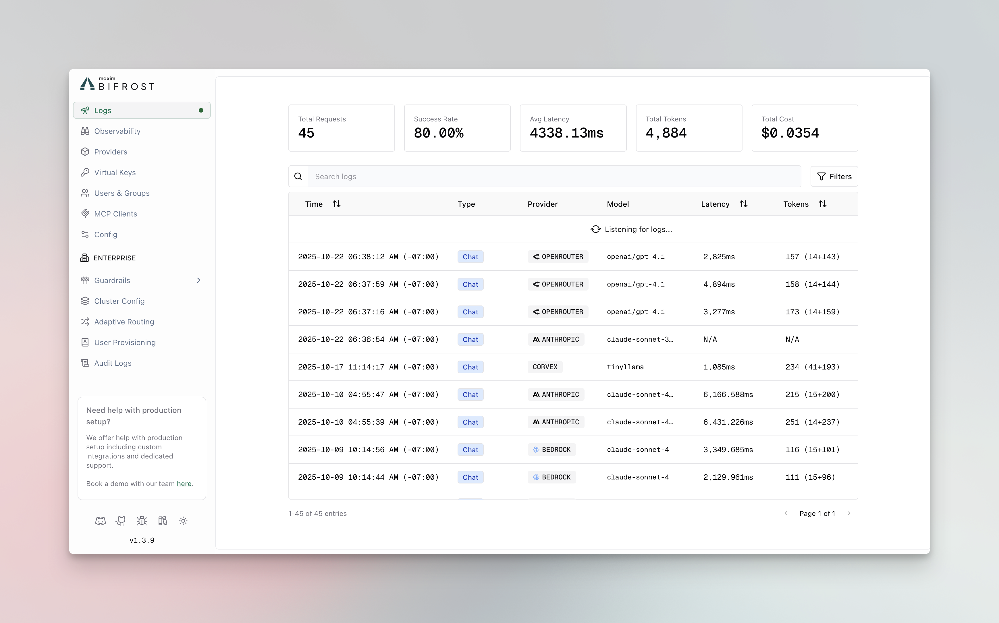
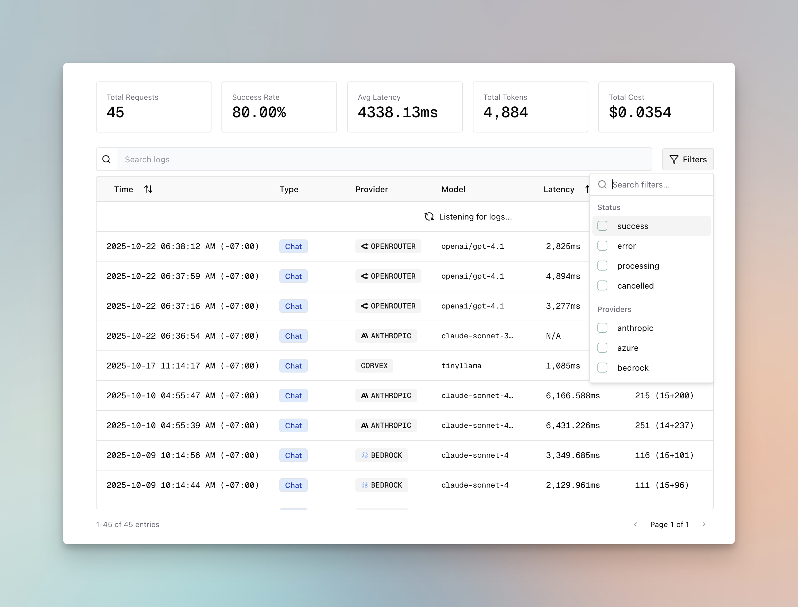

## Overview

Bifrost includes **built-in observability** powered by the logging plugin, providing automatic request/response tracking for local development and self-hosted deployments. All LLM interactions are captured with comprehensive metadata including inputs, outputs, tokens, costs, and latency.



The logging plugin operates **asynchronously** with zero impact on request latency, storing logs in SQLite (for local development) or PostgreSQL/MySQL/Clickhouse (for production deployments).

---

## How It Works

The logging plugin intercepts all requests flowing through Bifrost using the plugin architecture:

1. **PreHook**: Captures request metadata (provider, model, input messages, parameters)
2. **Async Processing**: Logs are written in background goroutines with sync.Pool optimization
3. **PostHook**: Updates log entry with response data (output, tokens, cost, latency, errors)
4. **Real-time Updates**: WebSocket broadcasts keep the UI synchronized

All logging operations are non-blocking, ensuring your LLM requests maintain optimal performance.

---

## Configuration

### Gateway Mode

The logging plugin is **automatically enabled** in Gateway mode with SQLite storage:

<Tabs group="storage-config">
<Tab title="Default (SQLite)">

By default, logs are stored in `~/.bifrost/logs.db`:

```json
{
  "enable_logging": true
}
```

</Tab>
<Tab title="Custom SQLite">

Specify a custom SQLite path:

```json
{
  "enable_logging": true,
  "logs_store": {
    "enabled": true,
    "type": "sqlite",
    "config": {
      "path": "/path/to/custom/logs.db"
    }
  }
}
```

</Tab>
<Tab title="PostgreSQL">

For production deployments, use PostgreSQL:

```json
{
  "enable_logging": true,
  "logs_store": {
    "enabled": true,
    "type": "postgres",
    "config": {
      "host": "localhost",
      "port": "5432",
      "user": "bifrost",
      "password": "your_password",
      "db_name": "bifrost_logs",
      "ssl_mode": "disable"
    }
  }
}
```

</Tab>
</Tabs>

### Go SDK

When using Bifrost as a Go SDK, initialize the logging plugin manually:

```go
package main

import (
    "context"
    bifrost "github.com/maximhq/bifrost/core"
    "github.com/maximhq/bifrost/core/schemas"
    "github.com/maximhq/bifrost/framework/logstore"
    "github.com/maximhq/bifrost/framework/pricing"
    "github.com/maximhq/bifrost/plugins/logging"
)

func main() {
    ctx := context.Background()
    logger := schemas.NewLogger()
    
    // Initialize log store (SQLite)
    store, err := logstore.NewLogStore(ctx, &logstore.Config{
        Enabled: true,
        Type:    logstore.LogStoreTypeSQLite,
        Config: &logstore.SQLiteConfig{
            Path: "./logs.db",
        },
    }, logger)
    if err != nil {
        panic(err)
    }
    
    // Initialize pricing manager (required for cost calculation)
    pricingManager := pricing.NewPricingManager(logger)
    
    // Initialize logging plugin
    loggingPlugin, err := logging.Init(ctx, logger, store, pricingManager)
    if err != nil {
        panic(err)
    }
    
    // Initialize Bifrost with logging plugin
    client, err := bifrost.Init(ctx, schemas.BifrostConfig{
        Account: &yourAccount,
        Plugins: []schemas.Plugin{loggingPlugin},
    })
    if err != nil {
        panic(err)
    }
    defer client.Shutdown()
    
    // All requests are now logged automatically
}
```

---

## Features

### Captured Data

Each log entry includes:

- **Request Metadata**: Provider, model, request type, timestamp
- **Input/Output**: Complete message history, response content, tool calls
- **Performance**: Latency (ms), token usage (prompt/completion/total)
- **Cost**: Calculated cost in dollars based on provider pricing
- **Status**: `processing`, `success`, or `error` with error details
- **Caching**: Semantic cache hit/miss information

### Search & Filtering

Filter logs by multiple criteria:



- **Provider**: Filter by LLM provider (openai, anthropic, etc.)
- **Model**: Filter by specific models (gpt-4, claude-3-opus, etc.)
- **Status**: Filter by success, error, or processing
- **Time Range**: Filter by start/end timestamps
- **Performance**: Filter by latency range (min/max ms)
- **Usage**: Filter by token count or cost range
- **Content**: Full-text search across input/output messages

### Sorting & Pagination

- Sort by: timestamp, latency, tokens, or cost
- Order: ascending or descending
- Paginated results for efficient browsing

### Real-time Updates

Logs appear in the UI immediately via WebSocket connections, perfect for:
- Live debugging during development
- Monitoring streaming requests as they complete
- Tracking token usage and costs in real-time

---

## Accessing Logs

### Web UI

When running the Gateway, access the built-in dashboard:

```bash
# Start Bifrost Gateway
bifrost-http

# Open browser
open http://localhost:8080
```


The UI provides:
- Real-time log streaming
- Advanced filtering and search
- Detailed request/response inspection
- Token and cost analytics

### API Endpoints

Query logs programmatically:

```bash
# Search logs with filters
curl http://localhost:8080/api/logs/search \
  -H "Content-Type: application/json" \
  -d '{
    "filters": {
      "providers": ["openai"],
      "status": ["success"],
      "start_time": "2024-01-01T00:00:00Z"
    },
    "pagination": {
      "limit": 50,
      "offset": 0,
      "sort_by": "timestamp",
      "order": "desc"
    }
  }'

# Get specific log entry
curl http://localhost:8080/api/logs/{request_id}
```

### WebSocket

Subscribe to real-time log updates:

```javascript
const ws = new WebSocket('ws://localhost:8080/ws')

ws.onmessage = (event) => {
  const logUpdate = JSON.parse(event.data)
  console.log('New log entry:', logUpdate)
}
```

---

## Supported Request Types

The logging plugin captures all Bifrost request types:

- Chat Completion (streaming and non-streaming)
- Text Completion (streaming and non-streaming)
- Embeddings
- Speech Generation (streaming and non-streaming)
- Transcription (streaming and non-streaming)

---

## When to Use

### Built-in Observability

Use the built-in logging plugin for:

- **Local Development**: Quick setup with SQLite, no external dependencies
- **Self-hosted Deployments**: Full control over your data with PostgreSQL
- **Simple Use Cases**: Basic monitoring and debugging needs
- **Privacy-sensitive Workloads**: Keep all logs on your infrastructure

### vs. Maxim Plugin

Switch to the [Maxim plugin](./maxim) for:

- Advanced evaluation and testing workflows
- Prompt engineering and experimentation
- Multi-team governance and collaboration
- Production monitoring with alerts and SLAs
- Dataset management and annotation pipelines

### vs. OTel Plugin

Switch to the [OTel plugin](./otel) for:

- Integration with existing observability infrastructure
- Correlation with application traces and metrics
- Custom collector configurations
- Compliance and enterprise requirements

---

## Performance

The logging plugin is designed for **zero-impact observability**:

- **Async Operations**: All database writes happen in background goroutines
- **Sync.Pool**: Reuses memory allocations for LogMessage and UpdateLogData structs
- **Batch Processing**: Efficiently handles high request volumes
- **Automatic Cleanup**: Removes stale processing logs every 30 seconds

In benchmarks, the logging plugin adds **< 0.1ms overhead** to request processing time.

---

## Next Steps

- **[Maxim Plugin](./maxim)** - Advanced observability with evaluation and monitoring
- **[OTel Plugin](./otel)** - OpenTelemetry integration for distributed tracing
- **[Telemetry](../telemetry)** - Prometheus metrics and dashboards
- **[Governance](../governance)** - Virtual keys and usage limits