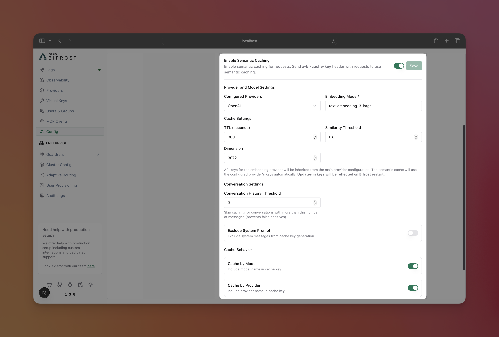

## Overview

Bifrost provides native support for Weaviate as a vector store backend, enabling powerful semantic caching capabilities through vector similarity search. This integration allows you to cache AI responses based on semantic similarity rather than just exact text matches, dramatically reducing costs and improving performance for similar queries.

**Key Benefits:**
- **Semantic Intelligence**: Find cached responses for semantically similar requests
- **Cost Reduction**: Avoid expensive LLM API calls for similar queries
- **Performance Boost**: Sub-millisecond cache retrieval vs multi-second API calls
- **Flexible Matching**: Configurable similarity thresholds for cache lookups
- **Streaming Support**: Full streaming response caching with proper chunk ordering


## Quick Start

### 1. Set Up Weaviate

**Weaviate Cloud:**
- Sign up at [cloud.weaviate.io](https://cloud.weaviate.io)
- Create a new cluster
- Get your API key and cluster URL

### 2. Configure Vector Store

<Tabs group="vector-store-setup">

<Tab title="Go SDK">

```go
import (
    "context"
    "github.com/maximhq/bifrost/framework/vectorstore"
    "github.com/maximhq/bifrost/core/schemas"
)

// Configure Weaviate vector store
vectorConfig := &vectorstore.Config{
    Enabled: true,
    Type:    vectorstore.VectorStoreTypeWeaviate,
    Config: vectorstore.WeaviateConfig{
        Scheme:    "http",           // "http" for local, "https" for cloud
        Host:      "localhost:8080", // Your Weaviate host
        // Optional: API key for cloud deployments
        // ApiKey:  "your-weaviate-api-key",
    },
}

// Create vector store
store, err := vectorstore.NewVectorStore(context.Background(), vectorConfig, logger)
if err != nil {
    log.Fatal("Failed to create vector store:", err)
}
```

</Tab>

<Tab title="config.json">

```json
{
  "vector_store": {
    "enabled": true,
    "type": "weaviate",
    "config": {
      "scheme": "http",
      "host": "localhost:8080"
    }
  }
}
```

**For Weaviate Cloud:**
```json
{
  "vector_store": {
    "enabled": true,
    "type": "weaviate",
    "config": {
      "scheme": "https",
      "host": "your-cluster.weaviate.network",
      "api_key": "your-weaviate-api-key"
    }
  }
}
```

</Tab>

</Tabs>

### 3. Configure Semantic Cache Plugin

<Tabs group="cache-config">

<Tab title="Go SDK">

```go
import (
    "github.com/maximhq/bifrost/plugins/semanticcache"
    "github.com/maximhq/bifrost/core/schemas"
)

// Configure semantic cache plugin with Weaviate backend
cacheConfig := semanticcache.Config{
    CacheKey:    "request-cache-key",     // Required: context key for cache triggering
    CacheTTLKey: "request-cache-ttl",     // Optional: context key for TTL override
    CacheThresholdKey: "request-cache-threshold", // Optional: context key for threshold override
    
    // Embedding model configuration (Required)
    Provider:       schemas.OpenAI,
    Keys:          []schemas.Key{{Value: "sk-..."}},
    EmbeddingModel: "text-embedding-3-small",
    
    // Cache behavior
    TTL:       5 * time.Minute,  // Time to live for cached responses
    Threshold: 0.8,              // Similarity threshold for cache lookup
    
    // Advanced options
    CacheByModel:    bifrost.Ptr(true),  // Include model in cache key
    CacheByProvider: bifrost.Ptr(true),  // Include provider in cache key
    ExcludeSystemPrompt: bifrost.Ptr(false), // Exclude system messages in cache key
}

// Create plugin with vector store
plugin, err := semanticcache.Init(context.Background(), cacheConfig, logger, store)
if err != nil {
    log.Fatal("Failed to create semantic cache plugin:", err)
}

// Add to Bifrost config
bifrostConfig := schemas.BifrostConfig{
    Plugins: []schemas.Plugin{plugin},
    // ... other config
}
```

</Tab>

<Tab title="Web UI">



**Note**: Make sure you have a vector store setup (using `config.json`) before configuring the semantic cache plugin.

1. **Navigate to Settings**
   - Open Bifrost UI at `http://localhost:8080`
   - Go to Settings.

2. **Configure Semantic Cache Plugin**

- Toggle the plugin switch to enable it, and fill in the required fields.

**Required Fields:**
- **Provider**: The provider to use for caching.
- **Embedding Model**: The embedding model to use for caching.

**Note**: Changes will need a restart of the Bifrost server to take effect, because the plugin is loaded on startup only.

</Tab>

<Tab title="config.json">

```json
{
  "plugins": [
    {
      "enabled": true,
      "name": "semantic_cache",
      "config": {        
        "provider": "openai",
        "embedding_model": "text-embedding-3-small",
        
        "ttl": "5m",
        "threshold": 0.8,
        
        "cache_by_model": true,
        "cache_by_provider": true,
        "exclude_system_prompt": false
      }
    }
  ]
}
```

> **Note**: All the available keys will be taken from the provider config on initialization, so make sure to add the keys to the provider you have specified in the config. Any updates to the keys will not be reflected until next restart.

**TTL Format Options:**
- Duration strings: `"30s"`, `"5m"`, `"1h"`, `"24h"`
- Numeric seconds: `300` (5 minutes), `3600` (1 hour)

</Tab>

</Tabs>


## Related Documentation

For detailed information about semantic caching functionality, refer to the following sections in the [Semantic Caching](../semantic-caching.mdx) documentation:

| Topic | Description |
|-------|-------------|
| **Cache Triggering** | How to enable caching with cache keys in Go SDK and HTTP API |
| **Per-Request Overrides**  | Override TTL and similarity threshold per request |
| **Cache Management** | Clear cache entries and manage cached responses |
| **Cache Metadata**| Understand cache hit information and debug data |
| **Performance Tuning** | Optimize thresholds, TTL, and embedding models |

---

## Use Cases

### Customer Support
Cache responses for common questions like "How do I reset my password?" or "What are your business hours?" - semantically similar variations get instant responses.

**Example:**
- **Original Query**: "How do I reset my password?"
- **Similar Queries**: "I forgot my password", "Password reset help", "Can't log in, need new password"
- **Result**: All get the same cached response instantly

### Content Generation
Cache blog post outlines, product descriptions, or marketing copy for similar topics, reducing costs for content teams.

**Example:**
- **Original Query**: "Write a blog post about machine learning basics"
- **Similar Queries**: "ML fundamentals blog post", "Introduction to machine learning article", "AI basics blog outline"
- **Result**: Cached content structure with minor variations

### Data Analysis
Cache responses for similar analytical queries about datasets, dashboards, or reports, speeding up business intelligence workflows.

**Example:**
- **Original Query**: "Show me Q3 sales performance by region"
- **Similar Queries**: "Q3 regional sales data", "Third quarter sales by region", "Regional Q3 performance metrics"
- **Result**: Same cached analysis with consistent formatting

---

<Info>
**Vector Store Requirement**: Weaviate integration requires a configured vector store before the semantic cache plugin can function. Ensure Weaviate is running and accessible before enabling semantic caching.
</Info>

<Warning>
**Production Readiness**: For production deployments, use Weaviate Cloud or a properly secured self-hosted instance with authentication enabled.
</Warning>
