# Bifrost Governance Plugin

The Bifrost Governance Plugin provides comprehensive access control, usage tracking, and cost management for your AI infrastructure. It enables you to control who can access what models, set spending limits, and track usage across your organization.

## 🎯 What is Governance?

Governance in Bifrost ensures that:

- **Only authorized users** can access your AI models
- **Spending stays within budget** through hierarchical cost controls
- **Usage is tracked and monitored** for accountability
- **Rate limits prevent abuse** and ensure fair resource allocation

## 🏗️ Core Concepts

### Virtual Keys (VKs)
Virtual Keys are the fundamental unit of access control in Bifrost. Think of them as "API keys with superpowers":

- **Authentication**: Each request must include a valid Virtual Key
- **Authorization**: VKs can be restricted to specific models and providers
- **Usage Tracking**: All usage is tracked per Virtual Key
- **Budget Control**: VKs can have individual spending limits

### Hierarchical Budget System

Bifrost uses a three-tier hierarchy for cost management:

```mermaid
graph TD
    Customer[👥 Customer] --> Team1[🏢 Team A]
    Customer --> Team2[🏢 Team B]
    Team1 --> VK1[🔑 VK-001]
    Team1 --> VK2[🔑 VK-002]
    Team2 --> VK3[🔑 VK-003]
    Team2 --> VK4[🔑 VK-004]
    
    Customer -.-> CB[💰 Customer Budget<br/>$1000/month]
    Team1 -.-> TB1[💰 Team A Budget<br/>$400/month]
    Team2 -.-> TB2[💰 Team B Budget<br/>$600/month]
    VK1 -.-> VB1[💰 VK Budget<br/>$100/month]
    VK2 -.-> VB2[💰 VK Budget<br/>$300/month]
```



**Budget Inheritance Rules:**
- VK usage counts toward its Team budget
- Team usage counts toward its Customer budget
- Any level hitting its limit blocks requests at that level and below
- Budgets reset automatically based on their configured duration

### Rate Limiting

Rate limits control the frequency of API requests:

- **Token-based limits**: Limit total tokens consumed per time period
- **Request-based limits**: Limit number of requests per time period
- **Flexible durations**: Configure limits per hour, day, week, month, etc.
- **Automatic reset**: Counters reset based on configured intervals

## 🚀 Getting Started

### 1. Enable Governance

The governance plugin is automatically enabled when Virtual Keys are configured. You can control enforcement through the UI settings.

### 2. Configure Enforcement Settings

In the Bifrost UI, navigate to **Settings → Core Settings**:

- **Enforce Virtual Keys**: Toggle to require VKs for all requests
  - `ON`: All requests must include a valid Virtual Key (`x-bf-vk` header)
  - `OFF`: Requests without VKs are allowed (useful for testing)

### 3. Create Your First Virtual Key

1. Go to **Virtual Keys** in the UI
2. Click **Create Virtual Key**
3. Configure:
   - **Name**: Descriptive name (e.g., "Marketing Team - GPT-4")
   - **Value**: Auto-generated secure token
   - **Active**: Enable/disable the key
   - **Models**: Restrict to specific models (optional)
   - **Providers**: Restrict to specific providers (optional)

### 4. Set Up Budgets (Optional)

1. Go to **Governance → Budgets**
2. Create budgets at different levels:
   - **Customer-level**: Overall organizational spending limit
   - **Team-level**: Department or project spending limits
   - **VK-level**: Individual key spending limits

### 5. Configure Rate Limits (Optional)

1. Go to **Governance → Rate Limits**
2. Set limits for:
   - **Token consumption**: Prevent excessive usage
   - **Request frequency**: Prevent API abuse
   - **Time windows**: Hourly, daily, weekly, monthly periods

## 📊 Request Flow

Every request goes through the governance decision process with `enforce_governance` set to `true`:

```mermaid
graph TD
    A[🌐 Incoming Request] --> B{Has Virtual Key?}
    B -->|No| B1[❌ Forbidden 403]
    B -->|Yes| C{VK Valid & Active?}
    C -->|No| C1[❌ Forbidden 403]
    C -->|Yes| D{Model Allowed?}
    D -->|No| D1[❌ Forbidden 403]
    D -->|Yes| E{Provider Allowed?}
    E -->|No| E1[❌ Forbidden 403]
    E -->|Yes| F{Rate Limit OK?}
    F -->|No| F1[❌ Rate Limited 429]
    F -->|Yes| G{Budget Available?}
    G -->|No| G1[❌ Budget Exceeded 402]
    G -->|Yes| H[✅ Request Allowed]
    
    H --> I[📤 Process Request]
    I --> J[📈 Track Usage]
    J --> K[💰 Update Budgets]
    K --> L[🔄 Update Rate Limits]
```



### Decision Outcomes

| Decision | HTTP Status | Description |
|----------|-------------|-------------|
| ✅ **Allow** | 200 | Request approved and processed |
| ❌ **VK Not Found** | 403 | Invalid or missing Virtual Key |
| ❌ **VK Blocked** | 403 | Virtual Key is disabled |
| ❌ **Model Blocked** | 403 | Model not allowed for this VK |
| ❌ **Provider Blocked** | 403 | Provider not allowed for this VK |
| ❌ **Rate Limited** | 429 | Rate limit exceeded |
| ❌ **Budget Exceeded** | 402 | Budget limit reached |

## 🔧 Configuration Guide

### Virtual Key Configuration

```json
{
  "name": "Marketing Team - GPT-4 Access",
  "value": "vk-abc123def456...",
  "is_active": true,
  "allowed_models": ["gpt-4", "gpt-4-turbo"],
  "allowed_providers": ["openai"],
  "team_id": "team-marketing",
  "budget_id": "budget-marketing-vk",
  "rate_limit_id": "rl-marketing"
}
```

### Budget Configuration

```json
{
  "name": "Marketing Team Monthly Budget",
  "max_limit": 50000,  // $500.00 in cents
  "current_usage": 12500,  // $125.00 spent
  "reset_duration": "1M",  // Reset monthly
  "last_reset": "2024-01-01T00:00:00Z"
}
```

### Rate Limit Configuration

```json
{
  "name": "Standard Rate Limit",
  "token_max_limit": 100000,  // 100k tokens
  "token_reset_duration": "1h",  // Per hour
  "request_max_limit": 1000,  // 1000 requests
  "request_reset_duration": "1h"  // Per hour
}
```

## 📈 Monitoring and Analytics

### Usage Tracking

The governance plugin automatically tracks:

- **Token consumption** per VK, Team, and Customer
- **Request counts** and success rates
- **Cost accumulation** in real-time
- **Rate limit utilization**
- **Budget consumption** across hierarchy

### Dashboard Insights

Monitor your governance metrics through:

1. **Virtual Keys Dashboard**: Individual VK performance
2. **Budget Dashboard**: Spending across hierarchy levels
3. **Rate Limits Dashboard**: Usage pattern analysis
4. **Audit Logs**: Detailed request history

### Alert Thresholds

Set up monitoring for:
- **Budget utilization** (e.g., alert at 80% usage)
- **Rate limit approaching** (e.g., alert at 90% of limit)
- **Unusual usage patterns** (e.g., spike in failed requests)

## 💡 Common Use Cases

### 1. Department-Based Access Control

**Scenario**: Different departments need access to different models with separate budgets.

**Setup**:
- Create Customer budget for organization
- Create Team budgets for each department
- Create VKs for each department with model restrictions
- Set appropriate rate limits per department

```text
Organization ($10k/month)
├── Engineering Team ($4k/month)
│   ├── VK-ENG-01 (GPT-4, Claude) - $2k/month
│   └── VK-ENG-02 (GPT-3.5) - $2k/month
├── Marketing Team ($3k/month)
│   ├── VK-MKT-01 (GPT-4) - $2k/month
│   └── VK-MKT-02 (DALL-E) - $1k/month
└── Support Team ($3k/month)
    └── VK-SUP-01 (GPT-3.5) - $3k/month
```

### 2. Client API Access

**Scenario**: Providing AI capabilities to external clients with usage-based billing.

**Setup**:
- Create Customer per client organization
- Create VKs per client API key
- Set conservative rate limits
- Monitor usage for billing

### 3. Development vs Production

**Scenario**: Separate governance for development and production environments.

**Setup**:
- Higher rate limits for development
- Lower budgets for development testing
- Stricter controls for production
- Model access restrictions per environment

### 4. Experimentation and Research

**Scenario**: Researchers need access to expensive models with careful budget control.

**Setup**:
- Individual VK budgets for each researcher
- Access to all models but with spending limits
- Higher rate limits during research phases
- Automatic budget resets per research cycle

## 🛠️ Advanced Configuration

### Custom Duration Formats

Rate limits and budgets support flexible durations:

- **Standard**: `1h`, `24h`, `7d`
- **Extended**: `1d` (1 day), `1w` (1 week), `1M` (1 month), `1Y` (1 year)

### Streaming Request Optimization

The governance plugin intelligently handles streaming requests:

- **Rate limits**: Only count completed requests
- **Token limits**: Only count when usage data is available
- **Budget updates**: Only charge for actual usage

### Hierarchy Budget Flow

When a request is made:

1. **Check VK budget**: Ensure individual limit not exceeded
2. **Check Team budget**: Ensure team allocation available
3. **Check Customer budget**: Ensure organization-wide limit OK
4. **Process request**: If all checks pass
5. **Update all levels**: Deduct costs from VK → Team → Customer

## 🔍 Troubleshooting

### Common Issues

#### 403 Forbidden Errors
- **Check VK validity**: Ensure Virtual Key exists and is active
- **Verify model access**: Check if model is in allowed list
- **Confirm provider access**: Ensure provider is permitted

#### 429 Rate Limited Errors
- **Check token limits**: Verify token consumption rate
- **Check request limits**: Monitor request frequency
- **Review time windows**: Understand reset periods

#### 402 Budget Exceeded Errors
- **Check VK budget**: Individual spending limit reached
- **Check Team budget**: Department budget exhausted
- **Check Customer budget**: Organization-wide limit hit
- **Verify reset schedule**: Confirm when budgets reset

### Debugging Tips

1. **Enable debug logging**: Set log level to debug for detailed traces
2. **Check audit logs**: Review detailed request history
3. **Monitor dashboards**: Use real-time metrics for insights
4. **Test incrementally**: Start with loose limits, then tighten

## 🚦 Best Practices

### Security

- **Rotate Virtual Keys** regularly
- **Use least privilege**: Grant minimal necessary access
- **Monitor for anomalies**: Watch for unusual usage patterns
- **Secure key storage**: Never expose VKs in client-side code

### Budget Management

- **Set conservative limits** initially
- **Monitor usage patterns** before setting permanent budgets
- **Use hierarchy effectively**: Control spending at multiple levels
- **Plan for spikes**: Account for usage variations

### Rate Limiting Best Practices

- **Start generous**: Begin with higher limits and adjust down
- **Consider use patterns**: Match limits to expected usage
- **Monitor near-limits**: Alert before hitting limits
- **Account for retries**: Factor in retry behavior

### Operational

- **Regular reviews**: Periodically audit VK access and budgets
- **Documentation**: Maintain clear records of governance setup
- **Team training**: Ensure teams understand governance concepts
- **Gradual rollout**: Implement governance incrementally

## 📚 API Integration

### Adding Virtual Keys to Requests

Include the Virtual Key in your API requests:

```bash
# cURL example
curl -X POST "https://your-bifrost.com/v1/chat/completions" \
  -H "Content-Type: application/json" \
  -H "x-bf-vk: vk-your-virtual-key-here" \
  -d '{
    "model": "gpt-4",
    "messages": [{"role": "user", "content": "Hello!"}]
  }'
```

```python
# Python example
import requests

headers = {
    "Content-Type": "application/json",
    "x-bf-vk": "vk-your-virtual-key-here"
}

response = requests.post(
    "https://your-bifrost.com/v1/chat/completions",
    headers=headers,
    json={
        "model": "gpt-4", 
        "messages": [{"role": "user", "content": "Hello!"}]
    }
)
```

```javascript
// JavaScript example
const response = await fetch('https://your-bifrost.com/v1/chat/completions', {
  method: 'POST',
  headers: {
    'Content-Type': 'application/json',
    'x-bf-vk': 'vk-your-virtual-key-here'
  },
  body: JSON.stringify({
    model: 'gpt-4',
    messages: [{ role: 'user', content: 'Hello!' }]
  })
});
```

---

## 🎉 Conclusion

The Bifrost Governance Plugin provides powerful, flexible control over your AI infrastructure. By implementing Virtual Keys, hierarchical budgets, and rate limiting, you can ensure secure, cost-effective, and monitored access to AI models across your organization.

Start with basic Virtual Key setup, then gradually add budgets and rate limits as your usage patterns become clear. The governance system is designed to grow with your needs while maintaining security and cost control.

For technical implementation details, see the [Architecture Documentation](architecture/README.md).