# Bifrost MCP Integration

The **Bifrost MCP (Model Context Protocol) Integration** provides seamless connectivity between Bifrost and MCP servers, enabling dynamic tool discovery, registration, and execution from both local and external MCP sources.

## Table of Contents

- [Overview](#overview)
- [Features](#features)
- [Quick Start](#quick-start)
- [HTTP Transport Usage](#http-transport-usage)
- [Configuration](#configuration)
- [Usage Examples](#usage-examples)
- [Implementing Chat Conversations with MCP Tools](#implementing-chat-conversations-with-mcp-tools)
- [Architecture](#architecture)
- [API Reference](#api-reference)
- [Advanced Features](#advanced-features)
- [Troubleshooting](#troubleshooting)

## Overview

The MCP Integration acts as a bridge between Bifrost and the Model Context Protocol ecosystem, allowing you to:

- **Host Local Tools**: Register Go functions as MCP tools directly in Bifrost core
- **Connect to External MCP Servers**: Integrate with existing MCP servers via HTTP or STDIO
- **Automatic Tool Discovery**: Automatically discover and register tools from connected MCP servers
- **Dynamic Tool Execution**: Seamless tool execution integrated into Bifrost's request flow
- **Client Filtering**: Control which MCP clients are active per request

## Features

### 🔧 **Tool Management**

- **Local Tool Hosting**: Register typed Go functions as MCP tools
- **External Tool Integration**: Connect to HTTP or STDIO-based MCP servers
- **Dynamic Discovery**: Automatically discover tools from external servers
- **Tool Filtering**: Include/exclude specific tools or clients per request

### 🔒 **Security & Control**

- **Client Filtering**: Control which MCP clients are active per request
- **Tool Filtering**: Configure which tools are available from each client
- **Safe Defaults**: Comprehensive tool management and filtering

### 🔌 **Connection Types**

- **HTTP**: Connect to web-based MCP servers with streaming support
- **STDIO**: Launch and communicate with command-line MCP tools
- **SSE**: Connect to Server-Sent Events based MCP services
- **Process Management**: Automatic cleanup of STDIO processes and SSE connections

## Quick Start

### 1. Basic Setup

```go
package main

import (
    "github.com/maximhq/bifrost/core"
    "github.com/maximhq/bifrost/core/schemas"
)

func main() {
    // Create MCP configuration
    mcpConfig := &schemas.MCPConfig{
        ClientConfigs: []schemas.MCPClientConfig{
            {
                Name:        "weather-service",
                ToolsToSkip: []string{}, // No tools to skip
            },
        },
    }

    // Create Bifrost instance with MCP integration
    bifrost, err := bifrost.Init(schemas.BifrostConfig{
        Account:   accountImplementation,
        MCPConfig: mcpConfig, // MCP is configured directly in Bifrost
        Logger:    bifrost.NewDefaultLogger(schemas.LogLevelInfo),
    })
    if err != nil {
        panic(err)
    }
    defer bifrost.Cleanup()
}
```

### 2. Register a Simple Tool

```go
// Define tool arguments structure
type EchoArgs struct {
    Message string `json:"message"`
}

// Create tool schema
toolSchema := schemas.Tool{
    Type: "function",
    Function: schemas.Function{
        Name:        "echo",
        Description: "Echo a message back to the user",
        Parameters: schemas.FunctionParameters{
            Type: "object",
            Properties: map[string]interface{}{
                "message": map[string]interface{}{
                    "type":        "string",
                    "description": "The message to echo back",
                },
            },
            Required: []string{"message"},
        },
    },
}

// Register the tool with Bifrost
err := bifrost.RegisterMCPTool("echo", "Echo a message",
    func(args any) (string, error) {
        // Type assertion for arguments
        if echoArgs, ok := args.(map[string]interface{}); ok {
            if message, exists := echoArgs["message"].(string); exists {
                return fmt.Sprintf("Echo: %s", message), nil
            }
        }
        return "", fmt.Errorf("invalid arguments")
    }, toolSchema)
```

### 3. Connect to External MCP Server

```go
mcpConfig := &schemas.MCPConfig{
    ClientConfigs: []schemas.MCPClientConfig{
        // HTTP-based MCP server
        {
            Name:             "weather-service",
            ConnectionType:   schemas.MCPConnectionTypeHTTP,
            ConnectionString: &[]string{"http://localhost:3000"}[0],
            ToolsToSkip:      []string{}, // No tools to skip
        },
        // STDIO-based MCP tool
        {
            Name:           "filesystem-tools",
            ConnectionType: schemas.MCPConnectionTypeSTDIO,
            StdioConfig: &schemas.MCPStdioConfig{
                Command: "npx",
                Args:    []string{"@modelcontextprotocol/server-filesystem", "/tmp"},
            },
            ToolsToSkip: []string{"rm", "delete"}, // Skip dangerous operations
        },
    },
}
```

## HTTP Transport Usage

This section covers HTTP-specific MCP setup and usage patterns for integrating tools via Bifrost HTTP Transport.

> 📖 **For detailed HTTP transport setup and configuration examples, see** [**Bifrost Transports Documentation**](../transports/README.md#mcp-model-context-protocol-configuration).

### HTTP Transport Configuration

Configure MCP in your JSON configuration file when using Bifrost HTTP Transport:

```json
{
  "providers": {
    "openai": {
      "keys": [
        {
          "value": "env.OPENAI_API_KEY",
          "models": ["gpt-4o-mini"],
          "weight": 1.0
        }
      ]
    }
  },
  "mcp": {
    "client_configs": [
      {
        "name": "filesystem",
        "connection_type": "stdio",
        "stdio_config": {
          "command": "npx",
          "args": ["-y", "@modelcontextprotocol/server-filesystem", "/tmp"],
          "envs": []
        },
        "tools_to_skip": ["rm", "delete"],
        "tools_to_execute": []
      },
      {
        "name": "web-search",
        "connection_type": "http",
        "connection_string": "http://localhost:3001/mcp",
        "tools_to_skip": [],
        "tools_to_execute": []
      },
      {
        "name": "real-time-data",
        "connection_type": "sse",
        "connection_string": "http://localhost:3002/sse",
        "tools_to_skip": [],
        "tools_to_execute": []
      }
    ]
  }
}
```

### Starting HTTP Transport with MCP

```bash
# Start Bifrost HTTP server with MCP configuration
bifrost-http -config config.json -port 8080 -pool-size 300

# Or using Docker
docker run -p 8080:8080 \
  -v ./config.json:/app/config.json \
  -e OPENAI_API_KEY \
  bifrost-transports
```

### HTTP API Endpoints with MCP Tools

When MCP is configured, tools are automatically added to chat completion requests. The HTTP transport provides two key endpoints:

- `POST /v1/chat/completions` - Chat with automatic tool discovery
- `POST /v1/mcp/tool/execute` - Execute specific tool calls

#### 1. Standard Chat Completion (Tools Auto-Added)

```bash
curl -X POST http://localhost:8080/v1/chat/completions \
  -H "Content-Type: application/json" \
  -d '{
    "provider": "openai",
    "model": "gpt-4o-mini",
    "messages": [
      {"role": "user", "content": "List the files in /tmp directory"}
    ]
  }'
```

**Response** (AI decides to use tools):

```json
{
  "data": {
    "choices": [
      {
        "message": {
          "role": "assistant",
          "content": null,
          "tool_calls": [
            {
              "id": "call_abc123",
              "type": "function",
              "function": {
                "name": "list_files",
                "arguments": "{\"path\": \"/tmp\"}"
              }
            }
          ]
        }
      }
    ]
  }
}
```

#### 2. Multi-Turn Tool Execution Flow

> 📋 **For complete multi-turn conversation examples with tool execution, see** [**HTTP Transport Multi-Turn Examples**](../transports/README.md#multi-turn-conversations-with-mcp-tools).

The typical flow involves:

1. **Initial Request** → AI responds with tool calls
2. **Tool Execution** → Use Bifrost's `/v1/mcp/tool/execute` endpoint
3. **Continue Conversation** → Send conversation history with tool results
4. **Final Response** → AI provides final answer

```bash
# Step 2: Execute tool using Bifrost's MCP endpoint
curl -X POST http://localhost:8080/v1/mcp/tool/execute \
  -H "Content-Type: application/json" \
  -d ' {
      "id": "call_abc123",
      "type": "function",
      "function": {
        "name": "list_files",
        "arguments": "{\"path\": \"/tmp\"}"
      }
  }'

# Response: {"role": "tool", "content": "config.json\nreadme.txt\ndata.csv", "tool_call_id": "call_abc123"}

# Step 3: Continue conversation with tool results
curl -X POST http://localhost:8080/v1/chat/completions \
  -H "Content-Type: application/json" \
  -d '{
    "provider": "openai",
    "model": "gpt-4o-mini",
    "messages": [
      {"role": "user", "content": "List the files in /tmp directory"},
      {
        "role": "assistant",
        "tool_calls": [{
          "id": "call_abc123",
          "type": "function",
          "function": {
            "name": "list_files",
            "arguments": "{\"path\": \"/tmp\"}"
          }
        }]
      },
      {
        "role": "tool",
        "content": "config.json\nreadme.txt\ndata.csv",
        "tool_call_id": "call_abc123"
      }
    ]
  }'
```

### HTTP Headers for MCP Client and Tool Filtering

Control which MCP clients and specific tools are active per request using HTTP headers:

```bash
# Include only specific MCP clients
curl -X POST http://localhost:8080/v1/chat/completions \
  -H "Content-Type: application/json" \
  -H "X-BF-MCP-Include-Clients: filesystem,weather" \
  -d '{...}'

# Exclude specific MCP clients
curl -X POST http://localhost:8080/v1/chat/completions \
  -H "Content-Type: application/json" \
  -H "X-BF-MCP-Exclude-Clients: dangerous-tools" \
  -d '{...}'

# Include only specific tools (across all active clients)
curl -X POST http://localhost:8080/v1/chat/completions \
  -H "Content-Type: application/json" \
  -H "X-BF-MCP-Include-Tools: read_file,list_files,get_weather" \
  -d '{...}'

# Exclude specific tools (from all active clients)
curl -X POST http://localhost:8080/v1/chat/completions \
  -H "Content-Type: application/json" \
  -H "X-BF-MCP-Exclude-Tools: delete,rm,format_disk" \
  -d '{...}'

# Combine client and tool filtering
curl -X POST http://localhost:8080/v1/chat/completions \
  -H "Content-Type: application/json" \
  -H "X-BF-MCP-Include-Clients: filesystem,search" \
  -H "X-BF-MCP-Include-Tools: read_file,search_web" \
  -d '{...}'
```

### Tool Execution with HTTP Transport

The HTTP transport provides a dedicated endpoint for tool execution:

**Endpoint:** `POST /v1/mcp/tool/execute`

**Workflow:**

1. **Send chat completion request** → Receive tool calls in response
2. **Execute tools via `/v1/mcp/tool/execute`** → Get tool result messages
3. **Add tool results to conversation** → Continue chat completion
4. **Receive final response** → Complete conversation

**Request Format:** (Tool Call Result)

```json
{
  "id": "call_abc123",
  "type": "function",
  "function": {
    "name": "tool_name",
    "arguments": "{\"param\": \"value\"}"
  }
}
```

**Response Format:**

```json
{
  "role": "tool",
  "content": "tool execution result",
  "tool_call_id": "call_abc123"
}
```

This approach gives you control over when to execute tools while leveraging Bifrost's MCP infrastructure for the actual execution.

### Environment Variables

Set environment variables for MCP tools that require them:

```bash
export OPENAI_API_KEY="your-api-key"
export FILESYSTEM_ROOT="/allowed/path"
export SEARCH_API_KEY="your-search-key"

# Start HTTP transport
bifrost-http -config config.json
```

## Configuration

### Bifrost Configuration with MCP

```go
type BifrostConfig struct {
    Account            Account
    Plugins            []Plugin
    Logger             Logger
    InitialPoolSize    int
    DropExcessRequests bool
    MCPConfig          *MCPConfig `json:"mcp_config,omitempty"` // MCP configuration
}
```

### MCP Configuration

```go
type MCPConfig struct {
    ClientConfigs []MCPClientConfig `json:"client_configs,omitempty"` // MCP client configurations (connection + filtering)
}
```

### Client Configuration (Connection + Tool Filtering)

```go
type MCPClientConfig struct {
    Name             string            `json:"name"`                        // Client name
    ConnectionType   MCPConnectionType `json:"connection_type"`             // How to connect (HTTP, STDIO, or SSE)
    ConnectionString *string           `json:"connection_string,omitempty"` // HTTP or SSE URL (required for HTTP or SSE connections)
    StdioConfig      *MCPStdioConfig   `json:"stdio_config,omitempty"`      // STDIO configuration (required for STDIO connections)
    ToolsToSkip      []string          `json:"tools_to_skip,omitempty"`     // Tools to exclude from this client
    ToolsToExecute   []string          `json:"tools_to_execute,omitempty"`  // Tools to include from this client (if specified, only these are used)
}
```

### Connection Types

```go
type MCPConnectionType string

const (
    MCPConnectionTypeHTTP  MCPConnectionType = "http"  // HTTP-based MCP connection (streamable)
    MCPConnectionTypeSTDIO MCPConnectionType = "stdio" // STDIO-based MCP connection
    MCPConnectionTypeSSE   MCPConnectionType = "sse"   // Server-Sent Events MCP connection
)
```

### STDIO Configuration

```go
type MCPStdioConfig struct {
    Command string   `json:"command"` // Executable command to run
    Args    []string `json:"args"`    // Command line arguments
    Envs    []string `json:"envs"`    // Environment variables required
}
```

### Example Configuration

```go
mcpConfig := &schemas.MCPConfig{
    ClientConfigs: []schemas.MCPClientConfig{
        {
            Name:             "weather-service",
            ConnectionType:   schemas.MCPConnectionTypeHTTP,
            ConnectionString: &[]string{"http://localhost:3000"}[0],
            ToolsToExecute:   []string{"get_weather", "get_forecast"}, // Only these tools
        },
        {
            Name:           "filesystem-tools",
            ConnectionType: schemas.MCPConnectionTypeSTDIO,
            StdioConfig: &schemas.MCPStdioConfig{
                Command: "npx",
                Args:    []string{"@modelcontextprotocol/server-filesystem", "/home/user/documents"},
            },
            ToolsToSkip: []string{"rm", "delete"}, // Skip dangerous operations
        },
        {
            Name: "local-tools-only",
            // No ConnectionType means this client is for tool filtering only
            // (for tools registered via RegisterMCPTool)
            ToolsToExecute: []string{"echo", "calculate"},
        },
    },
}
```

## Usage Examples

### Example 1: File System Tools

```go
mcpConfig := &schemas.MCPConfig{
    ClientConfigs: []schemas.MCPClientConfig{
        {
            Name:           "filesystem",
            ConnectionType: schemas.MCPConnectionTypeSTDIO,
            StdioConfig: &schemas.MCPStdioConfig{
                Command: "npx",
                Args:    []string{"@modelcontextprotocol/server-filesystem", "/home/user/documents"},
            },
            ToolsToExecute: []string{"read_file", "list_files"}, // Read-only operations
        },
    },
}

bifrost, err := bifrost.Init(schemas.BifrostConfig{
    Account:   account,
    MCPConfig: mcpConfig,
    Logger:    bifrost.NewDefaultLogger(schemas.LogLevelInfo),
})
```

### Example 2: Weather Service Integration

```go
// Register weather tool
weatherSchema := schemas.Tool{
    Type: "function",
    Function: schemas.Function{
        Name:        "get_weather",
        Description: "Get current weather for a location",
        Parameters: schemas.FunctionParameters{
            Type: "object",
            Properties: map[string]interface{}{
                "location": map[string]interface{}{
                    "type":        "string",
                    "description": "City name or coordinates",
                },
                "units": map[string]interface{}{
                    "type":        "string",
                    "description": "Temperature units (celsius/fahrenheit)",
                    "enum":        []string{"celsius", "fahrenheit"},
                },
            },
            Required: []string{"location"},
        },
    },
}

err := bifrost.RegisterMCPTool("get_weather", "Get current weather",
    func(args any) (string, error) {
        // Extract arguments
        argMap := args.(map[string]interface{})
        location := argMap["location"].(string)
        units := "celsius" // default
        if u, ok := argMap["units"].(string); ok {
            units = u
        }

        // Call external weather API
        weather, err := getWeatherData(location, units)
        if err != nil {
            return "", err
        }
        return formatWeatherResponse(weather), nil
    }, weatherSchema)
```

### Example 3: Client and Tool Filtering in Requests

```go
// Create context with client filtering
ctx := context.Background()
ctx = context.WithValue(ctx, "mcp-include-clients", []string{"weather-service"})
// Only tools from weather-service will be available

ctx = context.WithValue(ctx, "mcp-exclude-clients", []string{"filesystem"})
// All tools except filesystem tools will be available

// Create context with tool-level filtering
ctx = context.WithValue(ctx, "mcp-include-tools", []string{"read_file", "get_weather"})
// Only these specific tools will be available (across all active clients)

ctx = context.WithValue(ctx, "mcp-exclude-tools", []string{"delete", "rm", "format"})
// All tools except these dangerous ones will be available

// Combine client and tool filtering for granular control
ctx = context.Background()
ctx = context.WithValue(ctx, "mcp-include-clients", []string{"filesystem", "weather"})
ctx = context.WithValue(ctx, "mcp-include-tools", []string{"read_file", "list_files", "get_weather"})
// Only safe, read-only tools from filesystem and weather clients

// Use in Bifrost request
request := &schemas.BifrostRequest{
    Provider: "openai",
    Model:    "gpt-4",
    Input: schemas.RequestInput{
        ChatCompletionInput: &[]schemas.BifrostMessage{
            {
                Role: schemas.ModelChatMessageRoleUser,
                Content: schemas.MessageContent{
                    ContentStr: &[]string{"What's the weather like today?"}[0],
                },
            },
        },
    },
}

response, err := bifrost.ChatCompletionRequest(ctx, request)
```

> 🌐 **HTTP Transport Users**: When using Bifrost HTTP transport, use HTTP headers instead of context values: `X-BF-MCP-Include-Clients`, `X-BF-MCP-Exclude-Clients`, `X-BF-MCP-Include-Tools`, and `X-BF-MCP-Exclude-Tools`. See [HTTP Headers for MCP Client and Tool Filtering](#http-headers-for-mcp-client-and-tool-filtering).

## Implementing Chat Conversations with MCP Tools

This section explains how to build chat applications that leverage MCP tools using the Bifrost Go package. You'll learn the key patterns for tool call handling, conversation management, and implementing your own tool approval logic.

> 🌐 **For HTTP Transport usage with MCP tools, see [HTTP Transport Usage](#http-transport-usage) and [Multi-Turn Conversations with MCP Tools](../transports/README.md#multi-turn-conversations-with-mcp-tools).**

### Why You Control Tool Execution

**Bifrost does NOT automatically execute tools for you.** Instead, it:

1. **Discovers and registers** MCP tools from your configured clients
2. **Adds tools to LLM requests** automatically
3. **Provides the infrastructure** to execute tools when the LLM requests them
4. **Leaves the execution logic to you** - giving you full control over when and how tools run

This design gives you complete control over:

- **Security**: You decide which tools to run and when
- **User approval**: You can implement approval flows
- **Error handling**: You control how failures are handled
- **Logging and monitoring**: You can track all tool usage

### MCP Tool Execution Flow

The following diagram shows the complete flow from user input to tool execution, highlighting where **you** control the process:

```mermaid
flowchart TD
    A["👤 User Message<br/>\"List files in current directory\""] --> B["🤖 Bifrost Core"]

    B --> C["🔧 MCP Manager<br/>Auto-discovers and adds<br/>available tools to request"]

    C --> D["🌐 LLM Provider<br/>(OpenAI, Anthropic, etc.)"]

    D --> E{"🔍 Response contains<br/>tool_calls?"}

    E -->|No| F["✅ Final Response<br/>Display to user"]

    E -->|Yes| G["📝 Add assistant message<br/>with tool_calls to history"]

    G --> H["🛡️ YOUR EXECUTION LOGIC<br/>(Security, Approval, Logging)"]

    H --> I{"🤔 User Decision Point<br/>Execute this tool?"}

    I -->|Deny| J["❌ Create denial result<br/>Add to conversation history"]

    I -->|Approve| K["⚙️ client.ExecuteMCPTool()<br/>Bifrost executes via MCP"]

    K --> L["📊 Tool Result<br/>Add to conversation history"]

    J --> M["🔄 Continue conversation loop<br/>Send updated history back to LLM"]
    L --> M

    M --> D

    style A fill:#e1f5fe
    style F fill:#e8f5e8
    style H fill:#fff3e0
    style I fill:#fce4ec
    style K fill:#f3e5f5
```



### Basic Chat Loop Pattern

Here's the core pattern for handling tool-enabled conversations:

```go
func processChatWithTools(client *bifrost.Bifrost, history []schemas.BifrostMessage) {
    maxIterations := 10 // Prevent infinite loops

    for iteration := 0; iteration < maxIterations; iteration++ {
        // 1. Send conversation to LLM (tools auto-added by Bifrost)
        response, err := client.ChatCompletionRequest(ctx, &schemas.BifrostRequest{
            Provider: "openai",
            Model:    "gpt-4",
            Input: schemas.RequestInput{ChatCompletionInput: &history},
        })

        assistantMessage := response.Data.Choices[0].Message

        // 2. Check if LLM wants to use tools
        if assistantMessage.ToolCalls != nil && len(*assistantMessage.ToolCalls) > 0 {
            // Add assistant message with tool calls to history
            history = append(history, assistantMessage)

            // 3. Execute tools (YOUR LOGIC HERE)
            for _, toolCall := range *assistantMessage.ToolCalls {
                toolResult := executeToolWithApproval(client, toolCall)
                history = append(history, *toolResult)
            }

            continue // Get final response from LLM
        }

        // 4. No more tools - conversation complete
        return &assistantMessage
    }
}
```

### Tool Approval Patterns

Since you control tool execution, you can implement various approval mechanisms:

#### 1. **Manual Approval**

```go
func executeToolWithApproval(client *bifrost.Bifrost, toolCall schemas.ToolCall) *schemas.BifrostMessage {
    // Ask user for approval
    fmt.Printf("🔧 Execute %s? (y/n): ", toolCall.Function.Name)
    scanner := bufio.NewScanner(os.Stdin)
    scanner.Scan()

    if strings.ToLower(scanner.Text()) != "y" {
        return &schemas.BifrostMessage{
            Role: schemas.ModelChatMessageRoleTool,
            Content: schemas.MessageContent{
                ContentStr: &[]string{"Tool execution cancelled by user"}[0],
            },
            ToolCallID: toolCall.ID,
        }
    }

    // User approved - execute via Bifrost's MCP infrastructure
    return client.ExecuteMCPTool(ctx, toolCall)
}
```

#### 2. **Automatic with Allowlist**

```go
func executeIfSafe(client *bifrost.Bifrost, toolCall schemas.ToolCall) *schemas.BifrostMessage {
    safeFunctions := []string{"read_file", "list_files", "search_web"}

    for _, safe := range safeFunctions {
        if toolCall.Function.Name == safe {
            return client.ExecuteMCPTool(ctx, toolCall) // Auto-execute safe tools
        }
    }

    // Dangerous tool - require approval or reject
    return askForApproval(client, toolCall)
}
```

#### 3. **Role-Based Approval**

```go
func executeBasedOnRole(client *bifrost.Bifrost, toolCall schemas.ToolCall, userRole string) *schemas.BifrostMessage {
    switch userRole {
    case "admin":
        return client.ExecuteMCPTool(ctx, toolCall) // Admins can run anything
    case "user":
        if isReadOnlyTool(toolCall.Function.Name) {
            return client.ExecuteMCPTool(ctx, toolCall) // Users get read-only tools
        }
        return requireApproval(client, toolCall)
    default:
        return denyExecution(toolCall, "Insufficient permissions")
    }
}
```

### Core Implementation Details

#### 1. **MCP Configuration Setup**

Configure your MCP clients with appropriate security controls:

```go
mcpConfig := &schemas.MCPConfig{
    ClientConfigs: []schemas.MCPClientConfig{
        {
            Name:           "filesystem",
            ConnectionType: schemas.MCPConnectionTypeSTDIO,
            StdioConfig: &schemas.MCPStdioConfig{
                Command: "npx",
                Args:    []string{"@modelcontextprotocol/server-filesystem", "."},
            },
            ToolsToExecute: []string{"read_file", "list_files"}, // Whitelist safe tools
        },
    },
}
```

#### 2. **Critical Message Sequencing**

The LLM expects this exact conversation flow:

```text
    1. User Message      -> "Can you read config.json?"
    2. Assistant Message -> [with tool_calls to read_file]
    3. Tool Result(s)    -> [file contents]
    4. Assistant Message -> [final response with no tool_calls]
```

**Implementation:**

```go
// MUST add assistant message with tool calls BEFORE executing tools
history = append(history, assistantMessage)

// Execute tools and add results
for _, toolCall := range *assistantMessage.ToolCalls {
    result := executeWithYourLogic(client, toolCall)
    history = append(history, *result) // Each tool result
}

// Send back to LLM for final response
```

#### 3. **Error Handling**

Always return a valid tool result, even for errors:

```go
func handleToolError(toolCall schemas.ToolCall, err error) *schemas.BifrostMessage {
    return &schemas.BifrostMessage{
        Role: schemas.ModelChatMessageRoleTool,
        Content: schemas.MessageContent{
            ContentStr: &[]string{fmt.Sprintf("Error: %v", err)}[0],
        },
        ToolCallID: toolCall.ID, // CRITICAL: Must match the tool call ID
    }
}
```

### Essential Fields

When implementing tool execution, these fields are critical:

#### **Tool Call ID Matching**

```go
// The tool result MUST have the same ID as the tool call
toolResult.ToolCallID = toolCall.ID
```

#### **Message Roles**

```go
schemas.ModelChatMessageRoleUser      // User input
schemas.ModelChatMessageRoleAssistant // LLM responses (with/without tool_calls)
schemas.ModelChatMessageRoleTool      // Tool execution results
schemas.ModelChatMessageRoleSystem    // System instructions
```

### Common Implementation Patterns

#### **Automatic Execution with Safety Checks**

```go
func executeWithSafetyChecks(client *bifrost.Bifrost, toolCall schemas.ToolCall) *schemas.BifrostMessage {
    // Log all tool usage
    log.Printf("Tool called: %s with args: %s", toolCall.Function.Name, toolCall.Function.Arguments)

    // Apply your business logic here
    if requiresSpecialHandling(toolCall.Function.Name) {
        return handleSpecialTool(client, toolCall)
    }

    // Default: execute via Bifrost MCP infrastructure
    result, err := client.ExecuteMCPTool(ctx, toolCall)
    if err != nil {
        return createErrorResult(toolCall, err)
    }

    return result
}
```

#### **Context-Based Filtering**

```go
// Runtime control over which MCP clients are active
ctx := context.WithValue(context.Background(), "mcp_include_clients", []string{"safe-tools"})

response, err := client.ChatCompletionRequest(ctx, request)
```

### Key Takeaways

1. **Bifrost handles discovery and registration** - MCP tools are automatically added to LLM requests
2. **You control execution** - Implement approval, logging, and security in your tool execution logic
3. **Message sequencing matters** - Follow the exact conversation flow pattern
4. **Tool Call IDs must match** - Critical for proper conversation continuity
5. **Error handling is essential** - Always return valid tool results, even for failures

For a complete working example, see `tests/core-chatbot/main.go` in the repository.

## Architecture

### Integration Architecture

```text
┌──────────────────────────────────────────────────────────────┐
│                     Bifrost Core                             │
├──────────────────────────────────────────────────────────────┤
│  ┌─────────────────────────────────────────────────────────┐ │
│  │                  MCP Manager                            │ │
│  │  ┌─────────────────┐  ┌──────────────────┐              │ │
│  │  │   Local MCP     │  │  External MCP    │              │ │
│  │  │    Server       │  │    Clients       │              │ │
│  │  │                 │  │                  │              │ │
│  │  │  - Host Tools   │  │  - HTTP Clients  │              │ │
│  │  │  - HTTP Server  │  │  - STDIO Procs   │              │ │
│  │  │                 │  │  - SSE Clients   │              │ │
│  │  │  - Tool Reg.    │  │  - Tool Discovery│              │ │
│  │  └─────────────────┘  └──────────────────┘              │ │
│  │                                                         │ │
│  │  ┌────────────────────────────────────────────────────┐ │ │
│  │  │                Client Manager                      │ │ │
│  │  │  - Connection Lifecycle                            │ │ │
│  │  │  - Tool Mapping                                    │ │ │
│  │  │  - Configuration Management                        │ │ │
│  │  └────────────────────────────────────────────────────┘ │ │
│  └─────────────────────────────────────────────────────────┘ │
│                                                              │
│  ┌─────────────────────────────────────────────────────────┐ │
│  │                Request Processing                       │ │
│  │  - Tool Auto-Discovery                                  │ │
│  │  - Tool Execution                                       │ │
│  │  - Client Filtering                                     │ │
│  └─────────────────────────────────────────────────────────┘ │
└──────────────────────────────────────────────────────────────┘
                              │
                              ▼
┌─────────────────────────────────────────────────────────────┐
│                    AI Model Providers                       │
│  - OpenAI, Anthropic, Azure, etc.                           │
│  - Tool-enabled requests                                    │
│  - Automatic tool calling                                   │
└─────────────────────────────────────────────────────────────┘
```

### Tool Execution Flow

```text
User Request
     │
     ▼
┌─────────────────┐    ┌─────────────────┐    ┌─────────────────┐
│  Add MCP Tools  │───▶│  LLM Process    │───▶│ Execute Tools   │
│                 │    │                 │    │                 │
│ - Discovery     │    │ - Generate      │    │ - Call MCP      │
│ - Filter        │    │   Response      │    │   Servers       │
│ - Add to        │    │ - Tool Calls    │    │ - Return        │
│   Request       │    │                 │    │   Results       │
└─────────────────┘    └─────────────────┘    └─────────────────┘
```

### Connection Types

#### HTTP Connections

- Direct HTTP communication with MCP servers
- Suitable for web services and remote tools
- Automatic connection management

#### STDIO Connections

- Launch command-line MCP tools as child processes
- Communicate via stdin/stdout
- Automatic process lifecycle management
- Process cleanup on Bifrost shutdown

#### SSE Connections

- Connect to Server-Sent Events streams
- Persistent, long-lived connections for real-time data
- Automatic connection management and reconnection
- Proper context cleanup on shutdown

## API Reference

### Core Integration Methods

`bifrost.Init(config schemas.BifrostConfig) (*Bifrost, error)`

Initializes Bifrost with MCP integration. The MCP configuration is provided as part of the main Bifrost configuration.

`bifrost.RegisterMCPTool(name, description string, handler func(args any) (string, error), toolSchema schemas.Tool) error`

Registers a typed Go function as an MCP tool in the local MCP server.

`bifrost.ExecuteMCPTool(ctx context.Context, toolCall schemas.ToolCall) (*schemas.BifrostMessage, *schemas.BifrostError)`

Executes an MCP tool with the given tool call and returns the result.

### Configuration Structures

`schemas.MCPConfig`

Main configuration for MCP integration.

```go
type MCPConfig struct {
    ClientConfigs []MCPClientConfig `json:"client_configs,omitempty"` // MCP client configurations (connection + filtering)
}
```

`schemas.MCPClientConfig`

Configuration for individual MCP clients, including both connection details and tool filtering.

```go
type MCPClientConfig struct {
    Name             string            `json:"name"`                        // Client name
    ConnectionType   MCPConnectionType `json:"connection_type"`             // How to connect (HTTP, STDIO, or SSE)
    ConnectionString *string           `json:"connection_string,omitempty"` // HTTP or SSE URL (required for HTTP or SSE connections)
    StdioConfig      *MCPStdioConfig   `json:"stdio_config,omitempty"`      // STDIO configuration (required for STDIO connections)
    ToolsToSkip      []string          `json:"tools_to_skip,omitempty"`     // Tools to exclude from this client
    ToolsToExecute   []string          `json:"tools_to_execute,omitempty"`  // Tools to include from this client (if specified, only these are used)
}
```

`schemas.MCPStdioConfig`

STDIO-specific configuration for launching external MCP tools.

```go
type MCPStdioConfig struct {
    Command string   `json:"command"` // Executable command to run
    Args    []string `json:"args"`    // Command line arguments
    Envs    []string `json:"envs"`    // Environment variables required
}
```

`schemas.MCPConnectionType`

Enumeration of supported connection types.

```go
type MCPConnectionType string

const (
    MCPConnectionTypeHTTP  MCPConnectionType = "http"  // HTTP-based MCP connection (streamable)
    MCPConnectionTypeSTDIO MCPConnectionType = "stdio" // STDIO-based MCP connection
    MCPConnectionTypeSSE   MCPConnectionType = "sse"   // Server-Sent Events MCP connection
)
```

### Context Keys for Client and Tool Filtering

**Client Filtering:**

- `"mcp-include-clients"`: Whitelist specific clients for a request
- `"mcp-exclude-clients"`: Blacklist specific clients for a request

**Tool Filtering:**

- `"mcp-include-tools"`: Whitelist specific tools for a request (across all active clients)
- `"mcp-exclude-tools"`: Blacklist specific tools for a request (across all active clients)

## Advanced Features

### Tool and Client Filtering

The MCP integration provides multiple levels of filtering to control which tools are available and how they execute.

#### Configuration-Level Tool Filtering

Configure which tools are available from each client at startup:

```go
mcpConfig := &schemas.MCPConfig{
    ClientConfigs: []schemas.MCPClientConfig{
        {
            Name:           "filesystem-tools",
            ConnectionType: schemas.MCPConnectionTypeSTDIO,
            StdioConfig: &schemas.MCPStdioConfig{
                Command: "npx",
                Args:    []string{"@modelcontextprotocol/server-filesystem", "/home/user"},
            },
            ToolsToSkip: []string{"rm", "delete", "format", "chmod"}, // Exclude dangerous tools

            // Alternative: Include only specific tools (whitelist approach)
            // If ToolsToExecute is specified, ONLY these tools will be available
            // ToolsToExecute: []string{"read_file", "list_files", "write_file"},
        },
        {
            Name:             "safe-tools",
            ConnectionType:   schemas.MCPConnectionTypeHTTP,
            ConnectionString: &[]string{"http://localhost:3000"}[0],
            ToolsToExecute:   []string{"search", "weather"}, // Only safe operations
        },
    },
}
```

**Configuration-Level Priority Rules:**

1. **`ToolsToExecute` takes precedence**: If specified, only these tools are available (whitelist)
2. **`ToolsToSkip` is secondary**: Only applies when `ToolsToExecute` is empty (blacklist)
3. **Empty configurations**: All discovered tools are available

#### Request-Level Client and Tool Filtering

Control which MCP clients and specific tools are active per individual request:

```go
// Client-level filtering
// Whitelist mode - only include specific clients
ctx = context.WithValue(ctx, "mcp-include-clients", []string{"weather", "calendar"})

// Blacklist mode - exclude specific clients
ctx = context.WithValue(ctx, "mcp-exclude-clients", []string{"filesystem", "admin-tools"})

// Tool-level filtering (across all active clients)
// Whitelist mode - only include specific tools
ctx = context.WithValue(ctx, "mcp-include-tools", []string{"read_file", "get_weather", "search"})

// Blacklist mode - exclude specific tools
ctx = context.WithValue(ctx, "mcp-exclude-tools", []string{"delete", "rm", "format_disk", "drop_table"})

// Combined filtering for maximum control
ctx = context.Background()
ctx = context.WithValue(ctx, "mcp-include-clients", []string{"filesystem", "weather"})
ctx = context.WithValue(ctx, "mcp-include-tools", []string{"read_file", "list_files", "get_weather"})
// Result: Only safe read operations from filesystem + weather tools

// Use in request
response, err := bifrost.ChatCompletionRequest(ctx, request)
```

**Request-Level Priority Rules:**

**Client Filtering:**

1. **Include takes absolute precedence**: If `mcp-include-clients` is set, only those clients are used
2. **Exclude is secondary**: Only applies when include list is empty
3. **Empty filters**: All configured clients are available

**Tool Filtering:**

1. **Include takes absolute precedence**: If `mcp-include-tools` is set, only those tools are available
2. **Exclude is secondary**: Only applies when include list is empty
3. **Empty filters**: All discovered tools (from active clients) are available

**Interaction Between Client and Tool Filtering:**

- Client filtering is applied first to determine active clients
- Tool filtering is then applied to tools from the active clients
- Both types of filtering work together for fine-grained control

#### Combined Example: Multi-Level Filtering

```go
// 1. Configuration Level: Set up clients with tool filtering
mcpConfig := &schemas.MCPConfig{
    ClientConfigs: []schemas.MCPClientConfig{
        {
            Name:           "filesystem",
            ConnectionType: schemas.MCPConnectionTypeSTDIO,
            StdioConfig: &schemas.MCPStdioConfig{
                Command: "npx",
                Args:    []string{"@modelcontextprotocol/server-filesystem", "/home/user"},
            },
            ToolsToExecute: []string{"read_file", "list_files"}, // Only safe read operations
        },
        {
            Name:             "weather",
            ConnectionType:   schemas.MCPConnectionTypeHTTP,
            ConnectionString: &[]string{"http://localhost:3000"}[0],
            // All tools available (no filtering)
        },
        {
            Name:           "admin-tools",
            ConnectionType: schemas.MCPConnectionTypeSTDIO,
            StdioConfig: &schemas.MCPStdioConfig{
                Command: "npx",
                Args:    []string{"admin-server"},
            },
            ToolsToSkip: []string{"delete_user", "reset_system"}, // Exclude dangerous operations
        },
    },
}

// 2. Request Level: Further filter clients and tools per request
ctx := context.Background()

// For safe operations - include filesystem and weather only
ctx = context.WithValue(ctx, "mcp-include-clients", []string{"filesystem", "weather"})

// Add tool-level filtering for extra safety
ctx = context.WithValue(ctx, "mcp-include-tools", []string{"read_file", "list_files", "get_weather"})
// Result: Only safe read operations from filesystem + weather data

// Alternative: For admin operations - exclude only high-risk client but allow specific tools
// ctx = context.WithValue(ctx, "mcp-exclude-clients", []string{"admin-tools"})
// ctx = context.WithValue(ctx, "mcp-exclude-tools", []string{"delete_user", "reset_system", "drop_table"})
```

#### Filtering Priority Summary

**Overall Priority Order (highest to lowest):**

**Client Filtering:**

1. **Request-level client include** (`mcp-include-clients`) - Absolute client whitelist
2. **Request-level client exclude** (`mcp-exclude-clients`) - Applied if no include list
3. **Default**: All configured clients available

**Tool Filtering (applied to tools from active clients):**

1. **Request-level tool include** (`mcp-include-tools`) - Absolute tool whitelist across all active clients
2. **Request-level tool exclude** (`mcp-exclude-tools`) - Applied if no include list
3. **Config-level tool whitelist** (`ToolsToExecute`) - Per-client tool whitelist
4. **Config-level tool blacklist** (`ToolsToSkip`) - Per-client tool blacklist
5. **Default**: All discovered tools from active clients available

**Filtering Execution Order:**

1. **Client filtering** determines which MCP clients are active
2. **Tool filtering** determines which tools are available from those active clients
3. **Final result** is the intersection of active clients and allowed tools

### Automatic Tool Discovery and Integration

The MCP integration automatically:

1. **Discovers Tools**: Connects to external MCP servers and discovers available tools
2. **Adds to Requests**: Automatically adds discovered tools to LLM requests
3. **Executes Tools**: Handles tool execution when LLMs make tool calls
4. **Manages Connections**: Maintains connections to external MCP servers

#### Dynamic Tool Integration Flow

```go
// Tools are automatically discovered and added to requests
request := &schemas.BifrostRequest{
    Provider: "openai",
    Model:    "gpt-4",
    Input: schemas.RequestInput{
        ChatCompletionInput: &conversationHistory,
    },
    // No need to manually specify tools - they're added automatically
}

// MCP integration automatically:
// 1. Discovers available tools from all connected clients
// 2. Filters tools based on configuration and context
// 3. Adds tools to the request
// 4. Handles tool execution if the LLM makes tool calls
response, err := bifrost.ChatCompletionRequest(ctx, request)
```

### External MCP Server Integration

#### Connecting to NPM-based MCP Servers

Many MCP servers are available as NPM packages:

```go
mcpConfig := &schemas.MCPConfig{
    ClientConfigs: []schemas.MCPClientConfig{
        // File system server
        {
            Name:           "filesystem",
            ConnectionType: schemas.MCPConnectionTypeSTDIO,
            StdioConfig: &schemas.MCPStdioConfig{
                Command: "npx",
                Args:    []string{"@modelcontextprotocol/server-filesystem", "/home/user"},
            },
            ToolsToSkip: []string{"rm", "delete"}, // Skip dangerous operations
        },
        // Web search server
        {
            Name:           "web-search",
            ConnectionType: schemas.MCPConnectionTypeSTDIO,
            StdioConfig: &schemas.MCPStdioConfig{
                Command: "npx",
                Args:    []string{"-y", "serper-search-scrape-mcp-server"},
            },
            ToolsToSkip: []string{}, // No tools to skip
        },
        // Database server
        {
            Name:           "database",
            ConnectionType: schemas.MCPConnectionTypeSTDIO,
            StdioConfig: &schemas.MCPStdioConfig{
                Command: "npx",
                Args:    []string{"@modelcontextprotocol/server-sqlite", "database.db"},
            },
            ToolsToSkip: []string{"drop_table", "delete_database"}, // Skip destructive operations
        },
    },
}
```

#### Connecting to HTTP-based MCP Servers

For web-based MCP services:

```go
mcpConfig := &schemas.MCPConfig{
    ClientConfigs: []schemas.MCPClientConfig{
        {
            Name:             "cloud-service",
            ConnectionType:   schemas.MCPConnectionTypeHTTP,
            ConnectionString: &[]string{"https://api.example.com/mcp"}[0],
            ToolsToSkip:      []string{}, // No tools to skip
        },
    },
}
```

#### Connecting to SSE-based MCP Servers

For Server-Sent Events based MCP services:

```go
mcpConfig := &schemas.MCPConfig{
    ClientConfigs: []schemas.MCPClientConfig{
        {
            Name:             "real-time-service",
            ConnectionType:   schemas.MCPConnectionTypeSSE,
            ConnectionString: &[]string{"https://api.example.com/sse"}[0],
            ToolsToSkip:      []string{}, // No tools to skip
        },
    },
}
```

### Security Best Practices

**1. Default to Restrictive Filtering**

```go
// Secure by default - only allow safe tools
clientConfig := schemas.MCPClientConfig{
    Name:           "external-tools",
    ConnectionType: schemas.MCPConnectionTypeSTDIO,
    StdioConfig: &schemas.MCPStdioConfig{
        Command: "npx",
        Args:    []string{"external-mcp-server"},
    },
    ToolsToExecute: []string{"search", "weather", "read_file"}, // Whitelist approach
}
```

**2. Environment-based Tool Control**

```go
func getSecureMCPConfig(environment string) *schemas.MCPConfig {
    config := &schemas.MCPConfig{}

    switch environment {
    case "production":
        // Minimal tools in production
        config.ClientConfigs = []schemas.MCPClientConfig{
            {
                Name:             "search",
                ConnectionType:   schemas.MCPConnectionTypeHTTP,
                ConnectionString: &[]string{"http://search-service:3000"}[0],
                ToolsToExecute:   []string{"web_search"},
            },
        }
    case "development":
        // More permissive in development
        config.ClientConfigs = []schemas.MCPClientConfig{
            {
                Name:           "filesystem",
                ConnectionType: schemas.MCPConnectionTypeSTDIO,
                StdioConfig: &schemas.MCPStdioConfig{
                    Command: "npx",
                    Args:    []string{"@modelcontextprotocol/server-filesystem", "/home/user"},
                },
                ToolsToSkip: []string{"rm", "delete"},
            },
            {
                Name:             "search",
                ConnectionType:   schemas.MCPConnectionTypeHTTP,
                ConnectionString: &[]string{"http://localhost:3000"}[0],
            },
        }
    }
    return config
}
```

**3. User Role-Based Filtering**

```go
func getContextForUserRole(role string) context.Context {
    ctx := context.Background()

    switch role {
    case "admin":
        // Admins get all tools
        return ctx
    case "user":
        // Users get safe tools only
        return context.WithValue(ctx, "mcp_include_clients",
            []string{"weather", "search"})
    case "guest":
        // Guests get minimal access
        return context.WithValue(ctx, "mcp_include_clients",
            []string{"weather"})
    default:
        // No tools for unknown roles
        return context.WithValue(ctx, "mcp_include_clients", []string{})
    }
}
```

## Troubleshooting

### Common Issues

#### 1. Connection Failures

**STDIO Connection Issues:**

```text
Error: failed to start command 'npx @modelcontextprotocol/server-filesystem'
```

**Solutions:**

- Verify the command exists and is executable
- Check command arguments are correct
- Ensure required dependencies are installed (Node.js for NPM packages)
- Check file permissions

**HTTP Connection Issues:**

```text
Error: failed to initialize external MCP client: connection refused
```

**Solutions:**

- Verify the HTTP server is running
- Check the URL is correct and accessible
- Verify network connectivity
- Check firewall settings

**SSE Connection Issues:**

```text
Error: SSE stream error: context canceled
```

**Solutions:**

- Verify the SSE server is running and accessible
- Check the SSE endpoint URL is correct
- Ensure the server supports Server-Sent Events protocol
- Check for network connectivity issues
- Verify the SSE stream is properly formatted

#### 2. Tool Registration Failures

**Tool Already Exists:**

```text
Error: tool 'echo' already registered
```

**Solutions:**

- Use unique tool names across all MCP clients
- Check for duplicate registrations
- Clear existing tools if needed

#### 3. Tool Filtering Issues

**No Tools Available:**

```text
Warning: No MCP tools found in response
```

**Common Causes & Solutions:**

- **Over-restrictive filtering**: Check if `mcp_include_clients` is too narrow
- **All tools skipped**: Review `ToolsToSkip` configuration for each client
- **Client connection issues**: Verify external MCP clients are connected
- **Empty whitelist**: If `ToolsToExecute` is set but empty, no tools will be available

**Unexpected Tool Availability:**

```text
Warning: Restricted tool 'delete_all_files' is available when it shouldn't be
```

**Solutions:**

- **Check priority order**: Ensure `ToolsToExecute` whitelist is properly configured
- **Verify client filtering**: Make sure dangerous clients are excluded at request level
- **Review configuration**: Confirm `ToolsToSkip` is correctly specified

#### 4. Tool Execution Failures

**Tool Not Found:**

```text
Error: MCP tool 'unknown_tool' not found
```

**Solutions:**

- Verify tool name spelling
- Check if tool is available from connected clients
- Verify client is not filtered out in the request context

### Debugging Tips

#### Enable Debug Logging

```go
logger := bifrost.NewDefaultLogger(schemas.LogLevelDebug)
bifrost, err := bifrost.Init(schemas.BifrostConfig{
    MCPConfig: mcpConfig,
    Logger:    logger,
})
```

#### Check Tool Registration

The MCP integration automatically discovers and registers tools. Check the logs for tool discovery messages.

#### Debug Filtering Configuration

```go
// Check what clients are active by examining the context
ctx := context.Background()
ctx = context.WithValue(ctx, "mcp_include_clients", []string{"filesystem"})

// The integration will automatically filter tools based on context
response, err := bifrost.ChatCompletionRequest(ctx, request)
```

#### Monitor Process Status

External STDIO processes are managed automatically. Check the logs for process start/stop messages.

---

For more information, see the [main Bifrost documentation](../README.md).
