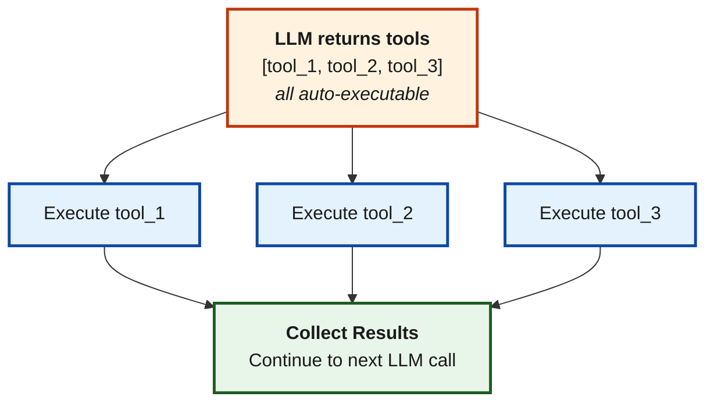

<Note>
This feature is only available on `v1.4.0-prerelease1` and above.
</Note>

## Overview

**Agent Mode** enables Bifrost to automatically execute tool calls without requiring explicit execution API calls for each tool. This transforms Bifrost from a simple gateway into an autonomous agent runtime.

<Warning>
**Streaming Not Supported**: Agent Mode is not compatible with streaming operations (`chat_stream` and `responses_stream`). Due to architectural limitations, the autonomous tool execution loop requires complete responses before proceeding to the next iteration (we cannot store all streaming chunks in memory just "in case" we get any tool calls, this would be a big anti-pattern). Use non-streaming endpoints (`chat` and `responses`) when Agent Mode is enabled.
</Warning>

When Agent Mode is enabled:
1. LLM returns tool calls in its response
2. Bifrost automatically executes **auto-executable** tools
3. Results are fed back to the LLM
4. Loop continues until no more tool calls OR max depth reached
5. Non-auto-executable tools are returned to your application for approval

<Warning>
Agent Mode requires explicit configuration. Tools must be marked as auto-executable via `tools_to_auto_execute`. By default, no tools are auto-executed.
</Warning>

---

## Configuration

Agent Mode requires two configurations:

1. **`tools_to_execute`**: Which tools are available (whitelist)
2. **`tools_to_auto_execute`**: Which tools can run automatically (subset of above)

### Tools To Execute vs Tools To Auto Execute

| Field | Purpose | Semantics |
|-------|---------|-----------|
| `tools_to_execute` | Tools available to the LLM | `["*"]` = all, `[]` = none, `["a", "b"]` = specific |
| `tools_to_auto_execute` | Tools that run without approval | Same semantics, must be subset of `tools_to_execute` |

<Note>
A tool in `tools_to_auto_execute` that is NOT in `tools_to_execute` will be ignored. The execute list takes precedence.
</Note>

---

## Gateway Setup

<Tabs>
<Tab title="Web UI">

### Configuring Auto-Execute Tools

1. Navigate to **MCP Gateway** in the left sidebar
2. Click on a client to open its configuration sheet
3. Scroll to the **Available Tools** section
4. For each tool, toggle the **Automatically execute tool** switch
5. Click **Save Changes** to apply

The auto-execute configuration is managed per-client, allowing fine-grained control over which tools run automatically vs. requiring manual approval.

### Global Agent Settings

Configure max depth and other agent settings via:

**Gateway API:**
```bash
# Update tool manager config
curl -X PUT http://localhost:8080/api/settings/mcp/tool-manager-config \
  -H "Content-Type: application/json" \
  -d '{
    "max_agent_depth": 15,
    "tool_execution_timeout": "45s",
    "code_mode_binding_level": "tool"
  }'
```

**config.json:**
```json
{
  "mcp": {
    "tool_manager_config": {
      "max_agent_depth": 15,
      "tool_execution_timeout": "45s",
      "code_mode_binding_level": "tool"
    }
  }
}
```

</Tab>
<Tab title="API">

### Add Client with Auto-Execute Tools

```bash
curl -X POST http://localhost:8080/api/mcp/client \
  -H "Content-Type: application/json" \
  -d '{
    "name": "filesystem",
    "connection_type": "stdio",
    "stdio_config": {
      "command": "npx",
      "args": ["-y", "@anthropic/mcp-filesystem"]
    },
    "tools_to_execute": ["*"],
    "tools_to_auto_execute": ["read_file", "list_directory"]
  }'
```

### Update Existing Client

```bash
curl -X PUT http://localhost:8080/api/mcp/client/{id} \
  -H "Content-Type: application/json" \
  -d '{
    "name": "filesystem",
    "connection_type": "stdio",
    "stdio_config": {
      "command": "npx",
      "args": ["-y", "@anthropic/mcp-filesystem"]
    },
    "tools_to_execute": ["*"],
    "tools_to_auto_execute": ["*"]
  }'
```

</Tab>
<Tab title="config.json">

```json
{
  "mcp": {
    "client_configs": [
      {
        "name": "filesystem",
        "connection_type": "stdio",
        "stdio_config": {
          "command": "npx",
          "args": ["-y", "@anthropic/mcp-filesystem"]
        },
        "tools_to_execute": ["*"],
        "tools_to_auto_execute": ["read_file", "list_directory"]
      },
      {
        "name": "web_search",
        "connection_type": "http",
        "connection_string": "http://localhost:3001/mcp",
        "tools_to_execute": ["search"],
        "tools_to_auto_execute": ["search"]
      }
    ],
    "tool_manager_config": {
      "max_agent_depth": 10,
      "tool_execution_timeout": "30s"
    }
  }
}
```

</Tab>
</Tabs>

---

## Go SDK Setup

```go
package main

import (
    "context"
    "time"

    bifrost "github.com/maximhq/bifrost/core"
    "github.com/maximhq/bifrost/core/schemas"
)

func main() {
    mcpConfig := &schemas.MCPConfig{
        ClientConfigs: []schemas.MCPClientConfig{
            {
                Name:           "filesystem",
                ConnectionType: schemas.MCPConnectionTypeSTDIO,
                StdioConfig: &schemas.MCPStdioConfig{
                    Command: "npx",
                    Args:    []string{"-y", "@anthropic/mcp-filesystem"},
                },
                // All tools available
                ToolsToExecute: []string{"*"},
                // Only read operations auto-execute
                ToolsToAutoExecute: []string{"read_file", "list_directory"},
            },
        },
        ToolManagerConfig: &schemas.MCPToolManagerConfig{
            MaxAgentDepth:        10,                      // Max iterations
            ToolExecutionTimeout: 30 * time.Second,        // Per-tool timeout
        },
    }

    client, err := bifrost.Init(context.Background(), schemas.BifrostConfig{
        Account:   account,
        MCPConfig: mcpConfig,
    })
    if err != nil {
        panic(err)
    }

    // Make request - agent mode runs automatically
    request := &schemas.BifrostChatRequest{
        Provider: schemas.OpenAI,
        Model:    "gpt-4o",
        Input: []schemas.ChatMessage{
            {
                Role: schemas.ChatMessageRoleUser,
                Content: schemas.ChatMessageContent{
                    ContentStr: bifrost.Ptr("List all Go files in the project and summarize their purpose"),
                },
            },
        },
    }

    // This will:
    // 1. Get tool calls from LLM
    // 2. Auto-execute list_directory, read_file
    // 3. Feed results back to LLM
    // 4. Return final response
    response, err := client.ChatCompletionRequest(schemas.NewBifrostContext(context.Background(), schemas.NoDeadline), request)
}
```

---

## Agent Mode Behavior

### Max Depth

The `max_agent_depth` setting limits how many iterations the agent can perform:

- **Default**: 10 iterations
- Each LLM call that produces tool calls counts as one iteration
- When max depth is reached, the current response is returned (may contain pending tool calls)

### Parallel Execution

Auto-executable tools are executed **in parallel** for performance:



### Mixed Auto/Non-Auto Tools

When a response contains both auto-executable and non-auto-executable tools:

1. Auto-executable tools are executed first
2. The response is returned with:
   - A text `content` field containing the executed tool results as JSON
   - Pending non-auto-executable tool calls in `tool_calls`
   - `finish_reason` set to `"stop"`

```json
{
  "choices": [{
    "index": 0,
    "finish_reason": "stop",
    "message": {
      "role": "assistant",
      "content": "The Output from allowed tools calls is - {\"filesystem_list_directory\":\"[\\\"file1.go\\\", \\\"file2.go\\\"]\"}\n\nNow I shall call these tools next...",
      "tool_calls": [{
        "id": "call_pending",
        "type": "function",
        "function": {
          "name": "filesystem_write_file",
          "arguments": "{\"path\": \"output.txt\", \"content\": \"...\"}"
        }
      }]
    }
  }]
}
```

<Note>
The `content` field contains a JSON summary of executed tool results. The `tool_calls` array contains only the non-auto-executable tools that require your approval. The `finish_reason` is set to `"stop"` to exit the agent loop.
</Note>

Your application then:
1. Parse the `content` field to see what was already executed
2. Review the pending non-auto-executable tools in `tool_calls`
3. Execute or reject them manually
4. Continue the conversation with results

---

## Security Considerations

<Warning>
Be careful which tools you mark as auto-executable. Dangerous operations like `write_file`, `delete_file`, `execute_command` should typically require human approval.
</Warning>

### Recommended Patterns

**Safe for Auto-Execute:**
- Read operations (`read_file`, `list_directory`)
- Search/query operations (`search`, `fetch_url`)
- Non-destructive information gathering

**Require Human Approval:**
- Write operations (`write_file`, `create_file`)
- Delete operations (`delete_file`, `delete_record`)
- Execute operations (`run_command`, `execute_script`)
- Operations with side effects (sending emails, making purchases)

### Example: Safe Configuration

```json
{
  "tools_to_execute": ["*"],
  "tools_to_auto_execute": [
    "read_file",
    "list_directory",
    "search",
    "get_weather"
  ]
}
```

---

## Tool Execution Timeout

Individual tool executions are bounded by `tool_execution_timeout`:

- **Default**: 30 seconds
- If a tool exceeds the timeout, an error result is returned
- The agent loop continues with the error result

```json
{
  "tool_manager_config": {
    "tool_execution_timeout": "60s"
  }
}
```

---

## Advanced: Agent Loop Internals

### Iteration Tracking

When Agent Mode executes, each iteration through the LLM and tool execution cycle increments a counter. You can track this for logging and debugging:

```go
// During iteration 1 -> Request made with max_tokens adjustment
// Tool results collected and added to history
// During iteration 2 -> Another LLM call with history
// Process continues until no more tool calls or max_agent_depth reached
```

The `max_agent_depth` setting controls maximum iterations:
- **Default:** 10
- **Range:** 1-50 (configurable)
- When reached, current response returned as-is (may contain pending tool calls)

### Custom Request ID Management

For complex workflows, track each iteration with unique request IDs:

```go
mcpConfig := &schemas.MCPConfig{
    ToolManagerConfig: &schemas.MCPToolManagerConfig{
        MaxAgentDepth: 10,
    },
    FetchNewRequestIDFunc: func(ctx context.Context) string {
        // Called before each LLM invocation
        baseID := ctx.Value(schemas.BifrostContextKeyRequestID).(string)
        iterationNum := ctx.Value("iteration").(int)
        return fmt.Sprintf("%s-iter-%d", baseID, iterationNum)
    },
}
```

This enables:
- Audit trail of intermediate steps
- Correlation of tool executions to iterations
- Detailed observability for agent behavior

### Parallel vs Sequential Execution

**Auto-executable tools** run in parallel for performance:
```
Iteration N:
  ├─ Execute tool_1 ───┐
  ├─ Execute tool_2 ───┼─── Parallel (simultaneous)
  └─ Execute tool_3 ───┘
        ↓
  Collect results → Feed to next iteration
```

**Non-auto-executable tools** return immediately:
```
Iteration N:
  Auto tools executed in parallel
  Non-auto tools returned in response
  Application reviews & approves non-auto tools
  Application calls execute endpoint manually
  Results fed back in next iteration
```

### Response Format in Agent Mode

When Agent Mode finds mixed auto/non-auto tools:

```json
{
  "choices": [{
    "message": {
      "role": "assistant",
      "content": "Executed tools: filesystem_list_directory returned [...]",
      "tool_calls": [{
        "id": "call_abc",
        "type": "function",
        "function": {
          "name": "filesystem_write_file",
          "arguments": "..."
        }
      }]
    },
    "finish_reason": "stop"
  }]
}
```

The `content` field contains JSON summary of executed tool results. The `tool_calls` array contains only non-auto-executable tools.

---

## Next Steps

<CardGroup cols={2}>
  <Card title="Code Mode" icon="code" href="./code-mode">
    Let AI write code to orchestrate multiple tools
  </Card>
  <Card title="Tool Filtering" icon="filter" href="./filtering">
    Control tool availability per request
  </Card>
</CardGroup>
