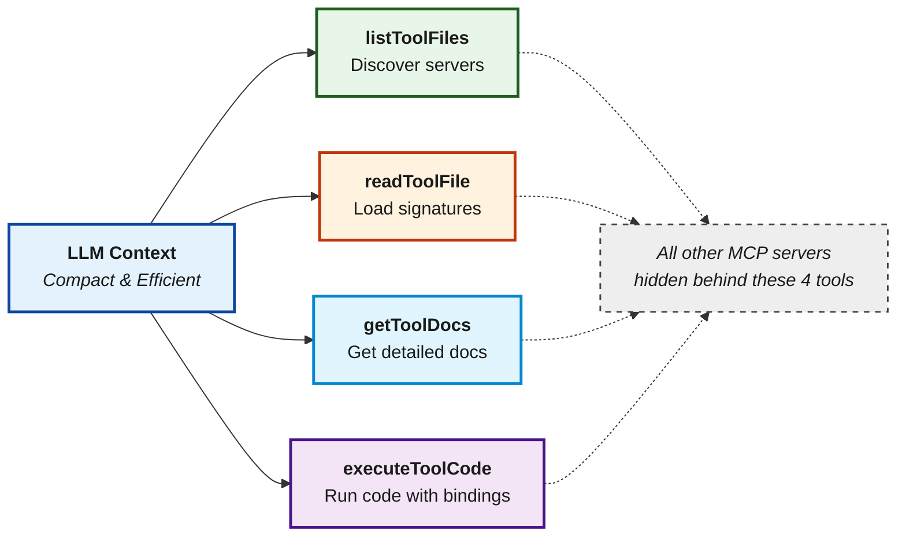

<Note>
This feature is only available on `v1.4.0-prerelease1` and above.
</Note>

## Overview

**Code Mode** is a transformative approach to using MCP that solves a critical problem at scale:

> **The Problem:** When you connect 8-10 MCP servers (150+ tools), every single request includes all tool definitions in the context. The LLM spends most of its budget reading tool catalogs instead of doing actual work.

**The Solution:** Instead of exposing 150 tools directly, Code Mode exposes just **four generic tools**. The LLM uses those tools to write Python code (Starlark) that orchestrates everything else in a sandbox.

### The Impact

Compare a workflow across 5 MCP servers with ~100 tools:

**Classic MCP Flow:**
- 6 LLM turns
- 100 tools in context **every turn** (600 tool-definition tokens)
- All intermediate results flow through the model

**Code Mode Flow:**
- 3-4 LLM turns
- Only 4 tools + definitions on-demand
- Intermediate results processed in sandbox

**Result: ~50% cost reduction + 30-40% faster execution**

Code Mode provides four meta-tools to the AI:
1. **`listToolFiles`** - Discover available MCP servers
2. **`readToolFile`** - Load Python stub signatures on-demand
3. **`getToolDocs`** - Get detailed documentation for a specific tool
4. **`executeToolCode`** - Execute Python code with full tool bindings

## When to Use Code Mode

**Enable Code Mode if you have:**
- ✅ 3+ MCP servers connected
- ✅ Complex multi-step workflows
- ✅ Concerned about token costs or latency
- ✅ Tools that need to interact with each other

**Keep Classic MCP if you have:**
- ✅ Only 1-2 small MCP servers
- ✅ Simple, direct tool calls
- ✅ Very latency-sensitive use cases (though Code Mode is usually faster)

**You can mix both:** Enable Code Mode for "heavy" servers (web, documents, databases) and keep small utilities as direct tools.

---

## How Code Mode Works

### The Four Tools

Instead of seeing 150+ tool definitions, the model sees four generic tools:



### The Execution Flow

```mermaid
graph LR
    User["<b>1. User Request</b><br/>Search YouTube<br/>& save to file"]

    Discover["<b>2. Discover Tools</b><br/>listToolFiles()"]

    GetDefs["<b>3. Load Definitions</b><br/>readToolFile()"]

    Write["<b>4. Write Code</b><br/>Python<br/>in sandbox"]

    Execute["<b>5. Execute</b><br/>Real MCP calls<br/>contained in VM"]

    Result["<b>6. Compact Result</b><br/>{saved:10}"]

    Response["<b>7. Final Response</b><br/>Found & saved<br/>10 videos"]

    User --> Discover
    Discover --> GetDefs
    GetDefs --> Write
    Write --> Execute
    Execute --> Result
    Result --> Response

    style User fill:#E3F2FD,stroke:#0D47A1,stroke-width:2.5px,color:#1A1A1A
    style Discover fill:#F3E5F5,stroke:#4A148C,stroke-width:2.5px,color:#1A1A1A
    style GetDefs fill:#F3E5F5,stroke:#4A148C,stroke-width:2.5px,color:#1A1A1A
    style Write fill:#FFF3E0,stroke:#BF360C,stroke-width:2.5px,color:#1A1A1A
    style Execute fill:#E8F5E9,stroke:#1B5E20,stroke-width:3px,color:#1A1A1A
    style Result fill:#FFFDE7,stroke:#F57F17,stroke-width:2.5px,color:#1A1A1A
    style Response fill:#E8F5E9,stroke:#1B5E20,stroke-width:2.5px,color:#1A1A1A
```



**Key insight:** All the complex orchestration happens inside the sandbox. The LLM only receives the final, compact result—not every intermediate step.

---

## Why This Matters at Scale

### Classic MCP with 5 servers (100 tools):

```
Turn 1: Prompt + search query + [100 tool definitions]
Turn 2: Prompt + search result + [100 tool definitions]
Turn 3: Prompt + channel list + [100 tool definitions]
Turn 4: Prompt + video list + [100 tool definitions]
Turn 5: Prompt + summaries + [100 tool definitions]
Turn 6: Prompt + doc result + [100 tool definitions]

Total: 6 LLM calls, ~600+ tokens in tool definitions alone
```

### Code Mode with same 5 servers:

```
Turn 1: Prompt + 4 tools (listToolFiles, readToolFile, getToolDocs, executeToolCode)
Turn 2: Prompt + server list + 4 tools
Turn 3: Prompt + selected definitions + 4 tools + [EXECUTES CODE]
        [YouTube search, channel list, videos, summaries, doc creation all happen in sandbox]
Turn 4: Prompt + final result + 4 tools

Total: 3-4 LLM calls, ~50 tokens in tool definitions
Result: 50% cost reduction, 3-4x fewer LLM round trips
```

---

## Enabling Code Mode

Code Mode must be enabled **per MCP client**. Once enabled, that client's tools are accessed through the four meta-tools rather than exposed directly.

**Best practice:** Enable Code Mode for 3+ servers or any "heavy" server (web search, documents, databases).

<Tabs>
<Tab title="Web UI">

### Enable Code Mode for a Client

1. Navigate to **MCP Gateway** in the sidebar
2. Click on a client row to open the configuration sheet

<Frame>
  
</Frame>

3. In the **Basic Information** section, toggle **Code Mode Client** to enabled
4. Click **Save Changes**

Once enabled:
- This client's tools are no longer in the default tool list
- They become accessible through `listToolFiles()` and `readToolFile()`
- The AI can write code using `executeToolCode()` to call them

</Tab>
<Tab title="API">

```bash
# When adding a new client
curl -X POST http://localhost:8080/api/mcp/client \
  -H "Content-Type: application/json" \
  -d '{
    "name": "youtube",
    "connection_type": "http",
    "connection_string": "http://localhost:3001/mcp",
    "tools_to_execute": ["*"],
    "is_code_mode_client": true
  }'

# Or update an existing client
curl -X PUT http://localhost:8080/api/mcp/client/{id} \
  -H "Content-Type: application/json" \
  -d '{
    "name": "youtube",
    "connection_type": "http",
    "connection_string": "http://localhost:3001/mcp",
    "tools_to_execute": ["*"],
    "is_code_mode_client": true
  }'
```

</Tab>
<Tab title="config.json">

```json
{
  "mcp": {
    "client_configs": [
      {
        "name": "youtube",
        "connection_type": "http",
        "connection_string": "http://localhost:3001/mcp",
        "tools_to_execute": ["*"],
        "is_code_mode_client": true
      },
      {
        "name": "filesystem",
        "connection_type": "stdio",
        "stdio_config": {
          "command": "npx",
          "args": ["-y", "@anthropic/mcp-filesystem"]
        },
        "tools_to_execute": ["*"],
        "is_code_mode_client": true
      }
    ]
  }
}
```

</Tab>
</Tabs>

### Go SDK Setup

```go
mcpConfig := &schemas.MCPConfig{
    ClientConfigs: []schemas.MCPClientConfig{
        {
            Name:             "youtube",
            ConnectionType:   schemas.MCPConnectionTypeHTTP,
            ConnectionString: bifrost.Ptr("http://localhost:3001/mcp"),
            ToolsToExecute:   []string{"*"},
            IsCodeModeClient: true, // Enable code mode
        },
        {
            Name:           "filesystem",
            ConnectionType: schemas.MCPConnectionTypeSTDIO,
            StdioConfig: &schemas.MCPStdioConfig{
                Command: "npx",
                Args:    []string{"-y", "@anthropic/mcp-filesystem"},
            },
            ToolsToExecute:   []string{"*"},
            IsCodeModeClient: true, // Enable code mode
        },
    },
}
```

---

## The Four Code Mode Tools

When Code Mode clients are connected, Bifrost automatically adds four meta-tools to every request:

### 1. listToolFiles

Lists all available virtual `.pyi` stub files for connected code mode servers.

**Example output (Server-level binding):**
```
servers/
  youtube.pyi
  filesystem.pyi
```

**Example output (Tool-level binding):**
```
servers/
  youtube/
    search.pyi
    get_video.pyi
  filesystem/
    read_file.pyi
    write_file.pyi
```

### 2. readToolFile

Reads a virtual `.pyi` file to get compact Python function signatures for tools.

**Parameters:**
- `fileName` (required): Path like `servers/youtube.pyi` or `servers/youtube/search.pyi`
- `startLine` (optional): 1-based starting line for partial reads
- `endLine` (optional): 1-based ending line for partial reads

**Example output:**
```python
# youtube server tools
# Usage: youtube.tool_name(param=value)
# For detailed docs: use getToolDocs(server="youtube", tool="tool_name")

def search(query: str, maxResults: int = None) -> dict:  # Search for videos
def get_video(id: str) -> dict:  # Get video details
```

### 3. getToolDocs

Get detailed documentation for a specific tool when the compact signature from `readToolFile` is not sufficient.

**Parameters:**
- `server` (required): The server name (e.g., `"youtube"`)
- `tool` (required): The tool name (e.g., `"search"`)

**Example output:**
```python
# ============================================================================
# Documentation for youtube.search tool
# ============================================================================
#
# USAGE INSTRUCTIONS:
# Call tools using: result = youtube.tool_name(param=value)
# No async/await needed - calls are synchronous.
#
# CRITICAL - HANDLING RESPONSES:
# Tool responses are dicts. To avoid runtime errors:
# 1. Use print(result) to inspect the response structure first
# 2. Access dict values with brackets: result["key"] NOT result.key
# 3. Use .get() for safe access: result.get("key", default)
# ============================================================================

def search(query: str, maxResults: int = None) -> dict:
    """
    Search for videos on YouTube.

    Args:
        query (str): Search query (required)
        maxResults (int): Max results to return (optional)

    Returns:
        dict: Response from the tool. Structure varies by tool.
              Use print(result) to inspect the actual structure.

    Example:
        result = youtube.search(query="...")
        print(result)  # Always inspect response first!
        value = result.get("key", default)  # Safe access
    """
    ...
```

### 4. executeToolCode

Executes Python code in a sandboxed Starlark interpreter with access to all code mode server tools.

**Parameters:**
- `code` (required): Python code to execute

**Execution Environment:**
- Python code runs in a Starlark interpreter (Python subset)
- All code mode servers are exposed as global objects (e.g., `youtube`, `filesystem`)
- Tool calls are **synchronous** - no async/await needed
- Use `print()` for logging (output captured in logs)
- Assign to `result` variable to return a value
- Tool execution timeout applies (default 30s)

**Syntax notes:**
- Use keyword arguments: `server.tool(param="value")` NOT `server.tool({"param": "value"})`
- Access dict values with brackets: `result["key"]` NOT `result.key`
- List comprehensions work: `[x for x in items if x["active"]]`

**Example code:**
```python
# Search YouTube and return formatted results
results = youtube.search(query="AI news", maxResults=5)
titles = [item["snippet"]["title"] for item in results["items"]]
print("Found", len(titles), "videos")
result = {"titles": titles, "count": len(titles)}
```

---

## Binding Levels

Code Mode supports two binding levels that control how tools are organized in the virtual file system:

### Server-Level Binding (Default)

All tools from a server are grouped into a single `.pyi` file.

```
servers/
  youtube.pyi        ← Contains all youtube tools
  filesystem.pyi     ← Contains all filesystem tools
```

**Best for:**
- Servers with few tools
- When you want to see all tools at once
- Simpler discovery workflow

### Tool-Level Binding

Each tool gets its own `.pyi` file.

```
servers/
  youtube/
    search.pyi
    get_video.pyi
    get_channel.pyi
  filesystem/
    read_file.pyi
    write_file.pyi
    list_directory.pyi
```

**Best for:**
- Servers with many tools
- When tools have large/complex schemas
- More focused documentation per tool

### Configuring Binding Level

Binding level is a **global setting** that controls how Code Mode's virtual file system is organized. It affects how the AI discovers and loads tool definitions.

<Tabs>
<Tab title="Web UI">

Binding level can be viewed in the MCP configuration overview:

<Frame>
  
</Frame>

- **Server-level (default)**: One `.pyi` file per MCP server
  - Use when: 5-20 tools per server, want simple discovery
  - Example: `servers/youtube.pyi` contains all YouTube tools

- **Tool-level**: One `.pyi` file per individual tool
  - Use when: 30+ tools per server, want minimal context bloat
  - Example: `servers/youtube/search.pyi`, `servers/youtube/list_channels.pyi`

Both modes use the same four-tool interface (`listToolFiles`, `readToolFile`, `getToolDocs`, `executeToolCode`). The choice is purely about **context efficiency per read operation**.

</Tab>
<Tab title="config.json">

```json
{
  "mcp": {
    "tool_manager_config": {
      "code_mode_binding_level": "server"
    }
  }
}
```

Options: `"server"` (default) or `"tool"`

</Tab>
<Tab title="Go SDK">

```go
mcpConfig := &schemas.MCPConfig{
    ToolManagerConfig: &schemas.MCPToolManagerConfig{
        CodeModeBindingLevel: schemas.CodeModeBindingLevelTool, // or CodeModeBindingLevelServer
    },
    ClientConfigs: []schemas.MCPClientConfig{
        // ... clients
    },
}
```

</Tab>
</Tabs>

---

## Auto-Execution with Code Mode

Code Mode tools can be auto-executed in [Agent Mode](./agent-mode), but with **additional validation**:

1. The `listToolFiles` and `readToolFile` tools are always auto-executable (they're read-only)
2. The `executeToolCode` tool is auto-executable **only if** all tool calls within the code are allowed

### How Validation Works

When `executeToolCode` is called in agent mode:

1. Bifrost parses the Python code
2. Extracts all `serverName.toolName()` calls
3. Checks each call against `tools_to_auto_execute` for that server
4. If ALL calls are allowed → auto-execute
5. If ANY call is not allowed → return to user for approval

**Example:**
```json
{
  "name": "youtube",
  "tools_to_execute": ["*"],
  "tools_to_auto_execute": ["search"],
  "is_code_mode_client": true
}
```

```python
# This code WILL auto-execute (only uses search)
results = youtube.search(query="AI")
result = results

# This code will NOT auto-execute (uses delete_video which is not in auto-execute list)
youtube.delete_video(id="abc123")
```

---

## Code Execution Environment

### Available APIs

| Available | Not Available |
|-----------|---------------|
| Python-like syntax | `import` statements |
| Synchronous tool calls | Classes (use dicts) |
| `print()` for logging | File I/O |
| Dict/List operations | Network access |
| List comprehensions | `random`, `time` modules |

### Runtime Environment Details

**Engine:** Starlark interpreter (Python subset)

**Tool Exposure:** Tools from code mode clients are exposed as global objects:
```python
# If you have a 'youtube' code mode client with a 'search' tool
results = youtube.search(query="AI news")
```

**Code Processing:**
1. Code is validated for syntax errors
2. Tool calls are extracted and validated
3. Code executes in isolated Starlark context
4. Result variable is automatically serialized to JSON

**Execution Limits:**
- Default timeout: 30 seconds per tool execution
- Memory isolation: Each execution gets its own context
- No access to host file system or network
- Logs captured from print() calls

### Error Handling

Bifrost provides detailed error messages with hints:

```python
# Error: youtube is not defined
# Hints:
# - Variable or identifier 'youtube' is not defined
# - Available server keys: youtubeAPI, filesystem
# - Use one of the available server keys as the object name
```

### Timeouts

- Default: 30 seconds per tool call
- Configure via `tool_execution_timeout` in `tool_manager_config`
- Long-running operations are interrupted with timeout error

---

## Real-World Impact Comparison

### Scenario: E-commerce Assistant with Multiple Services

**Setup:**
- 10 MCP servers (product catalog, inventory, payments, shipping, chat, analytics, docs, images, calendar, notifications)
- Average 15 tools per server = **150 total tools**
- Complex multi-step task: "Find matching products, check inventory, compare prices, get shipping estimate, create quote"

### Classic MCP Results

| Metric | Value |
|--------|-------|
| LLM Turns | 8-10 |
| Tokens in Tool Defs | ~2,400 per turn |
| Avg Request Tokens | 4,000-5,000 |
| Avg Total Cost | $3.20-4.00 |
| Latency | 18-25 seconds |

**Problem:** Most context goes to tool definitions. Model makes redundant tool calls. Every intermediate result travels back through the LLM.

### Code Mode Results

| Metric | Value |
|--------|-------|
| LLM Turns | 3-4 |
| Tokens in Tool Defs | ~100-300 per turn |
| Avg Request Tokens | 1,500-2,000 |
| Avg Total Cost | $1.20-1.80 |
| Latency | 8-12 seconds |

**Benefit:** Model writes one Python script. All orchestration happens in sandbox. Only compact result returned to LLM.

---

## Next Steps

<CardGroup cols={2}>
  <Card title="Agent Mode" icon="robot" href="./agent-mode">
    Combine Code Mode with auto-execution
  </Card>
  <Card title="MCP Gateway URL" icon="server" href="./gateway-url">
    Expose your tools to external clients
  </Card>
</CardGroup>
