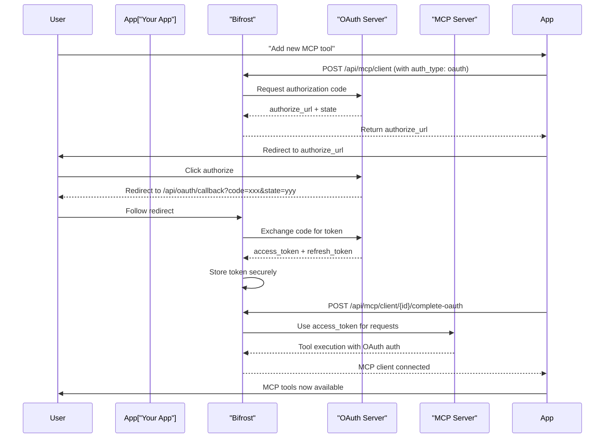

## Overview

OAuth 2.0 authentication enables secure, user-delegated access to MCP servers. Bifrost handles:

- **Automatic token refresh** - Tokens are refreshed before expiration
- **PKCE support** - For public clients without client secrets
- **Dynamic registration** - Automatic client registration (RFC 7591)
- **OAuth discovery** - Discover endpoints from server URLs
- **Token management** - Store and revoke OAuth tokens

This is ideal for integrations that need user-based access, require periodic re-authorization, or must comply with OAuth 2.0 standards.

## OAuth Flow

Bifrost implements the **Authorization Code** flow, the most secure and widely-supported OAuth flow:



## Configuration

### Basic OAuth Setup

Configure OAuth authentication when creating an MCP client:

<Tabs>
<Tab title="Web UI">

1. Navigate to **MCP Gateway** and click **New MCP Server**
2. Select **HTTP** or **SSE** as connection type
3. Set **Auth Type** to **OAuth 2.0**
4. Provide OAuth configuration:
   - **Client ID**: Your OAuth application's client ID
   - **Client Secret**: (Optional for PKCE) Your OAuth application's secret
   - **Authorize URL**: OAuth provider's authorization endpoint
   - **Token URL**: OAuth provider's token endpoint
   - **Scopes**: Comma-separated list of requested scopes
5. Click **Authorize** to start the OAuth flow
6. Complete the authorization in the browser
7. MCP client will be created with the OAuth token

</Tab>
<Tab title="API">

```bash
curl -X POST http://localhost:8080/api/mcp/client \
  -H "Content-Type: application/json" \
  -d '{
    "name": "authenticated-service",
    "connection_type": "http",
    "connection_string": "https://api.example.com/mcp",
    "auth_type": "oauth",
    "oauth_config": {
      "client_id": "your-client-id",
      "client_secret": "your-client-secret",
      "authorize_url": "https://auth.example.com/oauth/authorize",
      "token_url": "https://auth.example.com/oauth/token",
      "scopes": ["mcp:read", "mcp:write"]
    },
    "tools_to_execute": ["*"]
  }'
```

This returns:
```json
{
  "status": "pending_oauth",
  "message": "OAuth authorization required",
  "oauth_config_id": "oauth_cfg_abc123",
  "authorize_url": "https://auth.example.com/oauth/authorize?client_id=...&state=xyz",
  "expires_at": "2026-01-24T12:30:00Z",
  "mcp_client_id": "mcp_client_abc123"
}
```

Redirect the user to `authorize_url`. After authorization, complete the flow:

```bash
curl -X POST http://localhost:8080/api/mcp/client/mcp_client_abc123/complete-oauth
```

</Tab>
<Tab title="Go SDK">

```go
import "github.com/maximhq/bifrost/core/schemas"

mcpConfig := &schemas.MCPClientConfig{
    Name:           "authenticated-service",
    ConnectionType: schemas.MCPConnectionTypeHTTP,
    ConnectionString: schemas.EnvVar{
        Value: "https://api.example.com/mcp",
    },
    AuthType: schemas.MCPAuthTypeOauth,
    OauthConfigID: &oauthConfigID, // Set after OAuth flow
    ToolsToExecute: []string{"*"},
}
```

</Tab>
</Tabs>

### Advanced OAuth Configuration

#### PKCE for Public Clients

For applications without a client secret, use PKCE (Proof Key for Code Exchange):

```json
{
  "name": "public-client-service",
  "connection_type": "http",
  "connection_string": "https://api.example.com/mcp",
  "auth_type": "oauth",
  "oauth_config": {
    "client_id": "your-public-client-id",
    "authorize_url": "https://auth.example.com/oauth/authorize",
    "token_url": "https://auth.example.com/oauth/token",
    "scopes": ["mcp:read"]
  },
  "tools_to_execute": ["*"]
}
```

Bifrost automatically generates and manages PKCE code verifiers.

#### Dynamic Client Registration

If your OAuth server supports RFC 7591, Bifrost can automatically register a client:

```json
{
  "name": "auto-registered-service",
  "connection_type": "http",
  "connection_string": "https://api.example.com/mcp",
  "auth_type": "oauth",
  "oauth_config": {
    "registration_url": "https://auth.example.com/oauth/register",
    "server_url": "https://api.example.com",
    "scopes": ["mcp:read", "mcp:write"]
  },
  "tools_to_execute": ["*"]
}
```

Bifrost will:
1. Discover OAuth endpoints from `server_url`
2. Register a new client using `registration_url`
3. Use the registered client ID for authorization

#### OAuth Discovery

Bifrost can automatically discover OAuth endpoints from your MCP server's metadata:

```json
{
  "name": "discovered-service",
  "connection_type": "http",
  "connection_string": "https://api.example.com/mcp",
  "auth_type": "oauth",
  "oauth_config": {
    "client_id": "your-client-id",
    "server_url": "https://api.example.com",
    "scopes": ["mcp:read"]
  },
  "tools_to_execute": ["*"]
}
```

If OAuth endpoints aren't provided, Bifrost will check:
1. `/.well-known/oauth-authorization-server` (RFC 8414)
2. `/.well-known/openid-configuration`
3. Server MCP metadata

## Token Management

### View OAuth Token Status

Check the status of an OAuth configuration:

```bash
curl http://localhost:8080/api/oauth/config/oauth_cfg_abc123/status
```

Response:
```json
{
  "id": "oauth_cfg_abc123",
  "status": "authorized",
  "created_at": "2026-01-24T10:00:00Z",
  "expires_at": "2026-01-31T10:00:00Z",
  "token_id": "oauth_token_xyz",
  "token_expires_at": "2026-01-25T10:00:00Z",
  "token_scopes": ["mcp:read", "mcp:write"]
}
```

**Status values:**
- `pending`: User hasn't authorized yet
- `authorized`: Token is valid and active
- `failed`: Authorization failed or token is invalid

### Automatic Token Refresh

Bifrost automatically refreshes OAuth tokens before expiration. No action required - tokens are refreshed transparently during tool execution.

### Revoke OAuth Token

Revoke an OAuth token when you want to disconnect:

```bash
curl -X DELETE http://localhost:8080/api/oauth/config/oauth_cfg_abc123
```

This:
- Revokes the token with the OAuth provider
- Deletes the token from Bifrost
- Removes the OAuth configuration
- The MCP client can still be used if auth_type is changed

## Common OAuth Providers

### GitHub

<Tabs>
<Tab title="Configuration">

```json
{
  "name": "github-integration",
  "connection_type": "http",
  "connection_string": "https://github.example.com/api/v1/mcp",
  "auth_type": "oauth",
  "oauth_config": {
    "client_id": "your-github-app-id",
    "client_secret": "your-github-app-secret",
    "authorize_url": "https://github.com/login/oauth/authorize",
    "token_url": "https://github.com/login/oauth/access_token",
    "scopes": ["repo", "user"]
  },
  "tools_to_execute": ["*"]
}
```

</Tab>
<Tab title="Setup Steps">

1. Go to Settings → Developer settings → OAuth Apps
2. Click "New OAuth App"
3. Fill in:
   - **Application name**: Bifrost MCP
   - **Homepage URL**: `https://your-bifrost-domain.com`
   - **Authorization callback URL**: `https://your-bifrost-domain.com/api/oauth/callback`
4. Copy Client ID and Client Secret
5. Use in Bifrost configuration above

</Tab>
</Tabs>

### Google

<Tabs>
<Tab title="Configuration">

```json
{
  "name": "google-api",
  "connection_type": "http",
  "connection_string": "https://mcp.example.com/api",
  "auth_type": "oauth",
  "oauth_config": {
    "client_id": "your-google-client-id.apps.googleusercontent.com",
    "client_secret": "your-google-client-secret",
    "authorize_url": "https://accounts.google.com/o/oauth2/v2/auth",
    "token_url": "https://oauth2.googleapis.com/token",
    "scopes": ["openid", "email", "profile"]
  },
  "tools_to_execute": ["*"]
}
```

</Tab>
<Tab title="Setup Steps">

1. Go to [Google Cloud Console](https://console.cloud.google.com)
2. Create a new project
3. Enable OAuth 2.0 consent screen
4. Create OAuth 2.0 Client ID (Web application)
5. Add Authorized redirect URIs:
   - `https://your-bifrost-domain.com/api/oauth/callback`
6. Copy Client ID and Client Secret
7. Use in Bifrost configuration above

</Tab>
</Tabs>

### Custom OAuth Server

For your own OAuth server:

```json
{
  "name": "custom-oauth-service",
  "connection_type": "http",
  "connection_string": "https://mcp.yourcompany.com/mcp",
  "auth_type": "oauth",
  "oauth_config": {
    "client_id": "bifrost-client-id",
    "client_secret": "bifrost-client-secret",
    "authorize_url": "https://auth.yourcompany.com/authorize",
    "token_url": "https://auth.yourcompany.com/token",
    "registration_url": "https://auth.yourcompany.com/register",
    "server_url": "https://mcp.yourcompany.com",
    "scopes": ["mcp:full"]
  },
  "tools_to_execute": ["*"]
}
```

## Troubleshooting

### OAuth Flow Doesn't Start

**Problem:** `authorize_url` not returned when creating MCP client

**Solutions:**
- Ensure `auth_type` is set to `"oauth"`
- Check that `oauth_config` is provided in the request
- Verify `authorize_url` is specified or `server_url` is provided for discovery

### Token Refresh Fails

**Problem:** Tools fail with "OAuth token expired" or "OAuth token invalid"

**Solutions:**
- Check if the refresh token is still valid
- Revoke and re-authorize: `DELETE /api/oauth/config/{id}` then create a new client
- Verify the OAuth provider hasn't revoked the token
- Check that scopes are still sufficient

### Authorization Callback Hangs

**Problem:** Redirect to `/api/oauth/callback` doesn't complete

**Solutions:**
- Ensure Bifrost is accessible at the registered callback URL
- Check network connectivity between Bifrost and OAuth provider
- Verify the `state` parameter matches (for CSRF protection)
- Check Bifrost logs for errors: `grep -i oauth /var/log/bifrost`

### MCP Client Won't Connect with OAuth

**Problem:** MCP client shows "error" state with OAuth configured

**Solutions:**
- Verify OAuth token is still valid: `GET /api/oauth/config/{id}/status`
- Check that OAuth token has required scopes
- Ensure MCP server accepts the `Authorization: Bearer {token}` header
- Test HTTP connectivity to MCP server

## API Reference

### Create MCP Client with OAuth

**POST** `/api/mcp/client`

```json
{
  "name": "string",
  "connection_type": "http|sse",
  "connection_string": "string",
  "auth_type": "oauth",
  "oauth_config": {
    "client_id": "string",
    "client_secret": "string (optional)",
    "authorize_url": "string",
    "token_url": "string",
    "registration_url": "string (optional)",
    "server_url": "string (optional for discovery)",
    "scopes": ["string"]
  },
  "tools_to_execute": ["*"]
}
```

**Response:** `OAuthFlowInitiation` with `authorize_url`

### Complete OAuth Flow

**POST** `/api/mcp/client/{mcp_client_id}/complete-oauth`

Called after user authorizes and is redirected back. Bifrost automatically handles the code exchange.

**Response:** `SuccessResponse`

### Get OAuth Config Status

**GET** `/api/oauth/config/{oauth_config_id}/status`

Returns current status of OAuth configuration and token information.

**Response:** `OAuthConfigStatus`

### Revoke OAuth Token

**DELETE** `/api/oauth/config/{oauth_config_id}`

Revokes the token and removes OAuth configuration.

**Response:** `SuccessResponse`

## Best Practices

1. **Use HTTPS** - Always use HTTPS for OAuth flows. OAuth providers won't accept HTTP callback URLs in production.

2. **Secure Client Secrets** - Store client secrets in environment variables or secure vaults, not in version control.

3. **Rotate Tokens** - Periodically revoke and re-authorize OAuth tokens for enhanced security.

4. **Monitor Token Status** - Check token status regularly, especially before critical operations.

5. **Handle Refresh Failures** - If token refresh fails, prompt user to re-authorize rather than silently failing.

6. **Limit Scopes** - Request only the scopes your MCP tools actually need.

7. **Log OAuth Operations** - Keep audit logs of OAuth authorizations and token usage.

## Security Considerations

- **Token Storage** - Bifrost stores OAuth tokens in the database encrypted. Never log or expose tokens.
- **PKCE Requirement** - For public clients, PKCE is automatically enabled and verified.
- **State Parameter** - CSRF protection via state parameter is enforced in OAuth flows.
- **Token Expiration** - Tokens are automatically refreshed, reducing the window of vulnerability.
- **Revocation Support** - Tokens can be revoked immediately if compromised.

---

## Next Steps

- [Connect to MCP Servers →](./connecting-to-servers)
- [Tool Execution →](./tool-execution)
- [Agent Mode →](./agent-mode)
