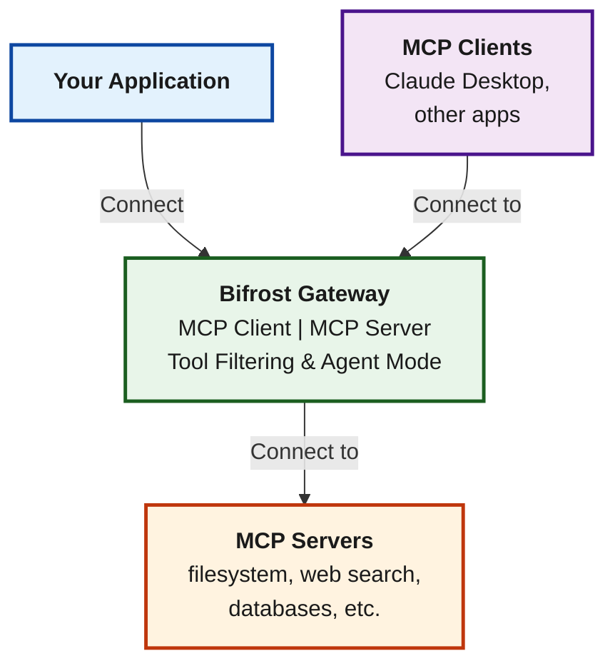

## What is MCP?

**Model Context Protocol (MCP)** is an open standard that enables AI models to seamlessly discover and execute external tools at runtime. Instead of being limited to text generation, AI models can interact with filesystems, search the web, query databases, and execute custom business logic through external MCP servers.

Bifrost provides a comprehensive MCP integration that goes beyond simple tool execution:

- **MCP Client**: Connect to any MCP-compatible server (filesystem tools, web search, databases, etc.)
- **MCP Server**: Expose your connected tools to external MCP clients (like Claude Desktop)
- **Agent Mode**: Autonomous tool execution with configurable auto-approval
- **Code Mode**: Let AI write and execute TypeScript to orchestrate multiple tools

## Security-First Design

<Note>
By default, Bifrost does NOT automatically execute tool calls. All tool execution requires explicit API calls, ensuring human oversight for potentially dangerous operations. However, you can enable [Agent Mode](./agent-mode) to allow automatic execution of specific tools via the `tools_to_auto_execute` configuration.
</Note>

**Key Security Principles:**

| Principle | Description |
|-----------|-------------|
| **Explicit Execution** | Tool calls from LLMs are suggestions only - execution requires separate API call |
| **Granular Control** | Filter tools per-request, per-client, or per-virtual-key |
| **Opt-in Auto-execution** | Agent mode with auto-execution must be explicitly configured |
| **Stateless Design** | Each API call is independent - your app controls conversation state |

## Key Capabilities

<CardGroup cols={2}>
  <Card title="Connect to MCP Servers" icon="plug" href="./connecting-to-servers">
    Connect to external MCP servers via STDIO, HTTP, or SSE protocols
  </Card>
  <Card title="OAuth Authentication" icon="lock" href="./oauth">
    Secure OAuth 2.0 authentication with automatic token refresh
  </Card>
  <Card title="Tool Execution" icon="play" href="./tool-execution">
    Execute tools with full control over approval and conversation flow
  </Card>
  <Card title="Agent Mode" icon="robot" href="./agent-mode">
    Enable autonomous tool execution with configurable auto-approval
  </Card>
  <Card title="Code Mode" icon="code" href="./code-mode">
    Let AI write TypeScript to orchestrate multiple tools in one request
  </Card>
  <Card title="MCP Gateway URL" icon="server" href="./gateway-url">
    Expose Bifrost as an MCP server for Claude Desktop and other clients
  </Card>
  <Card title="Tool Hosting" icon="toolbox" href="./tool-hosting">
    Register custom tools directly in your Go application
  </Card>
  <Card title="Tool Filtering" icon="filter" href="./filtering">
    Control which tools are available per request or per virtual key
  </Card>
</CardGroup>

## How MCP Works in Bifrost

Bifrost acts as both an **MCP client** (connecting to external tool servers) and optionally as an **MCP server** (exposing tools to external clients like Claude Desktop).



For detailed architecture information, see the [MCP Architecture](/architecture/core/mcp) documentation.

## Basic Tool Calling Flow

The default tool calling pattern in Bifrost is **stateless** with explicit execution:

```
1. POST /v1/chat/completions
   → LLM returns tool call suggestions (NOT executed)

2. Your app reviews the tool calls
   → Apply security rules, get user approval if needed

3. POST /v1/mcp/tool/execute
   → Execute approved tool calls explicitly

4. POST /v1/chat/completions
   → Continue conversation with tool results
```

This pattern ensures:
- No unintended API calls to external services
- No accidental data modification or deletion
- Full audit trail of all tool operations
- Human oversight for sensitive operations

## Why Code Mode Matters

If you're planning to use **3+ MCP servers**, read the [Code Mode](./code-mode) documentation carefully.

Code Mode reduces token usage by **50%+ and execution latency by 40-50%** compared to classic MCP by having the AI write TypeScript code to orchestrate tools in a sandbox, rather than exposing 100+ tool definitions directly to the LLM.

---

## Next Steps

<Steps>
  <Step title="Connect to MCP Servers">
    [Set up your first MCP client connection →](./connecting-to-servers)
  </Step>
  <Step title="Choose Authentication (if needed)">
    [Learn about header-based and OAuth 2.0 authentication →](./oauth)
  </Step>
  <Step title="Enable Code Mode (for 3+ servers)">
    [Learn how Code Mode reduces costs by 50% →](./code-mode)
  </Step>
  <Step title="Execute Tools">
    [Learn the tool execution workflow →](./tool-execution)
  </Step>
  <Step title="Enable Agent Mode">
    [Configure autonomous tool execution →](./agent-mode)
  </Step>
</Steps>
