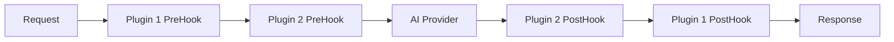

# 🔌 Plugin System

Bifrost's extensible plugin architecture enables custom middleware functionality, allowing you to add authentication, rate limiting, caching, monitoring, and custom business logic without modifying core code.

---

## 🎯 What are Plugins?

**Bifrost Plugins** are middleware components that intercept and modify requests/responses as they flow through the system. The core purpose of the plugin system is to **keep Bifrost's core extremely lightweight** while providing **endless possibilities for extension** through simple plugin additions.

This design philosophy allows you to:

- **🪶 Start Minimal** - Core Bifrost has zero dependencies and minimal overhead
- **🔌 Add as Needed** - Install only the plugins you actually use
- **⚡ One-Click Extensions** - Simple plugin installation without core modifications
- **🎯 Purpose-Built** - Each plugin serves a specific, well-defined purpose
- **♾️ Unlimited Growth** - Combine plugins for complex, enterprise-grade functionality

**Plugin Capabilities:**

- **🔒 Authentication & Authorization** - Validate API keys, manage user permissions
- **⏱️ Rate Limiting & Throttling** - Control request rates per user/IP
- **💾 Caching & Performance** - Cache responses for faster subsequent requests
- **📊 Monitoring & Analytics** - Track usage patterns and performance metrics
- **🛠️ Custom Business Logic** - Add domain-specific processing

### Plugin Execution Flow



**Key Features:**

- **⚡ Zero-Copy Integration** - Direct memory access for minimal overhead
- **🔄 Lifecycle Management** - Automatic resource cleanup and error recovery
- **🛡️ Failure Isolation** - Plugin errors don't crash the system
- **📐 Interface-Based Safety** - Type safety and compile-time validation

---

## 🚀 Quick Example

```go
// Simple logging plugin
type LoggingPlugin struct{}

func (p *LoggingPlugin) PreHook(ctx *context.Context, req *BifrostRequest) (*BifrostRequest, *PluginShortCircuit, error) {
    log.Printf("Request: Provider=%s, Model=%s", req.Provider, req.Model)
    return req, nil, nil
}

func (p *LoggingPlugin) PostHook(ctx *context.Context, result *BifrostResponse, err *BifrostError) (*BifrostResponse, *BifrostError, error) {
    if err != nil {
        log.Printf("Error: %s", err.Error.Message)
    } else {
        log.Printf("Success: Response received")
    }
    return result, err, nil
}

// Add to Bifrost
client, err := bifrost.Init(schemas.BifrostConfig{
    Account: &MyAccount{},
    Plugins: []schemas.Plugin{
        &LoggingPlugin{},
    },
})
```

---

## 📚 Documentation

### 🏗️ Architecture & Design

**[Plugin Architecture](architecture/plugins.md)**

- Plugin system philosophy and design principles
- Complete lifecycle management
- Execution pipeline and flow control
- Performance optimization strategies
- Security and isolation mechanisms

### 🔧 Go Package Development

**[Go Package Plugin Guide](usage/go-package/plugins.md)**

- Plugin interface implementation
- PreHook and PostHook patterns
- Short-circuit responses
- Real-world plugin examples
- Testing and debugging plugins

### 🌐 HTTP Transport Configuration

**[HTTP Transport Plugin Configuration](usage/http-transport/configuration/plugins.md)**

- Loading plugins via command-line flags
- Environment variable configuration
- Available built-in plugins
- Custom plugin deployment
- Docker integration

---

## 🛠️ Plugin Capabilities

### PreHook (Request Processing)

- **Modify requests** before they reach AI providers
- **Add authentication** and authorization checks
- **Implement rate limiting** per user/IP/organization
- **Return cached responses** to skip provider calls
- **Validate and transform** request data

### PostHook (Response Processing)

- **Transform responses** before returning to clients
- **Add metadata** and tracking information
- **Implement logging** and analytics
- **Handle errors** and implement fallback logic
- **Cache responses** for future use

---

## 🔧 Available Plugins

| Plugin                 | Purpose                  | Status           |
| ---------------------- | ------------------------ | ---------------- |
| **Maxim Logger**       | Analytics and monitoring | ✅ Available     |
| **Mocker**             | Testing and mocking      | ✅ Available     |
| **Redis**              | Caching and storage      | ✅ Available     |
| **Prometheus Metrics** | Performance metrics      | ✅ Built-in      |
| **Custom Plugins**     | Your business logic      | 🛠️ Develop yours |

> **📦 Complete Plugin Library**: For the latest plugins and detailed examples, visit the [Bifrost Plugins Repository](https://github.com/maximhq/bifrost/tree/main/plugins) where we continuously add new community and official plugins.

---

## 🎯 Common Use Cases

- **🔐 Enterprise Authentication**: Integrate with SSO, LDAP, or custom auth systems
- **📈 Usage Analytics**: Track API usage patterns and generate insights
- **💰 Billing & Metering**: Implement usage-based pricing and quotas
- **🛡️ Security Policies**: Add custom security rules and compliance checks
- **🔄 Data Transformation**: Modify requests/responses for legacy system compatibility
- **📊 A/B Testing**: Route requests to different providers for testing

---

## 🎉 Getting Started

1. **[📖 Quick Start Guide](quickstart/README.md)** - Add your first plugin in 30 seconds
2. **[🏗️ Understand the Architecture](architecture/plugins.md)** - Plugin system deep dive
3. **[🛠️ Build Custom Plugins](usage/go-package/plugins.md)** - Create your own middleware

> **💡 New to Bifrost?** Start with the [main documentation](README.md) to understand Bifrost's core concepts before developing plugins.
