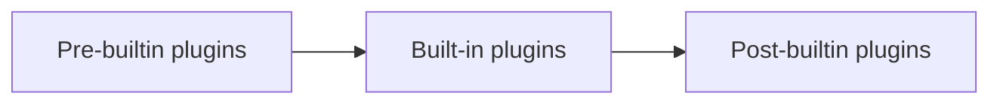
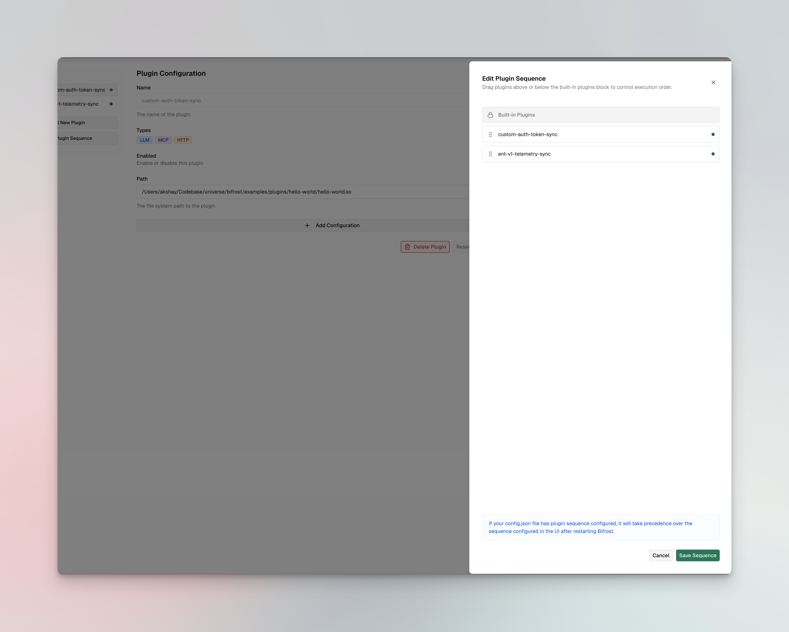

## Overview

When you have multiple plugins — both built-in and custom — the order in which they execute matters. A logging plugin should capture the final request, an auth plugin should validate before anything else runs, and a response transformer should run after the provider returns data.

Plugin sequencing lets you control **where** your custom plugins execute relative to Bifrost's built-in plugins (telemetry, logging, governance, etc.) and **in what order** they execute relative to each other.

---

## How it works

Bifrost organizes plugins into three **placement groups** that execute in a fixed order:



| Placement Group | Pre-hooks (request) | Post-hooks (response) |
|-----------------|--------------------|-----------------------|
| `pre_builtin` | Runs **first** | Runs **last** |
| `builtin` | Runs **second** | Runs **second** |
| `post_builtin` | Runs **third** | Runs **first** |

<Info>
Post-hooks execute in **reverse order** of pre-hooks (LIFO pattern). This means a `pre_builtin` plugin's `PreLLMHook` runs first, but its `PostLLMHook` runs last — ensuring proper cleanup and state unwinding.
</Info>

### Ordering within a group

Within each placement group, plugins are sorted by their `order` value (lower executes earlier). Plugins with the same order preserve their registration order.

**Example:** Three custom plugins configured as:

| Plugin | Placement | Order | Pre-hook runs | Post-hook runs |
|--------|-----------|-------|---------------|----------------|
| auth-validator | `pre_builtin` | 0 | 1st | 5th (last) |
| request-enricher | `pre_builtin` | 1 | 2nd | 4th |
| *Built-in plugins* | — | — | 3rd | 3rd |
| response-logger | `post_builtin` | 0 | 4th | 2nd |
| analytics | `post_builtin` | 1 | 5th (last) | 1st |

---

## Configuration

<Tabs group="config-method">
<Tab title="Web UI">

1. Navigate to the **Plugins** page in the sidebar
2. Click the **Edit Plugin Sequence** button (appears when you have at least one custom plugin installed)



3. **Drag** custom plugins above or below the **Built-in Plugins** block:
   - Plugins **above** the block get `pre_builtin` placement
   - Plugins **below** the block get `post_builtin` placement
4. The order within each group is determined by position (top = lowest order value)
5. Click **Save Sequence** to apply the changes

<Note>
If your `config.json` file has plugin sequence configured, it will take precedence over the sequence configured in the UI after restarting Bifrost.
</Note>

</Tab>
<Tab title="API">

Update a plugin's placement and order using the update endpoint:

```bash
curl -X PUT http://localhost:8080/api/plugins/my-plugin \
  -H "Content-Type: application/json" \
  -d '{
    "enabled": true,
    "path": "/path/to/my-plugin.so",
    "placement": "pre_builtin",
    "order": 0
  }'
```

**Response:**
```json
{
  "message": "Plugin updated successfully",
  "plugin": {
    "name": "my-plugin",
    "enabled": true,
    "isCustom": true,
    "path": "/path/to/my-plugin.so",
    "placement": "pre_builtin",
    "order": 0,
    "status": {
      "status": "active"
    }
  }
}
```

You can also set placement when creating a plugin:

```bash
curl -X POST http://localhost:8080/api/plugins \
  -H "Content-Type: application/json" \
  -d '{
    "name": "my-plugin",
    "enabled": true,
    "path": "/path/to/my-plugin.so",
    "placement": "pre_builtin",
    "order": 0
  }'
```

</Tab>
<Tab title="config.json">

Set `placement` and `order` on each plugin in the `plugins` array:

```json
{
  "plugins": [
    {
      "name": "auth-validator",
      "enabled": true,
      "path": "/plugins/auth-validator.so",
      "placement": "pre_builtin",
      "order": 0
    },
    {
      "name": "request-enricher",
      "enabled": true,
      "path": "/plugins/request-enricher.so",
      "placement": "pre_builtin",
      "order": 1
    },
    {
      "name": "response-logger",
      "enabled": true,
      "path": "/plugins/response-logger.so",
      "placement": "post_builtin",
      "order": 0
    }
  ]
}
```

| Field | Type | Required | Default | Description |
|-------|------|----------|---------|-------------|
| `placement` | string | No | `post_builtin` | `"pre_builtin"` or `"post_builtin"`. Controls whether the plugin runs before or after built-in plugins. |
| `order` | integer | No | `0` | Position within the placement group. Lower values execute earlier. |

</Tab>
</Tabs>

---

## When to use each placement

### `pre_builtin` — run before built-in plugins

Use this when your plugin needs to:

- **Validate or authenticate** requests before any built-in processing
- **Enrich requests** with data that built-in plugins should see (e.g., injecting headers or metadata)
- **Short-circuit** requests before they reach governance checks or telemetry

### `post_builtin` (default) — run after built-in plugins

Use this when your plugin needs to:

- **Transform responses** after all built-in processing is complete
- **Log or analyze** the final request/response (after governance, telemetry, etc.)
- **Add custom headers** or modify the response before it reaches the client

<Tip>
When in doubt, use the default `post_builtin` placement. Most custom plugins — logging, analytics, response transformations — work best after built-in plugins have finished their processing.
</Tip>

---

## Next steps

- **[Writing a Go plugin](./writing-go-plugin)** — Build your first custom plugin with `PreLLMHook` and `PostLLMHook`
- **[Writing a WASM plugin](./writing-wasm-plugin)** — Build a portable WASM plugin
- **[Plugin architecture](../architecture/core/plugins)** — Deep dive into the plugin lifecycle and hook execution model
