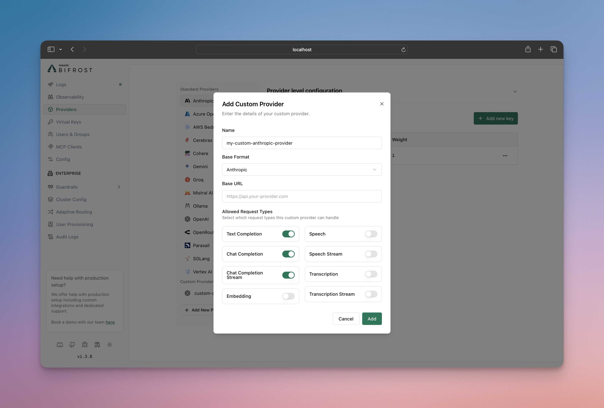

## What Are Custom Providers?

Custom providers allow you to create multiple instances of the same base provider, each with different configurations and access patterns. The key feature is request type control, which enables you to restrict what operations each custom provider instance can perform.

Think of custom providers as "multiple views" of the same underlying provider — you can create several custom configurations for OpenAI, Anthropic, or any other provider, each optimized for different use cases while sharing the same API keys and base infrastructure.

## Key Benefits

- **Multiple Provider Instances**: Create several configurations of the same base provider (e.g., multiple OpenAI configurations)
- **Request Type Control**: Restrict which operations (chat, embeddings, speech, etc.) each custom provider can perform
- **Custom Naming**: Use descriptive names like "openai-production" or "openai-staging"
- **Provider Reuse**: Maximize the value of your existing provider accounts

## How to Configure

Custom providers are configured using the `custom_provider_config` field, which extends the standard provider configuration. The main purpose is to create multiple instances of the same base provider, each with different request type restrictions.

**Important**: The `allowed_requests` field follows a specific behavior:
- **Omitted entirely**: All operations are allowed (default behavior)
- **Partially specified**: Only explicitly set fields are allowed, others default to `false`
- **Fully specified**: Only the operations you explicitly enable are allowed
- **Present but empty object (`{}`)**: All fields are set to false

<Tabs group="custom-provider-config">

<Tab title="Using Web UI">



1. Go to **http://localhost:8080**
2. Navigate to **"Providers"** in the sidebar
3. Click **"Add New Provider"**
4. Choose a unique provider name (e.g., "openai-custom")
5. Select the base provider type (e.g., "openai")
6. Configure which request types are allowed
7. Save configuration

</Tab>

<Tab title="Using API">

```bash
# Create a chat-only custom provider
curl --location 'http://localhost:8080/api/providers' \
--header 'Content-Type: application/json' \
--data '{
    "provider": "openai-custom",
    "keys": [
        {
            "name": "openai-custom-key-1",
            "value": "env.OPENAI_API_KEY",
            "models": [],
            "weight": 1.0
        }
    ],
    "custom_provider_config": {
        "base_provider_type": "openai",
        "allowed_requests": {
            "list_models": false,
            "text_completion": false,
            "text_completion_stream": false,
            "chat_completion": true,
            "chat_completion_stream": true,
            "responses": false,
            "responses_stream": false,
            "embedding": false,
            "speech": false,
            "speech_stream": false,
            "transcription": false,
            "transcription_stream": false
        },
        "request_path_overrides": {
            "chat_completion": "/v1/chat/completions"
        }
    }
}'
```

</Tab>

<Tab title="Using config.json">

```json
{
    "providers": {
        "openai-custom": {
            "keys": [
                {
                    "name": "openai-custom-key-1",
                    "value": "env.OPENAI_API_KEY",
                    "models": [],
                    "weight": 1.0
                }
            ],
            "custom_provider_config": {
                "base_provider_type": "openai",
                "allowed_requests": {
                    "list_models": false,
                    "text_completion": false,
                    "text_completion_stream": false,
                    "chat_completion": true,
                    "chat_completion_stream": true,
                    "responses": false,
                    "responses_stream": false,
                    "embedding": false,
                    "speech": false,
                    "speech_stream": false,
                    "transcription": false,
                    "transcription_stream": false
                },
                "request_path_overrides": {
                    "chat_completion": "/v1/chat/completions"
                }
            }
        }
    }
}
```

</Tab>

<Tab title="Go SDK">

Create a custom provider using the Go SDK by implementing the Account interface with custom provider configuration:

```go
package main

import (
    "context"
    "fmt"
    "os"
    "time"

    "github.com/maximhq/bifrost/core/schemas"
)

// Define custom provider name
const ProviderOpenAICustom = schemas.ModelProvider("openai-custom")

type MyAccount struct{}

func (a *MyAccount) GetConfiguredProviders() ([]schemas.ModelProvider, error) {
    return []schemas.ModelProvider{
        schemas.OpenAI,
        ProviderOpenAICustom, // Include your custom provider
    }, nil
}

func (a *MyAccount) GetKeysForProvider(ctx context.Context, provider schemas.ModelProvider) ([]schemas.Key, error) {
    switch provider {
    case schemas.OpenAI:
        return []schemas.Key{{
            Value:  os.Getenv("OPENAI_API_KEY"),
            Models: []string{},
            Weight: 1.0,
        }}, nil
    case ProviderOpenAICustom:
        return []schemas.Key{{
            Value:  os.Getenv("OPENAI_CUSTOM_API_KEY"), // API key for OpenAI-compatible endpoint
            Models: []string{},
            Weight: 1.0,
        }}, nil
    }
    return nil, fmt.Errorf("provider %s not supported", provider)
}

func (a *MyAccount) GetConfigForProvider(provider schemas.ModelProvider) (*schemas.ProviderConfig, error) {
    switch provider {
    case schemas.OpenAI:
        return &schemas.ProviderConfig{
            NetworkConfig:            schemas.DefaultNetworkConfig,
            ConcurrencyAndBufferSize: schemas.DefaultConcurrencyAndBufferSize,
        }, nil
    case ProviderOpenAICustom:
        return &schemas.ProviderConfig{
            NetworkConfig: schemas.NetworkConfig{
                BaseURL:                        "https://your-openai-compatible-endpoint.com", // Custom base URL
                DefaultRequestTimeoutInSeconds: 60,
                MaxRetries:                     1,
                RetryBackoffInitial:            100 * time.Millisecond,
                RetryBackoffMax:                2 * time.Second,
            },
            ConcurrencyAndBufferSize: schemas.ConcurrencyAndBufferSize{
                Concurrency: 3,
                BufferSize:  10,
            },
            CustomProviderConfig: &schemas.CustomProviderConfig{
                BaseProviderType: schemas.OpenAI, // Use OpenAI protocol
                AllowedRequests: &schemas.AllowedRequests{
                    TextCompletion:       false,
                    TextCompletionStream: false,
                    ChatCompletion:       true,  // Enable chat completion
                    ChatCompletionStream: true,  // Enable streaming
                    Responses:            false,
                    ResponsesStream:      false,
                    Embedding:            false,
                    Speech:               false,
                    SpeechStream:         false,
                    Transcription:        false,
                    TranscriptionStream:  false,
                },
                RequestPathOverrides: map[schemas.RequestType]string{
                    schemas.ChatCompletionRequest:       "/v1/chat/completions",
                    schemas.ChatCompletionStreamRequest: "/v1/chat/completions",
                },
            },
        }, nil
    }
    return nil, fmt.Errorf("provider %s not supported", provider)
}

```

</Tab>

</Tabs>

## Configuration Options

### Allowed Request Types

Control which operations your custom provider can perform. The behavior is:

- **If `allowed_requests` is not specified**: All operations are allowed by default
- **If `allowed_requests` is specified**: Only the fields set to `true` are allowed, all others default to `false`

Available operations:

- **`text_completion`**: Legacy text completion requests
- **`text_completion_stream`**: Streaming text completion requests
- **`chat_completion`**: Standard chat completion requests
- **`chat_completion_stream`**: Streaming chat responses
- **`responses`**: Standard responses requests
- **`responses_stream`**: Streaming responses requests
- **`embedding`**: Text embedding generation
- **`speech`**: Text-to-speech conversion
- **`speech_stream`**: Streaming text-to-speech
- **`transcription`**: Speech-to-text conversion
- **`transcription_stream`**: Streaming speech-to-text

### Base Provider Types

Custom providers can be built on these supported providers:

- `openai` - OpenAI API
- `anthropic` - Anthropic Claude
- `bedrock` - AWS Bedrock
- `cohere` - Cohere
- `gemini` - Gemini

### Request Path Overrides

The `request_path_overrides` field allows you to override the default API endpoint paths for specific request types. This is useful when:

- Connecting to custom or self-hosted model providers
- Integrating with proxies that expect specific URL patterns
- Using provider forks with modified API paths

<Warning>
**Not Supported:** `request_path_overrides` is not supported for `gemini` and `bedrock` base provider types due to their specialized API implementations.
</Warning>

The field accepts a mapping of request types to either custom **paths** or **full URLs**:

**Using Paths (relative to `base_url`):**
```json
{
    "request_path_overrides": {
        "chat_completion": "/v1/chat/completions",
        "chat_completion_stream": "/v1/chat/completions",
        "embedding": "/v1/embeddings",
        "text_completion": "/v1/completions"
    }
}
```

**Using Full URLs (bypasses `base_url`):**
```json
{
    "request_path_overrides": {
        "chat_completion": "https://specific-endpoint.com/chat",
        "embedding": "http://another-service:8080/embeddings"
    }
}
```

<Info>
When a full URL (with scheme and host) is provided in `request_path_overrides`, Bifrost will use that URL directly and ignore the `base_url` from `network_config` for that specific request type. This allows you to route different request types to completely different endpoints.
</Info>

**Example: OpenAI-Compatible Endpoint with Custom Paths**

```json
{
    "custom-llm": {
        "keys": [{ "name": "custom-llm-key-1", "value": "env.PROVIDER_API_KEY", "models": [], "weight": 1.0 }],
        "network_config": {
            "base_url": "https://your-openai-compatible-endpoint.com"
        },
        "custom_provider_config": {
            "base_provider_type": "openai",
            "allowed_requests": {
                "chat_completion": true,
                "chat_completion_stream": true
            },
            "request_path_overrides": {
                "chat_completion": "/api/v2/chat",
                "chat_completion_stream": "/api/v2/chat"
            }
        }
    }
}
```

In this example, instead of using OpenAI's default `/v1/chat/completions` path, requests will be sent to `https://custom-endpoint.example.com/api/v2/chat`.

## Use Cases

### 1. Environment-Specific Configurations

Create different configurations for production, staging, and development environments:

```json
{
    "openai-production": {
        "keys": [{ "name": "openai-prod-key-1", "value": "env.PROVIDER_API_KEY", "models": [], "weight": 1.0 }],
        "custom_provider_config": {
            "base_provider_type": "openai",
            "allowed_requests": {
                "chat_completion": true,
                "chat_completion_stream": true,
                "embedding": true,
                "speech": true,
                "speech_stream": true
            }
        }
    },
    "openai-staging": {
        "keys": [{ "name": "openai-stage-key-1", "value": "env.PROVIDER_API_KEY", "models": [], "weight": 1.0 }],
        "custom_provider_config": {
            "base_provider_type": "openai",
            "allowed_requests": {
                "chat_completion": true,
                "chat_completion_stream": true,
                "embedding": true,
                "speech": false,
                "speech_stream": false
            }
        }
    },
    "openai-dev": {
        "keys": [{ "name": "openai-dev-key-1", "value": "env.PROVIDER_API_KEY", "models": [], "weight": 1.0 }],
        "custom_provider_config": {
            "base_provider_type": "openai",
            "allowed_requests": {
                "chat_completion": true,
                "chat_completion_stream": false,
                "embedding": false,
                "speech": false,
                "speech_stream": false
            }
        }
    }
}
```

### 2. Role-Based Access Control

Restrict capabilities based on user roles or team permissions. You can then create virtual keys for better management of who can access which providers, providing granular control over team permissions and resource usage. This integrates seamlessly with Bifrost's **[governance](../features/governance/virtual-keys)** features for comprehensive access control and monitoring:

```json
{
    "openai-developers": {
        "keys": [{ "name": "openai-developers-key-1", "value": "env.PROVIDER_API_KEY", "models": [], "weight": 1.0 }],
        "custom_provider_config": {
            "base_provider_type": "openai",
            "allowed_requests": {
                "chat_completion": true,
                "chat_completion_stream": true,
                "embedding": true,
                "text_completion": true
            }
        }
    },
    "openai-analysts": {
        "keys": [{ "name": "openai-analysts-key-1", "value": "env.PROVIDER_API_KEY", "models": [], "weight": 1.0 }],
        "custom_provider_config": {
            "base_provider_type": "openai",
            "allowed_requests": {
                "chat_completion": true,
                "embedding": true
            }
        }
    },
    "openai-support": {
        "keys": [{ "name": "openai-support-key-1", "value": "env.PROVIDER_API_KEY", "models": [], "weight": 1.0 }],
        "custom_provider_config": {
            "base_provider_type": "openai",
            "allowed_requests": {
                "chat_completion": true,
                "chat_completion_stream": false
            }
        }
    }
}
```

### 3. Feature Testing and Rollouts

Test new features with limited user groups:

```json
{
    "openai-beta-streaming": {
        "keys": [{ "name": "openai-streaming-key-1", "value": "env.PROVIDER_API_KEY", "models": [], "weight": 1.0 }],
        "custom_provider_config": {
            "base_provider_type": "openai",
            "allowed_requests": {
                "chat_completion": true,
                "chat_completion_stream": true,
                "embedding": false
            }
        }
    },
    "openai-stable": {
        "keys": [{ "name": "openai-stable-key-1", "value": "env.PROVIDER_API_KEY", "models": [], "weight": 1.0 }],
        "custom_provider_config": {
            "base_provider_type": "openai",
            "allowed_requests": {
                "chat_completion": true,
                "chat_completion_stream": false,
                "embedding": true
            }
        }
    }
}
```

## Making Requests

Use your custom provider name in requests:

```bash
# Request to custom provider
curl --location 'http://localhost:8080/v1/chat/completions' \
--header 'Content-Type: application/json' \
--data '{
    "model": "openai-custom/gpt-4o-mini",
    "messages": [
        {"role": "user", "content": "Hello!"}
    ]
}'
```

## Relationship to Provider Configuration

Custom providers extend the standard provider configuration system. They inherit all the capabilities of their base provider while adding request type restrictions.

**Learn more about provider configuration:**
- **[Gateway Provider Configuration](../quickstart/gateway/provider-configuration)**
- **[Go SDK Provider Configuration](../quickstart/go-sdk/provider-configuration)**

## Next Steps

- **[Fallbacks](../features/fallbacks)** - Automatic failover between providers
- **[Load Balancing](../features/keys-management)** - Intelligent API key management with weighted load balancing
- **[Governance](../features/governance/virtual-keys)** - Advanced access control and monitoring
