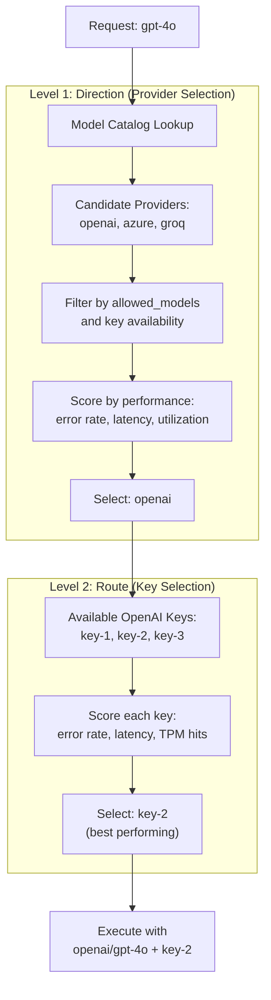
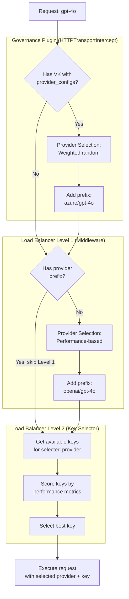

## Overview

Bifrost offers two powerful methods for routing requests across AI providers, each serving different use cases:

1. **Governance-based Routing**: Explicit, user-defined routing rules configured via Virtual Keys
2. **Adaptive Load Balancing**: Automatic, performance-based routing powered by real-time metrics (Enterprise feature)

When both methods are available, **governance takes precedence** because users have explicitly defined their routing preferences through provider configurations on Virtual Keys.

<Info>
**When to use which method:**
- Use **Governance** when you need explicit control, compliance requirements, or specific cost optimization strategies
- Use **Adaptive Load Balancing** for automatic performance optimization and minimal configuration overhead
</Info>

---

## The Model Catalog

The Model Catalog is Bifrost's central registry that tracks which models are available from which providers. It powers both governance-based routing and adaptive load balancing by maintaining an up-to-date mapping of models to providers.

### Data Sources

The Model Catalog combines two data sources:

1. **Pricing Data** (Primary source)
   - Downloaded from a remote URL (configurable, defaults to Maxim's pricing endpoint)
   - Contains model names, pricing tiers, and provider mappings
   - Synced to database on startup and refreshed every hour
   - Used for cost calculation and initial model-to-provider mapping

2. **Provider List Models API** (Secondary source)
   - Calls each provider's `/v1/models` endpoint
   - Enriches the catalog with provider-specific models and aliases
   - Called on Bifrost startup and when providers are added/updated
   - Adds models that may not be in pricing data yet

### Syncing Behavior

<AccordionGroup>
  <Accordion title="Initial Sync (Startup)">
    When Bifrost starts:
    1. **Pricing data** is loaded from the remote URL
    2. If successful, data is stored in the database (if config store is available)
    3. **Model pool** is populated from pricing data
    4. **List models API** is called for all configured providers
    5. Results are added to the model pool

    If list models API fails for a provider:
    ```json
    {"level":"warn","message":"failed to list models for provider ollama: failed to execute HTTP request to provider API"}
    ```
    - This is logged as a warning but **does not stop startup**
    - The provider can still be used with models from pricing data
  </Accordion>

  <Accordion title="Ongoing Sync (Background)">
    While Bifrost is running:
    - **Pricing data**: Background worker checks every hour and syncs if interval elapsed
    - **List models API**: Re-fetched when provider is added/updated via API or dashboard

    Sync failures are handled gracefully:
    - If pricing URL fails but database has existing data → Use database
    - If pricing URL fails and no database data → Error (startup fails)
    - If list models API fails → Log warning, continue with pricing data only
  </Accordion>

  <Accordion title="Fallback Strategy">
    When syncing fails:
    1. **Pricing data failure**: Use existing database records (requires config store)
    2. **List models failure**: Rely on pricing data only
    3. **Empty `allowed_models`**: Use model catalog to validate which models are supported

    This multi-layered approach ensures routing continues even with partial sync failures.
  </Accordion>
</AccordionGroup>

### How It's Used in Routing

<Tabs>
<Tab title="Governance Routing">

When a Virtual Key has empty `allowed_models`:

```json
{
  "provider_configs": [
    {
      "provider": "openai",
      "allowed_models": [],  // Empty = use Model Catalog
      "weight": 0.5
    }
  ]
}
```

Bifrost checks the Model Catalog:
- Request for `gpt-4o` → ✅ Allowed (catalog shows OpenAI supports this)
- Request for `claude-3-sonnet` → ❌ Rejected (catalog shows OpenAI doesn't support this)

</Tab>

<Tab title="Load Balancing">

When load balancing selects providers:

```bash
curl -X POST http://localhost:8080/v1/chat/completions \
  -d '{"model": "gpt-4o", "messages": [...]}'
```

1. Load balancer calls `GetProvidersForModel("gpt-4o")`
2. Model Catalog returns: [openai, azure, groq]
3. Load balancer filters based on configured providers and allowed models
4. Performance-based selection among filtered providers

</Tab>
</Tabs>

<Note>
**Model Catalog is essential for cross-provider routing**. Without it, Bifrost wouldn't know that `gpt-4o` is available from both OpenAI and Azure, limiting routing flexibility.
</Note>

---

## Governance-based Routing

Governance-based routing allows you to explicitly define which providers and models should handle requests for a specific Virtual Key. This method provides precise control over routing decisions.

### How It Works

When a Virtual Key has `provider_configs` defined:

1. **Request arrives** with a Virtual Key (e.g., `x-bf-vk: vk-prod-main`)
2. **Model validation**: Bifrost checks if the requested model is allowed for any configured provider
3. **Provider filtering**: Providers are filtered based on:
   - Model availability in `allowed_models`
   - Budget limits (current usage vs max limit)
   - Rate limits (tokens/requests per time window)
4. **Weighted selection**: A provider is selected using weighted random distribution
5. **Provider prefix added**: Model string becomes `provider/model` (e.g., `openai/gpt-4o`)
6. **Fallbacks created**: Remaining providers sorted by weight (descending) are added as fallbacks

### Configuration Example

```json
{
  "provider_configs": [
    {
      "provider": "openai",
      "allowed_models": ["gpt-4o", "gpt-4o-mini"],
      "weight": 0.3,
      "budget": {
        "max_limit": 100.0,
        "current_usage": 45.0
      }
    },
    {
      "provider": "azure",
      "allowed_models": ["gpt-4o"],
      "weight": 0.7,
      "rate_limit": {
        "token_max_limit": 100000,
        "token_reset_duration": "1m"
      }
    }
  ]
}
```

### Request Flow

<Steps>
  <Step title="Request with Virtual Key">
    ```bash
    curl -X POST http://localhost:8080/v1/chat/completions \
      -H "x-bf-vk: vk-prod-main" \
      -d '{"model": "gpt-4o", "messages": [...]}'
    ```
  </Step>
  <Step title="Governance Evaluation">
    - OpenAI: ✅ Has `gpt-4o` in allowed_models, budget OK, weight 0.3
    - Azure: ✅ Has `gpt-4o` in allowed_models, rate limit OK, weight 0.7
  </Step>
  <Step title="Weighted Selection">
    - 70% chance → Azure
    - 30% chance → OpenAI
  </Step>
  <Step title="Request Transformation">
    ```json
    {
      "model": "azure/gpt-4o",
      "messages": [...],
      "fallbacks": ["openai/gpt-4o"]
    }
    ```
  </Step>
</Steps>

### Key Features

| Feature | Description |
|---------|-------------|
| **Explicit Control** | Define exactly which providers and models are accessible |
| **Budget Enforcement** | Automatically exclude providers exceeding budget limits |
| **Rate Limit Protection** | Skip providers that have hit rate limits |
| **Weighted Distribution** | Control traffic distribution with custom weights |
| **Automatic Fallbacks** | Failed providers automatically retry with next highest weight |

### Best Practices

<AccordionGroup>
  <Accordion title="Cost Optimization">
    Assign higher weights to cheaper providers for cost-sensitive workloads:
    ```json
    {
      "provider_configs": [
        {"provider": "groq", "weight": 0.7},
        {"provider": "openai", "weight": 0.3}
      ]
    }
    ```
  </Accordion>

  <Accordion title="Environment Separation">
    Create different Virtual Keys for dev/staging/prod with different provider access:
    ```json
    {
      "virtual_keys": [
        {
          "id": "vk-dev",
          "provider_configs": [{"provider": "ollama"}]
        },
        {
          "id": "vk-prod",
          "provider_configs": [{"provider": "openai"}, {"provider": "azure"}]
        }
      ]
    }
    ```
  </Accordion>

  <Accordion title="Compliance & Data Residency">
    Restrict specific Virtual Keys to compliant providers:
    ```json
    {
      "provider_configs": [
        {"provider": "azure", "allowed_models": ["gpt-4o"]},
        {"provider": "bedrock", "allowed_models": ["claude-3-sonnet-20240229"]}
      ]
    }
    ```
  </Accordion>
</AccordionGroup>

<Note>
**Empty `allowed_models`**: When left empty, Bifrost uses the Model Catalog (populated from pricing data and the provider's list models API) to determine which models are supported. See the [Model Catalog section](#the-model-catalog) above for how syncing works. For configuration instructions, see [Governance Routing](/features/governance/routing).
</Note>

---

## Adaptive Load Balancing

<Info>
**Enterprise Feature**: Adaptive Load Balancing is available in Bifrost Enterprise. [Contact us](https://www.getmaxim.ai/bifrost/enterprise) to enable it.
</Info>

Adaptive Load Balancing automatically optimizes routing based on real-time performance metrics. It operates at **two levels** to provide both macro-level provider selection and micro-level key optimization.

### Two-Level Architecture

<Card title="Why Two Levels?" icon="layer-group">
Separating provider selection (direction) from key selection (route) enables:
- **Provider-level optimization**: Choose the best provider for a model based on aggregate performance
- **Key-level optimization**: Within that provider, choose the best API key based on individual key performance
- **Resilience**: Even when provider is specified (by governance or user), key-level load balancing still optimizes which API key to use
</Card>



### Level 1: Direction (Provider Selection)

**When it runs**: Only when the model string has **no** provider prefix (e.g., `gpt-4o`)

**How it works**:

1. **Model catalog lookup**: Find all configured providers that support the requested model
2. **Provider filtering**: Filter based on:
   - Allowed models from keys configuration
   - Keys availability for the provider
3. **Performance scoring**: Calculate scores for each provider based on:
   - Error rates (50% weight)
   - Latency (20% weight, using MV-TACOS algorithm)
   - Utilization (5% weight)
   - Momentum bias (recovery acceleration)
4. **Smart selection**: Choose provider using weighted random with jitter and exploration
5. **Fallbacks created**: Remaining providers sorted by performance score (descending) are added as fallbacks

### Level 2: Route (Key Selection)

**When it runs**: **Always**, even when provider is already specified (by governance, user, or Level 1)

**How it works**:

1. **Get available keys**: Fetch all keys for the selected provider
2. **Filter by configuration**: Apply model restrictions from key configuration
3. **Performance scoring**: Calculate score for each key based on:
   - Error rates (recent failures)
   - Latency (response time)
   - TPM hits (rate limit violations)
   - Current state (Healthy, Degraded, Failed, Recovering)
4. **Weighted random selection**: Choose key with exploration (25% chance to probe recovering keys)
5. **Circuit breaker**: Skip keys with zero weight (TPM hits, repeated failures)

### Scoring Algorithm

The load balancer computes a performance score for each provider-model combination:

$$
Score = (P_{error} \times 0.5) + (P_{latency} \times 0.2) + (P_{util} \times 0.05) - M_{momentum}
$$

<Tip>
Lower penalties = Higher weights = More traffic. The system self-heals by quickly penalizing failing routes but enabling fast recovery once issues are resolved.
</Tip>

### Request Flow

<Steps>
  <Step title="Request without Provider Prefix">
    ```bash
    curl -X POST http://localhost:8080/v1/chat/completions \
      -d '{"model": "gpt-4o", "messages": [...]}'
    ```
  </Step>
  <Step title="Model Catalog Lookup">
    Providers supporting `gpt-4o`: [openai, azure, groq]
  </Step>
  <Step title="Performance Evaluation">
    - OpenAI: Score 0.92 (low latency, 99% success rate)
    - Azure: Score 0.85 (medium latency, 98% success rate)
    - Groq: Score 0.65 (high latency recently)
  </Step>
  <Step title="Provider Selection">
    OpenAI selected (highest score within jitter band)
  </Step>
  <Step title="Request Transformation">
    ```json
    {
      "model": "openai/gpt-4o",
      "messages": [...],
      "fallbacks": ["azure/gpt-4o", "groq/gpt-4o"]
    }
    ```
  </Step>
</Steps>

### Key Features

| Feature | Description |
|---------|-------------|
| **Automatic Optimization** | No manual weight tuning required |
| **Real-time Adaptation** | Weights recomputed every 5 seconds based on live metrics |
| **Circuit Breakers** | Failing routes automatically removed from rotation |
| **Fast Recovery** | 90% penalty reduction in 30 seconds after issues resolve |
| **Health States** | Routes transition between Healthy, Degraded, Failed, and Recovering |
| **Smart Exploration** | 25% chance to probe potentially recovered routes |


### Dashboard Visibility

Monitor load balancing performance in real-time:

<Frame>
  
</Frame>

The dashboard shows:
- Weight distribution across provider-model-key routes
- Performance metrics (error rates, latency, success rates)
- State transitions (Healthy → Degraded → Failed → Recovering)
- Actual vs expected traffic distribution

---

## How Governance and Load Balancing Interact

When both methods are available in your Bifrost deployment, they work together in a complementary way across two levels.

<Warning>
**Key Insight**: Load balancing has **two levels**:
- **Level 1 (Direction/Provider)**: Skipped when provider is already specified
- **Level 2 (Route/Key)**: **Always runs**, even when provider is specified

This means key-level optimization works regardless of how the provider was chosen!
</Warning>

### Execution Flow



### Execution Order

1. **HTTPTransportIntercept** (Governance Plugin - Provider Level)
   - Runs first in the request pipeline
   - Checks if Virtual Key has `provider_configs`
   - If yes: adds provider prefix (e.g., `azure/gpt-4o`)
   - **Result**: Provider is selected by governance rules

2. **Middleware** (Load Balancing Plugin - Provider Level / Direction)
   - Runs after HTTPTransportIntercept
   - Checks if model string contains "/"
   - If yes: **skips provider selection** (already determined by governance or user)
   - If no: performs performance-based provider selection
   - **Result**: Provider prefix added if not already present

3. **KeySelector** (Load Balancing - Key Level / Route)
   - **Always runs** during request execution in Bifrost core
   - Gets all keys for the selected provider
   - Filters keys based on model restrictions
   - Scores each key by performance metrics
   - Selects best key using weighted random + exploration
   - **Result**: Optimal key selected within the provider

<Info>
**Important**: Even when governance specifies `azure/gpt-4o`, load balancing **still optimizes which Azure key to use** based on performance metrics. This is the power of the two-level architecture!
</Info>

### Example Scenarios

<Tabs>
<Tab title="Governance Only">

**Setup:**
- Virtual Key has `provider_configs` defined
- No adaptive load balancing enabled

**Request:**
```bash
curl -X POST http://localhost:8080/v1/chat/completions \
  -H "x-bf-vk: vk-prod-main" \
  -d '{"model": "gpt-4o", "messages": [...]}'
```

**Behavior:**
1. **Governance** applies weighted provider routing → selects Azure (70% weight)
2. Model becomes `azure/gpt-4o`
3. **Standard key selection** (non-adaptive) chooses an Azure key based on static weights
4. Request forwarded to Azure with selected key

</Tab>

<Tab title="Load Balancing Only">

**Setup:**
- No Virtual Key or Virtual Key without `provider_configs`
- Adaptive load balancing enabled

**Request:**
```bash
curl -X POST http://localhost:8080/v1/chat/completions \
  -d '{"model": "gpt-4o", "messages": [...]}'
```

**Behavior:**
1. **Load Balancing Level 1** applies performance-based provider routing → selects OpenAI (best performing)
2. Model becomes `openai/gpt-4o`
3. **Load Balancing Level 2** selects best OpenAI key based on performance metrics (error rate, latency, TPM status)
4. Request forwarded to OpenAI with optimal key

</Tab>

<Tab title="Both Available (Governance + Load Balancing)">

**Setup:**
- Virtual Key has `provider_configs` defined
- Adaptive load balancing enabled
- Azure has 3 keys: `azure-key-1`, `azure-key-2`, `azure-key-3`

**Request:**
```bash
curl -X POST http://localhost:8080/v1/chat/completions \
  -H "x-bf-vk: vk-prod-main" \
  -d '{"model": "gpt-4o", "messages": [...]}'
```

**Behavior:**
1. **Governance** applies first (respects explicit user config) → selects Azure provider
2. Model becomes `azure/gpt-4o`
3. **Load Balancing Level 1** sees "/" and **skips provider selection** (already decided)
4. **Load Balancing Level 2** still runs! Selects best Azure key based on performance:
   - `azure-key-1`: 99% success rate, 150ms avg latency → score 0.95
   - `azure-key-2`: 85% success rate, 200ms avg latency → score 0.60 (degraded)
   - `azure-key-3`: Hit TPM limit → score 0.0 (circuit broken)
   - **Selects `azure-key-1`** (highest score)
5. Request forwarded to Azure with `azure-key-1`

**Why?** Governance controls provider selection (explicit user intent), but load balancing still optimizes key selection (automatic performance optimization).

</Tab>

<Tab title="Manual Provider Selection">

**Setup:**
- Both governance and load balancing enabled
- OpenAI has 2 keys available

**Request:**
```bash
curl -X POST http://localhost:8080/v1/chat/completions \
  -d '{"model": "openai/gpt-4o", "messages": [...]}'
```

**Behavior:**
1. **Governance** sees "/" and skips
2. **Load Balancing Level 1** sees "/" and **skips provider selection**
3. **Load Balancing Level 2** still runs! Selects best OpenAI key based on current metrics
4. Request forwarded to OpenAI with optimal key

**Why?** User explicitly specified the provider, but key-level optimization still provides value by selecting the best-performing OpenAI key.

</Tab>
</Tabs>

### Provider vs Key Selection Rules

| Scenario | Provider Selection | Key Selection |
|----------|-------------------|---------------|
| VK with provider_configs | **Governance** (weighted random) | **Standard** or **Adaptive** (if enabled) |
| VK without provider_configs + LB | **Load Balancing Level 1** (performance) | **Load Balancing Level 2** (performance) |
| No VK + LB | **Load Balancing Level 1** (performance) | **Load Balancing Level 2** (performance) |
| Model with provider prefix + LB | **Skip** (already specified) | **Load Balancing Level 2** (performance) ✅ |
| No Load Balancing enabled | **Governance** or **User** or **Model Catalog** | **Standard** (static weights) |

<Note>
**Critical Insight**:
- **Provider selection** respects the hierarchy: Governance → Load Balancing Level 1 → User specification
- **Key selection** runs independently and benefits from load balancing **even when provider is predetermined**

This separation is what makes the two-level architecture so powerful!
</Note>

---

## Choosing the Right Approach

1. **Use Governance When:**

   ✅ **Compliance requirements**: Need to ensure data stays in specific regions or providers
   ✅ **Cost optimization**: Want explicit control over traffic distribution to cheaper providers
   ✅ **Budget enforcement**: Need hard limits on spending per provider
   ✅ **Environment separation**: Different teams/apps need different provider access
   ✅ **Rate limit management**: Need to respect provider-specific rate limits

2. **Use Load Balancing When:**

   ✅ **Performance optimization**: Want automatic routing to best-performing providers
   ✅ **Minimal configuration**: Prefer hands-off operation with intelligent defaults
   ✅ **Dynamic workloads**: Traffic patterns change frequently
   ✅ **Automatic failover**: Need instant adaptation to provider issues
   ✅ **Multi-provider redundancy**: Want seamless provider switching based on availability

3. **Use Both When:**

   ✅ **Hybrid requirements**: Some Virtual Keys need governance, others can use load balancing
   ✅ **Progressive rollout**: Start with governance, gradually adopt load balancing
   ✅ **Selective optimization**: Governance for sensitive workloads, load balancing for others

---

## Additional Resources

<CardGroup cols={2}>
  <Card title="Governance Routing" icon="shield-check" href="/features/governance/routing">
    Configuration instructions for setting up governance routing via Virtual Keys (Web UI, API, config.json)
  </Card>
  <Card title="Adaptive Load Balancing" icon="brain" href="/enterprise/adaptive-load-balancing">
    Technical implementation details: scoring algorithms, weight calculations, and performance characteristics
  </Card>
  <Card title="Virtual Keys" icon="key" href="/features/governance/virtual-keys">
    Learn how to create and configure Virtual Keys
  </Card>
  <Card title="Fallbacks" icon="arrow-rotate-right" href="/features/fallbacks">
    Understand how automatic fallbacks work across providers
  </Card>
</CardGroup>
