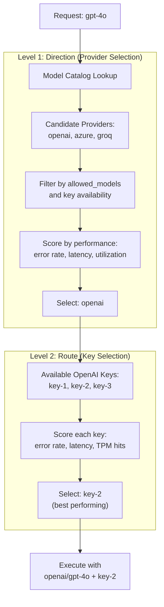
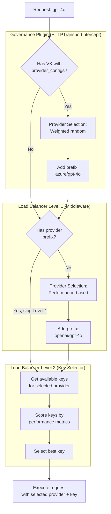
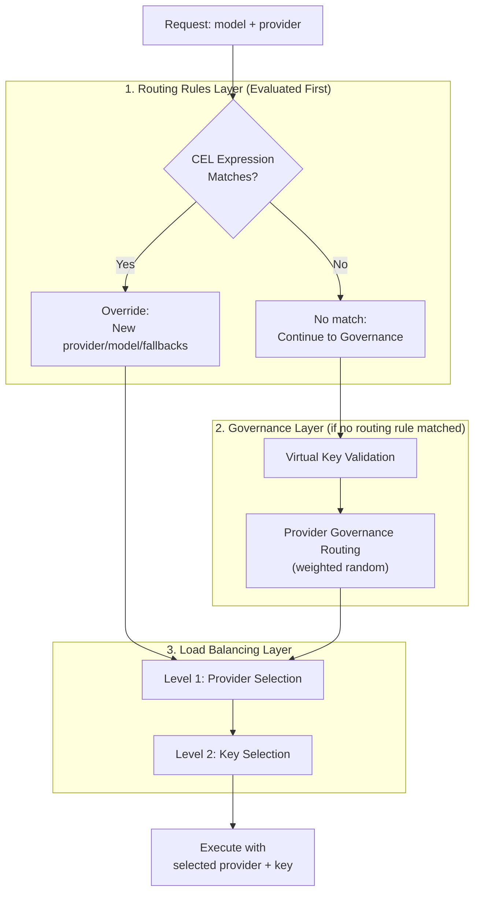

## Overview

Bifrost offers two powerful methods for routing requests across AI providers, each serving different use cases:

1. **Governance-based Routing**: Explicit, user-defined routing rules configured via Virtual Keys
2. **Adaptive Load Balancing**: Automatic, performance-based routing powered by real-time metrics (Enterprise feature)

When both methods are available, **governance takes precedence** because users have explicitly defined their routing preferences through provider configurations on Virtual Keys.

<Info>
**When to use which method:**
- Use **Governance** when you need explicit control, compliance requirements, or specific cost optimization strategies
- Use **Adaptive Load Balancing** for automatic performance optimization and minimal configuration overhead
</Info>

---

## The Model Catalog

The Model Catalog is Bifrost's central registry that tracks which models are available from which providers. It powers both governance-based routing and adaptive load balancing by maintaining an up-to-date mapping of models to providers.

<Info>
**Architecture Documentation**: For detailed technical documentation on the Model Catalog implementation, including API reference, thread safety, and advanced usage patterns, see [Model Catalog Architecture](/architecture/framework/model-catalog).
</Info>

### Data Sources

The Model Catalog combines two data sources to maintain a comprehensive and up-to-date model registry:

1. **Pricing Data** (Primary source)
   - Downloaded from a remote URL (configurable, defaults to `https://getbifrost.ai/datasheet`)
   - Contains model names, pricing tiers, and provider mappings
   - Synced to database on startup and refreshed periodically (default: every 24 hours)
   - Used for cost calculation and initial model-to-provider mapping
   - **Stored as**: In-memory map `pricingData[model|provider|mode]` for O(1) lookups

2. **Provider List Models API** (Secondary source)
   - Calls each provider's `/v1/models` endpoint during startup
   - Enriches the catalog with provider-specific models and aliases
   - Re-fetched when providers are added/updated via API or dashboard
   - Adds models that may not be in pricing data yet (e.g., newly released models)
   - **Stored as**: In-memory map `modelPool[provider][]models`

<Info>
**Why two sources?** Pricing data provides comprehensive model coverage with cost information, while the List Models API ensures you can use newly released models immediately without waiting for pricing data updates.
</Info>

### How Model Availability is Determined

Bifrost uses a sophisticated multi-step process to determine if a model is available for a provider:

<AccordionGroup>
  <Accordion title="GetModelsForProvider(provider)">
    **Purpose**: Find all models available for a specific provider

    **Lookup Process**:
    1. Check `modelPool[provider]` for direct matches
    2. Return all models in that provider's slice

    **Example**:
    ```go
    models := GetModelsForProvider("openai")
    // Returns: ["gpt-4o", "gpt-4o-mini", "gpt-4-turbo", "gpt-3.5-turbo", ...]
    ```

    **Used by**:
    - Routing Methods to validate `allowed_models`
    - Dashboard model selector dropdowns
    - API responses for `/v1/models?provider=openai`
  </Accordion>

  <Accordion title="GetProvidersForModel(model)">
    **Purpose**: Find all providers that support a specific model

    **Lookup Process**:
    1. **Direct lookup**: Check each provider's model list in `modelPool`
    2. **Cross-provider resolution**: Apply special handling for proxy providers

    **Special Cross-Provider Rules**:

    <Steps>
      <Step title="OpenRouter Format">
        If model is not found directly, check if `provider/model` exists in OpenRouter
        ```go
        // Request: claude-3-5-sonnet
        // Checks: openrouter models for "anthropic/claude-3-5-sonnet"
        // Result: Adds "openrouter" to providers list
        ```
      </Step>

      <Step title="Vertex Format">
        If model is not found directly, check if `provider/model` exists in Vertex
        ```go
        // Request: claude-3-5-sonnet
        // Checks: vertex models for "anthropic/claude-3-5-sonnet"
        // Result: Adds "vertex" to providers list
        ```
      </Step>

      <Step title="Groq OpenAI Compatibility">
        For GPT models, check if `openai/model` exists in Groq
        ```go
        // Request: gpt-3.5-turbo
        // Checks: groq models for "openai/gpt-3.5-turbo"
        // Result: Adds "groq" to providers list
        ```
      </Step>

      <Step title="Bedrock Claude Models">
        For Claude models, check Bedrock with flexible matching
        ```go
        // Request: claude-3-5-sonnet
        // Checks: bedrock models containing "claude-3-5-sonnet"
        // Matches: "anthropic.claude-3-5-sonnet-20240620-v1:0"
        // Result: Adds "bedrock" to providers list
        ```
      </Step>
    </Steps>

    **Example**:
    ```go
    providers := GetProvidersForModel("claude-3-5-sonnet")
    // Returns: ["anthropic", "vertex", "bedrock", "openrouter"]
    // Even though the request was just "claude-3-5-sonnet"!
    ```

    **Used by**:
    - Load balancing to find candidate providers
    - Fallback generation
    - Model validation in requests
  </Accordion>

  <Accordion title="Pricing Lookup with Fallbacks">
    **Purpose**: Get pricing data for cost calculation and model validation

    **Lookup Key**: `model|provider|mode` (e.g., `gpt-4o|openai|chat`)

    **Fallback Chain**:
    1. **Primary lookup**: `model|provider|requestType`
    2. **Gemini → Vertex**: If Gemini not found, try Vertex with same model
    3. **Vertex format stripping**: For `provider/model`, strip prefix and retry
    4. **Bedrock prefix handling**: For Claude models, try with `anthropic.` prefix
    5. **Responses → Chat**: If Responses mode not found, try Chat mode

    **Example Flow**:
    ```go
    // Request: claude-3-5-sonnet on Gemini (Responses API)

    // 1. Try: claude-3-5-sonnet|gemini|responses → Not found
    // 2. Try: claude-3-5-sonnet|vertex|responses → Not found
    // 3. Try: claude-3-5-sonnet|vertex|chat → ✅ Found!

    // Pricing returned from vertex/chat mode
    ```

    **Used by**:
    - Cost calculation for billing
    - Model validation during routing
    - Budget enforcement
  </Accordion>
</AccordionGroup>

### Syncing Behavior

<AccordionGroup>
  <Accordion title="Initial Sync (Startup)">
    When Bifrost starts, it performs a complete model catalog initialization:

    **Step-by-step process** (from `server.go:Bootstrap()`):

    <Steps>
      <Step title="Load Pricing Data">
        ```go
        // 1. Download from URL
        pricingData := loadPricingFromURL(ctx)

        // 2. Store in database (if configStore available)
        configStore.CreateModelPrices(ctx, pricingData)

        // 3. Load into memory cache
        mc.pricingData = map[string]TableModelPricing{...}
        ```
      </Step>

      <Step title="Populate Initial Model Pool">
        ```go
        // Build modelPool from pricing data
        mc.populateModelPoolFromPricingData()
        // Result: modelPool[provider] = [models from pricing]
        ```
      </Step>

      <Step title="Fetch Dynamic Models">
        ```go
        // Call ListAllModels for all configured providers
        modelData, err := client.ListAllModels(ctx, nil)

        // Add results to model pool
        mc.AddModelDataToPool(modelData)
        // Result: modelPool enriched with provider-specific models
        ```
      </Step>

      <Step title="Handle Failures Gracefully">
        If list models API fails for a provider:
        ```json
        {"level":"warn","message":"failed to list models for provider ollama: connection refused"}
        ```
        - Logged as warning, **does not stop startup**
        - Provider remains usable with models from pricing data
        - Can be manually refreshed later via API
      </Step>
    </Steps>

    **Result**: Bifrost is ready with a comprehensive model catalog combining both sources.
  </Accordion>

  <Accordion title="Ongoing Sync (Background)">
    While Bifrost is running, the catalog stays up-to-date through background workers:

    **Pricing Data Sync**:
    - Background worker runs every **1 hour** (ticker interval)
    - Checks if **24 hours** have elapsed since last sync (configurable)
    - If yes, downloads fresh pricing data and updates database + memory cache
    - Timer resets after successful sync

    **List Models API Sync**:
    Triggered by these events:
    1. **Provider Added**: When a new provider is configured
       ```bash
       POST /api/v1/providers
       # Automatically calls ListModels for the new provider
       ```

    2. **Provider Updated**: When provider config changes (keys, endpoints, etc.)
       ```bash
       PUT /api/v1/providers/{provider}
       # Refetches models to detect changes
       ```

    3. **Manual Refresh**: Via API endpoint
       ```bash
       POST /api/v1/providers/{provider}/models/refetch
       # Explicitly refetches models for a provider
       ```

    4. **Manual Delete + Refetch**: Clear and reload models
       ```bash
       DELETE /api/v1/providers/{provider}/models
       POST /api/v1/providers/{provider}/models/refetch
       # Useful when models are out of sync
       ```

    **Failure Handling**:
    - Pricing URL fails but database has data → Use cached database records
    - Pricing URL fails and no database data → Error logged, existing memory cache retained
    - List models API fails → Log warning, retain existing model pool entries
  </Accordion>

  <Accordion title="Fallback Strategy">
    Bifrost's multi-layered approach ensures high availability:

    **Layer 1: Pricing Data Persistence**
    ```
    URL fails → Database → Memory cache → Continue operation
    ```

    **Layer 2: Model Pool Redundancy**
    ```
    ListModels fails → Pricing data models → Continue with reduced catalog
    ```

    **Layer 3: Runtime Validation**
    ```
    Model not in catalog → Special cross-provider rules → May still work
    ```

    **Example Scenario**:
    ```
    Situation:
    - Pricing URL is down
    - OpenAI ListModels API is down
    - User requests gpt-4o on OpenAI

    Bifrost's Response:
    1. ✅ Pricing data available from database (last sync 12h ago)
    2. ✅ Model pool has gpt-4o from previous ListModels call
    3. ✅ Request proceeds normally
    4. 📊 Cost calculated from cached pricing data
    ```

    This design ensures **requests never fail due to sync issues** as long as one data source is available.
  </Accordion>
</AccordionGroup>

### Allowed Models Behavior with Examples

The `allowed_models` field in provider configs controls which models can be used with that provider. Understanding its behavior is crucial for governance routing.

<Tabs>
<Tab title="Empty allowed_models (Use Catalog)">

**Configuration**:
```json
{
  "provider_configs": [
    {
      "provider": "openai",
      "allowed_models": [],  // Empty = defer to catalog
      "weight": 1.0
    }
  ]
}
```

**Behavior**:
- Bifrost calls `GetModelsForProvider("openai")`
- Returns all models in `modelPool["openai"]`
- Request validated against catalog

**Examples**:
```bash
# ✅ Allowed (in catalog)
curl -H "x-bf-vk: vk-123" -d '{"model": "gpt-4o"}'

# ✅ Allowed (in catalog)
curl -H "x-bf-vk: vk-123" -d '{"model": "gpt-3.5-turbo"}'

# ❌ Rejected (not in OpenAI catalog)
curl -H "x-bf-vk: vk-123" -d '{"model": "claude-3-5-sonnet"}'
```

**Use Cases**:
- Default behavior for most deployments
- Automatically stays up-to-date with provider's model offerings
- No manual model list maintenance required

</Tab>

<Tab title="Explicit allowed_models (Strict Control)">

**Configuration**:
```json
{
  "provider_configs": [
    {
      "provider": "openai",
      "allowed_models": ["gpt-4o", "gpt-4o-mini"],  // Only these two
      "weight": 1.0
    },
    {
      "provider": "anthropic",
      "allowed_models": ["claude-3-5-sonnet-20241022"],  // Specific version
      "weight": 1.0
    }
  ]
}
```

**Behavior**:
- Bifrost validates request model against explicit list
- Catalog is **ignored** for this provider
- Supports both direct matches and provider-prefixed entries
- Case-sensitive matching

**Examples**:
```bash
# ✅ Allowed (in explicit list)
curl -H "x-bf-vk: vk-123" -d '{"model": "gpt-4o"}'

# ❌ Rejected (not in explicit list)
curl -H "x-bf-vk: vk-123" -d '{"model": "gpt-4-turbo"}'
# Even though gpt-4-turbo is in the OpenAI catalog!

# ✅ Allowed (exact match for Anthropic)
curl -H "x-bf-vk: vk-123" -d '{"model": "claude-3-5-sonnet-20241022"}'

# ❌ Rejected (version mismatch)
curl -H "x-bf-vk: vk-123" -d '{"model": "claude-3-5-sonnet-20240620"}'
```

**Provider-Prefixed Entries**:

You can also use provider-prefixed model names in `allowed_models`. Bifrost will strip the prefix and match against the requested model:

```json
{
  "provider_configs": [
    {
      "provider": "openrouter",
      "allowed_models": ["openai/gpt-4o", "anthropic/claude-3-5-sonnet"],
      "weight": 1.0
    }
  ]
}
```

**How it works**:
```bash
# Request without prefix
curl -H "x-bf-vk: vk-123" -d '{"model": "gpt-4o"}'

# 1. Checks: "openai/gpt-4o" in allowed_models
# 2. Strips prefix: "openai/gpt-4o" → "gpt-4o"
# 3. Compares: "gpt-4o" == "gpt-4o" ✅
# 4. Result: Allowed and routed to OpenRouter
```

This is particularly useful for proxy providers (OpenRouter, Vertex) where you want to explicitly control which upstream models are accessible.

**Use Cases**:
- Compliance requirements (only approved models)
- Cost control (restrict to cheaper models)
- Version pinning (prevent automatic updates)
- Testing specific model versions
- **Explicit cross-provider routing** (e.g., only allow OpenAI models via OpenRouter)

</Tab>

<Tab title="Deployments (Key-Level Aliases)">

**Key Concept**: Deployments are **key-specific** mappings that allow user-friendly model names to map to provider-specific deployment identifiers.

**How Deployments Work**:
- Defined at the **Key level**, not Virtual Key level
- Structure: `deployments: {"alias": "deployment-id"}`
- **Alias** (left side): User-facing model name used in requests
- **Deployment ID** (right side): Provider-specific identifier sent to the API

**Azure OpenAI Example**:

Provider configuration with deployment mapping:
```json
{
  "providers": {
    "azure": {
      "keys": [
        {
          "name": "azure-prod-key",
          "value": "your-api-key",
          "models": [],  // Not used when deployments exist
          "azure_key_config": {
            "endpoint": "https://your-resource.openai.azure.com",
            "deployments": {
              "gpt-4o": "my-prod-gpt4o-deployment",
              "gpt-4o-mini": "my-mini-deployment"
            }
          }
        }
      ]
    }
  }
}
```

**What Happens**:
1. **Allowed models derived from aliases**: `["gpt-4o", "gpt-4o-mini"]`
2. **User requests with alias**: `{"model": "gpt-4o"}`
3. **Bifrost validates**: `gpt-4o` is in derived allowed models ✅
4. **Bifrost maps to deployment**: `gpt-4o` → `my-prod-gpt4o-deployment`
5. **Sent to Azure**: Uses `my-prod-gpt4o-deployment` as the deployment name
6. **Pricing lookup**: If pricing for deployment not found, falls back to alias `gpt-4o`

**Bedrock Example with Inference Profiles**:

```json
{
  "providers": {
    "bedrock": {
      "keys": [
        {
          "name": "bedrock-key",
          "models": [],
          "bedrock_key_config": {
            "access_key": "your-access-key",
            "secret_key": "your-secret-key",
            "region": "us-east-1",
            "deployments": {
              "claude-sonnet": "us.anthropic.claude-3-5-sonnet-20241022-v2:0",
              "claude-opus": "us.anthropic.claude-3-opus-20240229-v1:0"
            }
          }
        }
      ]
    }
  }
}
```

**What Happens**:
1. **Allowed models**: `["claude-sonnet", "claude-opus"]` (from deployment aliases)
2. **User requests**: `{"model": "claude-sonnet"}`
3. **Bifrost validates**: `claude-sonnet` in allowed models ✅
4. **Maps to inference profile**: `claude-sonnet` → `us.anthropic.claude-3-5-sonnet-20241022-v2:0`
5. **Sent to Bedrock**: Full ARN used in API call

**Priority of Model Restrictions**:

When determining allowed models for a key:
```
1. If key.models is NOT empty → Use key.models
2. Else if deployments exist → Use deployment aliases (map keys)
3. Else → All models allowed (use Model Catalog)
```

**Example with Both**:
```json
{
  "keys": [
    {
      "models": ["gpt-4o", "gpt-3.5-turbo"],  // Explicit restriction
      "azure_key_config": {
        "deployments": {
          "gpt-4o": "my-deployment",
          "gpt-4-turbo": "another-deployment"  // NOT accessible!
        }
      }
    }
  ]
}
```
Result: Only `["gpt-4o", "gpt-3.5-turbo"]` allowed (models field takes priority)

**Vertex Example** (similar pattern):
```json
{
  "keys": [
    {
      "vertex_key_config": {
        "project_id": "my-project",
        "region": "us-central1",
        "deployments": {
          "claude-3-5-sonnet": "anthropic/claude-3-5-sonnet@20241022",
          "gemini-pro": "google/gemini-1.5-pro"
        }
      }
    }
  ]
}
```

**Use Cases for Deployments**:
- **Azure**: Map generic model names to specific deployment names in your Azure resource
- **Bedrock**: Use short aliases for long inference profile ARNs
- **Vertex**: Map to specific model versions or regional endpoints
- **Multi-environment**: Different deployments per key (dev/staging/prod)

**Key Insight**:
```
User Request: {"model": "gpt-4o"}
              ↓
Validation: Check if "gpt-4o" in allowed models (derived from deployments)
              ↓
Mapping: deployments["gpt-4o"] → "my-prod-gpt4o-deployment"
              ↓
API Call: Uses "my-prod-gpt4o-deployment" as deployment ID
              ↓
Pricing: Falls back to "gpt-4o" if deployment not in pricing data
```

This allows user-friendly model names in requests while supporting provider-specific deployment patterns at the key level.

</Tab>

<Tab title="Cross-Provider Model Routing">

**Configuration**:
```json
{
  "provider_configs": [
    {
      "provider": "openai",
      "allowed_models": ["gpt-4o"],
      "weight": 0.5
    },
    {
      "provider": "azure",
      "allowed_models": ["gpt-4o"],
      "weight": 0.5
    }
  ]
}
```

**Request**:
```bash
curl -H "x-bf-vk: vk-123" \
     -d '{"model": "gpt-4o"}'
```

**Routing Behavior**:
1. **Model validation**: Both providers have `gpt-4o` in allowed_models ✅
2. **Weighted selection**: 50% chance each
3. **Provider selected**: Let's say Azure
4. **Model transformation**: `gpt-4o` → `azure/gpt-4o`
5. **Fallbacks**: `["openai/gpt-4o"]` (remaining providers)

**Special Cross-Provider Scenarios**:

<Steps>
  <Step title="OpenRouter as Universal Proxy">
    ```json
    {
      "provider_configs": [
        {
          "provider": "openrouter",
          "allowed_models": []  // Use catalog
        }
      ]
    }
    ```

    Request `claude-3-5-sonnet`:
    - Bifrost checks: `GetModelsForProvider("openrouter")`
    - Finds: `anthropic/claude-3-5-sonnet` in OpenRouter catalog
    - ✅ Allowed, routes to OpenRouter
  </Step>

  <Step title="Weighted Routing via Proxy Provider">
    **Use Case**: Route 99% of OpenAI traffic through OpenRouter for cost savings, keep 1% direct for fallback

    ```json
    {
      "provider_configs": [
        {
          "provider": "openai",
          "allowed_models": ["gpt-4o"],
          "weight": 0.01  // 1% direct to OpenAI
        },
        {
          "provider": "openrouter",
          "allowed_models": ["openai/gpt-4o"],  // Provider-prefixed
          "weight": 0.99  // 99% via OpenRouter
        }
      ]
    }
    ```

    Request `gpt-4o`:
    - **OpenAI check**: `"gpt-4o"` in `["gpt-4o"]` → ✅ Allowed
    - **OpenRouter check**: Strips prefix from `"openai/gpt-4o"` → matches `"gpt-4o"` → ✅ Allowed
    - **Weighted selection**: 99% chance → OpenRouter selected
    - **Final model**: `openrouter/gpt-4o`
    - **Fallbacks**: `["openai/gpt-4o"]` (1% provider as fallback)

    **Why this works**: Bifrost now supports provider-prefixed entries in `allowed_models`, so `"openai/gpt-4o"` matches requests for `"gpt-4o"`.
  </Step>

  <Step title="Vertex as Multi-Provider Gateway">
    ```json
    {
      "provider_configs": [
        {
          "provider": "vertex",
          "allowed_models": ["claude-3-5-sonnet", "gemini-1.5-pro"]
        }
      ]
    }
    ```

    Request `claude-3-5-sonnet`:
    - Model catalog lookup: `GetProvidersForModel("claude-3-5-sonnet")`
    - Finds: `["anthropic", "vertex", "bedrock"]`
    - Validation: `claude-3-5-sonnet` in allowed_models ✅
    - Sends to Vertex as: `anthropic/claude-3-5-sonnet`
  </Step>

  <Step title="Groq OpenAI Compatibility">
    ```json
    {
      "provider_configs": [
        {
          "provider": "groq",
          "allowed_models": ["gpt-3.5-turbo"]
        }
      ]
    }
    ```

    Request `gpt-3.5-turbo`:
    - Special handling: Checks Groq catalog for `openai/gpt-3.5-turbo`
    - ✅ Found, validation passes
    - Sends to Groq as: `openai/gpt-3.5-turbo`
  </Step>
</Steps>

</Tab>
</Tabs>

### How It's Used in Routing

<Tabs>
<Tab title="Governance Routing">

When a Virtual Key has `provider_configs`, governance uses the model catalog for validation:

**Empty allowed_models Example**:
```json
{
  "provider_configs": [
    {
      "provider": "openai",
      "allowed_models": [],  // Use catalog
      "weight": 0.5
    }
  ]
}
```

**Request Flow**:
```bash
curl -H "x-bf-vk: vk-123" -d '{"model": "gpt-4o"}'

# 1. Governance checks: Is "gpt-4o" in GetModelsForProvider("openai")?
# 2. Catalog lookup: modelPool["openai"] contains "gpt-4o" ✅
# 3. Validation passes, provider selected
# 4. Model becomes: "openai/gpt-4o"
```

**Rejection Example**:
```bash
curl -H "x-bf-vk: vk-123" -d '{"model": "claude-3-5-sonnet"}'

# 1. Governance checks: Is "claude-3-5-sonnet" in GetModelsForProvider("openai")?
# 2. Catalog lookup: modelPool["openai"] does NOT contain "claude-3-5-sonnet" ❌
# 3. Validation fails, request rejected
# 4. Error: "model not allowed for any configured provider"
```

</Tab>

<Tab title="Load Balancing">

When load balancing selects providers, it queries the catalog to find candidates:

**Request Flow**:
```bash
curl -X POST http://localhost:8080/v1/chat/completions \
  -d '{"model": "gpt-4o", "messages": [...]}'

# 1. Load balancer: GetProvidersForModel("gpt-4o")
# 2. Catalog returns: ["openai", "azure", "groq"]
# 3. Filter by configured providers: ["openai", "azure"]  (groq not configured)
# 4. Performance scoring: openai=0.95, azure=0.87
# 5. Select: openai (highest score)
# 6. Model becomes: "openai/gpt-4o"
# 7. Fallbacks: ["azure/gpt-4o"]
```

**Cross-Provider Discovery**:
```bash
curl -d '{"model": "claude-3-5-sonnet"}'

# 1. Load balancer: GetProvidersForModel("claude-3-5-sonnet")
# 2. Catalog checks:
#    - Direct: ["anthropic"] ✅
#    - OpenRouter: Has "anthropic/claude-3-5-sonnet" ✅
#    - Vertex: Has "anthropic/claude-3-5-sonnet" ✅
#    - Bedrock: Has "anthropic.claude-3-5-sonnet-..." ✅
# 3. Catalog returns: ["anthropic", "openrouter", "vertex", "bedrock"]
# 4. Performance scoring across all four
# 5. Best performer selected
```

This is how Bifrost achieves **intelligent cross-provider routing** without manual configuration.

</Tab>
</Tabs>

<Note>
**Model Catalog is essential for cross-provider routing**. Without it, Bifrost wouldn't know that `gpt-4o` is available from OpenAI, Azure, and Groq, or that `claude-3-5-sonnet` can be routed through Anthropic, Vertex, Bedrock, and OpenRouter. This knowledge powers both governance validation and load balancing provider discovery.
</Note>

---

## Governance-based Routing

Governance-based routing allows you to explicitly define which providers and models should handle requests for a specific Virtual Key. This method provides precise control over routing decisions.

### How It Works

When a Virtual Key has `provider_configs` defined:

1. **Request arrives** with a Virtual Key (e.g., `x-bf-vk: vk-prod-main`)
2. **Model validation**: Bifrost checks if the requested model is allowed for any configured provider
3. **Provider filtering**: Providers are filtered based on:
   - Model availability in `allowed_models`
   - Budget limits (current usage vs max limit)
   - Rate limits (tokens/requests per time window)
4. **Weighted selection**: A provider is selected using weighted random distribution
5. **Provider prefix added**: Model string becomes `provider/model` (e.g., `openai/gpt-4o`)
6. **Fallbacks created**: Remaining providers sorted by weight (descending) are added as fallbacks

### Configuration Example

```json
{
  "provider_configs": [
    {
      "provider": "openai",
      "allowed_models": ["gpt-4o", "gpt-4o-mini"],
      "weight": 0.3,
      "budget": {
        "max_limit": 100.0,
        "current_usage": 45.0
      }
    },
    {
      "provider": "azure",
      "allowed_models": ["gpt-4o"],
      "weight": 0.7,
      "rate_limit": {
        "token_max_limit": 100000,
        "token_reset_duration": "1m"
      }
    }
  ]
}
```

### Request Flow

<Steps>
  <Step title="Request with Virtual Key">
    ```bash
    curl -X POST http://localhost:8080/v1/chat/completions \
      -H "x-bf-vk: vk-prod-main" \
      -d '{"model": "gpt-4o", "messages": [...]}'
    ```
  </Step>
  <Step title="Governance Evaluation">
    - OpenAI: ✅ Has `gpt-4o` in allowed_models, budget OK, weight 0.3
    - Azure: ✅ Has `gpt-4o` in allowed_models, rate limit OK, weight 0.7
  </Step>
  <Step title="Weighted Selection">
    - 70% chance → Azure
    - 30% chance → OpenAI
  </Step>
  <Step title="Request Transformation">
    ```json
    {
      "model": "azure/gpt-4o",
      "messages": [...],
      "fallbacks": ["openai/gpt-4o"]
    }
    ```
  </Step>
</Steps>

### Key Features

| Feature | Description |
|---------|-------------|
| **Explicit Control** | Define exactly which providers and models are accessible |
| **Budget Enforcement** | Automatically exclude providers exceeding budget limits |
| **Rate Limit Protection** | Skip providers that have hit rate limits |
| **Weighted Distribution** | Control traffic distribution with custom weights |
| **Automatic Fallbacks** | Failed providers automatically retry with next highest weight |

### Best Practices

<AccordionGroup>
  <Accordion title="Cost Optimization">
    Assign higher weights to cheaper providers for cost-sensitive workloads:
    ```json
    {
      "provider_configs": [
        {"provider": "groq", "weight": 0.7},
        {"provider": "openai", "weight": 0.3}
      ]
    }
    ```
  </Accordion>

  <Accordion title="Environment Separation">
    Create different Virtual Keys for dev/staging/prod with different provider access:
    ```json
    {
      "virtual_keys": [
        {
          "id": "vk-dev",
          "provider_configs": [{"provider": "ollama"}]
        },
        {
          "id": "vk-prod",
          "provider_configs": [{"provider": "openai"}, {"provider": "azure"}]
        }
      ]
    }
    ```
  </Accordion>

  <Accordion title="Compliance & Data Residency">
    Restrict specific Virtual Keys to compliant providers:
    ```json
    {
      "provider_configs": [
        {"provider": "azure", "allowed_models": ["gpt-4o"]},
        {"provider": "bedrock", "allowed_models": ["claude-3-sonnet-20240229"]}
      ]
    }
    ```
  </Accordion>
</AccordionGroup>

<Note>
**Empty `allowed_models`**: When left empty, Bifrost uses the Model Catalog (populated from pricing data and the provider's list models API) to determine which models are supported. See the [Model Catalog section](#the-model-catalog) above for how syncing works. For configuration instructions, see [Governance Routing](/features/governance/routing).
</Note>

---

## Adaptive Load Balancing

<Info>
**Enterprise Feature**: Adaptive Load Balancing is available in Bifrost Enterprise. [Contact us](https://www.getmaxim.ai/bifrost/enterprise) to enable it.
</Info>

Adaptive Load Balancing automatically optimizes routing based on real-time performance metrics. It operates at **two levels** to provide both macro-level provider selection and micro-level key optimization.

### Two-Level Architecture

<Card title="Why Two Levels?" icon="layer-group">
Separating provider selection (direction) from key selection (route) enables:
- **Provider-level optimization**: Choose the best provider for a model based on aggregate performance
- **Key-level optimization**: Within that provider, choose the best API key based on individual key performance
- **Resilience**: Even when provider is specified (by governance or user), key-level load balancing still optimizes which API key to use
</Card>



### Level 1: Direction (Provider Selection)

**When it runs**: Only when the model string has **no** provider prefix (e.g., `gpt-4o`)

**How it works**:

1. **Model catalog lookup**: Find all configured providers that support the requested model
2. **Provider filtering**: Filter based on:
   - Allowed models from keys configuration
   - Keys availability for the provider
3. **Performance scoring**: Calculate scores for each provider based on:
   - Error rates (50% weight)
   - Latency (20% weight, using MV-TACOS algorithm)
   - Utilization (5% weight)
   - Momentum bias (recovery acceleration)
4. **Smart selection**: Choose provider using weighted random with jitter and exploration
5. **Fallbacks created**: Remaining providers sorted by performance score (descending) are added as fallbacks

### Level 2: Route (Key Selection)

**When it runs**: **Always**, even when provider is already specified (by governance, user, or Level 1)

**How it works**:

1. **Get available keys**: Fetch all keys for the selected provider
2. **Filter by configuration**: Apply model restrictions from key configuration
3. **Performance scoring**: Calculate score for each key based on:
   - Error rates (recent failures)
   - Latency (response time)
   - TPM hits (rate limit violations)
   - Current state (Healthy, Degraded, Failed, Recovering)
4. **Weighted random selection**: Choose key with exploration (25% chance to probe recovering keys)
5. **Circuit breaker**: Skip keys with zero weight (TPM hits, repeated failures)

### Scoring Algorithm

The load balancer computes a performance score for each provider-model combination:

$$
Score = (P_{error} \times 0.5) + (P_{latency} \times 0.2) + (P_{util} \times 0.05) - M_{momentum}
$$

<Tip>
Lower penalties = Higher weights = More traffic. The system self-heals by quickly penalizing failing routes but enabling fast recovery once issues are resolved.
</Tip>

### Request Flow

<Steps>
  <Step title="Request without Provider Prefix">
    ```bash
    curl -X POST http://localhost:8080/v1/chat/completions \
      -d '{"model": "gpt-4o", "messages": [...]}'
    ```
  </Step>
  <Step title="Model Catalog Lookup">
    Providers supporting `gpt-4o`: [openai, azure, groq]
  </Step>
  <Step title="Performance Evaluation">
    - OpenAI: Score 0.92 (low latency, 99% success rate)
    - Azure: Score 0.85 (medium latency, 98% success rate)
    - Groq: Score 0.65 (high latency recently)
  </Step>
  <Step title="Provider Selection">
    OpenAI selected (highest score within jitter band)
  </Step>
  <Step title="Request Transformation">
    ```json
    {
      "model": "openai/gpt-4o",
      "messages": [...],
      "fallbacks": ["azure/gpt-4o", "groq/gpt-4o"]
    }
    ```
  </Step>
</Steps>

### Key Features

| Feature | Description |
|---------|-------------|
| **Automatic Optimization** | No manual weight tuning required |
| **Real-time Adaptation** | Weights recomputed every 5 seconds based on live metrics |
| **Circuit Breakers** | Failing routes automatically removed from rotation |
| **Fast Recovery** | 90% penalty reduction in 30 seconds after issues resolve |
| **Health States** | Routes transition between Healthy, Degraded, Failed, and Recovering |
| **Smart Exploration** | 25% chance to probe potentially recovered routes |


### Dashboard Visibility

Monitor load balancing performance in real-time:

<Frame>
  
</Frame>

The dashboard shows:
- Weight distribution across provider-model-key routes
- Performance metrics (error rates, latency, success rates)
- State transitions (Healthy → Degraded → Failed → Recovering)
- Actual vs expected traffic distribution

---

## How Governance and Load Balancing Interact

When both methods are available in your Bifrost deployment, they work together in a complementary way across two levels.

<Warning>
**Key Insight**: Load balancing has **two levels**:
- **Level 1 (Direction/Provider)**: Skipped when provider is already specified
- **Level 2 (Route/Key)**: **Always runs**, even when provider is specified

This means key-level optimization works regardless of how the provider was chosen!
</Warning>

### Execution Flow



### Execution Order

1. **HTTPTransportIntercept** (Governance Plugin - Provider Level)
   - Runs first in the request pipeline
   - Checks if Virtual Key has `provider_configs`
   - If yes: adds provider prefix (e.g., `azure/gpt-4o`)
   - **Result**: Provider is selected by governance rules

2. **Middleware** (Load Balancing Plugin - Provider Level / Direction)
   - Runs after HTTPTransportIntercept
   - Checks if model string contains "/"
   - If yes: **skips provider selection** (already determined by governance or user)
   - If no: performs performance-based provider selection
   - **Result**: Provider prefix added if not already present

3. **KeySelector** (Load Balancing - Key Level / Route)
   - **Always runs** during request execution in Bifrost core
   - Gets all keys for the selected provider
   - Filters keys based on model restrictions
   - Scores each key by performance metrics
   - Selects best key using weighted random + exploration
   - **Result**: Optimal key selected within the provider

<Info>
**Important**: Even when governance specifies `azure/gpt-4o`, load balancing **still optimizes which Azure key to use** based on performance metrics. This is the power of the two-level architecture!
</Info>

### Example Scenarios

<Tabs>
<Tab title="Governance Only">

**Setup:**
- Virtual Key has `provider_configs` defined
- No adaptive load balancing enabled

**Request:**
```bash
curl -X POST http://localhost:8080/v1/chat/completions \
  -H "x-bf-vk: vk-prod-main" \
  -d '{"model": "gpt-4o", "messages": [...]}'
```

**Behavior:**
1. **Governance** applies weighted provider routing → selects Azure (70% weight)
2. Model becomes `azure/gpt-4o`
3. **Standard key selection** (non-adaptive) chooses an Azure key based on static weights
4. Request forwarded to Azure with selected key

</Tab>

<Tab title="Load Balancing Only">

**Setup:**
- No Virtual Key or Virtual Key without `provider_configs`
- Adaptive load balancing enabled

**Request:**
```bash
curl -X POST http://localhost:8080/v1/chat/completions \
  -d '{"model": "gpt-4o", "messages": [...]}'
```

**Behavior:**
1. **Load Balancing Level 1** applies performance-based provider routing → selects OpenAI (best performing)
2. Model becomes `openai/gpt-4o`
3. **Load Balancing Level 2** selects best OpenAI key based on performance metrics (error rate, latency, TPM status)
4. Request forwarded to OpenAI with optimal key

</Tab>

<Tab title="Both Available (Governance + Load Balancing)">

**Setup:**
- Virtual Key has `provider_configs` defined
- Adaptive load balancing enabled
- Azure has 3 keys: `azure-key-1`, `azure-key-2`, `azure-key-3`

**Request:**
```bash
curl -X POST http://localhost:8080/v1/chat/completions \
  -H "x-bf-vk: vk-prod-main" \
  -d '{"model": "gpt-4o", "messages": [...]}'
```

**Behavior:**
1. **Governance** applies first (respects explicit user config) → selects Azure provider
2. Model becomes `azure/gpt-4o`
3. **Load Balancing Level 1** sees "/" and **skips provider selection** (already decided)
4. **Load Balancing Level 2** still runs! Selects best Azure key based on performance:
   - `azure-key-1`: 99% success rate, 150ms avg latency → score 0.95
   - `azure-key-2`: 85% success rate, 200ms avg latency → score 0.60 (degraded)
   - `azure-key-3`: Hit TPM limit → score 0.0 (circuit broken)
   - **Selects `azure-key-1`** (highest score)
5. Request forwarded to Azure with `azure-key-1`

**Why?** Governance controls provider selection (explicit user intent), but load balancing still optimizes key selection (automatic performance optimization).

</Tab>

<Tab title="Manual Provider Selection">

**Setup:**
- Both governance and load balancing enabled
- OpenAI has 2 keys available

**Request:**
```bash
curl -X POST http://localhost:8080/v1/chat/completions \
  -d '{"model": "openai/gpt-4o", "messages": [...]}'
```

**Behavior:**
1. **Governance** sees "/" and skips
2. **Load Balancing Level 1** sees "/" and **skips provider selection**
3. **Load Balancing Level 2** still runs! Selects best OpenAI key based on current metrics
4. Request forwarded to OpenAI with optimal key

**Why?** User explicitly specified the provider, but key-level optimization still provides value by selecting the best-performing OpenAI key.

</Tab>
</Tabs>

### Provider vs Key Selection Rules

| Scenario | Provider Selection | Key Selection |
|----------|-------------------|---------------|
| VK with provider_configs | **Governance** (weighted random) | **Standard** or **Adaptive** (if enabled) |
| VK without provider_configs + LB | **Load Balancing Level 1** (performance) | **Load Balancing Level 2** (performance) |
| No VK + LB | **Load Balancing Level 1** (performance) | **Load Balancing Level 2** (performance) |
| Model with provider prefix + LB | **Skip** (already specified) | **Load Balancing Level 2** (performance) ✅ |
| No Load Balancing enabled | **Governance** or **User** or **Model Catalog** | **Standard** (static weights) |

<Note>
**Critical Insight**:
- **Provider selection** respects the hierarchy: Governance → Load Balancing Level 1 → User specification
- **Key selection** runs independently and benefits from load balancing **even when provider is predetermined**

This separation is what makes the two-level architecture so powerful!
</Note>

---

## Routing Rules (Dynamic Expression-Based Routing)

<Info>
**Position in routing pipeline**: Routing Rules execute **before governance provider selection** and can override it. They are evaluated before adaptive load balancing, enabling dynamic provider/model overrides based on runtime conditions like headers, parameters, capacity metrics, and organizational hierarchy.
</Info>

### Overview

Routing Rules provide sophisticated, expression-based control over request routing using CEL expressions. Unlike governance routing (static weights), routing rules evaluate conditions dynamically at request time.

### When Routing Rules Execute



### How It Works

1. **Routing rules evaluate first** in scope precedence order (VirtualKey → Team → Customer → Global)
2. **If a routing rule matches**: provider/model/fallbacks are overridden, governance provider_configs are skipped
3. **If no routing rule matches**: governance provider selection runs (weighted random)
4. **Load balancing Level 1**: skipped if provider already determined (has "/" prefix)
5. **Load balancing Level 2** (key selection): always runs to select the best key within the determined provider

### Available CEL Variables

Routing rules access request context through CEL variables:

```cel
// Request context
model                      // Requested model
provider                   // Current provider

// Headers and parameters (case-insensitive)
headers["x-tier"]          // Request header
params["region"]           // Query parameter

// Organization context
virtual_key_id             // VirtualKey ID
team_name                  // Team name
customer_id                // Customer ID

// Capacity metrics (0-100 percentage)
budget_used                // Budget usage %
tokens_used                // Token rate limit usage %
request                    // Request rate limit usage %
```

### Examples

#### Route based on user tier
```cel
headers["x-tier"] == "premium"   // → openai/gpt-4o
```

#### Route to fallback when budget high
```cel
budget_used > 85                 // → groq/llama-2 (cheaper)
```

#### Route by team
```cel
team_name == "ml-research"       // → anthropic/claude-3-opus
```

#### Complex multi-condition routing
```cel
headers["x-environment"] == "production" &&
tokens_used < 75 &&
team_name == "ai-platform"       // → openai/gpt-4o
```

### Scope Hierarchy

Rules are evaluated in organizational precedence order (first-match-wins):

```
1. VirtualKey scope (highest priority)
2. Team scope
3. Customer scope
4. Global scope (lowest priority)
```

Within each scope, rules are sorted by **priority** (ascending: 0 before 10).

### Key Features

| Feature | Description |
|---------|-------------|
| **CEL Expressions** | Powerful, composable condition language with multiple operators |
| **Scope Hierarchy** | Rules at VirtualKey/Team/Customer/Global levels with proper precedence |
| **Dynamic Override** | Override provider and/or model based on runtime conditions |
| **Fallback Chains** | Define multiple fallback providers for automatic failover |
| **Priority Ordering** | Lower priority evaluated first within same scope |
| **Capacity Awareness** | Access real-time budget and rate limit usage percentages |

### Integration with Governance

Routing Rules execute **before** governance provider selection and can override it:

**If a routing rule matches**:
```
Routing Rules evaluate
                    ↓
Rule matches: budget_used > 85
                    ↓
Override: groq/llama-2 (cheaper provider)
                    ↓
Governance provider_configs SKIPPED
                    ↓
Load Balancing selects best key
```

**If no routing rule matches**:
```
Routing Rules evaluate
                    ↓
No matching rule
                    ↓
Governance decides: azure/gpt-4o (70% weight)
                    ↓
Load Balancing selects best key
```

**Key Insight**: Routing rules have higher precedence than governance provider_configs. If a routing rule matches, governance provider_configs are bypassed entirely.

### Integration with Load Balancing

Routing Rules work **before** load balancing:

```
Routing Rules decide: openai/gpt-4o
                    ↓
Load Balancing Level 1: Skipped (provider already determined)
                    ↓
Load Balancing Level 2: Selects best OpenAI key based on performance
```

Even when routing rules determine the provider, load balancing Level 2 still optimizes which API key to use within that provider.

### Use Cases

- **Tier-based routing**: Premium users → fast providers
- **Capacity failover**: High budget usage → cheaper providers
- **Team preferences**: Different teams → different providers
- **A/B testing**: Route subset of traffic to test models
- **Regional routing**: EU users → EU providers (data residency)
- **Complex logic**: Combine multiple conditions for sophisticated routing

### Dashboard & API

Routing rules can be configured through:

- **Dashboard**: Visual rule builder with CEL expression editor
- **API**: `POST /api/governance/routing-rules` and related endpoints
- **Scope**: Create rules at global, customer, team, or virtual key levels
- **Priority**: Order rules within scope with numeric priority

For complete documentation, see [Routing Rules Documentation](/providers/routing-rules).

---

## Choosing the Right Approach

1. **Use Governance When:**

   ✅ **Compliance requirements**: Need to ensure data stays in specific regions or providers
   ✅ **Cost optimization**: Want explicit control over traffic distribution to cheaper providers
   ✅ **Budget enforcement**: Need hard limits on spending per provider
   ✅ **Environment separation**: Different teams/apps need different provider access
   ✅ **Rate limit management**: Need to respect provider-specific rate limits

2. **Use Routing Rules When:**

   ✅ **Dynamic routing**: Route based on runtime request context (headers, parameters)
   ✅ **Capacity-aware routing**: Switch to fallback when budget/rate limits high
   ✅ **Organization-based routing**: Different rules for teams/customers
   ✅ **A/B testing**: Route subset of traffic to test new models
   ✅ **Complex conditions**: Multiple criteria (e.g., tier + capacity + team)

3. **Use Load Balancing When:**

   ✅ **Performance optimization**: Want automatic routing to best-performing providers
   ✅ **Minimal configuration**: Prefer hands-off operation with intelligent defaults
   ✅ **Dynamic workloads**: Traffic patterns change frequently
   ✅ **Automatic failover**: Need instant adaptation to provider issues
   ✅ **Multi-provider redundancy**: Want seamless provider switching based on availability

4. **Use All Three Together:**

   ✅ **Complete solution**: Governance provides base routing, routing rules add dynamic override, load balancing optimizes keys
   ✅ **Maximum flexibility**: Different Virtual Keys use different strategies (governance vs routing rules vs load balancing)
   ✅ **Enterprise deployments**: Complex organizations with multiple requirements per layer

---

## Additional Resources

<CardGroup cols={2}>
  <Card title="Governance Routing" icon="shield-check" href="/features/governance/routing">
    Configuration instructions for setting up governance routing via Virtual Keys (Web UI, API, config.json)
  </Card>
  <Card title="Routing Rules" icon="sliders" href="/providers/routing-rules">
    Dynamic, expression-based routing using CEL expressions for runtime conditions
  </Card>
  <Card title="Adaptive Load Balancing" icon="brain" href="/enterprise/adaptive-load-balancing">
    Technical implementation details: scoring algorithms, weight calculations, and performance characteristics
  </Card>
  <Card title="Virtual Keys" icon="key" href="/features/governance/virtual-keys">
    Learn how to create and configure Virtual Keys
  </Card>
  <Card title="Fallbacks" icon="arrow-rotate-right" href="/features/fallbacks">
    Understand how automatic fallbacks work across providers
  </Card>
</CardGroup>
