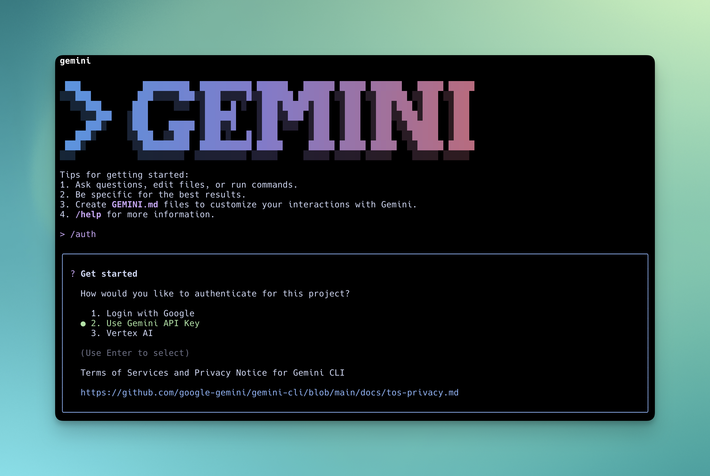
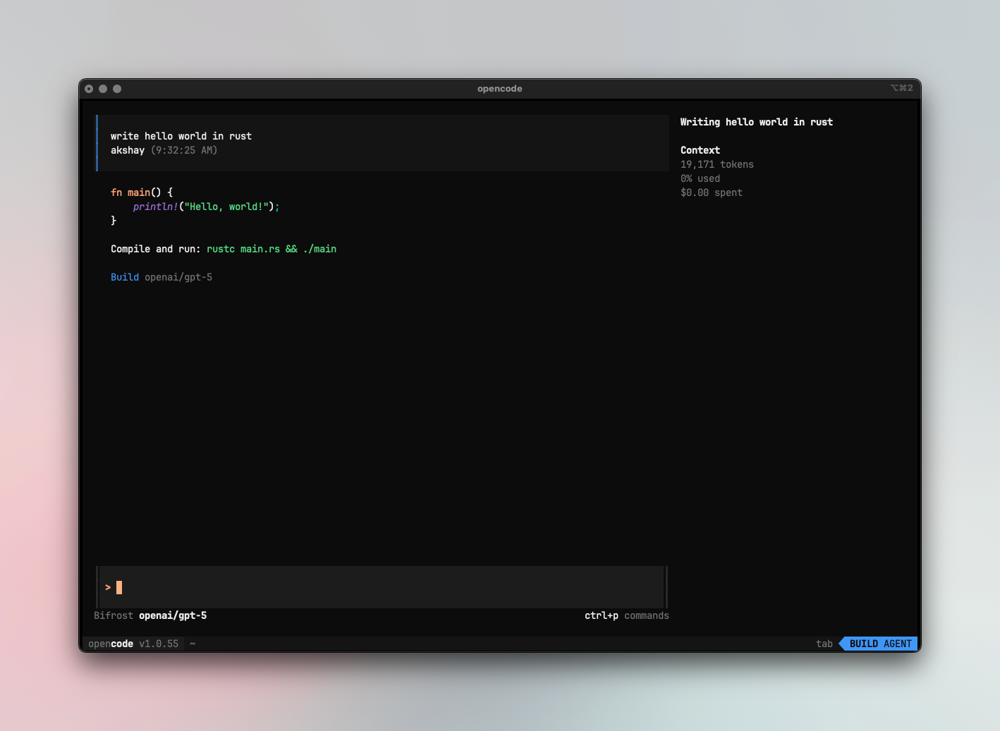
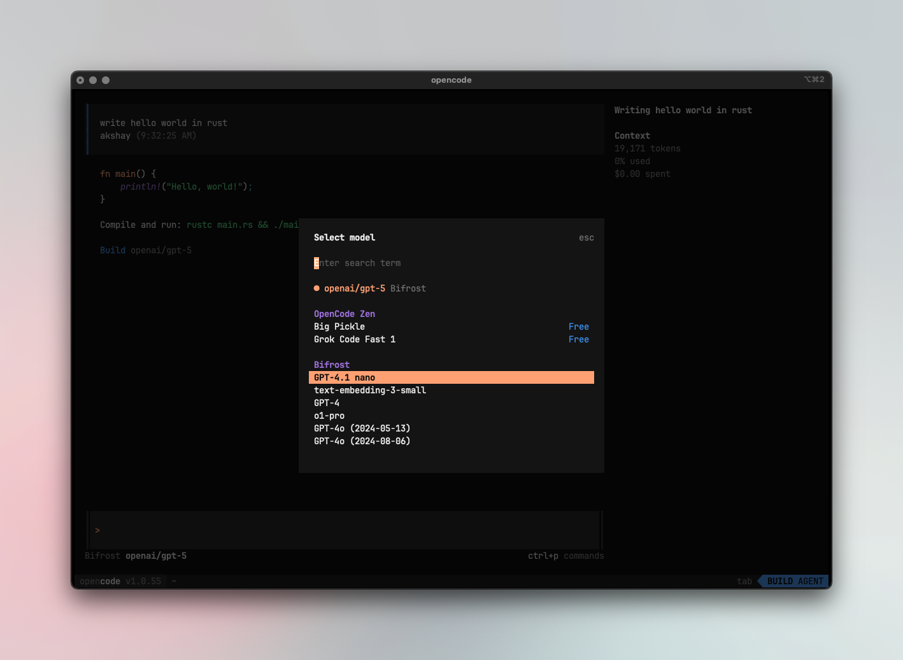

## Overview

Bifrost provides **100% compatible endpoints** for OpenAI, Anthropic, and Gemini APIs, making it seamless to integrate with any agent that uses these providers. By simply pointing your agent's base URL to Bifrost, you unlock powerful features like:

- **Universal Model Access**: Use **any provider/model** configured in Bifrost with any agent (e.g., use GPT-5 with Claude Code, or Claude Sonnet 4.5 with Codex CLI)
- **MCP Tools Integration**: All Model Context Protocol tools configured in Bifrost become available to your agents
- **Built-in Observability**: Monitor all agent interactions in real-time through Bifrost's logging dashboard
- **Load Balancing**: Automatically distribute requests across multiple providers and regions
- **Advanced Features**: Governance, caching, failover, and more - all transparent to your agent

## Example Integrations

### [LibreChat](https://github.com/danny-avila/LibreChat)

It is a modern, open-source chat client that supports multiple providers.

**Setup:**

1. **Install LibreChat:** There are multiple ways of local setup, please follow the [LibreChat documentation](https://www.librechat.ai/docs/local) for more details.

2. **Add Bifrost as a custom provider**: Now that you have LibreChat installed, you can add Bifrost as a custom provider.

   Add the following to your `librechat.yaml` file:
   ```yaml
   custom:
    - name: "Bifrost"
      apiKey: "dummy" # Add the authentication key if login is enabled, otherwise add a placeholder
      baseURL: "http://host.docker.internal:8080/v1" # Or localhost:8080 if running locally, or {your-bifrost-container}:8080 if running in the same docker network
      models:
        default: ["openai/gpt-4o"] # Replace with the model you want to use
        fetch: true
      titleConvo: true
      titleModel: "openai/gpt-4o" # Replace with the model you want to use for chat title generation
      summarize: false # Set to true if you want to enable chat summary generation
      summaryModel: "openai/gpt-4o" # Replace with the model you want to use for chat summary generation
      forcePrompt: false # Set to true if you want to enable force prompt generation
      modelDisplayLabel: "Bifrost" 
      iconURL: https://getbifrost.ai/bifrost-logo.png
   ```

   <Note>
   If you're running LibreChat in a docker container, LibreChat does not automatically use the `librechat.yaml` file, please check the Step 1 of the [LibreChat documentation](https://www.librechat.ai/docs/quick_start/custom_endpoints#step-1-create-or-edit-a-docker-override-file) for more details.
   </Note>

3. **Run LibreChat**

   Now you can start using Bifrost as a provider in LibreChat, with all the features of Bifrost.

### [Claude Code](https://www.claude.com/product/claude-code)

It brings AI-powered coding capabilities directly to your terminal.

**Setup:**

1. **Install Claude Code**
   ```bash
   npm install -g @anthropic-ai/claude-code
   ```

2. **Configure Environment Variables**
   ```bash
   export ANTHROPIC_API_KEY=dummy-key  # Handled by Bifrost (only set when using virtual keys)
   export ANTHROPIC_BASE_URL=http://localhost:8080/anthropic
   ```

3. **Run Claude Code**
   ```bash
   claude
   ```

Now all Claude Code traffic flows through Bifrost, giving you access to any provider/model configured in your Bifrost setup, plus MCP tools and observability.

<Note>
This setup automatically detects if you're using Anthropic MAX account instead of a regular API key authentication :)
</Note>

#### Model Configuration

Claude Code uses three model tiers: **Sonnet** (default), **Opus** (complex tasks), and **Haiku** (fast, lightweight). With Bifrost, you can override these defaults to use any model from any provider.

**Override Default Models:**

Set environment variables to replace Claude Code's default model tiers with any Bifrost-configured model:

```bash
# Replace Sonnet tier with GPT-5
export ANTHROPIC_DEFAULT_SONNET_MODEL="openai/gpt-5"

# Replace Opus tier with Claude Opus 4.5
export ANTHROPIC_DEFAULT_OPUS_MODEL="anthropic/claude-opus-4-5-20251101"

# Replace Haiku tier with Azure-hosted Claude
export ANTHROPIC_DEFAULT_HAIKU_MODEL="azure/claude-haiku-4-5"
```

<Warning>
Alternative models must support **tool use capabilities** for file operations, terminal commands, and code editing to work properly with Claude Code.
</Warning>

**Start with a Specific Model:**

Launch Claude Code with a specific model using the `--model` flag:

```bash
# Start with Opus
claude --model claude-opus-4-5-20251101

# Start with Haiku for lightweight tasks
claude --model claude-haiku-4-5-20251001
```

#### Switching Models Mid-Session

Use the `/model` command to switch models during an active session:

```bash
# Using shorthand
/model opus
/model sonnet
/model haiku

# Using full model names
/model claude-opus-4-5-20251101
/model claude-sonnet-4-5-20250929

# Using different providers dynamically via Bifrost
/model vertex/claude-haiku-4-5
/model azure/claude-sonnet-4-5
/model bedrock/claude-sonnet-4-5
```

<Tip>
Run `/model` without arguments to check your current model. The switch is instantaneous and Claude Code seamlessly continues your conversation context with the new model.
</Tip>

<Warning>
If you use Claude-specific features like **web search**, **computer use**, or **citations**, ensure the model you switch to also supports these capabilities. Non-Claude models or Claude models on certain providers may not support all features.
</Warning>

#### Provider Compatibility

<Warning>
**Not all providers work well with Claude Code**. Since Claude Code heavily relies on tool calling for file operations, terminal commands, and code editing, providers must properly support and stream tool call arguments.

**Known Issues:**
- **OpenRouter**: Does not stream function call arguments properly. Tool calls return with empty `arguments` fields, causing Claude Code to fail when attempting file operations or other tool-based actions.
- **Some proxy providers**: May not fully implement the Anthropic API streaming specification for tool calls.

If you experience issues with tool calls not executing properly, try switching to a different provider in your Bifrost configuration.
</Warning>

#### Example: Full Bifrost Setup

Here's a complete setup using Bifrost with custom model overrides:

```bash
# Core Bifrost configuration
export ANTHROPIC_API_KEY=your-bifrost-virtual-key
export ANTHROPIC_BASE_URL=http://localhost:8080/anthropic

# Custom model tiers (optional)
export ANTHROPIC_DEFAULT_SONNET_MODEL="anthropic/claude-sonnet-4-5-20250929"
export ANTHROPIC_DEFAULT_OPUS_MODEL="openai/gpt-5"
export ANTHROPIC_DEFAULT_HAIKU_MODEL="azure/claude-haiku-4-5"

# Start Claude Code
claude
```

<Note>
Add these exports to your `~/.bashrc` or `~/.zshrc` for persistent configuration across terminal sessions.
</Note>

### [Codex CLI](https://developers.openai.com/codex/cli/)

It provides powerful code generation and completion capabilities.

**Setup:**

1. **Install Codex CLI**
   ```bash
   npm install -g @openai/codex
   ```

2. **Configure Environment Variables**
   ```bash
   export OPENAI_API_KEY=dummy-key  # Handled by Bifrost (only set when using virtual keys)
   export OPENAI_BASE_URL=http://localhost:8080/openai
   ```

3. **Run Codex**
   ```bash
   codex
   ```

### [Gemini CLI](https://github.com/google-gemini/gemini-cli)

It is Google's powerful coding assistant with advanced reasoning capabilities.

**Setup:**

1. **Install Gemini CLI**
   ```bash
   npm install -g @google/gemini-cli
   ```

2. **Configure Environment Variables**
   ```bash
   export GEMINI_API_KEY=dummy-key  # Handled by Bifrost (only set when using virtual keys)
   export GOOGLE_GEMINI_BASE_URL=http://localhost:8080/genai
   ```

3. **Run Gemini CLI**
   ```bash
   gemini
   ```

4. Select **Use Gemini API Key** in the CLI prompt for authentication.



### [Qwen Code](https://github.com/QwenLM/qwen-code)

It is Alibaba's powerful coding assistant with advanced reasoning capabilities.

**Setup:**

1. **Install Qwen Code**
   ```bash
    npm install -g @qwen-code/qwen-code
   ```

2. **Configure Base URL**
   ```bash
   export OPENAI_BASE_URL=http://localhost:8080/openai
   ```

3. **Run Qwen Code**
   ```bash
   qwen
   ```

### [Opencode](https://github.com/sst/opencode)




**Setup**

1. **Configure Bifrost**

```json
{
  "$schema": "https://opencode.ai/config.json",
  // Theme configuration
  "theme": "opencode",
  "autoupdate": true,
  "provider": {
    "openai": {
      "name": "Bifrost",
      "options": {        
        "baseURL": "http://localhost:8080/openai",
        "apiKey": "{{virtual-key-if-enabled}}"
      },
      "models": {
        "openai/gpt-5": {
          "options": {
            "reasoningEffort": "high",
            "textVerbosity": "low",
            "reasoningSummary": "auto",
            "include": [
              "reasoning.encrypted_content"
            ],
          },
        },
        "anthropic/claude-sonnet-4-5-20250929": {
          "options": {
            "thinking": {
              "type": "enabled",
              "budgetTokens": 16000,
            },
          },
        },
      },
    }
  }
}
```

2. Select Bifrost models using <key>ctrl</key>+<key>p</key>



## Editors

### [Zed editor](https://zed.dev/)


1. **Configure Bifrost provider.**

```json {4}
   "language_models": {
        "openai_compatible": {
            "Bifrost": {
                "api_url": "{{bifrost-base-url}}/openai",
                "available_models": [
                    {
                        "name": "anthropic/claude-sonnet-4.5",
                        "max_tokens": 200000,
                        "max_output_tokens": 4096,
                        "capabilities": {
                            "tools": true,
                            "images": true,
                            "parallel_tool_calls": true,
                            "prompt_cache_key": false
                        }
                    },
                    {
                        "name": "openai/gpt-4o",
                        "max_tokens": 128000,
                        "max_output_tokens": 4096,
                        "capabilities": {
                            "tools": true,
                            "images": true,
                            "parallel_tool_calls": true,
                            "prompt_cache_key": false
                        }
                    },
                    {
                        "name": "openai/gpt-5",
                        "max_tokens": 256000,
                        "max_output_tokens": 4096,
                        "capabilities": {
                            "tools": true,
                            "images": true,
                            "parallel_tool_calls": true,
                            "prompt_cache_key": false
                        }
                    }
                ]
            }
        }
    }
```

2. **Reload workspace** to make sure Zed editor recognizes and reloads the provider list.

## Configuration

Agent integrations work with your existing Bifrost configuration. Ensure you have:

- **Providers configured**: See [Provider Configuration](./provider-configuration) for setup details
- **Optional: MCP tools**: See [MCP Integration](../../mcp/overview) to enhance agent capabilities

## Monitoring Agent Traffic

All agent interactions are automatically logged and can be monitored at `http://localhost:8080/logs`. You can filter by provider, model, or search through conversation content to track your agents' performance.


For complete monitoring capabilities, see [Built-in Observability](../../features/observability/default).

## MCP Tools Integration

<Note>
This feature is only available on `v1.4.0-prerelease1` and above.
</Note>

Bifrost exposes all configured MCP tools through a dedicated MCP server endpoint at `/mcp`. This allows external MCP clients (Claude Code, Cursor, and other MCP-compatible applications) to connect directly and access your tools.

### Connect Claude Code to Bifrost MCP

Add Bifrost as an MCP server to Claude Code:

```bash
claude mcp add --transport http bifrost http://localhost:8080/mcp
```

This gives Claude Code access to all configured MCP tools in Bifrost without any additional setup. Once connected, Claude Code can use filesystem operations, database queries, web search, and any other MCP tools you've connected to Bifrost.

### Supported Agents

You can connect any MCP-compatible client to Bifrost's MCP server:

- **Claude Code** - Add via `claude mcp add` command
- **Cursor IDE** - Configure in cursor settings
- **Custom Applications** - Any app implementing the MCP protocol

### Tool Access Control

Control which tools each client can access using Virtual Keys:

- Create a Virtual Key for each client/environment
- Configure which MCP servers and tools the key can access
- Bifrost automatically enforces these permissions

For complete setup instructions and tool filtering options, see [MCP Gateway URL](../../mcp/gateway-url).

## Next Steps

- **[Provider Configuration](./provider-configuration)** - Configure AI providers for your agents
- **[Governance](../../features/governance/virtual-keys)** - Set usage limits and policies for your agents
- **[Integrations](../../integrations/what-is-an-integration)** - Understand how Bifrost works with existing AI provider SDKs