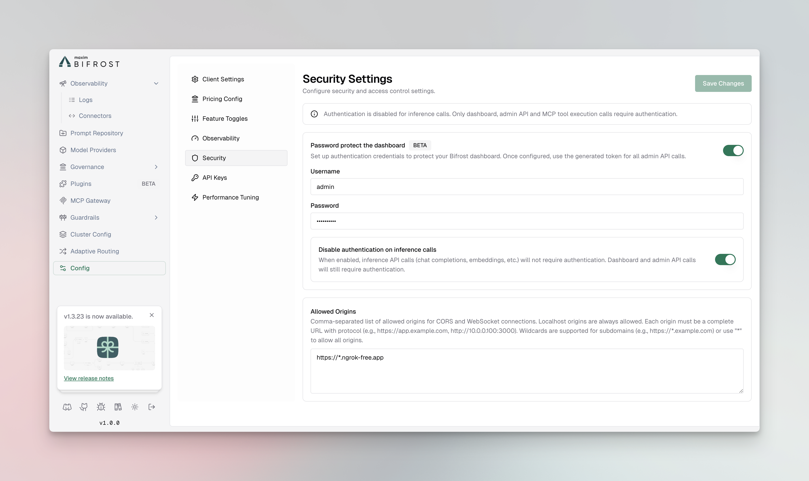

## Overview

Bifrost provides built-in authentication to protect your dashboard and admin API endpoints. When enabled, users must log in with credentials before accessing the dashboard or making admin API calls. This feature helps secure your Bifrost instance, especially when deployed in production environments.

## Enabling Authentication

### Step 1: Navigate to Security Settings

1. Open your Bifrost dashboard
2. Go to **Workspace** → **Config** → **Security** tab
3. Scroll to the **Password protect the dashboard** section



### Step 2: Enable Authentication

1. Toggle the **Password protect the dashboard** switch to enable authentication
2. Enter your **Username** in the admin username field
3. Enter your **Password** in the admin password field

<Note>
The username and password fields are only enabled when the authentication toggle is turned on. Make sure to use a strong password for security.
</Note>

### Step 3: Configure Inference Call Authentication (Optional)

By default, when authentication is enabled, all API calls (including inference calls) require authentication. You can optionally disable authentication for inference calls while keeping it enabled for the dashboard and admin API:

1. Enable the **Disable authentication on inference calls** toggle
2. When enabled:
   - Dashboard and admin API calls will still require authentication
   - Inference API calls (chat completions, embeddings, etc.) will not require authentication
   - MCP tool execution calls will still require authentication

<Note>
This option is useful if you want to protect your dashboard and admin functions while allowing public access to inference endpoints.
</Note>

### Step 4: Save Changes

1. Click **Save Changes** to apply your authentication settings
2. Changes take effect immediately - no restart required

## Logging In

Once authentication is enabled:

1. Navigate to your Bifrost dashboard URL
2. You will be automatically redirected to the login page
3. Enter your configured username and password
4. Click **Sign in**

After successful login, you'll be redirected to the dashboard. Your session will remain active for 30 days, and you'll need to log in again after the session expires.

## Authentication Methods

Bifrost supports different authentication methods depending on the type of request:

### Dashboard Access

- **Bearer Token Authentication**: The dashboard uses Bearer token authentication
- Tokens are automatically managed through the login session
- Tokens are stored in browser localStorage and sent with each API request

### API Calls

When authentication is enabled, API calls can be made using

- **Basic Authentication**: Username and password encoded as base64 via HTTP Basic auth
- **Bearer Token**: Session token issued after login (Bearer token from session)

When authentication is enabled for inference calls (i.e., the "Disable authentication on inference calls" toggle is OFF), inference calls can be made using:

- **Basic Authentication**: Username and Password in Basic auth
- **Bearer Token**: base64 string of username:password as bearer token
### Example: Using Basic Auth for Inference Calls

```bash
# Using curl with Basic Auth
curl -X POST http://localhost:8080/v1/chat/completions \
  -u "your-username:your-password" \
  -H "Content-Type: application/json" \
  -d '{
    "model": "openai/gpt-4o",
    "messages": [{"role": "user", "content": "Hello!"}]
  }'
```

## Important Notes

- **No Restart Required**: Authentication changes take effect immediately without requiring a server restart
- **Session Duration**: Login sessions last for 30 days
- **Password Security**: Passwords are hashed and stored securely in the database
- **Inference Calls**: If you disable authentication on inference calls, only dashboard and admin API endpoints will be protected

## Disabling Authentication

To disable authentication:

1. Navigate to **Workspace** → **Config** → **Security**
2. Toggle off the **Password protect the dashboard** switch
3. Click **Save Changes**

After disabling, the dashboard will be accessible without authentication immediately.