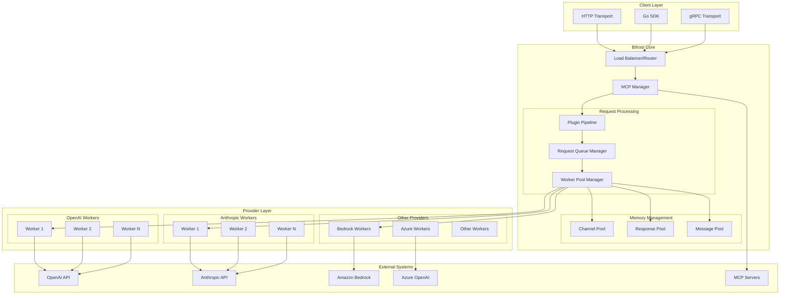
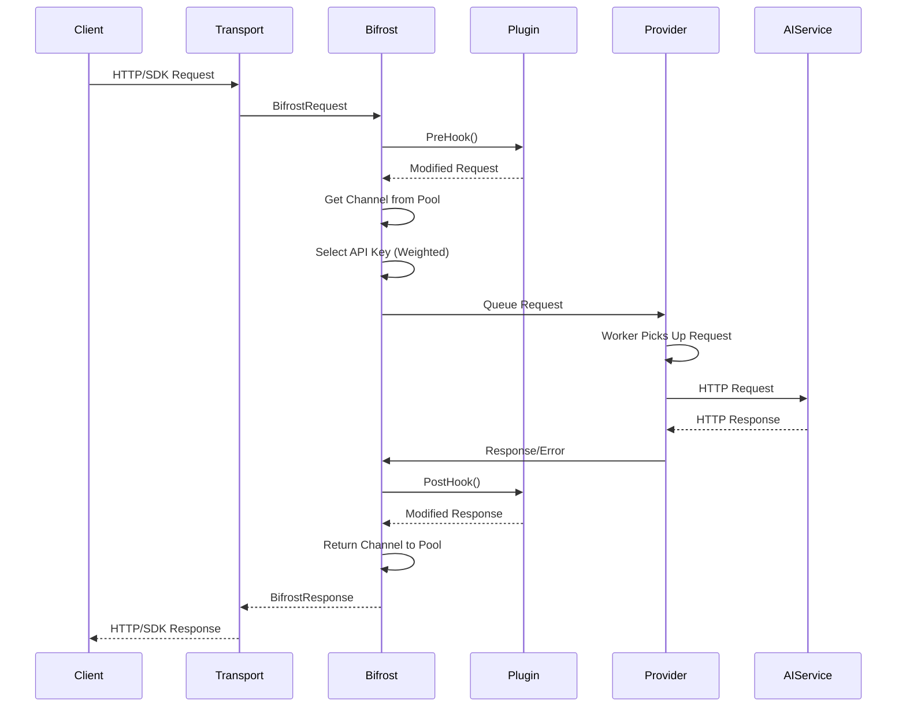
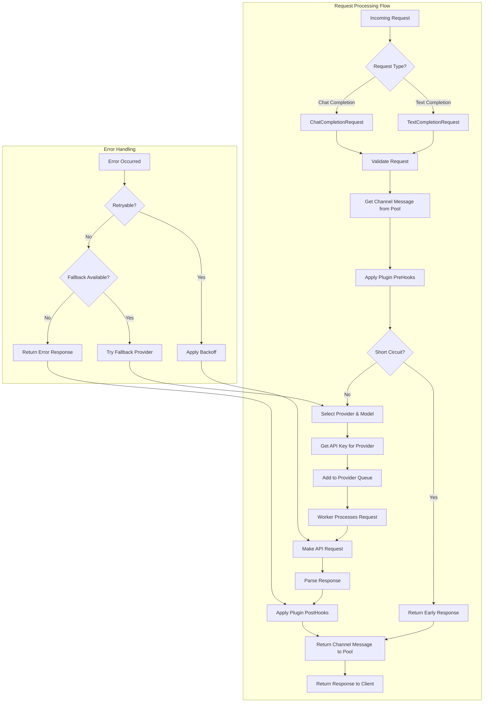
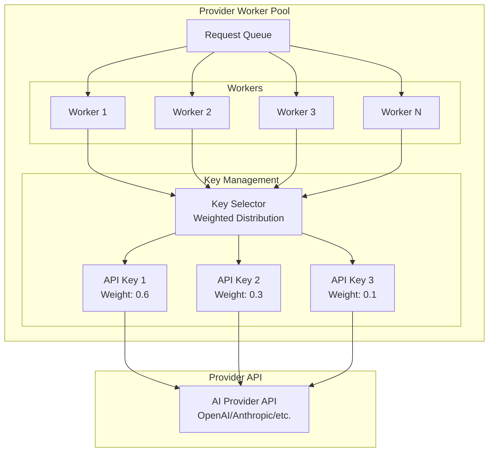
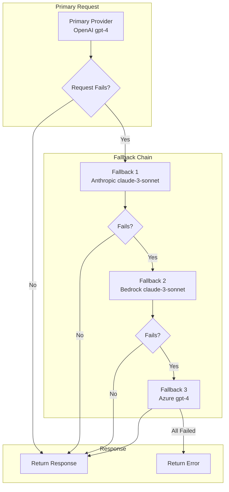
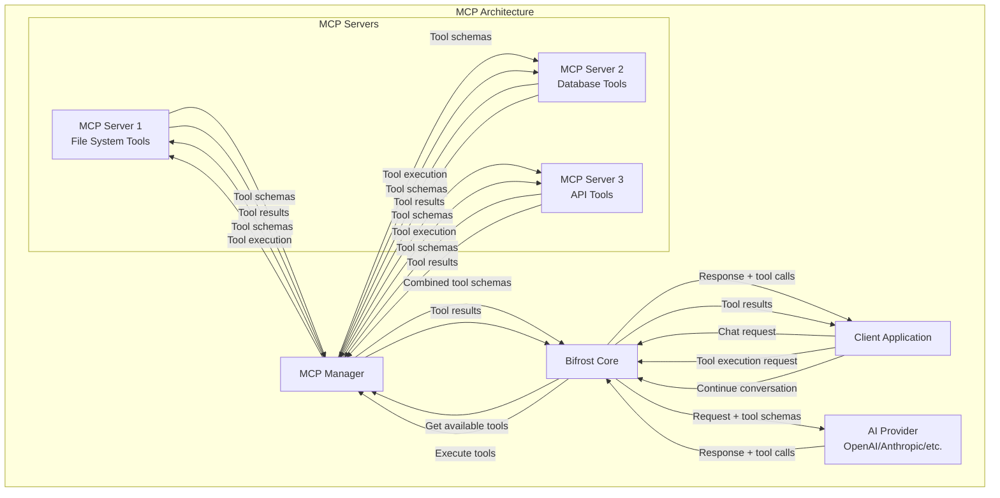

# Bifrost System Architecture

## Overview

Bifrost is designed as a high-performance, horizontally scalable middleware that acts as a unified gateway to multiple AI model providers. The architecture is specifically optimized to handle **10,000+ requests per second (RPS)** through sophisticated concurrency management, memory optimization, and connection pooling strategies.

## Core Architecture Principles

### 1. **Asynchronous Request Processing**

Bifrost uses a channel-based worker pool architecture where each provider maintains its own queue of workers to process requests concurrently.

### 2. **Memory Pool Management**

Advanced object pooling minimizes garbage collection pressure and memory allocations during high-load scenarios.

### 3. **Provider Isolation**

Each AI provider operates in its own isolated context with dedicated configuration, workers, and resource management.

### 4. **Plugin-First Design**

Extensible plugin architecture allows for custom logic injection without modifying core functionality.

---

## High-Level System Architecture



## Getting Started

To quickly deploy Bifrost and start using it at scale, see the [HTTP Transport API Documentation](./http-transport-api.md) for:

- **Quick Setup**: Docker and binary deployment options
- **Configuration Examples**: Sample configs for different use cases
- **API Usage**: Complete API reference and examples
- **Performance Tuning**: Optimization settings for high-scale deployments

---

## Detailed Component Architecture

### 1. Request Flow Architecture

The request processing pipeline is designed for maximum throughput and minimal latency:



#### Key Components:

- **Transport Layer**: HTTP, gRPC, or Go SDK entry points
- **Plugin Pipeline**: Pre/Post hooks for custom logic injection
- **Memory Pools**: Object reuse to minimize GC pressure
- **Worker Pools**: Provider-specific concurrent request processors
- **Key Management**: Weighted distribution across multiple API keys

#### Detailed Request Processing Flow



This diagram illustrates the complete request lifecycle including error handling and the plugin pipeline. Note that when tool calls are present in the response, Bifrost returns them to the client for execution rather than executing them automatically.

### 2. Memory Management Architecture

Bifrost's memory management system is optimized for high-throughput scenarios with minimal garbage collection impact. See [Memory Management Documentation](./memory-management.md) for detailed configuration options.

#### Object Pooling Strategy:

1. **Channel Pools**: Pre-allocated channels for request/response communication
2. **Message Pools**: Reusable `ChannelMessage` objects to reduce allocations
3. **Response Pools**: Pre-allocated response structures

#### Configuration Impact:

- `InitialPoolSize`: Controls initial memory allocation (default: 100)
- Higher values reduce runtime allocations but increase memory usage
- Optimal setting: Match expected concurrent request volume

### 3. Provider Worker Pool Architecture

Each AI provider operates with its own isolated worker pool system:



#### Worker Pool Characteristics:

- **Isolated Queues**: Each provider has its own buffered channel queue
- **Configurable Concurrency**: Number of workers per provider (default: 10)
- **Buffer Management**: Configurable queue size (default: 100)
- **Load Distribution**: Weighted API key selection for load balancing

#### Performance Tuning:

- **Concurrency**: Higher values increase throughput but consume more resources
- **Buffer Size**: Larger buffers handle request spikes but use more memory
- **Drop Excess Requests**: Optional fail-fast behavior when queues are full

See [Provider Configuration Documentation](./providers.md) for detailed configuration options.

---

## High-Performance Features

### 1. Connection Pooling and Keep-Alive

Bifrost maintains persistent HTTP connections to reduce connection overhead:

- **HTTP/2 Support**: Multiplexed connections where supported
- **Connection Reuse**: Persistent connections with keep-alive
- **Custom Timeouts**: Configurable request timeouts per provider
- **Retry Logic**: Exponential backoff for failed requests

### 2. Dynamic Key Management

Advanced API key management system for optimal performance:

```go
type Key struct {
    Value  string   // The actual API key value
    Models []string // List of models this key can access
    Weight float64  // Weight for load balancing (0.0-1.0)
}
```

#### Key Selection Process:

1. **Model Filtering**: Keys are filtered by model compatibility
2. **Weight Normalization**: Weights are normalized to sum to 1.0
3. **Weighted Random Selection**: Keys are selected based on weight distribution
4. **Fallback Logic**: Falls back to first available key if selection fails

### 3. Fallback System Architecture

Robust fallback mechanism for high availability. See [Fallback Documentation](./fallbacks.md) for complete configuration guide.



#### Fallback Characteristics:

- **Sequential Processing**: Fallbacks are tried in order until one succeeds
- **Independent Configuration**: Each fallback provider uses its own settings
- **Model Compatibility**: Ensures fallback models support required features
- **Error Propagation**: Detailed error information from each attempt

### 4. Plugin Architecture

Extensible plugin system for custom logic injection. See [Plugin Documentation](./plugins.md) for usage and development guide.

```go
type Plugin interface {
    GetName() string
    PreHook(ctx *context.Context, req *BifrostRequest) (*BifrostRequest, *PluginShortCircuit, error)
    PostHook(ctx *context.Context, result *BifrostResponse, err *BifrostError) (*BifrostResponse, *BifrostError, error)
    Cleanup() error
}
```

#### Plugin Pipeline Features:

- **Pre-Hook Processing**: Request modification before provider call
- **Post-Hook Processing**: Response modification after provider call
- **Short-Circuit Support**: Skip provider calls for cached responses
- **Error Recovery**: Plugins can recover from errors or invalidate responses
- **Symmetric Execution**: PostHooks run in reverse order of PreHooks

### 5. Model Context Protocol (MCP) Integration

Built-in MCP support for external tool integration. Bifrost integrates with MCP servers to provide tool capabilities to AI models, but the actual tool execution is handled by the client application:



**Key Points:**

- **Tool Discovery**: Bifrost fetches available tools from MCP servers and includes them in AI requests
- **Tool Calls**: AI models return tool calls in their responses, which Bifrost passes through to the client
- **Client-Side Execution**: The client application is responsible for executing tool calls via MCP
- **Conversation Continuation**: After tool execution, clients can continue the conversation with tool results
- **Connection Types**: Support for HTTP, STDIO, and SSE connections
- **Client Filtering**: Include/exclude specific MCP clients/tools per request
- **Local Tool Hosting**: Host custom tools within Bifrost and use them in your requests.

See [MCP Documentation](./mcp.md) for detailed configuration and usage examples.

---

## Performance Benchmarks

### Benchmark Results (5000 RPS Test)

| Instance Type | Success Rate | Avg Latency | Peak Memory | Bifrost Overhead |
| ------------- | ------------ | ----------- | ----------- | ---------------- |
| t3.medium     | 100.00%      | 2.12s       | 1312.79 MB  | **59 µs**        |
| t3.xlarge     | 100.00%      | 1.61s       | 3340.44 MB  | **11 µs**        |

#### Key Performance Metrics:

- **Queue Wait Time**: 1.67 µs (t3.xlarge)
- **Key Selection**: 10 ns (t3.xlarge)
- **Message Formatting**: 2.11 µs (t3.xlarge)
- **JSON Marshaling**: 26.80 µs (t3.xlarge)

### Scaling Configuration Examples

#### High-Throughput Configuration (10k+ RPS)

```go
// Bifrost Configuration
bifrost.Init(schemas.BifrostConfig{
    Account:            &account,
    InitialPoolSize:    20000,  // High pool size for memory optimization
    DropExcessRequests: true,  // Fail-fast when overloaded
})

// Provider Configuration
schemas.ProviderConfig{
    ConcurrencyAndBufferSize: schemas.ConcurrencyAndBufferSize{
        Concurrency: 20000,   // High concurrency for throughput
        BufferSize:  30000,  // Large buffer for request spikes
    },
    NetworkConfig: schemas.NetworkConfig{
        DefaultRequestTimeoutInSeconds: 30,
        MaxRetries:                     2,
        RetryBackoffInitial:            100 * time.Millisecond,
        RetryBackoffMax:                2 * time.Second,
    },
}
```

#### Memory-Optimized Configuration

```go
// Lower memory usage, slightly higher latency
bifrost.Init(schemas.BifrostConfig{
    Account:            &account,
    InitialPoolSize:    250,   // Standard pool size
    DropExcessRequests: false, // Queue requests instead of dropping
})

// Provider Configuration
schemas.ProviderConfig{
    ConcurrencyAndBufferSize: schemas.ConcurrencyAndBufferSize{
        Concurrency: 100,   // Moderate concurrency
        BufferSize:  250,  // Standard buffer size
    },
}
```

---

## Multi-Provider Support

Bifrost supports 8 AI model providers with unified interfaces:

1. **OpenAI** - GPT models with function calling
2. **Anthropic** - Claude models with tool use
3. **Amazon Bedrock** - Multi-model platform with inference profiles
4. **Azure OpenAI** - Enterprise GPT deployment
5. **Google Vertex AI** - Gemini and other Google models
6. **Cohere** - Command and embedding models
7. **Mistral AI** - Mistral model family
8. **Ollama** - Local model deployment

---

### Logging Architecture

Comprehensive logging system with configurable levels. See [Logger Documentation](./logger.md) for setup guide.

#### Log Levels:

- **Debug**: Detailed execution traces
- **Info**: General operational information
- **Warn**: Non-critical issues and fallback usage
- **Error**: Critical errors requiring attention

---

## Network and Security Features

### Proxy Support

Enterprise-grade proxy support for secure deployments:

- **HTTP Proxy**: Standard HTTP proxy with authentication
- **SOCKS5 Proxy**: SOCKS5 proxy support
- **Environment Proxy**: Automatic proxy detection from environment
- **Per-Provider Configuration**: Different proxies per provider

### Security Features

- **API Key Rotation**: Hot-swappable API keys without downtime
- **Rate Limiting**: Built-in rate limiting and backoff strategies
- **Request Isolation**: Provider-level request isolation
- **Secure Defaults**: Secure configuration defaults

---

## Transport Layer Architecture

Bifrost supports multiple transport mechanisms for flexible integration:

### HTTP Transport

Full-featured HTTP API with OpenAPI specification:

- **RESTful Endpoints**: Standard HTTP API patterns
- **Request/Response Validation**: JSON schema validation
- **Error Handling**: Structured error responses
- **Documentation**: Complete OpenAPI 3.0 specification

See [HTTP Transport API Documentation](./http-transport-api.md) for complete API reference.

### Go SDK

Native Go integration for embedded usage:

- **Type Safety**: Compile-time type checking
- **Context Support**: Full context.Context integration
- **Error Handling**: Structured error types
- **Memory Efficiency**: Direct object access without serialization

### Future Transports

Planned transport implementations:

- **gRPC Transport**: High-performance binary protocol
- **WebSocket Transport**: Real-time streaming support

---

## Configuration Management

### Account Interface

Central configuration management through the Account interface:

```go
type Account interface {
    GetConfiguredProviders() ([]ModelProvider, error)
    GetKeysForProvider(providerKey ModelProvider) ([]Key, error)
    GetConfigForProvider(providerKey ModelProvider) (*ProviderConfig, error)
}
```

### Dynamic Configuration

- **Hot Reloading**: Update configurations without restart
- **Environment Variables**: Support for environment-based config
- **Validation**: Configuration validation at startup
- **Defaults**: Sensible defaults for all settings

---

## Error Handling and Resilience

### Error Classification

Bifrost provides structured error handling with detailed error information:

```go
type BifrostError struct {
    EventID        *string    `json:"event_id,omitempty"`
    Type           *string    `json:"type,omitempty"`
    IsBifrostError bool       `json:"is_bifrost_error"`
    StatusCode     *int       `json:"status_code,omitempty"`
    Error          ErrorField `json:"error"`
    AllowFallbacks *bool      `json:"allow_fallbacks,omitempty"`
}
```

### Resilience Patterns

- **Circuit Breaker**: Automatic failure detection and recovery
- **Bulkhead**: Resource isolation between providers
- **Timeout**: Configurable request timeouts
- **Retry**: Exponential backoff with jitter
- **Fallback**: Multi-level fallback chains

---

## Development and Extension

### Custom Provider Development

Bifrost's modular architecture supports custom provider implementation:

```go
type Provider interface {
    GetProviderKey() ModelProvider
    TextCompletion(ctx context.Context, model, key, text string, params *ModelParameters) (*BifrostResponse, *BifrostError)
    ChatCompletion(ctx context.Context, model, key string, messages []BifrostMessage, params *ModelParameters) (*BifrostResponse, *BifrostError)
}
```

### Plugin Development

Extensible plugin system for custom functionality:

- **Request Processing**: Modify requests before provider calls
- **Response Processing**: Transform responses after provider calls
- **Caching**: Implement custom caching strategies
- **Monitoring**: Add custom metrics and logging
- **Authentication**: Implement custom auth mechanisms

---

## Conclusion

Bifrost's architecture is specifically designed to handle enterprise-scale AI workloads with **10,000+ RPS** through:

- **Advanced Concurrency**: Channel-based worker pools with configurable parallelism
- **Memory Optimization**: Object pooling and GC pressure reduction
- **Provider Isolation**: Independent scaling and configuration per provider
- **Extensibility**: Plugin architecture for custom logic
- **Resilience**: Multi-level fallback and error handling
- **Observability**: Built-in metrics and comprehensive logging

The modular design allows for horizontal scaling, custom integrations, and enterprise-grade reliability while maintaining sub-millisecond overhead in the request processing pipeline.
